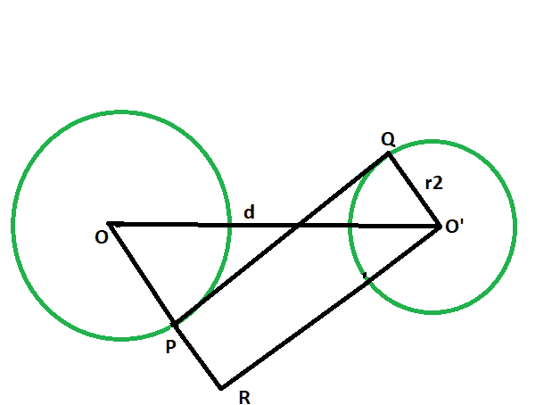

# 两个不相交圆之间的横向公共切线的长度

> 原文:[https://www . geeksforgeeks . org/两个不相交圆之间的横向公共切线长度/](https://www.geeksforgeeks.org/length-of-the-transverse-common-tangent-between-the-two-non-intersecting-circles/)

给定两个给定半径的圆，圆心相距给定距离，这样两个圆就不会相互接触。任务是求圆之间的横向公共切线的长度。
**例:**

```
Input: r1 = 4, r2 = 6, d = 12
Output: 6.63325

Input: r1 = 7, r2 = 9, d = 21
Output: 13.6015
```



**接近** :

1.  让圆的半径分别为 **r1** & **r2** 。
2.  让中心之间的距离为 **d** 单位。
3.  画一条平行于 PQ 的线，
4.  **角度 OPQ =角度 RPQ = 90 度**
    **角度 O'QP = 90 度**
    {圆心到接触点的连线与切线成 90 度角}

5.  **角度 RPQ +角度 O'QP = 180 度**
    **pr | | o’q**
6.  由于对边平行，内角为 90°，因此 **O'PQR** 为矩形。
7.  **O'Q = RP = r2 和 PQ = O'R**
8.  在三角形中**oo’r**
    **angle oro’= 90 度**
    由**勾股定理**、
    **or^2+o'r^2 = oo'^2**
    T12】o'r^2 = oo'^2–or^2
    t15】o'r^2 = d^2 –( R1+R2)2
    t18】o’r 2 =√(D2–(R1+R2)2)


## C++

```
// C++ program to find the length
// of the transverse common tangent
// between two circles which
// do not touch each other

#include <bits/stdc++.h>
using namespace std;

// Function to find the length
// of the transverse common tangent
void lengthOfTangent(double r1, double r2, double d)
{

    cout << "The length of the transverse"
         << " common tangent is "
         << sqrt(pow(d, 2) - pow((r1 + r2), 2))
         << endl;
}

// Driver code
int main()
{
    double r1 = 4, r2 = 6, d = 12;
    lengthOfTangent(r1, r2, d);
    return 0;
}
```

## Java 语言(一种计算机语言，尤用于创建网站)

```
// Java program to find the length
// of the transverse common tangent
// between two circles which
// do not touch each other
class GFG {

    // Function to find the length
    // of the transverse common tangent
    static void lengthOfTangent(double r1,
                                double r2, double d)
    {

        System.out.println("The length of the transverse"
                           + " common tangent is "
                           + Math.sqrt(Math.pow(d, 2)
                                       - Math.pow((r1 + r2), 2)));
    }

    // Driver code
    public static void main(String args[])
    {
        double r1 = 4, r2 = 6, d = 12;
        lengthOfTangent(r1, r2, d);
    }
}

// This code has been contributed by 29AjayKumar
```

## 蟒蛇 3

```
# python 3 program to find the length
# of the transverse common tangent
# between two circles which
# do not touch each other
from math import sqrt, pow

# Function to find the length
# of the transverse common tangent
def lengthOfTangent(r1, r2, d):
    print("The length of the transverse",
                     "common tangent is",
          '{0:.6g}'.format(sqrt(pow(d, 2) -
                                pow((r1 + r2), 2))))

# Driver code
if __name__ == '__main__':
    r1 = 4
    r2 = 6
    d = 12
    lengthOfTangent(r1, r2, d)

# This code is contributed by
# Surendra_Gangwar
```

## C#

```
// C# program to find the length
// of the transverse common tangent
// between two circles which
// do not touch each other
using System;

class GFG {
    // Function to find the length
    // of the transverse common tangent
    static void lengthOfTangent(double r1,
                                double r2, double d)
    {

        Console.WriteLine("The length of the transverse"
                          + " common tangent is "
                          + Math.Sqrt(Math.Pow(d, 2)
                                      - Math.Pow((r1 + r2), 2)));
    }

    // Driver code
    static public void Main()
    {
        double r1 = 4, r2 = 6, d = 12;
        lengthOfTangent(r1, r2, d);
    }
}

// This code has been contributed by ajit.
```

## 服务器端编程语言（Professional Hypertext Preprocessor 的缩写）

```
<?php
// PHP program to find the length
// of the transverse common tangent
// between two circles which
// do not touch each other

// Function to find the length
// of the transverse common tangent
function lengthOfTangent($r1, $r2, $d)
{

    echo "The length of the transverse common tangent is ",
    sqrt(pow($d, 2) - pow(($r1 + $r2), 2)) ;
}

// Driver code
$r1 = 4; $r2 = 6; $d = 12;
lengthOfTangent($r1, $r2, $d);

// This code is contributed by AnkitRai01
?>
```

## java 描述语言

```
<script>

// javascript program to find the length
// of the transverse common tangent
// between two circles which
// do not touch each other

// Function to find the length
// of the transverse common tangent
function lengthOfTangent(r1,r2 , d)
{

    document.write("The length of the transverse"
                       + " common tangent is "
                       + Math.sqrt(Math.pow(d, 2)
                                   - Math.pow((r1 + r2), 2)));
}

// Driver code

var r1 = 4, r2 = 6, d = 12;
lengthOfTangent(r1, r2, d);

// This code contributed by Princi Singh

</script>
```

**Output:** 

```
The length of the transverse common tangent is 6.63325
```