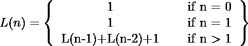

# 莱昂纳多号

> 原文:[https://www.geeksforgeeks.org/leonardo-number/](https://www.geeksforgeeks.org/leonardo-number/)

[列奥纳多数字](https://en.wikipedia.org/wiki/Leonardo_number)是由递归给出的数字序列:

前几个列奥纳多数字是 1、1、3、5、9、15、25、41、67、109、177、287、465、753、1219、1973、3193、5167、8361、
列奥纳多数字通过以下关系与[斐波那契数字](https://www.geeksforgeeks.org/program-for-nth-fibonacci-number/)相关联:【T8

**示例:**

```
Input : n = 0
Output : 1

Input : n = 3
Output : 5
```

一个简单的解决方案是递归计算值。

## C++

```
// A simple recursive program to find n-th
// leonardo number.
#include <iostream>
using namespace std;

int leonardo(int n)
{
    if (n == 0 || n == 1)
        return 1;
    return leonardo(n - 1) + leonardo(n - 2) + 1;
}

int main()
{
    cout << leonardo(3);
    return 0;
}
```

## Java 语言(一种计算机语言，尤用于创建网站)

```
// A simple recursive program to find n-th
// leonardo number.
import java.io.*;

class GFG {
    static int leonardo(int n)
    {
        if (n == 0 || n == 1)
            return 1;
        return (leonardo(n - 1) + leonardo(n - 2) + 1);
    }

    public static void main(String args[])
    {
        System.out.println(leonardo(3));
    }
}

/*This code is contributed by Nikita Tiwari.*/
```

## 蟒蛇 3

```
# A simple recursive program to find n-th
# leonardo number.

def leonardo(n) :
    if (n == 0 or n == 1) :
        return 1
    return (leonardo(n - 1) + leonardo(n - 2) + 1);

# Driver code   
print(leonardo(3))

# This code is contributed by Nikita Tiwari.
```

## C#

```
// A simple recursive program to
// find n-th leonardo number.
using System;

class GFG {

    static int leonardo(int n)
    {
        if (n == 0 || n == 1)
            return 1;

        return (leonardo(n - 1) + leonardo(n - 2) + 1);
    }

    public static void Main()
    {
        Console.WriteLine(leonardo(3));
    }
}

// This code is contributed by vt_m.
```

## 服务器端编程语言（Professional Hypertext Preprocessor 的缩写）

```
<?php
// A simple recursive PHP
// program to find n-th
// leonardo number.

// function returns the
// nth leonardo number
function leonardo($n)
{
    if ($n == 0 || $n == 1)
        return 1;
    return leonardo($n - 1) +
           leonardo($n - 2) + 1;
}

// Driver Code
echo leonardo(3);

// This code is contributed by ajit
?>
```

## java 描述语言

```
<script>
    // Javascript program to find n-th
// leonardo number.

    function leonardo(n)
    {
        let dp = [];
        dp[0] = dp[1] = 1;
        for (let i = 2; i <= n; i++)
            dp[i] = dp[i - 1] + dp[i - 2] + 1;
        return dp[n];
    }

    // Driver code

    document.write(leonardo(3));

</script>
```

**输出:**

```
5
```

**时间复杂度:**指数

一个**更好的解决方案**是使用动态规划。

## C++

```
// A simple recursive program to find n-th
// leonardo number.
#include <iostream>
using namespace std;

int leonardo(int n)
{
    int dp[n + 1];
    dp[0] = dp[1] = 1;
    for (int i = 2; i <= n; i++)
        dp[i] = dp[i - 1] + dp[i - 2] + 1;
    return dp[n];
}

int main()
{
    cout << leonardo(3);
    return 0;
}
```

## Java 语言(一种计算机语言，尤用于创建网站)

```
// A simple recursive program to find n-th
// leonardo number.
import java.io.*;

class GFG {

    static int leonardo(int n)
    {
        int dp[] = new int[n + 1];
        dp[0] = dp[1] = 1;
        for (int i = 2; i <= n; i++)
            dp[i] = dp[i - 1] + dp[i - 2] + 1;
        return dp[n];
    }

    // Driver code
    public static void main(String[] args)
    {
        System.out.println(leonardo(3));
    }
}

/*This code is contributed by vt_m.*/
```

## 蟒蛇 3

```
# A simple recursive program
# to find n-th leonardo number.

def leonardo(n):
    dp = [];
    dp.append(1);
    dp.append(1);
    for i in range(2, n + 1):
        dp.append(dp[i - 1] +
                  dp[i - 2] + 1);
    return dp[n];

# Driver code
print(leonardo(3));

# This code is contributed by mits
```

## C#

```
// A simple recursive program to
// find n-th leonardo number.
using System;

class GFG {

    static int leonardo(int n)
    {
        int[] dp = new int[n + 1];
        dp[0] = dp[1] = 1;

        for (int i = 2; i <= n; i++)
            dp[i] = dp[i - 1] + dp[i - 2] + 1;
        return dp[n];
    }

    public static void Main()
    {
        Console.WriteLine(leonardo(3));
    }
}
// This code is contributed by vt_m.
```

## 服务器端编程语言（Professional Hypertext Preprocessor 的缩写）

```
<?php
// A simple recursive program to
// find n-th leonardo number.

function leonardo( $n)
{
    $dp[0] = $dp[1] = 1;
    for ($i = 2; $i <= $n; $i++)
        $dp[$i] = $dp[$i - 1] +
                  $dp[$i - 2] + 1;
    return $dp[$n];
}

    echo leonardo(3);

// This code is contributed by ajit.
?>
```

## Java Script 语言

```
<script>
// A simple recursive program to find n-th
// leonardo number.

   function leonardo(n)
    {
        var dp = Array.from({length: n+1}, (_, i) => 0);
        dp[0] = dp[1] = 1;
        for (var i = 2; i <= n; i++)
            dp[i] = dp[i - 1] + dp[i - 2] + 1;
        return dp[n];
    }

    // Driver code
   document.write(leonardo(3));

// This code contributed by Princi Singh
</script>
```

**输出:**

```
5
```

**时间复杂度:** O(n)

**最佳解决方案**是使用与[斐波那契数](https://www.geeksforgeeks.org/program-for-nth-fibonacci-number/)的关系。我们可以在 O(Log n)时间内找到第 n 个斐波那契数[参见[本](https://www.geeksforgeeks.org/program-for-nth-fibonacci-number/)的方法 4]

## C++

```
// A O(Log n) program to find n-th Leonardo
// number.
#include <iostream>
using namespace std;

/* Helper function that multiplies 2 matrices
   F and M of size 2*2, and puts the
   multiplication result back to F[][] */
void multiply(int F[2][2], int M[2][2])
{
    int x = F[0][0] * M[0][0] + F[0][1] * M[1][0];
    int y = F[0][0] * M[0][1] + F[0][1] * M[1][1];
    int z = F[1][0] * M[0][0] + F[1][1] * M[1][0];
    int w = F[1][0] * M[0][1] + F[1][1] * M[1][1];
    F[0][0] = x;
    F[0][1] = y;
    F[1][0] = z;
    F[1][1] = w;
}

void power(int F[2][2], int n)
{
    int i;
    int M[2][2] = { { 1, 1 }, { 1, 0 } };

    // n - 1 times multiply the matrix
    // to {{1, 0}, {0, 1}}
    for (i = 2; i <= n; i++)
        multiply(F, M);
}

int fib(int n)
{
    int F[2][2] = { { 1, 1 }, { 1, 0 } };
    if (n == 0)
        return 0;
    power(F, n - 1);
    return F[0][0];
}

int leonardo(int n)
{
    if (n == 0 || n == 1)
        return 1;
    return 2 * fib(n + 1) - 1;
}

int main()
{
    cout << leonardo(3);
    return 0;
}
```

## Java 语言(一种计算机语言，尤用于创建网站)

```
// A O(Log n) program to find n-th Leonardo
// number.

class GFG {

    /* Helper function that multiplies 2 matrices
    F and M of size 2*2, and puts the
    multiplication result back to F[][] */
    static void multiply(int F[][], int M[][])
    {
        int x = F[0][0] * M[0][0] + F[0][1] * M[1][0];
        int y = F[0][0] * M[0][1] + F[0][1] * M[1][1];
        int z = F[1][0] * M[0][0] + F[1][1] * M[1][0];
        int w = F[1][0] * M[0][1] + F[1][1] * M[1][1];
        F[0][0] = x;
        F[0][1] = y;
        F[1][0] = z;
        F[1][1] = w;
    }

    static void power(int F[][], int n)
    {
        int i;
        int M[][] = { { 1, 1 }, { 1, 0 } };

        // n - 1 times multiply the matrix
        // to {{1, 0}, {0, 1}}
        for (i = 2; i <= n; i++)
            multiply(F, M);
    }

    static int fib(int n)
    {
        int F[][] = { { 1, 1 }, { 1, 0 } };
        if (n == 0)
            return 0;
        power(F, n - 1);
        return F[0][0];
    }

    static int leonardo(int n)
    {
        if (n == 0 || n == 1)
            return 1;
        return 2 * fib(n + 1) - 1;
    }

    public static void main(String args[])
    {
        System.out.println(leonardo(3));
    }
}

/*This code is contributed by Nikita Tiwari.*/
```

## 蟒蛇 3

```
# A O(Log n) program to find n-th Leonardo
# number.

# Helper function that multiplies 2 matrices
# F and M of size 2 * 2, and puts the
# multiplication result back to F[][]
def multiply(F, M ) :
    x = F[0][0] * M[0][0] + F[0][1] * M[1][0]
    y = F[0][0] * M[0][1] + F[0][1] * M[1][1]
    z = F[1][0] * M[0][0] + F[1][1] * M[1][0]
    w = F[1][0] * M[0][1] + F[1][1] * M[1][1]
    F[0][0] = x
    F[0][1] = y
    F[1][0] = z
    F[1][1] = w

def power(F, n) :
    M = [[ 1, 1 ], [ 1, 0 ] ]

    # n - 1 times multiply the matrix
    # to {{1, 0}, {0, 1}}
    for i in range(2, n + 1) :
        multiply(F, M)

def fib(n) :
    F = [ [ 1, 1 ], [ 1, 0 ] ]
    if (n == 0) :
        return 0
    power(F, n - 1)
    return F[0][0]

def leonardo(n) :
    if (n == 0 or n == 1) :
        return 1
    return (2 * fib(n + 1) - 1)

# main method   
print(leonardo(3))

# This code is contributed by Nikita Tiwari.
```

## C#

```
// A O(Log n) program to find
// n-th Leonardo number.
using System;

class GFG {

    /* Helper function that multiplies 2 matrices
       F and M of size 2*2, and puts the
       multiplication result back to F[][] */
    static void multiply(int[, ] F, int[, ] M)
    {
        int x = F[0, 0] * M[0, 0] + F[0, 1] * M[1, 0];
        int y = F[0, 0] * M[0, 1] + F[0, 1] * M[1, 1];
        int z = F[1, 0] * M[0, 0] + F[1, 1] * M[1, 0];
        int w = F[1, 0] * M[0, 1] + F[1, 1] * M[1, 1];
        F[0, 0] = x;
        F[0, 1] = y;
        F[1, 0] = z;
        F[1, 1] = w;
    }

    static void power(int[, ] F, int n)
    {
        int i;
        int[, ] M = { { 1, 1 }, { 1, 0 } };

        // n - 1 times multiply the matrix
        // to {{1, 0}, {0, 1}}
        for (i = 2; i <= n; i++)
            multiply(F, M);
    }

    static int fib(int n)
    {
        int[, ] F = { { 1, 1 }, { 1, 0 } };
        if (n == 0)
            return 0;
        power(F, n - 1);
        return F[0, 0];
    }

    static int leonardo(int n)
    {
        if (n == 0 || n == 1)
            return 1;
        return 2 * fib(n + 1) - 1;
    }

    // Driver Code
    public static void Main()
    {
        Console.WriteLine(leonardo(3));
    }
}

// This code is contributed by vt_m.
```

## 服务器端编程语言（Professional Hypertext Preprocessor 的缩写）

```
<?php
// A O(Log n) program to find n-th
// Leonardo number.

/* Helper function that multiplies 2 matrices
F and M of size 2*2, and puts the
multiplication result back to $F][] */
function multiply(&$F, $M)
{
    $x = $F[0][0] * $M[0][0] +
         $F[0][1] * $M[1][0];
    $y = $F[0][0] * $M[0][1] +
         $F[0][1] * $M[1][1];
    $z = $F[1][0] * $M[0][0] +
         $F[1][1] * $M[1][0];
    $w = $F[1][0] * $M[0][1] +
         $F[1][1] * $M[1][1];
    $F[0][0] = $x;
    $F[0][1] = $y;
    $F[1][0] = $z;
    $F[1][1] = $w;
}

function power(&$F, $n)
{
    $M = array(array(1, 1), array(1, 0));

    // n - 1 times multiply the matrix
    // to {{1, 0}, {0, 1}}
    for ($i = 2; $i <= $n; $i++)
        multiply($F, $M);
}

function fib($n)
{
    $F = array(array(1, 1), array(1, 0));
    if ($n == 0)
        return 0;
    power($F, $n - 1);
    return $F[0][0];
}

function leonardo($n)
{
    if ($n == 0 || $n == 1)
        return 1;
    return 2 * fib($n + 1) - 1;
}

// Driver Code
echo leonardo(3);

//This code is contributed by mits
?>
```

## java 描述语言

```
<script>
// A O(Log n) program to find n-th Leonardo
// number.
   /* Helper function that multiplies 2 matrices
F and M of size 2*2, and puts the
multiplication result back to F */
function multiply(F , M)
{
    var x = F[0][0] * M[0][0] + F[0][1] * M[1][0];
    var y = F[0][0] * M[0][1] + F[0][1] * M[1][1];
    var z = F[1][0] * M[0][0] + F[1][1] * M[1][0];
    var w = F[1][0] * M[0][1] + F[1][1] * M[1][1];
    F[0][0] = x;
    F[0][1] = y;
    F[1][0] = z;
    F[1][1] = w;
}

function power(F , n)
{
    var i;
    var M = [ [ 1, 1 ], [ 1, 0 ] ];

    // n - 1 times multiply the matrix
    // to {{1, 0], [0, 1}}
    for (i = 2; i <= n; i++)
        multiply(F, M);
}

function fib(n)
{
    var F = [ [ 1, 1 ], [ 1, 0 ] ];
    if (n == 0)
        return 0;
    power(F, n - 1);
    return F[0][0];
}

function leonardo(n)
{
    if (n == 0 || n == 1)
        return 1;
    return 2 * fib(n + 1) - 1;
}

document.write(leonardo(3));

// This code is contributed by Amit Katiyar
</script>
```

**输出:**

```
5
```

**时间复杂度:** O(Log n)
本文由 [**Subhajit Saha**](https://www.linkedin.com/in/subhajit-saha-06aa29131/) 供稿。如果你喜欢 GeeksforGeeks 并想投稿，你也可以使用[contribute.geeksforgeeks.org](http://www.contribute.geeksforgeeks.org)写一篇文章或者把你的文章邮寄到 contribute@geeksforgeeks.org。看到你的文章出现在极客博客主页上，帮助其他极客。
如果发现有不正确的地方，或者想分享更多关于上述话题的信息，请写评论。