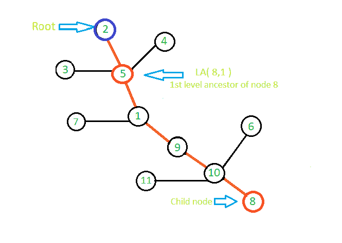

# 等级祖先问题

> 原文:[https://www.geeksforgeeks.org/level-ancestor-problem/](https://www.geeksforgeeks.org/level-ancestor-problem/)

[级祖先问题](https://en.wikipedia.org/wiki/Level_ancestor_problem)是将给定的有根树 T 预处理成数据结构的问题，该数据结构可以确定给定节点在距离树的根给定深度的祖先。这里**树中任何节点的深度**是从树根到节点的最短路径上的边数。
给定的树被表示为具有 n 个节点和 n-1 条边的**无向连通图**。

解决上述查询的思路是使用**跳转指针算法**，在 **O( n log n )** 时间对树进行预处理，在 **O( logn )** 时间回答级祖先查询。在跳转指针中，有一个从节点 N 到 N 的第 j 个祖先的指针，对于
j = 1，2，4，8，…，等等。我们称这些指针为跳转<sub>N</sub>【I】，其中
跳转<sub>u</sub>【I】= LA(N，深度(N)–2<sup>I</sup>)。
当算法被要求处理一个查询时，我们使用这些跳转指针反复向上跳树。跳转的次数最多为 n 次，因此查询可以在 O( logn)时间内得到回答。
所以我们存储 **2 <sup>i</sup> 每个节点的第一个祖先**，也可以找到每个节点距离树根的深度。
现在我们的任务简化为寻找节点 N 的第(深度(N)–2<sup>I</sup>)个祖先。让我们将 X 表示为(深度(N)–2<sup>I</sup>)，并让 X 的 **b** 位是由 s1、s2、s3、…sb 表示的**组位** (1)。
**X = 2<sup>(S1)</sup>+2<sup>(S2)</sup>+……+2<sup>(sb)</sup>**
现在的问题是如何找到 2 <sup>j</sup> 每个节点的祖先以及每个节点距离树根的深度？
最初，我们知道每个节点的第 2 个 <sup>0</sup> 祖先是它的父节点。我们可以递归计算 2<sup>j</sup>-第 10 个祖先。我们知道 2<sup>j</sup>-第 2 祖先是 2<sup>j-1</sup>-第 2 <sup>j-1</sup> 的第 2 祖先。为了计算每个节点的深度，我们使用祖先矩阵。如果我们在 jth 索引处发现根节点存在于 kth 元素的数组中，那么该节点的深度简单地为 2 <sup>j</sup> ，但是如果根节点不存在于 kth 元素的祖先数组中，则 kth 元素的深度为 2<sup>(kth 行的最后一个非零祖先的索引)</sup> +在 kth 行的最后一个索引处存在的祖先的深度。
下面是使用动态规划填充祖先矩阵和每个节点深度的算法。这里，我们将根节点表示为 **R** ，并且最初假设根节点的祖先为 **0** 。我们还用 **-1** 初始化深度数组，表示当前节点的深度没有设置，我们需要找到它的深度。如果当前节点的深度不等于-1，则意味着我们已经计算了它的深度。

```
we know the first ancestor of each node so we take j>=1,
For j>=1

ancstr[k][j] =  2jth ancestor of k    
             =  2j-1th ancestor of (2j-1th ancestor of k)       
             =  ancstr[ancstr[i][j-1][j-1]
                if ancstr[k][j] == R && depth[k] == -1
                   depth[k] = 2j
                else if ancstr[k][j] == -1 && depth[k] == -1
                   depth[k] = 2(j-1) + depth[ ancstr[k][j-1] ]

```

让我们用下图来理解这个算法。



在给定的图中，我们需要计算值为 **8** 的节点的第一级祖先。首先，我们制作一个祖先矩阵，它存储 2 个<sup>和</sup>节点的祖先。现在， **2 <sup>0</sup>** 节点 **8** 的祖先是 **10** ，同样**2<sup>0</sup>T15】节点 **10** 的祖先是 **9** ，对于节点 **9** 是 **1** ，对于节点 **1** 是 **5** 。基于上述算法，节点 8 的第一级祖先是节点 8 的第**(深度(8)-1)级祖先**。我们已经预先计算了每个节点的深度，深度 8 是 5，所以我们最终需要找到节点 8 的第 4 个 **(5-1) =第 4 个**祖先，它等于【2】的第 1 个祖先【2】的第 1 个<sup>祖先</sup>**和**的第 2 个<sup>祖先【1】节点 8 的第 1 个</sup>祖先**是 **2 <sup>0</sup> 的第 2 个<sup>祖先</sup>**所以， **2 <sup>0</sup> 的第 2 个 <sup>0</sup> 的第 8 个**的祖先是值为 **9** 的节点， **2 <sup>1</sup> 的第 9 个祖先**是值为 **5** 的节点。这样，我们就可以计算出所有查询的时间复杂度。

## 卡片打印处理机（Card Print Processor 的缩写）

```
// CPP program to implement Level Ancestor Algorithm
#include <bits/stdc++.h>
using namespace std;
int R = 0;

// n -> it represent total number of nodes
// len -> it is the maximum length of array to hold
//          ancestor of each node. In worst case,
// the highest value of ancestor a node can have is n-1.
// 2 ^ len <= n-1
// len = O(log2n)
int getLen(int n)
{
    return (int)(log(n) / log(2)) + 1;
}

// ancstr represents 2D matrix to hold ancestor of node.
// Here we pass reference of 2D matrix so that the change
// made occur directly  to the original matrix
// depth[] stores depth of each node
// len is same as defined above
// n is total nodes in graph
// R represent root node
void setancestor(vector<vector<int> >& ancstr,
           vector<int>& depth, int* node, int len, int n)
{
    // depth of root node is set to 0
    depth[R] = 0;

    // if depth of a node is -1 it means its depth
    // is not set otherwise we have computed its depth
    for (int j = 1; j <= len; j++) {
        for (int i = 0; i < n; i++) {
            ancstr[node[i]][j] = ancstr[ancstr[node[i]][j - 1]][j - 1];

            // if ancestor of current node is R its height is
            //  previously not set, then its height is  2^j
            if (ancstr[node[i]][j] == R && depth[node[i]] == -1) {

                // set the depth of ith node
                depth[node[i]] = pow(2, j);
            }

            // if ancestor of current node is 0 means it
            // does not have root node at its 2th power
            // on its path so its depth is 2^(index of
            // last non zero ancestor means j-1) + depth
            // of 2^(j-1) th ancestor
            else if (ancstr[node[i]][j] == 0 &&
                     node[i] != R && depth[node[i]] == -1) {
                depth[node[i]] = pow(2, j - 1) +
                                 depth[ancstr[node[i]][j - 1]];
            }
        }
    }
}

// c -> it represent child
// p -> it represent ancestor
// i -> it represent node number
// p=0 means the node is root node
// R represent root node
// here also we pass reference of 2D matrix and depth
// vector so that the change made occur directly to
// the original matrix and original vector
void constructGraph(vector<vector<int> >& ancstr,
            int* node, vector<int>& depth, int* isNode,
                                   int c, int p, int i)
{
    // enter the node in node array
    // it stores all the nodes in the graph
    node[i] = c;

    // to confirm that no child node have 2 ancestors
    if (isNode == 0) {
        isNode = 1;

        // make ancestor of x as y
        ancstr[0] = p;

        // ifits first ancestor is root than its depth is 1
        if (R == p) {
            depth = 1;
        }
    }
    return;
}

// this function will delete leaf node
// x is node to be deleted
void removeNode(vector<vector<int> >& ancstr,
                    int* isNode, int len, int x)
{
    if (isNode[x] == 0)
        cout << "node does not present in graph " << endl;
    else {
        isNode[x] = 0;

        // make all ancestor of node x as 0
        for (int j = 0; j <= len; j++) {
            ancstr[x][j] = 0;
        }
    }
    return;
}

// x -> it represent new node to be inserted
// p -> it represent ancestor of new node
void addNode(vector<vector<int> >& ancstr,
      vector<int>& depth, int* isNode, int len,
                                 int x, int p)
{
    if (isNode[x] == 1) {
        cout << " Node is already present in array " << endl;
        return;
    }
    if (isNode[p] == 0) {
        cout << " ancestor not does not present in an array " << endl;
        return;
    }

    isNode[x] = 1;
    ancstr[x][0] = p;

    // depth of new node is 1 + depth of its ancestor
    depth[x] = depth[p] + 1;
    int j = 0;

    // while we don't reach root node
    while (ancstr[x][j] != 0) {
        ancstr[x][j + 1] = ancstr[ancstr[x][j]][j];
        j++;
    }

    // remaining array will fill with 0 after
    // we find root of tree
    while (j <= len) {
        ancstr[x][j] = 0;
        j++;
    }
    return;
}

// LA function to find Lth level ancestor of node x
void LA(vector<vector<int> >& ancstr, vector<int> depth,
                              int* isNode, int x, int L)
{
    int j = 0;
    int temp = x;

    // to check if node is present in graph or not
    if (isNode[x] == 0) {
        cout << "Node is not present in graph " << endl;
        return;
    }

    // we change L as depth of node x -
    int k = depth[x] - L;
    // int q = k;
    // in this loop we decrease the value of k by k/2 and
    // increment j by 1 after each iteration, and check for set bit
    // if we get set bit then we update x with jth ancestor of x
    // as k becomes less than or equal to zero means we
    // reach to kth level ancestor
    while (k > 0) {

        // to check if last bit is 1 or not
        if (k & 1) {
            x = ancstr[x][j];
        }

        // use of shift operator to make k = k/2
        // after every iteration
        k = k >> 1;
        j++;
    }
    cout << L << "th level ancestor of node "
               << temp << " is = " << x << endl;

    return;
}

int main()
{
    // n represent number of nodes
    int n = 12;

    // initialization of ancestor matrix
    // suppose max range of node is up to 1000
    // if there are 1000 nodes than also length
    // of ancestor matrix will not exceed 10
    vector<vector<int> > ancestor(1000, vector<int>(10));

    // this vector is used to store depth of each node.
    vector<int> depth(1000);

    // fill function is used to initialize depth with -1
    fill(depth.begin(), depth.end(), -1);

    // node array is used to store all nodes
    int* node = new int[1000];

    // isNode is an array to check whether a
    // node is present in graph or not
    int* isNode = new int[1000];

    // memset function to initialize isNode array with 0
    memset(isNode, 0, 1000 * sizeof(int));

    // function to calculate len
    // len -> it is the maximum length of array to
    // hold ancestor of each node.
    int len = getLen(n);

    // R stores root node
    R = 2;

    // construction of graph
    // here 0 represent that the node is root node
    constructGraph(ancestor, node, depth, isNode, 2, 0, 0);
    constructGraph(ancestor, node, depth, isNode, 5, 2, 1);
    constructGraph(ancestor, node, depth, isNode, 3, 5, 2);
    constructGraph(ancestor, node, depth, isNode, 4, 5, 3);
    constructGraph(ancestor, node, depth, isNode, 1, 5, 4);
    constructGraph(ancestor, node, depth, isNode, 7, 1, 5);
    constructGraph(ancestor, node, depth, isNode, 9, 1, 6);
    constructGraph(ancestor, node, depth, isNode, 10, 9, 7);
    constructGraph(ancestor, node, depth, isNode, 11, 10, 8);
    constructGraph(ancestor, node, depth, isNode, 6, 10, 9);
    constructGraph(ancestor, node, depth, isNode, 8, 10, 10);

    // function to pre compute ancestor matrix
    setancestor(ancestor, depth, node, len, n);

    // query to get 1st level ancestor of node 8
    LA(ancestor, depth, isNode, 8, 1);

    // add node 12 and its ancestor is 8
    addNode(ancestor, depth, isNode, len, 12, 8);

    // query to get 2nd level ancestor of node 12
    LA(ancestor, depth, isNode, 12, 2);

    // delete node 12
    removeNode(ancestor, isNode, len, 12);

    // query to get 5th level ancestor of node
    // 12 after deletion of node
    LA(ancestor, depth, isNode, 12, 1);

    return 0;
}
```

**Output**

```
1th level ancestor of node 8 is = 5
2th level ancestor of node 12 is = 1
Node is not present in graph 

```