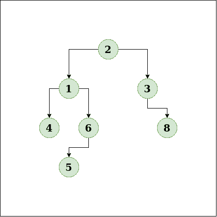
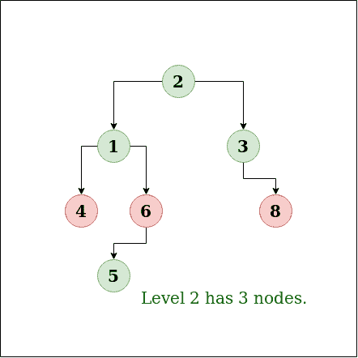
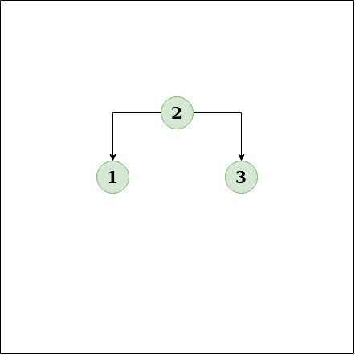
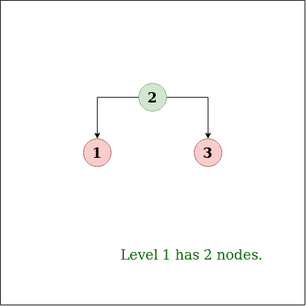

# 节点数最大的级别

> 原文:[https://www.geeksforgeeks.org/level-maximum-number-nodes/](https://www.geeksforgeeks.org/level-maximum-number-nodes/)

找出二叉树中节点数最多的层次。根在 0 级。
**例:**

```
Input: 
```



```
Output : 2
Explanation:
```



```
Input:
```



```
Output:1
Explanation
```



**方法:**众所周知，在[级顺序遍历带有队列的二叉树](https://www.geeksforgeeks.org/level-order-tree-traversal/)时，任何时候我们的队列都包含特定级别的所有元素。所以找到队列中节点数最多的级别。
BFS 遍历是一种遍历或搜索树或图的算法。它从树根开始，在继续下一深度级别的节点之前，探索当前深度的所有邻居节点。
因此，在任何时候，BFS 的队列都将包含相邻层的元素。所以这使得这个算法非常适合这个问题。
**算法:**

1.  创建树，一个存储节点的队列，并在队列中插入根。创建级别=0、计数=0 和级别 _ 否=-1 的变量
2.  实现将略有不同，同一级别的所有元素将在一次迭代中被移除。
3.  当队列大小大于 0 时运行循环。获取队列大小(*大小*)并存储。如果大小大于计数，则更新计数=大小，级别 _ 否=级别。
4.  现在运行一个循环，从队列中弹出一个节点并插入它的子节点(如果有的话)。
5.  增量级别。

**执行:**

## C++

```
// C++ implementation to find the level
// having maximum number of Nodes
#include <bits/stdc++.h>
using namespace std;

/* A binary tree Node has data, pointer
   to left child and a pointer to right
   child */
struct Node
{
    int data;
    struct Node* left;
    struct Node* right;
};

/* Helper function that allocates a new node with the
   given data and NULL left and right pointers. */
struct Node* newNode(int data)
{
    struct Node* node = new Node;
    node->data = data;
    node->left = NULL;
    node->right = NULL;
    return(node);
}

// function to find the level
// having maximum number of Nodes
int maxNodeLevel(Node *root)
{
    if (root == NULL)
        return -1;

    queue<Node *> q;
    q.push(root);

    // Current level
    int level = 0;

    // Maximum Nodes at same level
    int max = INT_MIN;

    // Level having maximum Nodes
    int level_no = 0;

    while (1)
    {
        // Count Nodes in a level
        int NodeCount = q.size();

        if (NodeCount == 0)
            break;

        // If it is maximum till now
        // Update level_no to current level
        if (NodeCount > max)
        {
            max = NodeCount;
            level_no = level;
        }

        // Pop complete current level
        while (NodeCount > 0)
        {
            Node *Node = q.front();
            q.pop();
            if (Node->left != NULL)
                q.push(Node->left);
            if (Node->right != NULL)
                q.push(Node->right);
            NodeCount--;
        }

        // Increment for next level
        level++;
    }

    return level_no;
}

// Driver program to test above
int main()
{
    // binary tree formation
    struct Node *root = newNode(2);      /*        2      */
    root->left        = newNode(1);      /*      /   \    */
    root->right       = newNode(3);      /*     1     3      */
    root->left->left  = newNode(4);      /*   /   \    \  */
    root->left->right = newNode(6);      /*  4     6    8 */
    root->right->right  = newNode(8);    /*       /       */
    root->left->right->left = newNode(5);/*      5        */

    printf("Level having maximum number of Nodes : %d",
            maxNodeLevel(root));
    return 0;
}
```

## Java 语言(一种计算机语言，尤用于创建网站)

```
// Java implementation to find the level
// having maximum number of Nodes
import java.util.*;
class GfG {

/* A binary tree Node has data, pointer
to left child and a pointer to right
child */
static class Node
{
    int data;
    Node left;
    Node right;
}

/* Helper function that allocates a new node with the
given data and NULL left and right pointers. */
static Node newNode(int data)
{
    Node node = new Node();
    node.data = data;
    node.left = null;
    node.right = null;
    return(node);
}

// function to find the level
// having maximum number of Nodes
static int maxNodeLevel(Node root)
{
    if (root == null)
        return -1;

    Queue<Node> q = new LinkedList<Node> ();
    q.add(root);

    // Current level
    int level = 0;

    // Maximum Nodes at same level
    int max = Integer.MIN_VALUE;

    // Level having maximum Nodes
    int level_no = 0;

    while (true)
    {
        // Count Nodes in a level
        int NodeCount = q.size();

        if (NodeCount == 0)
            break;

        // If it is maximum till now
        // Update level_no to current level
        if (NodeCount > max)
        {
            max = NodeCount;
            level_no = level;
        }

        // Pop complete current level
        while (NodeCount > 0)
        {
            Node Node = q.peek();
            q.remove();
            if (Node.left != null)
                q.add(Node.left);
            if (Node.right != null)
                q.add(Node.right);
            NodeCount--;
        }

        // Increment for next level
        level++;
    }

    return level_no;
}

// Driver program to test above
public static void main(String[] args)
{
    // binary tree formation
     Node root = newNode(2);     /*     2     */
    root.left     = newNode(1);     /*     / \ */
    root.right     = newNode(3);     /*     1     3     */
    root.left.left = newNode(4);     /* / \ \ */
    root.left.right = newNode(6);     /* 4     6 8 */
    root.right.right = newNode(8); /*     /     */
    root.left.right.left = newNode(5);/*     5     */

    System.out.println("Level having maximum number of Nodes : " + maxNodeLevel(root));
}
}
```

## 蟒蛇 3

```
# Python3 implementation to find the
# level having Maximum number of Nodes

# Importing Queue
from queue import Queue

# Helper class that allocates a new
# node with the given data and None
# left and right pointers.
class newNode:
    def __init__(self, data):
        self.data = data
        self.left = None
        self.right = None

# function to find the level
# having Maximum number of Nodes
def maxNodeLevel(root):
    if (root == None):
        return -1

    q = Queue()
    q.put(root)

    # Current level
    level = 0

    # Maximum Nodes at same level
    Max = -999999999999

    # Level having Maximum Nodes
    level_no = 0

    while (1):

        # Count Nodes in a level
        NodeCount = q.qsize()

        if (NodeCount == 0):
            break

        # If it is Maximum till now
        # Update level_no to current level
        if (NodeCount > Max):
            Max = NodeCount
            level_no = level

        # Pop complete current level
        while (NodeCount > 0):
            Node = q.queue[0]
            q.get()
            if (Node.left != None):
                q.put(Node.left)
            if (Node.right != None):
                q.put(Node.right)
            NodeCount -= 1

        # Increment for next level
        level += 1

    return level_no

# Driver Code
if __name__ == '__main__':

    # binary tree formation
    root = newNode(2)     #     2    
    root.left     = newNode(1)     #     / \
    root.right     = newNode(3)     #     1     3    
    root.left.left = newNode(4)     # / \ \
    root.left.right = newNode(6)     # 4     6 8
    root.right.right = newNode(8) #     /    
    root.left.right.left = newNode(5)#     5    

    print("Level having Maximum number of Nodes : ",
                                 maxNodeLevel(root))

# This code is contributed by Pranchalk
```

## C#

```
using System;
using System.Collections.Generic;

// C# implementation to find the level 
// having maximum number of Nodes 
public class GfG
{

/* A binary tree Node has data, pointer 
to left child and a pointer to right 
child */
public class Node
{
    public int data;
    public Node left;
    public Node right;
}

/* Helper function that allocates a new node with the 
given data and NULL left and right pointers. */
public static Node newNode(int data)
{
    Node node = new Node();
    node.data = data;
    node.left = null;
    node.right = null;
    return (node);
}

// function to find the level 
// having maximum number of Nodes 
public static int maxNodeLevel(Node root)
{
    if (root == null)
    {
        return -1;
    }

    LinkedList<Node> q = new LinkedList<Node> ();
    q.AddLast(root);

    // Current level 
    int level = 0;

    // Maximum Nodes at same level 
    int max = int.MinValue;

    // Level having maximum Nodes 
    int level_no = 0;

    while (true)
    {
        // Count Nodes in a level 
        int NodeCount = q.Count;

        if (NodeCount == 0)
        {
            break;
        }

        // If it is maximum till now 
        // Update level_no to current level 
        if (NodeCount > max)
        {
            max = NodeCount;
            level_no = level;
        }

        // Pop complete current level 
        while (NodeCount > 0)
        {
            Node Node = q.First.Value;
            q.RemoveFirst();
            if (Node.left != null)
            {
                q.AddLast(Node.left);
            }
            if (Node.right != null)
            {
                q.AddLast(Node.right);
            }
            NodeCount--;
        }

        // Increment for next level 
        level++;
    }

    return level_no;
}

// Driver program to test above 
public static void Main(string[] args)
{
    // binary tree formation 
     Node root = newNode(2); //  2
    root.left = newNode(1); //  / \
    root.right = newNode(3); //  1   3
    root.left.left = newNode(4); // / \ \
    root.left.right = newNode(6); // 4    6 8
    root.right.right = newNode(8); //    /
    root.left.right.left = newNode(5); //     5

    Console.WriteLine("Level having maximum number of Nodes : " + maxNodeLevel(root));
}
}

// This code is contributed by Shrikant13
```

## java 描述语言

```
<script>

// Javascript implementation to find the level 
// having maximum number of Nodes 

/* A binary tree Node has data, pointer 
to left child and a pointer to right 
child */
class Node
{
    constructor()
    {
        this.data = 0;
        this.left = null;
        this.right = null;
    }
}

/* Helper function that allocates a new node with the 
given data and NULL left and right pointers. */
function newNode(data)
{
    var node = new Node();
    node.data = data;
    node.left = null;
    node.right = null;
    return (node);
}

// function to find the level 
// having maximum number of Nodes 
function maxNodeLevel(root)
{
    if (root == null)
    {
        return -1;
    }

    var q = [];
    q.push(root);

    // Current level 
    var level = 0;

    // Maximum Nodes at same level 
    var max = -1000000000;

    // Level having maximum Nodes 
    var level_no = 0;

    while (true)
    {
        // length Nodes in a level 
        var NodeCount = q.length;

        if (NodeCount == 0)
        {
            break;
        }

        // If it is maximum till now 
        // Update level_no to current level 
        if (NodeCount > max)
        {
            max = NodeCount;
            level_no = level;
        }

        // Pop complete current level 
        while (NodeCount > 0)
        {
            var Node = q[0];
            q.shift();
            if (Node.left != null)
            {
                q.push(Node.left);
            }
            if (Node.right != null)
            {
                q.push(Node.right);
            }
            NodeCount--;
        }

        // Increment for next level 
        level++;
    }

    return level_no;
}

// Driver program to test above 
// binary tree formation 
var root = newNode(2); //  2
root.left = newNode(1); //  / \
root.right = newNode(3); //  1   3
root.left.left = newNode(4); // / \ \
root.left.right = newNode(6); // 4    6 8
root.right.right = newNode(8); //    /
root.left.right.left = newNode(5); //     5
document.write("Level having maximum number of Nodes : " + maxNodeLevel(root));

// This code is contributed by famously.
</script>
```

**输出:**

```
Level having maximum number of nodes : 2 
```

**复杂度分析:**

*   **时间复杂度:** O(n)。
    在 BFS 遍历中，每个节点只被访问一次，因此时间复杂度为 O(n)。
*   **空间复杂度:** O(n)。
    需要空间来存储队列中的节点。

？list = plqm7 alhxfyshcxd 7 r1j 0k y9 ZG _ gbb1 dbk
本文由**阿尤什·乔哈里**供稿。如果你喜欢 GeeksforGeeks 并想投稿，你也可以使用[write.geeksforgeeks.org](https://write.geeksforgeeks.org)写一篇文章或者把你的文章邮寄到 review-team@geeksforgeeks.org。看到你的文章出现在极客博客主页上，帮助其他极客。
如果发现有不正确的地方，或者想分享更多关于上述话题的信息，请写评论。