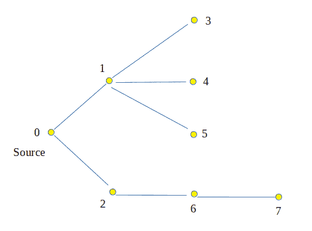
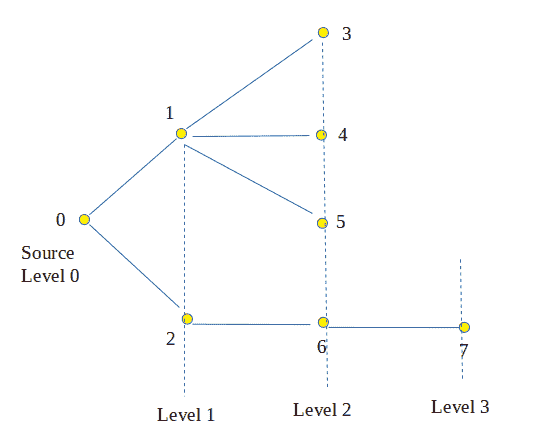
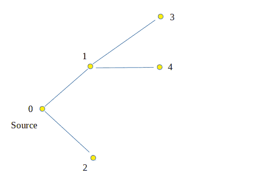
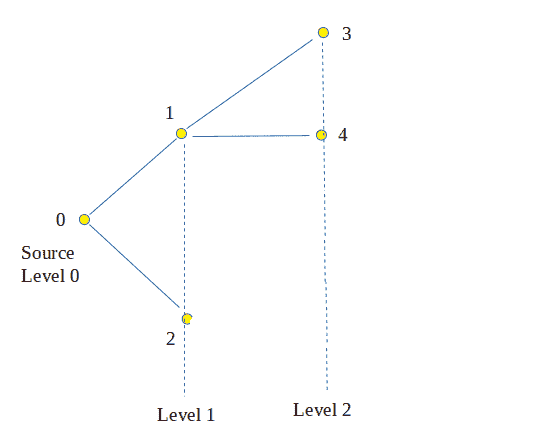

# 从源节点到树中每个节点的级别(使用 BFS)

> 原文:[https://www . geesforgeks . org/level-node-tree-source-node-using-bfs/](https://www.geeksforgeeks.org/level-node-tree-source-node-using-bfs/)

给定一棵有 v 个顶点的树，从源节点找到树中每个节点的级别。
**例:**

```
Input :   
```



```
Output :  Node      Level
           0          0
           1          1
           2          1
           3          2
           4          2
           5          2
           6          2
           7          3

Explanation : 
```



```
Input:
```



```
Output :  Node      Level
           0          0
           1          1
           2          1
           3          2
           4          2
Explanation:
```



**方法:**
[BFS(广度优先搜索)](https://www.geeksforgeeks.org/breadth-first-traversal-for-a-graph/)是一种图遍历技术，首先访问一个节点及其邻居，然后访问邻居的邻居。简单来说，它从源头开始逐级遍历。首先，它遍历一级节点(源节点的直接邻居)，然后遍历二级节点(源节点的邻居)等等。BFS 可用于确定来自给定源节点的每个节点的级别。
**算法:**

1.  创建树，一个存储节点的队列，并在队列中插入根节点或起始节点。创建一个大小为 v(顶点数)的额外数组*级*，并创建一个访问数组。
2.  当队列大小大于 0 时运行循环。
3.  将当前节点标记为已访问。
4.  从队列中弹出一个节点，插入其子节点(如果存在)，并将插入节点的大小更新为*级别[子节点] =级别[节点] + 1* 。
5.  打印所有节点及其级别。

**执行:**

## C++

```
// CPP Program to determine level of each node
// and print level
#include <bits/stdc++.h>
using namespace std;

// function to determine level of each node starting
// from x using BFS
void printLevels(vector<int> graph[], int V, int x)
{
    // array to store level of each node
    int level[V];
    bool marked[V];

    // create a queue
    queue<int> que;

    // enqueue element x
    que.push(x);

    // initialize level of source node to 0
    level[x] = 0;

    // marked it as visited
    marked[x] = true;

    // do until queue is empty
    while (!que.empty()) {

        // get the first element of queue
        x = que.front();

        // dequeue element
        que.pop();

        // traverse neighbors of node x
        for (int i = 0; i < graph[x].size(); i++) {
            // b is neighbor of node x
            int b = graph[x][i];

            // if b is not marked already
            if (!marked[b]) {

                // enqueue b in queue
                que.push(b);

                // level of b is level of x + 1
                level[b] = level[x] + 1;

                // mark b
                marked[b] = true;
            }
        }
    }

    // display all nodes and their levels
    cout << "Nodes"
         << "    "
         << "Level" << endl;
    for (int i = 0; i < V; i++)
        cout << " " << i << "   -->   " << level[i] << endl;
}

// Driver Code
int main()
{
    // adjacency graph for tree
    int V = 8;
    vector<int> graph[V];

    graph[0].push_back(1);
    graph[0].push_back(2);
    graph[1].push_back(3);
    graph[1].push_back(4);
    graph[1].push_back(5);
    graph[2].push_back(5);
    graph[2].push_back(6);
    graph[6].push_back(7);

    // call levels function with source as 0
    printLevels(graph, V, 0);

    return 0;
}
```

## Java 语言(一种计算机语言，尤用于创建网站)

```
// Java Program to determine level of each node 
// and print level 
import java.util.*;

class GFG
{

// function to determine level of each node starting 
// from x using BFS 
static void printLevels(Vector<Vector<Integer>> graph, int V, int x) 
{ 
    // array to store level of each node 
    int level[] = new int[V]; 
    boolean marked[] = new boolean[V]; 

    // create a queue 
    Queue<Integer> que = new LinkedList<Integer>(); 

    // enqueue element x 
    que.add(x); 

    // initialize level of source node to 0 
    level[x] = 0; 

    // marked it as visited 
    marked[x] = true; 

    // do until queue is empty 
    while (que.size() > 0) 
    { 

        // get the first element of queue 
        x = que.peek(); 

        // dequeue element 
        que.remove(); 

        // traverse neighbors of node x 
        for (int i = 0; i < graph.get(x).size(); i++) 
        { 
            // b is neighbor of node x 
            int b = graph.get(x).get(i); 

            // if b is not marked already 
            if (!marked[b])
            { 

                // enqueue b in queue 
                que.add(b); 

                // level of b is level of x + 1 
                level[b] = level[x] + 1; 

                // mark b 
                marked[b] = true; 
            } 
        } 
    } 

    // display all nodes and their levels 
    System.out.println( "Nodes"
                        + " "
                        + "Level"); 
    for (int i = 0; i < V; i++) 
        System.out.println(" " + i +" --> " + level[i] ); 
} 

// Driver Code 
public static void main(String args[])
{ 
    // adjacency graph for tree 
    int V = 8; 
    Vector<Vector<Integer>> graph=new Vector<Vector<Integer>>(); 

    for(int i = 0; i < V + 1; i++)
    graph.add(new Vector<Integer>());

    graph.get(0).add(1); 
    graph.get(0).add(2); 
    graph.get(1).add(3); 
    graph.get(1).add(4); 
    graph.get(1).add(5); 
    graph.get(2).add(5); 
    graph.get(2).add(6); 
    graph.get(6).add(7); 

    // call levels function with source as 0 
    printLevels(graph, V, 0); 
} 
} 

// This code is contributed by Arnab Kundu
```

## 蟒蛇 3

```
# Python3 Program to determine level 
# of each node and print level 
import queue 

# function to determine level of 
# each node starting from x using BFS 
def printLevels(graph, V, x):

    # array to store level of each node 
    level = [None] * V 
    marked = [False] * V 

    # create a queue 
    que = queue.Queue()

    # enqueue element x 
    que.put(x) 

    # initialize level of source 
    # node to 0 
    level[x] = 0

    # marked it as visited 
    marked[x] = True

    # do until queue is empty 
    while (not que.empty()):

        # get the first element of queue 
        x = que.get() 

        # traverse neighbors of node x
        for i in range(len(graph[x])):

            # b is neighbor of node x 
            b = graph[x][i] 

            # if b is not marked already 
            if (not marked[b]): 

                # enqueue b in queue 
                que.put(b) 

                # level of b is level of x + 1 
                level[b] = level[x] + 1

                # mark b 
                marked[b] = True

    # display all nodes and their levels 
    print("Nodes", " ", "Level")
    for i in range(V):
        print(" ",i,  " --> ", level[i])

# Driver Code 
if __name__ == '__main__':

    # adjacency graph for tree 
    V = 8
    graph = [[] for i in range(V)]

    graph[0].append(1) 
    graph[0].append(2) 
    graph[1].append(3) 
    graph[1].append(4) 
    graph[1].append(5) 
    graph[2].append(5) 
    graph[2].append(6) 
    graph[6].append(7) 

    # call levels function with source as 0 
    printLevels(graph, V, 0)

# This code is contributed by PranchalK
```

## C#

```
// C# Program to determine level of each node 
// and print level 
using System;
using System.Collections.Generic;

class GFG
{

// function to determine level of each node starting 
// from x using BFS 
static void printLevels(List<List<int>> graph, 
                                  int V, int x) 
{ 
    // array to store level of each node 
    int []level = new int[V]; 
    Boolean []marked = new Boolean[V]; 

    // create a queue 
    Queue<int> que = new Queue<int>(); 

    // enqueue element x 
    que.Enqueue(x); 

    // initialize level of source node to 0 
    level[x] = 0; 

    // marked it as visited 
    marked[x] = true; 

    // do until queue is empty 
    while (que.Count > 0) 
    { 

        // get the first element of queue 
        x = que.Peek(); 

        // dequeue element 
        que.Dequeue(); 

        // traverse neighbors of node x 
        for (int i = 0; i < graph[x].Count; i++) 
        { 
            // b is neighbor of node x 
            int b = graph[x][i]; 

            // if b is not marked already 
            if (!marked[b])
            { 

                // enqueue b in queue 
                que.Enqueue(b); 

                // level of b is level of x + 1 
                level[b] = level[x] + 1; 

                // mark b 
                marked[b] = true; 
            } 
        } 
    } 

    // display all nodes and their levels 
    Console.WriteLine("Nodes" + " " + "Level"); 
    for (int i = 0; i < V; i++) 
        Console.WriteLine(" " + i +" --> " + level[i]); 
} 

// Driver Code 
public static void Main(String []args)
{ 
    // adjacency graph for tree 
    int V = 8; 
    List<List<int>> graph = new List<List<int>>(); 

    for(int i = 0; i < V + 1; i++)
        graph.Add(new List<int>());

    graph[0].Add(1); 
    graph[0].Add(2); 
    graph[1].Add(3); 
    graph[1].Add(4); 
    graph[1].Add(5); 
    graph[2].Add(5); 
    graph[2].Add(6); 
    graph[6].Add(7); 

    // call levels function with source as 0 
    printLevels(graph, V, 0); 
} 
}

// This code is contributed by Princi Singh
```

## java 描述语言

```
<script>

// Javascript Program to determine level of each node 
// and print level 

// function to determine level of each node starting 
// from x using BFS 
function printLevels(graph, V, x) 
{ 
    // array to store level of each node 
    var level = Array(V); 
    var marked = Array(V).fill(false); 

    // create a queue 
    var que = [];

    // enqueue element x 
    que.push(x); 

    // initialize level of source node to 0 
    level[x] = 0; 

    // marked it as visited 
    marked[x] = true; 

    // do until queue is empty 
    while (que.length > 0) 
    { 

        // get the first element of queue 
        x = que[0]; 

        // dequeue element 
        que.shift(); 

        // traverse neighbors of node x 
        for (var i = 0; i < graph[x].length; i++) 
        { 
            // b is neighbor of node x 
            var b = graph[x][i]; 

            // if b is not marked already 
            if (!marked[b])
            { 

                // enqueue b in queue 
                que.push(b); 

                // level of b is level of x + 1 
                level[b] = level[x] + 1; 

                // mark b 
                marked[b] = true; 
            } 
        } 
    } 

    // display all nodes and their levels 
    document.write("Nodes" + " " + "Level<br>"); 
    for (var i = 0; i < V; i++) 
        document.write(" " + i +" --> " + level[i]+"<br>"); 
} 

// Driver Code 
// adjacency graph for tree 
var V = 8; 
var graph = Array.from(Array(V+1), ()=>Array()); 

graph[0].push(1); 
graph[0].push(2); 
graph[1].push(3); 
graph[1].push(4); 
graph[1].push(5); 
graph[2].push(5); 
graph[2].push(6); 
graph[6].push(7); 
// call levels function with source as 0 
printLevels(graph, V, 0); 

// This code is contributed by importantly.

</script>
```

**输出:**

```
Nodes    Level
 0   -->   0
 1   -->   1
 2   -->   1
 3   -->   2
 4   -->   2
 5   -->   2
 6   -->   2
 7   -->   3
```

**复杂度分析:**

*   **时间复杂度:** O(n)。
    在 BFS 遍历中，每个节点只被访问一次，因此时间复杂度为 O(n)。
*   **空间复杂度:** O(n)。
    需要空间来存储队列中的节点。