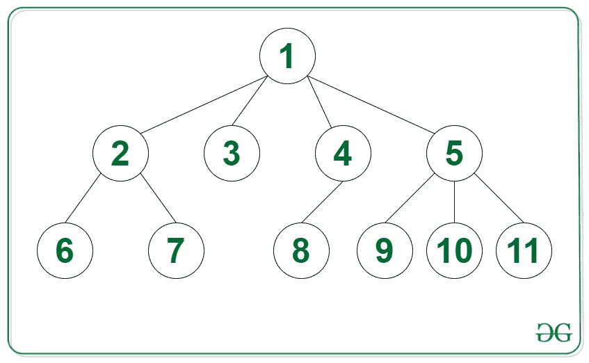
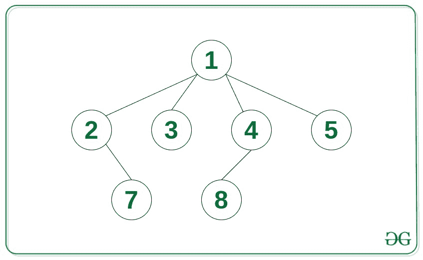

# 将 N 元树转换为以 K 为根节点的邻接表表示的层次顺序遍历

> 原文:[https://www . geesforgeks . org/level-order-transverse-by-converting-n-ary-tree-to-邻接表-presentation-with-k-as-root-node/](https://www.geeksforgeeks.org/level-order-traversal-by-converting-n-ary-tree-into-adjacency-list-representation-with-k-as-root-node/)

给定一个 [N 元树](https://www.geeksforgeeks.org/generic-treesn-array-trees/)和一个整数 **K** 的根节点，任务是将给定的树转换成[邻接表表示](https://www.geeksforgeeks.org/graph-and-its-representations/)，并打印考虑顶点 **K** 作为根节点的层次顺序遍历。

**示例:**

> **输入:**下图中的树，K = 5
> 
> 
> 
> **输出:**T2【5】T3【1】9 10 11
> 2 3 4
> 6 7 8
> 
> **输入:**下图中的树，K = 5
> 
> 
> 
> **输出:**T2 5
> 1
> 2 3 4
> 7 8

**方法:**利用 [N 元树上的](https://www.geeksforgeeks.org/generic-treesn-array-trees/) [DFS 遍历](https://www.geeksforgeeks.org/depth-first-search-or-dfs-for-a-graph/)并根据[邻接表表示](https://www.geeksforgeeks.org/graph-and-its-representations/)将所有边的关系存储到邻接表中，即可解决给定的问题。创建的邻接表可以用来打印 **K** 为根节点的[级序遍历](https://www.geeksforgeeks.org/level-order-tree-traversal/)。这可以使用 [BFS 遍历](https://www.geeksforgeeks.org/breadth-first-search-or-bfs-for-a-graph/)来完成，这将在本文中讨论。

下面是上述方法的实现:

## C++

```
// C++ program for the above approach
#include <bits/stdc++.h>
using namespace std;

// A binary tree node
struct Node {
    int data;
    vector<Node*> child;
};

// Function to create a new tree node
Node* newNode(int key)
{
    Node* temp = new Node;
    temp->data = key;
    return temp;
}

// Adjacency list to store the Tree
vector<vector<int> > adj;

// Function to perform the DFS traversal
// of the N-ary tree using the given
// pointer to the root node of the tree
void DFS(struct Node* node)
{
    // Traverse all child of node
    for (auto x : node->child) {
        if (x != NULL) {

            // Insert the pair of vertices
            // into the adjacency list
            adj[node->data].push_back(x->data);
            adj[x->data].push_back(node->data);

            // Recursive call for DFS on x
            DFS(x);
        }
    }
}

// Function to print the level order
// traversal of the given tree with
// s as root node
void levelOrderTrav(int s, int N)
{
    // Create a queue for Level
    // Order Traversal
    queue<int> q;

    // Stores if the current
    // node is visited
    vector<bool> visited(N);

    q.push(s);

    // -1 marks the end of level
    q.push(-1);
    visited[s] = true;
    while (!q.empty()) {

        // Dequeue a vertex from queue
        int v = q.front();
        q.pop();

        // If v marks the end of level
        if (v == -1) {
            if (!q.empty())
                q.push(-1);

            // Print a newline character
            cout << endl;
            continue;
        }

        // Print current vertex
        cout << v << " ";

        // Add the child vertices of
        // the current node in queue
        for (int u : adj[v]) {
            if (!visited[u]) {
                visited[u] = true;
                q.push(u);
            }
        }
    }
}

// Driver Code
int main()
{
    Node* root = newNode(1);
    (root->child).push_back(newNode(2));
    (root->child).push_back(newNode(3));
    (root->child).push_back(newNode(4));
    (root->child).push_back(newNode(5));
    (root->child[0]->child).push_back(newNode(6));
    (root->child[0]->child).push_back(newNode(7));
    (root->child[2]->child).push_back(newNode(8));
    (root->child[3]->child).push_back(newNode(9));
    (root->child[3]->child).push_back(newNode(10));
    (root->child[3]->child).push_back(newNode(11));
    int N = 11;
    int K = 5;
    adj.resize(N + 1, vector<int>());

    DFS(root);
    levelOrderTrav(5, 11);

    return 0;
}
```

**Output:**

```
5 
1 9 10 11 
2 3 4 
6 7 8

```

***时间复杂度:**O(N)*
T5**辅助空间:** O(N)