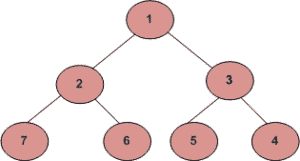

# 螺旋形式的层级顺序遍历|使用德格

> 原文:[https://www . geesforgeks . org/level-order-遍历-以螺旋形式-使用-deque/](https://www.geeksforgeeks.org/level-order-traversal-in-spiral-form-using-deque/)

给定一棵二叉树，任务是打印给定树的螺旋顺序遍历。对于下面的树，函数应该打印 1、2、3、4、5、6、7。



**例:**

```
Input: 
     1
    / \
   3   2
Output :
1
3 2

Input :
        10
       /  \
      20  30
     / \  
    40 60
Output :
10
20 30
60 40
```

我们已经看到[使用两个栈](https://www.geeksforgeeks.org/level-order-traversal-in-spiral-form/)的递归和迭代解，以及一种使用一个栈和一个队列的方法[。在这篇文章中，我们将讨论一个解决方案](https://www.geeksforgeeks.org/level-order-traversal-in-spiral-form-using-one-stack-and-one-queue/)[得克](https://www.geeksforgeeks.org/deque-set-1-introduction-applications/)。这个想法是使用一个方向变量，并根据这个方向变量的值决定是从前面弹出元素还是从后面弹出元素。
以下是上述方法的实现:

## C++

```
// C++ program to print level order traversal
// in spiral form using one deque.
#include <bits/stdc++.h>
using namespace std;

class Node {
public:
    int data;
    Node *left, *right;
    Node(int val)
    {
        data = val;
        left = NULL;
        right = NULL;
    }
};

void spiralOrder(Node* root)
{

    deque<Node*> d;

    // Push root
    d.push_back(root);

    // Direction 0 shows print right to left
    // and for Direction 1 left to right
    int dir = 0;
    while (!d.empty()) {
        int size = d.size();
        while (size--) {
            // One whole level
            // will be print in this loop

            if (dir == 0) {
                Node* temp = d.back();
                d.pop_back();
                if (temp->right)
                    d.push_front(temp->right);
                if (temp->left)
                    d.push_front(temp->left);
                cout << temp->data << " ";
            }
            else {
                Node* temp = d.front();
                d.pop_front();
                if (temp->left)
                    d.push_back(temp->left);
                if (temp->right)
                    d.push_back(temp->right);
                cout << temp->data << " ";
            }
        }
        cout << endl;
        // Direction change
        dir = 1 - dir;
    }
}

int main()
{
    // Build the Tree
    Node* root = new Node(10);
    root->left = new Node(20);
    root->right = new Node(30);
    root->left->left = new Node(40);
    root->left->right = new Node(60);

    // Call the Function
    spiralOrder(root);

    return 0;
}
```

## Java 语言(一种计算机语言，尤用于创建网站)

```
// Java program to print level order traversal
// in spiral form using one deque.
import java.util.*;

class GFG
{

static class Node
{
    int data;
    Node left, right;
    Node(int val)
    {
        data = val;
        left = null;
        right = null;
    }
};

static void spiralOrder(Node root)
{

    Deque<Node> d = new LinkedList<Node>();

    // Push root
    d.addLast(root);

    // Direction 0 shows print right to left
    // and for Direction 1 left to right
    int dir = 0;
    while (d.size() > 0)
    {
        int size = d.size();
        while (size-->0)
        {
            // One whole level
            // will be print in this loop

            if (dir == 0)
            {
                Node temp = d.peekLast();
                d.pollLast();
                if (temp.right != null)
                    d.addFirst(temp.right);
                if (temp.left != null)
                    d.addFirst(temp.left);
                System.out.print(temp.data + " ");
            }
            else
            {
                Node temp = d.peekFirst();
                d.pollFirst();
                if (temp.left != null)
                    d.addLast(temp.left);
                if (temp.right != null)
                    d.addLast(temp.right);
                System.out.print(temp.data + " ");
            }
        }
        System.out.println();

        // Direction change
        dir = 1 - dir;
    }
}

// Driver code
public static void main(String args[])
{
    // Build the Tree
    Node root = new Node(10);
    root.left = new Node(20);
    root.right = new Node(30);
    root.left.left = new Node(40);
    root.left.right = new Node(60);

    // Call the Function
    spiralOrder(root);
}
}

// This code is contributed by Arnab Kundu
```

## 蟒蛇 3

```
# Python program to print level order traversal
# in spiral form using one deque.
class Node :
    def __init__(self,val) :
        self.data = val;
        self.left = None;
        self.right = None;

def spiralOrder(root) :

    d = [];

    # Push root
    d.append(root);

    # Direction 0 shows print right to left
    # and for Direction 1 left to right
    direct = 0;
    while (len(d) != 0) :
        size = len(d);

        while (size) :
            size -= 1;

            # One whole level
            # will be print in this loop
            if (direct == 0) :
                temp = d.pop();

                if (temp.right) :
                    d.insert(0, temp.right);

                if (temp.left) :
                    d.insert(0, temp.left);

                print(temp.data, end= " ");

            else :
                temp = d[0];
                d.pop(0);

                if (temp.left) :
                    d.append(temp.left);

                if (temp.right) :
                    d.append(temp.right);

                print(temp.data ,end= " ");

        print()

        # Direction change
        direct = 1 - direct;

if __name__ == "__main__" :

    # Build the Tree
    root = Node(10);
    root.left = Node(20);
    root.right = Node(30);
    root.left.left = Node(40);
    root.left.right = Node(60);

    # Call the Function
    spiralOrder(root);

# This code is contributed by AnkitRai01
```

## java 描述语言

```
<script>

// JavaScript program to print level order traversal
// in spiral form using one deque.

class Node {

    constructor(val)
    {
        this.data = val;
        this.left = null;
        this.right = null;
    }
};

function spiralOrder(root)
{

    var d = [];

    // Push root
    d.push(root);

    // Direction 0 shows print right to left
    // and for Direction 1 left to right
    var dir = 0;
    while (d.length!=0) {
        var size = d.length;
        while (size-- >0) {
            // One whole level
            // will be print in this loop

            if (dir == 0) {
                var temp = d[d.length-1];
                d.pop();
                if (temp.right!= null)
                    d.unshift(temp.right);
                if (temp.left!= null)
                    d.unshift(temp.left);
                document.write( temp.data + " ");
            }
            else {
                var temp = d[0];
                d.shift();
                if (temp.left != null)
                    d.push(temp.left);
                if (temp.right!= null)
                    d.push(temp.right);
                document.write( temp.data + " ");
            }
        }
        document.write("<br>");
        // Direction change
        dir = 1 - dir;
    }
}

// Build the Tree
var root = new Node(10);
root.left = new Node(20);
root.right = new Node(30);
root.left.left = new Node(40);
root.left.right = new Node(60);
// Call the Function
spiralOrder(root);

</script>
```

**Output:** 

```
10 
20 30 
60 40
```

**时间复杂度:**O(N)
T3】空间复杂度: O(N)
其中 N 为节点数