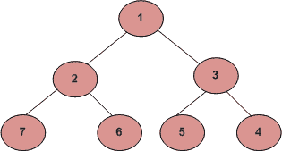

# 螺旋形式的层级顺序遍历|使用一个堆栈和一个队列

> 原文:[https://www . geesforgeks . org/level-order-through-in-spiral-form-use-one-stack-and-one-queue/](https://www.geeksforgeeks.org/level-order-traversal-in-spiral-form-using-one-stack-and-one-queue/)

写一个函数打印一棵树的螺旋顺序遍历。对于下面的树，函数应该打印 1、2、3、4、5、6、7。



您只能使用一个堆栈。

我们已经看到[使用两个栈](https://www.geeksforgeeks.org/level-order-traversal-in-spiral-form/)的递归和迭代解。在这篇文章中，讨论了一个具有一个堆栈和一个队列的解决方案。这个想法是像正常的级别顺序遍历一样继续输入节点，但是在打印过程中，交替地将它们推到堆栈上并打印它们，而在其他遍历中，只需按照它们在队列中出现的方式打印它们。

下面是这个想法的实现。

## C++

```
// CPP program to print level order traversal
// in spiral form using one queue and one stack.
#include <bits/stdc++.h>
using namespace std;

struct Node {
   int data;
   Node *left, *right;
};

/* Utility function to create a new tree node */
Node* newNode(int val)
{
    Node* new_node = new Node;
    new_node->data = val;
    new_node->left = new_node->right = NULL;
    return new_node;
}

/* Function to print a tree in spiral form
   using one stack */
void printSpiralUsingOneStack(Node* root)
{
    if (root == NULL)
        return;

    stack<int> s;
    queue<Node*> q;

    bool reverse = true;
    q.push(root);
    while (!q.empty()) {

        int size = q.size();
        while (size) {
            Node* p = q.front();
            q.pop();

            // if reverse is true, push node's
            // data onto the stack, else print it
            if (reverse)
                s.push(p->data);
            else
                cout << p->data << " ";

            if (p->left)
                q.push(p->left);
            if (p->right)
                q.push(p->right);
            size--;
        }

        // print nodes from the stack if
        // reverse is true
        if (reverse) {
            while (!s.empty()) {
                cout << s.top() << " ";
                s.pop();
            }
        }

        // the next row has to be printed as
        // it is, hence change the value of
        // reverse
        reverse = !reverse;
    }
}

// Driver Code
int main()
{
    Node* root = newNode(1);
    root->left = newNode(2);
    root->right = newNode(3);
    root->left->left = newNode(7);
    root->left->right = newNode(6);
    root->right->left = newNode(5);
    root->right->right = newNode(4);
    printSpiralUsingOneStack(root);
    return 0;
}
```

## Java 语言(一种计算机语言，尤用于创建网站)

```
// Java program to print level order traversal
// in spiral form using one queue and one stack.
import java.util.*;
class GFG
{
static class Node
{
    int data;
    Node left, right;
};

/* Utility function to create a new tree node */
static Node newNode(int val)
{
    Node new_node = new Node();
    new_node.data = val;
    new_node.left = new_node.right = null;
    return new_node;
}

/* Function to print a tree in spiral form
using one stack */
static void printSpiralUsingOneStack(Node root)
{
    if (root == null)
        return;

    Stack<Integer> s = new Stack<Integer>();
    Queue<Node> q = new LinkedList<Node>();

    boolean reverse = true;
    q.add(root);
    while (!q.isEmpty())
    {
        int size = q.size();
        while (size > 0)
        {
            Node p = q.peek();
            q.remove();

            // if reverse is true, push node's
            // data onto the stack, else print it
            if (reverse)
                s.add(p.data);
            else
                System.out.print(p.data + " ");

            if (p.left != null)
                q.add(p.left);
            if (p.right != null)
                q.add(p.right);
            size--;
        }

        // print nodes from the stack if
        // reverse is true
        if (reverse)
        {
            while (!s.empty())
            {
                System.out.print(s.peek() + " ");
                s.pop();
            }
        }

        // the next row has to be printed as
        // it is, hence change the value of
        // reverse
        reverse = !reverse;
    }
}

// Driver Code
public static void main(String[] args)
{
    Node root = newNode(1);
    root.left = newNode(2);
    root.right = newNode(3);
    root.left.left = newNode(7);
    root.left.right = newNode(6);
    root.right.left = newNode(5);
    root.right.right = newNode(4);
    printSpiralUsingOneStack(root);
}
}

// This code is contributed by Princi Singh
```

## 蟒蛇 3

```
# Python program to print level order traversal
# in spiral form using one queue and one stack.

# Utility class to create a new node
class Node:
    def __init__(self, key):
        self.key = key
        self.left = self.right = None

# Utility function to create a new tree node
def newNode(val):

    new_node = Node(0)
    new_node.data = val
    new_node.left = new_node.right = None
    return new_node

# Function to print a tree in spiral form
# using one stack
def printSpiralUsingOneStack(root):

    if (root == None):
        return

    s = []
    q = []

    reverse = True
    q.append(root)
    while (len(q) > 0) :

        size = len(q)
        while (size > 0) :
            p = q[0]
            q.pop(0)

            # if reverse is true, push node's
            # data onto the stack, else print it
            if (reverse):
                s.append(p.data)
            else:
                print( p.data ,end = " ")

            if (p.left != None):
                q.append(p.left)
            if (p.right != None):
                q.append(p.right)
            size = size - 1

        # print nodes from the stack if
        # reverse is true
        if (reverse) :
            while (len(s)) :
                print( s[-1],end= " ")
                s.pop()

        # the next row has to be printed as
        # it is, hence change the value of
        # reverse
        reverse = not reverse

# Driver Code
root = newNode(1)
root.left = newNode(2)
root.right = newNode(3)
root.left.left = newNode(7)
root.left.right = newNode(6)
root.right.left = newNode(5)
root.right.right = newNode(4)
printSpiralUsingOneStack(root)

# This code is contributed by Arnab Kundu
```

## C#

```
// C# program to print level order traversal
// in spiral form using one queue and one stack.
using System;
using System.Collections.Generic;

class GFG
{
public class Node
{
    public int data;
    public Node left, right;
};

/* Utility function to create a new tree node */
static Node newNode(int val)
{
    Node new_node = new Node();
    new_node.data = val;
    new_node.left = new_node.right = null;
    return new_node;
}

/* Function to print a tree in spiral form
using one stack */
static void printSpiralUsingOneStack(Node root)
{
    if (root == null)
        return;

    Stack<int> s = new Stack<int>();
    Queue<Node> q = new Queue<Node>();

    Boolean reverse = true;
    q.Enqueue(root);
    while (q.Count != 0)
    {
        int size = q.Count;
        while (size > 0)
        {
            Node p = q.Peek();
            q.Dequeue();

            // if reverse is true, push node's
            // data onto the stack, else print it
            if (reverse)
                s.Push(p.data);
            else
                Console.Write(p.data + " ");

            if (p.left != null)
                q.Enqueue(p.left);
            if (p.right != null)
                q.Enqueue(p.right);
            size--;
        }

        // print nodes from the stack if
        // reverse is true
        if (reverse)
        {
            while (s.Count != 0)
            {
                Console.Write(s.Peek() + " ");
                s.Pop();
            }
        }

        // the next row has to be printed as
        // it is, hence change the value of
        // reverse
        reverse = !reverse;
    }
}

// Driver Code
public static void Main(String[] args)
{
    Node root = newNode(1);
    root.left = newNode(2);
    root.right = newNode(3);
    root.left.left = newNode(7);
    root.left.right = newNode(6);
    root.right.left = newNode(5);
    root.right.right = newNode(4);
    printSpiralUsingOneStack(root);
}
}

// This code is contributed by Rajput-Jiv
```

## java 描述语言

```
<script>

// Javascript program to print level
// order traversal in spiral form
// using one queue and one stack.
class Node
{
    constructor()
    {
        this.data = 0;
        this.left = null;
        this.right = null;
    }
};

// Utility function to create
// a new tree node
function newNode(val)
{
    var new_node = new Node();
    new_node.data = val;
    new_node.left = new_node.right = null;
    return new_node;
}

// Function to print a tree in spiral form
// using one stack
function printSpiralUsingOneStack(root)
{
    if (root == null)
        return;

    var s = [];
    var q = [];

    var reverse = true;
    q.push(root);

    while (q.length != 0)
    {
        var size = q.length;
        while (size > 0)
        {
            var p = q[0];
            q.shift();

            // If reverse is true, push node's
            // data onto the stack, else print it
            if (reverse)
                s.push(p.data);
            else
                document.write(p.data + " ");

            if (p.left != null)
                q.push(p.left);
            if (p.right != null)
                q.push(p.right);

            size--;
        }

        // Print nodes from the stack if
        // reverse is true
        if (reverse)
        {
            while (s.length != 0)
            {
                document.write(s[s.length - 1] + " ");
                s.pop();
            }
        }

        // The next row has to be printed as
        // it is, hence change the value of
        // reverse
        reverse = !reverse;
    }
}

// Driver Code
var root = newNode(1);
root.left = newNode(2);
root.right = newNode(3);
root.left.left = newNode(7);
root.left.right = newNode(6);
root.right.left = newNode(5);
root.right.right = newNode(4);

printSpiralUsingOneStack(root);

// This code is contributed by rutvik_56

</script>
```

**Output:** 

```
1 2 3 4 5 6 7
```

**时间复杂度:**O(n)
T3】辅助空间: O(n)