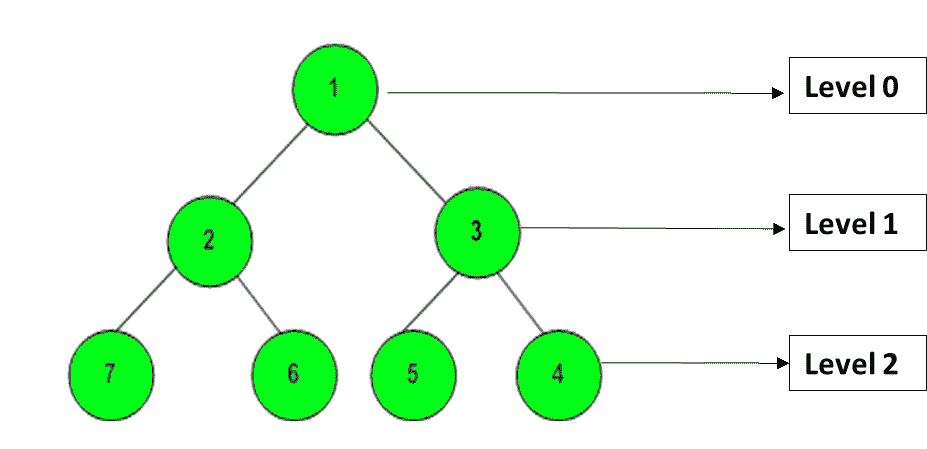

# 使用堆栈和多重映射以螺旋形式进行层级顺序遍历

> 原文:[https://www . geesforgeks . org/level-order-through-in-spiral-form-use-stack-and-multimap/](https://www.geeksforgeeks.org/level-order-traversal-in-spiral-form-using-stack-and-multimap/)

给定一个由 **N** 个节点组成的二叉树，任务是以螺旋形式打印级别顺序遍历。在螺旋形式中，树的第一层和第二层的节点正常打印(从左到右)，之后交替层的节点以相反的顺序打印。

**示例:**

> **输入:** N = 3
> 
> ```
>       1
>      / \
>     3   2
> 
> ```
> 
> **输出:** 1 3 2
> **说明:**
> 0 级节点按正常顺序打印(1)
> 1 级节点按正常顺序打印(3，2)
> 因此，螺旋顺序为(1，3，2)
> 
> **输入:** N = 5
> 
> ```
>        10
>       /  \
>      20  30
>     /  \
>    40  60
> 
> ```
> 
> **输出:** 10 20 30 60 40
> **说明:**
> 0 级节点按正常顺序打印(10)
> 1 级节点按正常顺序打印(20，30)
> 2 级节点按相反顺序打印(60，40)
> 因此，螺旋顺序为(10，20，30，60，40)

**天真方法:**
这个问题的天真方法已经在[这篇](https://www.geeksforgeeks.org/level-order-traversal-in-spiral-form/)文章中讨论过了。基本思想是使用递归和一个标志变量，使用它可以以相反的顺序打印交替层的节点，并最终获得螺旋形式。
***时间复杂度:**O(N<sup>2</sup>)*
***辅助空间:** O(1)*

**高效方式:**
在该方式中，使用 **[栈](https://www.geeksforgeeks.org/stack-data-structure/)** 和 **[多映射](https://www.geeksforgeeks.org/multimap-associative-containers-the-c-standard-template-library-stl/)** 。C++中的多映射容器以升序存储**(键，值)**对，按键排序。对于给定树的每个节点，如果我们将**(级别，节点)**放在一个多映射中，那么它将存储这些根据级别排序的节点。

例如，给定的树是:

[](https://media.geeksforgeeks.org/wp-content/uploads/20200627121335/pic2.png)

对于此树，多重映射如下所示:

```
Key(Level)     Value(Element)
0               1
1               2
1               3
2               7
2               6
2               5
2               4

```

该方法的详细步骤如下:

1.  遍历给定的树，将所有**(级别，节点)**对插入到一个多映射中，然后遍历这个多映射。
2.  如果级别为**奇数**，则按照节点在多地图中出现的顺序打印节点。
3.  如果级别为**甚至**，则将当前级别的所有元素推到堆栈中，然后从堆栈中弹出所有元素并打印它们。它给出了相反的顺序。

最后，这种级别顺序遍历将产生所需的螺旋形式。

下面是上述方法的实现:

```
// C++ implementation of
// the above approach

#include <bits/stdc++.h>
using namespace std;

// Tree Node
struct Node {
    int data;
    Node* left;
    Node* right;
};

// Utility function to
// create a new Tree Node
Node* newNode(int val)
{
    Node* temp = new Node;
    temp->data = val;
    temp->left = NULL;
    temp->right = NULL;

    return temp;
}

void printSpiral(Node* root);

// Function to build tree
// from given nodes
Node* buildTree(string str)
{
    // Corner Case
    if (str.length() == 0
        || str[0] == 'N')
        return NULL;

    // Vector to store nodes
    // after splitting space
    vector<string> ip;

    istringstream iss(str);
    for (string str; iss >> str;)
        ip.push_back(str);

    // Creating root of the tree
    Node* root = newNode(stoi(ip[0]));

    // Push the root to the queue
    queue<Node*> queue;
    queue.push(root);

    // Start from second element
    int i = 1;
    while (!queue.empty()
           && i < ip.size()) {

        // Get and remove the
        // front of the queue
        Node* currNode = queue.front();
        queue.pop();

        // Get the current node's
        // value from the string
        string currVal = ip[i];

        // If left child is not null
        if (currVal != "N") {

            // Create the left child
            // for the current node
            currNode->left = newNode(stoi(currVal));

            // Push it to the queue
            queue.push(currNode->left);
        }

        // For the right child
        i++;
        if (i >= ip.size())
            break;
        currVal = ip[i];

        // If the right child is not null
        if (currVal != "N") {

            // Create the right child
            // for the current node
            currNode->right = newNode(stoi(currVal));

            // Push it to the queue
            queue.push(currNode->right);
        }
        i++;
    }

    return root;
}

// Globally defined multimap
multimap<int, int> m;

// Function to fill multimap
void fillMultiMap(Node* root, int level)
{

    if (root == NULL)
        return;

    else {
        m.insert(pair<int, int>(
            level, root->data));
        fillMultiMap(
            root->left, level + 1);
        fillMultiMap(
            root->right, level + 1);
    }
}

void printSpiral(Node* root)
{
    m.clear();
    fillMultiMap(root, 0);
    stack<int> s;

    map<int, int>::iterator it
        = m.begin();

    // Traversing multimap
    while (it != m.end()) {

        // If level is odd
        if ((it->first) % 2 != 0) {

            // Printing same order
            while (!s.empty()) {
                cout << s.top() << " ";
                s.pop();
            }
            cout << it->second << " ";
        }

        // Otherwise, pushing to stack
        else {
            s.push(it->second);
        }
        it++;
    }

    // Pop from stack
    // to get reverse order
    while (!s.empty()) {
        cout << s.top() << " ";
        s.pop();
    }

    return;
}

// Driver code
int main()
{

    // Tree input
    string s = "1 2 3 7 6 5 4";

    // Build tree form given nodes
    Node* root = buildTree(s);

    // Print spiral form
    printSpiral(root);

    return 0;
}
```

**Output:**

```
1 2 3 4 5 6 7

```

***时间复杂度:**O(NlogN)*
T5**辅助空间:** O(N)