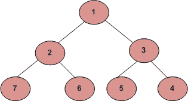

# 螺旋形式的层级顺序遍历

> 原文:[https://www . geesforgeks . org/level-order-遍历-以螺旋形式/](https://www.geeksforgeeks.org/level-order-traversal-in-spiral-form/)

写一个函数打印一棵树的螺旋顺序遍历。对于下面的树，函数应该打印 1、2、3、4、5、6、7。



**方法 1(递归)**
这个问题可以看作是[级顺序遍历](https://www.geeksforgeeks.org/level-order-tree-traversal/)帖子的延伸。
要按螺旋顺序打印节点，应交替打印不同级别的节点。一个额外的布尔变量 *ltr* 用于更改级别的打印顺序。如果 *ltr* 为 1，那么 printGivenLevel()从左到右打印节点，或者从右到左打印节点。 *ltr* 的值在每次迭代中翻转以改变顺序。
打印层次顺序遍历树的功能

```
printSpiral(tree)
  bool ltr = 0;
  for d = 1 to height(tree)
     printGivenLevel(tree, d, ltr);
     ltr ~= ltr /*flip ltr*/
```

函数打印给定级别的所有节点

```
printGivenLevel(tree, level, ltr)
if tree is NULL then return;
if level is 1, then
    print(tree->data);
else if level greater than 1, then
    if(ltr)
        printGivenLevel(tree->left, level-1, ltr);
        printGivenLevel(tree->right, level-1, ltr);
    else
        printGivenLevel(tree->right, level-1, ltr);
        printGivenLevel(tree->left, level-1, ltr);
```

下面是上述算法的实现。

## C++

```
// C++ program for recursive level
// order traversal in spiral form
#include<bits/stdc++.h>
using namespace std;

// A binary tree node has data,
// pointer to left child and a
// pointer to right child
struct node
{
    int data;
    struct node* left;
    struct node* right;
};

// Function prototypes
void printGivenLevel(struct node* root,
                     int level, int ltr);
int height(struct node* node);
struct node* newNode(int data);

// Function to print spiral traversal of a tree
void printSpiral(struct node* root)
{
    int h = height(root);
    int i;

    // ltr -> Left to Right. If this variable
    // is set,then the given level is traversed
    // from left to right.
    bool ltr = false;
    for(i = 1; i <= h; i++)
    {
        printGivenLevel(root, i, ltr);

        // Revert ltr to traverse next
        // level in opposite order
        ltr = !ltr;
    }
}

// Print nodes at a given level
void printGivenLevel(struct node* root,
                     int level, int ltr)
{
    if (root == NULL)
        return;
    if (level == 1)
        cout << root->data << " ";

    else if (level > 1)
    {
        if (ltr)
        {
            printGivenLevel(root->left,
                            level - 1, ltr);
            printGivenLevel(root->right,
                            level - 1, ltr);
        }
        else
        {
            printGivenLevel(root->right,
                            level - 1, ltr);
            printGivenLevel(root->left,
                            level - 1, ltr);
        }
    }
}

// Compute the "height" of a tree -- the number of
// nodes along the longest path from the root node
// down to the farthest leaf node.
int height(struct node* node)
{
    if (node == NULL)
        return 0;
    else
    {

        // Compute the height of each subtree
        int lheight = height(node->left);
        int rheight = height(node->right);

        // Use the larger one
        if (lheight > rheight)
            return (lheight + 1);
        else
            return (rheight + 1);
    }
}

// Helper function that allocates a new
// node with the given data and NULL left
// and right pointers.
struct node* newNode(int data)
{
    node* newnode = new node();
    newnode->data = data;
    newnode->left = NULL;
    newnode->right = NULL;

    return (newnode);
}

// Driver code
int main()
{
    struct node* root = newNode(1);
    root->left = newNode(2);
    root->right = newNode(3);
    root->left->left = newNode(7);
    root->left->right = newNode(6);
    root->right->left = newNode(5);
    root->right->right = newNode(4);
    printf("Spiral Order traversal of "
           "binary tree is \n");

    printSpiral(root);

    return 0;
}

// This code is contributed by samrat2825
```

## C

```
// C program for recursive level order traversal in spiral form
#include <stdbool.h>
#include <stdio.h>
#include <stdlib.h>

/* A binary tree node has data, pointer to left child
   and a pointer to right child */
struct node {
    int data;
    struct node* left;
    struct node* right;
};

/* Function prototypes */
void printGivenLevel(struct node* root, int level, int ltr);
int height(struct node* node);
struct node* newNode(int data);

/* Function to print spiral traversal of a tree*/
void printSpiral(struct node* root)
{
    int h = height(root);
    int i;

    /*ltr -> Left to Right. If this variable is set,
      then the given level is traversed from left to right. */
    bool ltr = false;
    for (i = 1; i <= h; i++) {
        printGivenLevel(root, i, ltr);

        /*Revert ltr to traverse next level in opposite order*/
        ltr = !ltr;
    }
}

/* Print nodes at a given level */
void printGivenLevel(struct node* root, int level, int ltr)
{
    if (root == NULL)
        return;
    if (level == 1)
        printf("%d ", root->data);
    else if (level > 1) {
        if (ltr) {
            printGivenLevel(root->left, level - 1, ltr);
            printGivenLevel(root->right, level - 1, ltr);
        }
        else {
            printGivenLevel(root->right, level - 1, ltr);
            printGivenLevel(root->left, level - 1, ltr);
        }
    }
}

/* Compute the "height" of a tree -- the number of
    nodes along the longest path from the root node
    down to the farthest leaf node.*/
int height(struct node* node)
{
    if (node == NULL)
        return 0;
    else {
        /* compute the height of each subtree */
        int lheight = height(node->left);
        int rheight = height(node->right);

        /* use the larger one */
        if (lheight > rheight)
            return (lheight + 1);
        else
            return (rheight + 1);
    }
}

/* Helper function that allocates a new node with the
   given data and NULL left and right pointers. */
struct node* newNode(int data)
{
    struct node* node = (struct node*)
        malloc(sizeof(struct node));
    node->data = data;
    node->left = NULL;
    node->right = NULL;

    return (node);
}

/* Driver program to test above functions*/
int main()
{
    struct node* root = newNode(1);
    root->left = newNode(2);
    root->right = newNode(3);
    root->left->left = newNode(7);
    root->left->right = newNode(6);
    root->right->left = newNode(5);
    root->right->right = newNode(4);
    printf("Spiral Order traversal of binary tree is \n");
    printSpiral(root);

    return 0;
}
```

## Java 语言(一种计算机语言，尤用于创建网站)

```
// Java program for recursive level order traversal in spiral form

/* A binary tree node has data, pointer to left child
   and a pointer to right child */
class Node {
    int data;
    Node left, right;

    public Node(int d)
    {
        data = d;
        left = right = null;
    }
}

class BinaryTree {
    Node root;

    // Function to print the spiral traversal of tree
    void printSpiral(Node node)
    {
        int h = height(node);
        int i;

        /* ltr -> left to right. If this variable is set then the
           given label is traversed from left to right */
        boolean ltr = false;
        for (i = 1; i <= h; i++) {
            printGivenLevel(node, i, ltr);

            /*Revert ltr to traverse next level in opposite order*/
            ltr = !ltr;
        }
    }

    /* Compute the "height" of a tree -- the number of
    nodes along the longest path from the root node
    down to the farthest leaf node.*/
    int height(Node node)
    {
        if (node == null)
            return 0;
        else {

            /* compute the height of each subtree */
            int lheight = height(node.left);
            int rheight = height(node.right);

            /* use the larger one */
            if (lheight > rheight)
                return (lheight + 1);
            else
                return (rheight + 1);
        }
    }

    /* Print nodes at a given level */
    void printGivenLevel(Node node, int level, boolean ltr)
    {
        if (node == null)
            return;
        if (level == 1)
            System.out.print(node.data + " ");
        else if (level > 1) {
            if (ltr != false) {
                printGivenLevel(node.left, level - 1, ltr);
                printGivenLevel(node.right, level - 1, ltr);
            }
            else {
                printGivenLevel(node.right, level - 1, ltr);
                printGivenLevel(node.left, level - 1, ltr);
            }
        }
    }
    /* Driver program to test the above functions */
    public static void main(String[] args)
    {
        BinaryTree tree = new BinaryTree();
        tree.root = new Node(1);
        tree.root.left = new Node(2);
        tree.root.right = new Node(3);
        tree.root.left.left = new Node(7);
        tree.root.left.right = new Node(6);
        tree.root.right.left = new Node(5);
        tree.root.right.right = new Node(4);
        System.out.println("Spiral order traversal of Binary Tree is ");
        tree.printSpiral(tree.root);
    }
}

// This code has been contributed by Mayank Jaiswal(mayank_24)
```

## 蟒蛇 3

```
# Python3 program for recursive level order
# traversal in spiral form

class newNode:

    # Construct to create a newNode
    def __init__(self, key):
        self.data = key
        self.left = None
        self.right = None

""" Function to print spiral traversal of a tree"""
def printSpiral(root):

    h = height(root)

    """ltr Left to Right. If this variable
    is set, then the given level is traversed
    from left to right. """
    ltr = False
    for i in range(1, h + 1):

        printGivenLevel(root, i, ltr)

        """Revert ltr to traverse next level
           in opposite order"""
        ltr = not ltr

""" Print nodes at a given level """
def printGivenLevel(root, level, ltr):

    if(root == None):
        return
    if(level == 1):
        print(root.data, end = " ")
    elif (level > 1):

        if(ltr):
            printGivenLevel(root.left, level - 1, ltr)
            printGivenLevel(root.right, level - 1, ltr)

        else:
            printGivenLevel(root.right, level - 1, ltr)
            printGivenLevel(root.left, level - 1, ltr)

""" Compute the "height" of a tree -- the number of
    nodes along the longest path from the root node
    down to the farthest leaf node."""
def height(node):

    if (node == None):
        return 0
    else:

        """ compute the height of each subtree """
        lheight = height(node.left)
        rheight = height(node.right)

        """ use the larger one """
        if (lheight > rheight):
            return(lheight + 1)
        else:
            return(rheight + 1)

# Driver Code
if __name__ == '__main__':
    root = newNode(1)
    root.left = newNode(2)
    root.right = newNode(3)
    root.left.left = newNode(7)
    root.left.right = newNode(6)
    root.right.left = newNode(5)
    root.right.right = newNode(4)
    print("Spiral Order traversal of binary tree is")
    printSpiral(root)

# This code is contributed
# by SHUBHAMSINGH10
```

## C#

```
// C# program for recursive level
// order traversal in spiral form
using System;

/* A binary tree node has data,
pointer to left child and a
pointer to right child */
public class Node {
    public int data;
    public Node left, right;

    public Node(int d)
    {
        data = d;
        left = right = null;
    }
}

class GFG {
    public Node root;

    // Function to print the spiral
    // traversal of tree
    public virtual void printSpiral(Node node)
    {
        int h = height(node);
        int i;

        /* ltr -> left to right. If this
        variable is set then the given
        label is traversed from left to right */
        bool ltr = false;
        for (i = 1; i <= h; i++) {
            printGivenLevel(node, i, ltr);

            /*Revert ltr to traverse next
              level in opposite order*/
            ltr = !ltr;
        }
    }

    /* Compute the "height" of a tree -- the
    number of nodes along the longest path
    from the root node down to the farthest
    leaf node.*/
    public virtual int height(Node node)
    {
        if (node == null) {
            return 0;
        }
        else {

            /* compute the height of each subtree */
            int lheight = height(node.left);
            int rheight = height(node.right);

            /* use the larger one */
            if (lheight > rheight) {
                return (lheight + 1);
            }
            else {
                return (rheight + 1);
            }
        }
    }

    /* Print nodes at a given level */
    public virtual void printGivenLevel(Node node,
                                        int level,
                                        bool ltr)
    {
        if (node == null) {
            return;
        }
        if (level == 1) {
            Console.Write(node.data + " ");
        }
        else if (level > 1) {
            if (ltr != false) {
                printGivenLevel(node.left, level - 1, ltr);
                printGivenLevel(node.right, level - 1, ltr);
            }
            else {
                printGivenLevel(node.right, level - 1, ltr);
                printGivenLevel(node.left, level - 1, ltr);
            }
        }
    }

    // Driver Code
    public static void Main(string[] args)
    {
        GFG tree = new GFG();
        tree.root = new Node(1);
        tree.root.left = new Node(2);
        tree.root.right = new Node(3);
        tree.root.left.left = new Node(7);
        tree.root.left.right = new Node(6);
        tree.root.right.left = new Node(5);
        tree.root.right.right = new Node(4);
        Console.WriteLine("Spiral order traversal "
                          + "of Binary Tree is ");
        tree.printSpiral(tree.root);
    }
}

// This code is contributed by Shrikant13
```

## java 描述语言

```
<script>

      // JavaScript program for recursive
    // level order traversal in spiral form

    class Node
    {
        constructor(d) {
           this.left = null;
           this.right = null;
           this.data = d;
        }
    }

    let root;

    // Function to print the spiral traversal of tree
    function printSpiral(node)
    {
        let h = height(node);
        let i;

        /* ltr -> left to right. If this variable is set then the
           given label is traversed from left to right */
        let ltr = false;
        for (i = 1; i <= h; i++) {
            printGivenLevel(node, i, ltr);

            /*Revert ltr to traverse next level in opposite order*/
            ltr = !ltr;
        }
    }

    /* Compute the "height" of a tree -- the number of
    nodes along the longest path from the root node
    down to the farthest leaf node.*/
    function height(node)
    {
        if (node == null)
            return 0;
        else {

            /* compute the height of each subtree */
            let lheight = height(node.left);
            let rheight = height(node.right);

            /* use the larger one */
            if (lheight > rheight)
                return (lheight + 1);
            else
                return (rheight + 1);
        }
    }

    /* Print nodes at a given level */
    function printGivenLevel(node, level, ltr)
    {
        if (node == null)
            return;
        if (level == 1)
            document.write(node.data + " ");
        else if (level > 1) {
            if (ltr != false) {
                printGivenLevel(node.left, level - 1, ltr);
                printGivenLevel(node.right, level - 1, ltr);
            }
            else {
                printGivenLevel(node.right, level - 1, ltr);
                printGivenLevel(node.left, level - 1, ltr);
            }
        }
    }

    root = new Node(1);
    root.left = new Node(2);
    root.right = new Node(3);
    root.left.left = new Node(7);
    root.left.right = new Node(6);
    root.right.left = new Node(5);
    root.right.right = new Node(4);
    document.write("Spiral order traversal of Binary Tree is " +
    "</br>");
    printSpiral(root);

</script>
```

**Output**

```
Spiral Order traversal of binary tree is 
1 2 3 4 5 6 7 
```

**时间复杂度:**上述方法的最坏情况时间复杂度为 **O(n^2)** 。最坏的情况发生在树倾斜的情况下。

**方法 2(迭代)**
我们可以在 **O(n)时间**和 O(n)额外空间打印螺旋顺序遍历。想法是使用两个堆栈。我们可以使用一个堆栈从左到右打印，另一个堆栈从右到左打印。在每次迭代中，我们在一个堆栈中有一个级别的节点。我们打印节点，并在其他堆栈中推送下一级节点。

## C++

```
// C++ implementation of a O(n) time method for spiral order traversal
#include <iostream>
#include <stack>
using namespace std;

// Binary Tree node
struct node {
    int data;
    struct node *left, *right;
};

void printSpiral(struct node* root)
{
    if (root == NULL)
        return; // NULL check

    // Create two stacks to store alternate levels
    stack<struct node*> s1; // For levels to be printed from right to left
    stack<struct node*> s2; // For levels to be printed from left to right

    // Push first level to first stack 's1'
    s1.push(root);

    // Keep printing while any of the stacks has some nodes
    while (!s1.empty() || !s2.empty()) {
        // Print nodes of current level from s1 and push nodes of
        // next level to s2
        while (!s1.empty()) {
            struct node* temp = s1.top();
            s1.pop();
            cout << temp->data << " ";

            // Note that is right is pushed before left
            if (temp->right)
                s2.push(temp->right);
            if (temp->left)
                s2.push(temp->left);
        }

        // Print nodes of current level from s2 and push nodes of
        // next level to s1
        while (!s2.empty()) {
            struct node* temp = s2.top();
            s2.pop();
            cout << temp->data << " ";

            // Note that is left is pushed before right
            if (temp->left)
                s1.push(temp->left);
            if (temp->right)
                s1.push(temp->right);
        }
    }
}

// A utility function to create a new node
struct node* newNode(int data)
{
    struct node* node = new struct node;
    node->data = data;
    node->left = NULL;
    node->right = NULL;

    return (node);
}

int main()
{
    struct node* root = newNode(1);
    root->left = newNode(2);
    root->right = newNode(3);
    root->left->left = newNode(7);
    root->left->right = newNode(6);
    root->right->left = newNode(5);
    root->right->right = newNode(4);
    cout << "Spiral Order traversal of binary tree is \n";
    printSpiral(root);

    return 0;
}
```

## Java 语言(一种计算机语言，尤用于创建网站)

```
// Java implementation of an O(n) approach of level order
// traversal in spiral form

import java.util.*;

// A Binary Tree node
class Node {
    int data;
    Node left, right;

    public Node(int item)
    {
        data = item;
        left = right = null;
    }
}

class BinaryTree {

    static Node root;

    void printSpiral(Node node)
    {
        if (node == null)
            return; // NULL check

        // Create two stacks to store alternate levels
        // For levels to be printed from right to left
        Stack<Node> s1 = new Stack<Node>();
        // For levels to be printed from left to right
        Stack<Node> s2 = new Stack<Node>();

        // Push first level to first stack 's1'
        s1.push(node);

        // Keep printing while any of the stacks has some nodes
        while (!s1.empty() || !s2.empty()) {
            // Print nodes of current level from s1 and push nodes of
            // next level to s2
            while (!s1.empty()) {
                Node temp = s1.peek();
                s1.pop();
                System.out.print(temp.data + " ");

                // Note that is right is pushed before left
                if (temp.right != null)
                    s2.push(temp.right);

                if (temp.left != null)
                    s2.push(temp.left);
            }

            // Print nodes of current level from s2 and push nodes of
            // next level to s1
            while (!s2.empty()) {
                Node temp = s2.peek();
                s2.pop();
                System.out.print(temp.data + " ");

                // Note that is left is pushed before right
                if (temp.left != null)
                    s1.push(temp.left);
                if (temp.right != null)
                    s1.push(temp.right);
            }
        }
    }

    public static void main(String[] args)
    {
        BinaryTree tree = new BinaryTree();
        tree.root = new Node(1);
        tree.root.left = new Node(2);
        tree.root.right = new Node(3);
        tree.root.left.left = new Node(7);
        tree.root.left.right = new Node(6);
        tree.root.right.left = new Node(5);
        tree.root.right.right = new Node(4);
        System.out.println("Spiral Order traversal of Binary Tree is ");
        tree.printSpiral(root);
    }
}

// This code has been contributed by Mayank Jaiswal(mayank_24)
```

## 蟒蛇 3

```
# Python3 implementation of a O(n) time
# method for spiral order traversal

# A class to create a new node
class newNode:
    def __init__(self, data):
        self.data = data
        self.left = None
        self.right = None

def printSpiral(root):
    if (root == None):
        return # None check

    # Create two stacks to store
    # alternate levels
    s1 = [] # For levels to be printed
            # from right to left
    s2 = [] # For levels to be printed
            # from left to right

    # append first level to first stack 's1'
    s1.append(root)

    # Keep printing while any of the
    # stacks has some nodes
    while not len(s1) == 0 or not len(s2) == 0:

        # Print nodes of current level from s1
        # and append nodes of next level to s2
        while not len(s1) == 0:
            temp = s1[-1]
            s1.pop()
            print(temp.data, end = " ")

            # Note that is right is appended
            # before left
            if (temp.right):
                s2.append(temp.right)
            if (temp.left):
                s2.append(temp.left)

        # Print nodes of current level from s2
        # and append nodes of next level to s1
        while (not len(s2) == 0):
            temp = s2[-1]
            s2.pop()
            print(temp.data, end = " ")

            # Note that is left is appended
            # before right
            if (temp.left):
                s1.append(temp.left)
            if (temp.right):
                s1.append(temp.right)

# Driver Code
if __name__ == '__main__':
    root = newNode(1)
    root.left = newNode(2)
    root.right = newNode(3)
    root.left.left = newNode(7)
    root.left.right = newNode(6)
    root.right.left = newNode(5)
    root.right.right = newNode(4)
    print("Spiral Order traversal of",
                    "binary tree is ")
    printSpiral(root)

# This code is contributed by PranchalK
```

## C#

```
// C# implementation of an O(n) approach of
// level order traversal in spiral form
using System;
using System.Collections.Generic;

// A Binary Tree node
public class Node {
    public int data;
    public Node left, right;

    public Node(int item)
    {
        data = item;
        left = right = null;
    }
}

public class BinaryTree {
    public static Node root;

    public virtual void printSpiral(Node node)
    {
        if (node == null) {
            return; // NULL check
        }

        // Create two stacks to store alternate levels
        Stack<Node> s1 = new Stack<Node>(); // For levels to be printed
        // from right to left
        Stack<Node> s2 = new Stack<Node>(); // For levels to be printed
        // from left to right

        // Push first level to first stack 's1'
        s1.Push(node);

        // Keep printing while any of the
        // stacks has some nodes
        while (s1.Count > 0 || s2.Count > 0) {
            // Print nodes of current level from
            // s1 and push nodes of next level to s2
            while (s1.Count > 0) {
                Node temp = s1.Peek();
                s1.Pop();
                Console.Write(temp.data + " ");

                // Note that is right is pushed before left
                if (temp.right != null) {
                    s2.Push(temp.right);
                }

                if (temp.left != null) {
                    s2.Push(temp.left);
                }
            }

            // Print nodes of current level from s2
            // and push nodes of next level to s1
            while (s2.Count > 0) {
                Node temp = s2.Peek();
                s2.Pop();
                Console.Write(temp.data + " ");

                // Note that is left is pushed before right
                if (temp.left != null) {
                    s1.Push(temp.left);
                }
                if (temp.right != null) {
                    s1.Push(temp.right);
                }
            }
        }
    }

    // Driver Code
    public static void Main(string[] args)
    {
        BinaryTree tree = new BinaryTree();
        BinaryTree.root = new Node(1);
        BinaryTree.root.left = new Node(2);
        BinaryTree.root.right = new Node(3);
        BinaryTree.root.left.left = new Node(7);
        BinaryTree.root.left.right = new Node(6);
        BinaryTree.root.right.left = new Node(5);
        BinaryTree.root.right.right = new Node(4);
        Console.WriteLine("Spiral Order traversal of Binary Tree is ");
        tree.printSpiral(root);
    }
}

// This code is contributed by Shrikant13
```

## java 描述语言

```
<script>
    // Javascript implementation of an O(n) approach of
    // level order traversal in spiral form

    // A Binary Tree node
    class Node
    {
        constructor(item) {
           this.left = null;
           this.right = null;
           this.data = item;
        }
    }

    let root;

    function printSpiral(node)
    {
        if (node == null) {
            return; // NULL check
        }

        // Create two stacks to store alternate levels
        let s1 = []; // For levels to be printed
        // from right to left
        let s2 = []; // For levels to be printed
        // from left to right

        // Push first level to first stack 's1'
        s1.push(node);

        // Keep printing while any of the
        // stacks has some nodes
        while (s1.length > 0 || s2.length > 0) {
            // Print nodes of current level from
            // s1 and push nodes of next level to s2
            while (s1.length > 0) {
                let temp = s1[s1.length - 1];
                s1.pop();
                document.write(temp.data + " ");

                // Note that is right is pushed before left
                if (temp.right != null) {
                    s2.push(temp.right);
                }

                if (temp.left != null) {
                    s2.push(temp.left);
                }
            }

            // Print nodes of current level from s2
            // and push nodes of next level to s1
            while (s2.length > 0) {
                let temp = s2[s2.length - 1];
                s2.pop();
                document.write(temp.data + " ");

                // Note that is left is pushed before right
                if (temp.left != null) {
                    s1.push(temp.left);
                }
                if (temp.right != null) {
                    s1.push(temp.right);
                }
            }
        }
    }

    root = new Node(1);
    root.left = new Node(2);
    root.right = new Node(3);
    root.left.left = new Node(7);
    root.left.right = new Node(6);
    root.right.left = new Node(5);
    root.right.right = new Node(4);
    document.write("Spiral Order traversal of Binary Tree is " + "</br>");
    printSpiral(root);

// Thiscode is contributed by decode2207.
</script>
```

**Output**

```
Spiral Order traversal of binary tree is 
1 2 3 4 5 6 7 
```

**方法 3(迭代，使用双端队列)**

这个想法是用一把德克尔。当从左向右移动时，我们可以从前面轮询和打印元素，并在后面插入它们的子元素(**先插入左子元素，然后插入右子元素**)。当从右向左移动时，我们可以从后面轮询和打印元素，并在 deque 的前面插入它们的子元素(**右子元素，然后是左子元素**)。

## Java 语言(一种计算机语言，尤用于创建网站)

```
/*package whatever //do not write package name here */

import java.io.*;
import java.util.ArrayDeque;
import java.util.Deque;

class GFG {

  //Defining Node class
  static class Node {

    int key;
    Node left;
    Node right;

    public Node(int key) {
        this.key = key;
    }
}

  //Class to construct the tree
  static class MyTree {

    public MyTree(){};

    public Node root;

}

  //Function that prints the tree in spiral fashion
  public static void spiralPrint(Node root){

        //Declare a deque
        Deque<Node> dq = new ArrayDeque<>();

        //Insert the root of the tree into the deque
        dq.offer(root);

        //Create a  variable that will switch in each iteration
        boolean reverse = true;

        //Start iteration
        while (!dq.isEmpty()){

              //Save the size of the deque here itself, as in further steps the size
              //of deque will frequently change
            int n = dq.size();

              //If we are printing left to right
            if(!reverse){

              //Iterate from left to right
                for (int i =0; i < n; i++){

                  //Insert the child from the back of the deque
                  //Left child first
                    if (dq.peekFirst().left  != null)
                        dq.offerLast(dq.peekFirst().left);

                    if (dq.peekFirst().right != null)
                        dq.offerLast(dq.peekFirst().right);

                  //Print the current processed element
                    System.out.print(dq.pollFirst().key + "  ");

                }
                //Switch reverse for next traversal
                reverse = !reverse;

            }else{

              //If we are printing right to left
              //Iterate the deque in reverse order and insert the children
              //from the front
                while (n-- >0){
                    //Insert the child in the front of the deque
                    //Right child first
                    if (dq.peekLast().right != null)
                        dq.offerFirst(dq.peekLast().right);

                    if (dq.peekLast().left != null)
                        dq.offerFirst(dq.peekLast().left);

                  //Print the current processed element
                    System.out.print(dq.pollLast().key + "  ");

                }
                //Switch reverse for next traversal
                reverse = !reverse;

            }
        }
    }

    public static void main (String[] args) {
        MyTree mt = new MyTree();
        mt.root = new Node(1);
        mt.root.left = new Node(2);
        mt.root.right = new Node(3);
        mt.root.left.left = new Node(7);
        mt.root.left.right = new Node(6);
        mt.root.right.left = new Node(5);
        mt.root.right.right = new Node(4);

      System.out.println("Spiral Order Traversal Of The Tree Is :");
        spiralPrint(mt.root);
    }
}

//This code has been contributed by Abhishek Kumar Sah(kumarabhisheksah98)
```

**Output**

```
Spiral Order Traversal Of The Tree Is :
1  2  3  4  5  6  7  
```

**时间复杂度:**O(N)
T3】辅助空间: O(N)

如发现以上程序/算法有 bug，请写评论；或者如果你想分享更多关于螺旋遍历的信息。