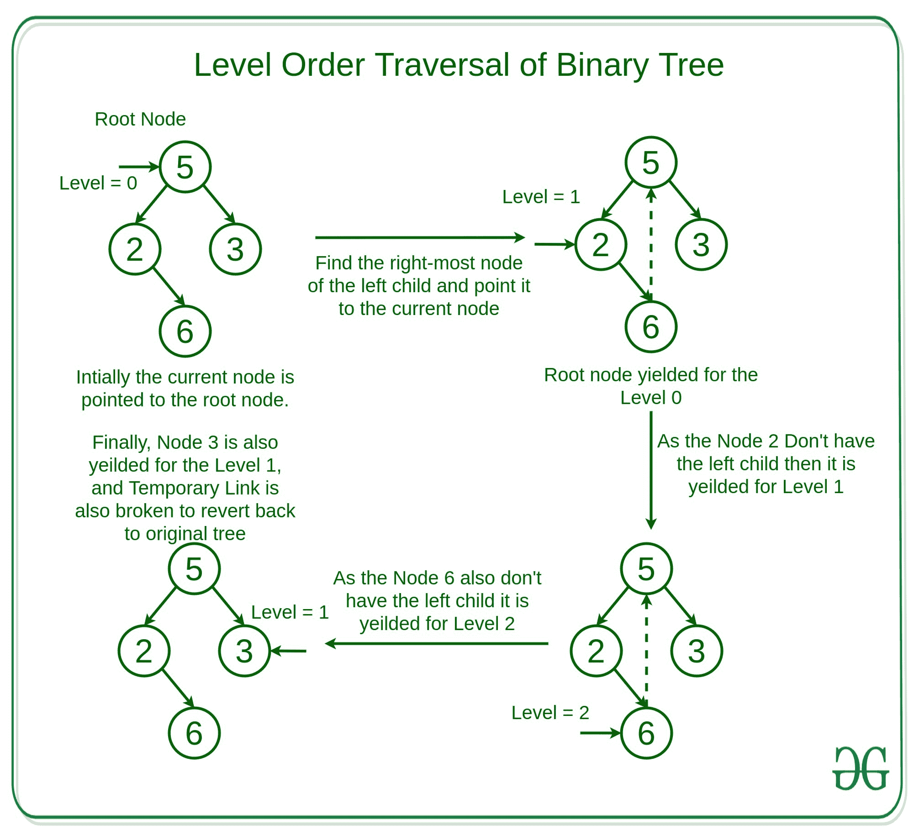

# 使用莫里斯遍历

进行二叉树的层级顺序遍历

> 原文:[https://www . geesforgeks . org/level-order-遍历二叉树-使用-Morris-遍历/](https://www.geeksforgeeks.org/level-order-traversal-of-binary-tree-using-morris-traversal/)

给定一个[二叉树](https://www.geeksforgeeks.org/binary-tree-data-structure/)，任务是以[级顺序方式](https://www.geeksforgeeks.org/level-order-tree-traversal/)遍历二叉树。
**例:**

```
Input: 
         1
        / \
       2   3
Output:
1
2 3

Input:
         5
        / \
       2   3
        \
         6
Output:
5
2 3
6
```

**方法:**思路是使用 [Morris Preorder 遍历](https://www.geeksforgeeks.org/morris-traversal-for-preorder/)以层级顺序遍历的方式遍历树。
**观察:**使用 Morris 预序遍历对树的遍历主要有两种观察。也就是–

*   在 Preorder 遍历中，首先访问一个级别的最左边的节点，因此可以使用它以级别顺序的方式遍历树。
*   当我们在二叉树的[顶视图中保持节点的水平距离时，同样，如果我们保持当前节点的级别，并根据移动相应地增加或减少级别，那么节点可以很容易地被遍历。](https://www.geeksforgeeks.org/print-nodes-top-view-binary-tree/)

就像在 Morris preorder 遍历中一样，我们将左子节点的最右边的节点连接到它的有序后继节点，以保持移动，这样我们就可以在完全探索父节点的左子节点之后遍历回父节点的右子节点。因此，当移动到左子级的最右边的子级时，我们可以跟踪级别中的增量数，以计算该子级的下一级。
以下是借助示例对该方法的说明:



以下是上述方法的实现:

## 蟒蛇 3

```
# Python implementation of the Level
# order traversal using Morris traversal

# Class of the node of the
# Binary Tree
class Node:
    def __init__(self, data):
        self.data = data
        self.left = None
        self.right = None

# Function to traverse the Binary
# tree in the Level Order Fashion
def levelOrderTraversal(root):

    # Current Node is marked as
    # the Root Node
    curr = root
    level = 0

    # Loop to traverse the Binary
    # Tree until the current node
    # is not Null
    while curr:

        # If left child is null, print the
        # current node data. And, update 
        # the current pointer to right child.
        if curr.left is None:

            # Return the current node with
            # its level
            yield [curr, level]
            curr = curr.right
            if curr:
                level += 1
            else:
                level -= 1
        else:

            # Find the inorder predecessor
            prev = curr.left
            to_up = 0

            # Loop to find the right most
            # node of the left child of the
            # current node
            while prev.right is not None and \
                    prev.right is not curr:
                prev = prev.right
                to_up += 1

            # If the right child of inorder
            # predecessor already points to
            # the current node, update the 
            # current with it's right child
            if prev.right is curr:
                prev.right = None
                curr = curr.right
                level -= to_up + 1

            # else If right child doesn't
            # point to the current node,
            # then print this node's data
            # and update the right child
            # pointer with the current node 
            # and update the current with
            # it's left child
            else:
                yield [curr, level]
                prev.right = curr 
                curr = curr.left
                level += 1

# Driver Code
if __name__ == "__main__":
    root = Node(5)
    root.left = Node(2)
    root.right = Node(3)
    root.left.right = Node(6)

    # Output List to store the
    # Level Order Traversed Nodes
    outputData = [[] for i in range(100)]

    for node, level in levelOrderTraversal(root):
        outputData[level].append(node.data)

    h = 0

    # Loop to find the height of the
    # Binary Tree
    for i in outputData:
        if i:
            h += 1
        else:
            break

    # Loop to print the Data
    for i in range(h):
        print(' '.join(map(str, outputData[i])))
```

**Output:** 

```
5
2 3
6
```

**业绩分析:**

*   **时间复杂度:**与上述方法一样，每个节点最多被触摸两次，因此时间复杂度为 **O(N)** ，其中 N 为节点数。
*   **辅助空间:**和上面的方法一样，没有使用额外的空间，因为使用的辅助空间将是 **O(1)**