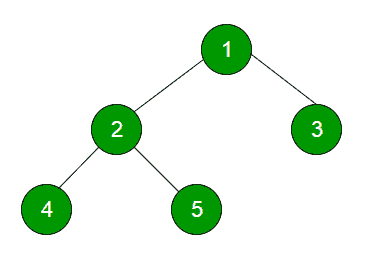

# 级序二叉树遍历

> 原文:[https://www.geeksforgeeks.org/level-order-tree-traversal/](https://www.geeksforgeeks.org/level-order-tree-traversal/)

树的级序遍历是[广度优先遍历](http://en.wikipedia.org/wiki/Breadth-first_traversal)为树。



上述树的层次顺序遍历是 1 2 3 4 5

**方法 1(使用功能打印当前电平)**

**算法:**
这个方法基本上有两个函数。一种是打印给定级别的所有节点(printCurrentLevel)，另一种是打印树的级别顺序遍历(print level order)。printLevelorder 利用 printCurrentLevel 从根开始逐个打印所有级别的节点。

```
/*Function to print level order traversal of tree*/
printLevelorder(tree)
for d = 1 to height(tree)
   printCurrentLevel(tree, d);

/*Function to print all nodes at a current level*/
printCurrentLevel(tree, level)
if tree is NULL then return;
if level is 1, then
    print(tree->data);
else if level greater than 1, then
    printCurrentLevel(tree->left, level-1);
    printCurrentLevel(tree->right, level-1);
```

**实施:**

## C++

```
// Recursive CPP program for level
// order traversal of Binary Tree
#include <bits/stdc++.h>
using namespace std;

/* A binary tree node has data,
pointer to left child
and a pointer to right child */
class node {
public:
    int data;
    node *left, *right;
};

/* Function prototypes */
void printCurrentLevel(node* root, int level);
int height(node* node);
node* newNode(int data);

/* Function to print level
order traversal a tree*/
void printLevelOrder(node* root)
{
    int h = height(root);
    int i;
    for (i = 1; i <= h; i++)
        printCurrentLevel(root, i);
}

/* Print nodes at a current level */
void printCurrentLevel(node* root, int level)
{
    if (root == NULL)
        return;
    if (level == 1)
        cout << root->data << " ";
    else if (level > 1) {
        printCurrentLevel(root->left, level - 1);
        printCurrentLevel(root->right, level - 1);
    }
}

/* Compute the "height" of a tree -- the number of
    nodes along the longest path from the root node
    down to the farthest leaf node.*/
int height(node* node)
{
    if (node == NULL)
        return 0;
    else {
        /* compute the height of each subtree */
        int lheight = height(node->left);
        int rheight = height(node->right);

        /* use the larger one */
        if (lheight > rheight) {
            return (lheight + 1);
        }
        else {
            return (rheight + 1);
        }
    }
}

/* Helper function that allocates
a new node with the given data and
NULL left and right pointers. */
node* newNode(int data)
{
    node* Node = new node();
    Node->data = data;
    Node->left = NULL;
    Node->right = NULL;

    return (Node);
}

/* Driver code*/
int main()
{
    node* root = newNode(1);
    root->left = newNode(2);
    root->right = newNode(3);
    root->left->left = newNode(4);
    root->left->right = newNode(5);

    cout << "Level Order traversal of binary tree is \n";
    printLevelOrder(root);

    return 0;
}

// This code is contributed by rathbhupendra
```

## C

```
// Recursive C program for level
// order traversal of Binary Tree
#include <stdio.h>
#include <stdlib.h>

/* A binary tree node has data,
   pointer to left child
   and a pointer to right child */
struct node {
    int data;
    struct node *left, *right;
};

/* Function prototypes */
void printCurrentLevel(struct node* root, int level);
int height(struct node* node);
struct node* newNode(int data);

/* Function to print level order traversal a tree*/
void printLevelOrder(struct node* root)
{
    int h = height(root);
    int i;
    for (i = 1; i <= h; i++)
        printCurrentLevel(root, i);
}

/* Print nodes at a current level */
void printCurrentLevel(struct node* root, int level)
{
    if (root == NULL)
        return;
    if (level == 1)
        printf("%d ", root->data);
    else if (level > 1) {
        printCurrentLevel(root->left, level - 1);
        printCurrentLevel(root->right, level - 1);
    }
}

/* Compute the "height" of a tree -- the number of
    nodes along the longest path from the root node
    down to the farthest leaf node.*/
int height(struct node* node)
{
    if (node == NULL)
        return 0;
    else {
        /* compute the height of each subtree */
        int lheight = height(node->left);
        int rheight = height(node->right);

        /* use the larger one */
        if (lheight > rheight)
            return (lheight + 1);
        else
            return (rheight + 1);
    }
}

/* Helper function that allocates a new node with the
   given data and NULL left and right pointers. */
struct node* newNode(int data)
{
    struct node* node
        = (struct node*)malloc(sizeof(struct node));
    node->data = data;
    node->left = NULL;
    node->right = NULL;

    return (node);
}

/* Driver program to test above functions*/
int main()
{
    struct node* root = newNode(1);
    root->left = newNode(2);
    root->right = newNode(3);
    root->left->left = newNode(4);
    root->left->right = newNode(5);

    printf("Level Order traversal of binary tree is \n");
    printLevelOrder(root);

    return 0;
}
```

## Java 语言(一种计算机语言，尤用于创建网站)

```
// Recursive Java program for level
// order traversal of Binary Tree

/* Class containing left and right child of current
   node and key value*/
class Node {
    int data;
    Node left, right;
    public Node(int item)
    {
        data = item;
        left = right = null;
    }
}

class BinaryTree {
    // Root of the Binary Tree
    Node root;

    public BinaryTree() { root = null; }

    /* function to print level order traversal of tree*/
    void printLevelOrder()
    {
        int h = height(root);
        int i;
        for (i = 1; i <= h; i++)
            printCurrentLevel(root, i);
    }

    /* Compute the "height" of a tree -- the number of
    nodes along the longest path from the root node
    down to the farthest leaf node.*/
    int height(Node root)
    {
        if (root == null)
            return 0;
        else {
            /* compute  height of each subtree */
            int lheight = height(root.left);
            int rheight = height(root.right);

            /* use the larger one */
            if (lheight > rheight)
                return (lheight + 1);
            else
                return (rheight + 1);
        }
    }

    /* Print nodes at the current level */
    void printCurrentLevel(Node root, int level)
    {
        if (root == null)
            return;
        if (level == 1)
            System.out.print(root.data + " ");
        else if (level > 1) {
            printCurrentLevel(root.left, level - 1);
            printCurrentLevel(root.right, level - 1);
        }
    }

    /* Driver program to test above functions */
    public static void main(String args[])
    {
        BinaryTree tree = new BinaryTree();
        tree.root = new Node(1);
        tree.root.left = new Node(2);
        tree.root.right = new Node(3);
        tree.root.left.left = new Node(4);
        tree.root.left.right = new Node(5);

       System.out.println("Level order traversal of
                                 binary tree is ");
       tree.printLevelOrder();
    }
}
```

## 蟒蛇 3

```
# Recursive Python program for level
# order traversal of Binary Tree

# A node structure

class Node:

    # A utility function to create a new node
    def __init__(self, key):
        self.data = key
        self.left = None
        self.right = None

# Function to  print level order traversal of tree
def printLevelOrder(root):
    h = height(root)
    for i in range(1, h+1):
        printCurrentLevel(root, i)

# Print nodes at a current level
def printCurrentLevel(root, level):
    if root is None:
        return
    if level == 1:
        print(root.data, end=" ")
    elif level > 1:
        printCurrentLevel(root.left, level-1)
        printCurrentLevel(root.right, level-1)

""" Compute the height of a tree--the number of nodes
    along the longest path from the root node down to
    the farthest leaf node
"""

def height(node):
    if node is None:
        return 0
    else:
        # Compute the height of each subtree
        lheight = height(node.left)
        rheight = height(node.right)

        # Use the larger one
        if lheight > rheight:
            return lheight+1
        else:
            return rheight+1

# Driver program to test above function
root = Node(1)
root.left = Node(2)
root.right = Node(3)
root.left.left = Node(4)
root.left.right = Node(5)

print("Level order traversal of binary tree is -")
printLevelOrder(root)

# This code is contributed by Nikhil Kumar Singh(nickzuck_007)
```

## C#

```
// Recursive c# program for level
// order traversal of Binary Tree
using System;

/* Class containing left and right
   child of current node and key value*/
public class Node {
    public int data;
    public Node left, right;
    public Node(int item)
    {
        data = item;
        left = right = null;
    }
}

class GFG {
    // Root of the Binary Tree
    public Node root;

    public void BinaryTree() { root = null; }

    /* function to print level order
       traversal of tree*/
    public virtual void printLevelOrder()
    {
        int h = height(root);
        int i;
        for (i = 1; i <= h; i++) {
            printCurrentLevel(root, i);
        }
    }

    /* Compute the "height" of a tree --
    the number of nodes along the longest
    path from the root node down to the
    farthest leaf node.*/
    public virtual int height(Node root)
    {
        if (root == null) {
            return 0;
        }
        else {
            /* compute height of each subtree */
            int lheight = height(root.left);
            int rheight = height(root.right);

            /* use the larger one */
            if (lheight > rheight) {
                return (lheight + 1);
            }
            else {
                return (rheight + 1);
            }
        }
    }

    /* Print nodes at the current level */
    public virtual void printCurrentLevel(Node root,
                                          int level)
    {
        if (root == null) {
            return;
        }
        if (level == 1) {
            Console.Write(root.data + " ");
        }
        else if (level > 1) {
            printCurrentLevel(root.left, level - 1);
            printCurrentLevel(root.right, level - 1);
        }
    }

    // Driver Code
    public static void Main(string[] args)
    {
        GFG tree = new GFG();
        tree.root = new Node(1);
        tree.root.left = new Node(2);
        tree.root.right = new Node(3);
        tree.root.left.left = new Node(4);
        tree.root.left.right = new Node(5);

        Console.WriteLine("Level order traversal "
                          + "of binary tree is ");
        tree.printLevelOrder();
    }
}

// This code is contributed by Shrikant13
```

## java 描述语言

```
<script>
// Recursive javascript program for level
// order traversal of Binary Tree

/* Class containing left and right child of current
   node and key value*/
 class Node {
        constructor(val) {
            this.data = val;
            this.left = null;
            this.right = null;
        }
    }

    // Root of the Binary Tree
    var root= null;

    /* function to print level order traversal of tree */
    function printLevelOrder() {
        var h = height(root);
        var i;
        for (i = 1; i <= h; i++)
            printCurrentLevel(root, i);
    }

    /*
     * Compute the "height" of a tree -- the number of nodes along the longest path
     * from the root node down to the farthest leaf node.
     */
    function height(root) {
        if (root == null)
            return 0;
        else {
            /* compute height of each subtree */
            var lheight = height(root.left);
            var rheight = height(root.right);

            /* use the larger one */
            if (lheight > rheight)
                return (lheight + 1);
            else
                return (rheight + 1);
        }
    }

    /* Print nodes at the current level */
    function printCurrentLevel(root , level) {
        if (root == null)
            return;
        if (level == 1)
            document.write(root.data + " ");
        else if (level > 1) {
            printCurrentLevel(root.left, level - 1);
            printCurrentLevel(root.right, level - 1);
        }
    }

    /* Driver program to test above functions */

        root = new Node(1);
        root.left = new Node(2);
        root.right = new Node(3);
        root.left.left = new Node(4);
        root.left.right = new Node(5);

       document.write("Level order traversal of  binary tree is ");
       printLevelOrder();

// This code is contributed by umadevi9616
</script>
```

**Output**

```
Level Order traversal of binary tree is 
1 2 3 4 5 
```

**时间复杂度:**最坏情况下的 O(n^2)。对于倾斜树，printGivenLevel()需要 O(n)个时间，其中 n 是倾斜树中的节点数。所以 printLevelOrder()的时间复杂度是 O(n) + O(n-1) + O(n-2) +..+ O(1)哪个是 O(n^2).
**空间复杂度:** O(n)最坏的情况。对于倾斜的树，printGivenLevel()使用 O(n)空间作为调用堆栈。对于平衡树，调用堆栈使用 O(log n)空间(即平衡树的高度)。

**方法 2(使用队列)**

**算法:**
对于每个节点，首先访问该节点，然后将其子节点放入 FIFO 队列。

```
printLevelorder(tree)
1) Create an empty queue q
2) temp_node = root /*start from root*/
3) Loop while temp_node is not NULL
    a) print temp_node->data.
    b) Enqueue temp_node’s children 
      (first left then right children) to q
    c) Dequeue a node from q.
```

**实现:**
下面是上面算法的简单实现。队列使用最大大小为 500 的数组来实现。我们也可以将队列实现为链表。

## C++

```
/* C++ program to print level
    order traversal using STL */
#include <bits/stdc++.h>
using namespace std;

// A Binary Tree Node
struct Node {
    int data;
    struct Node *left, *right;
};

// Iterative method to find height of Binary Tree
void printLevelOrder(Node* root)
{
    // Base Case
    if (root == NULL)
        return;

    // Create an empty queue for level order traversal
    queue<Node*> q;

    // Enqueue Root and initialize height
    q.push(root);

    while (q.empty() == false) {
        // Print front of queue and remove it from queue
        Node* node = q.front();
        cout << node->data << " ";
        q.pop();

        /* Enqueue left child */
        if (node->left != NULL)
            q.push(node->left);

        /*Enqueue right child */
        if (node->right != NULL)
            q.push(node->right);
    }
}

// Utility function to create a new tree node
Node* newNode(int data)
{
    Node* temp = new Node;
    temp->data = data;
    temp->left = temp->right = NULL;
    return temp;
}

// Driver program to test above functions
int main()
{
    // Let us create binary tree shown in above diagram
    Node* root = newNode(1);
    root->left = newNode(2);
    root->right = newNode(3);
    root->left->left = newNode(4);
    root->left->right = newNode(5);

    cout << "Level Order traversal of binary tree is \n";
    printLevelOrder(root);
    return 0;
}
```

## C

```
// Iterative Queue based C program
// to do level order traversal
// of Binary Tree
#include <stdio.h>
#include <stdlib.h>
#define MAX_Q_SIZE 500

/* A binary tree node has data,
   pointer to left child
   and a pointer to right child */
struct node {
    int data;
    struct node* left;
    struct node* right;
};

/* frunction prototypes */
struct node** createQueue(int*, int*);
void enQueue(struct node**, int*, struct node*);
struct node* deQueue(struct node**, int*);

/* Given a binary tree, print its nodes in level order
   using array for implementing queue */
void printLevelOrder(struct node* root)
{
    int rear, front;
    struct node** queue = createQueue(&front, &rear);
    struct node* temp_node = root;

    while (temp_node) {
        printf("%d ", temp_node->data);

        /*Enqueue left child */
        if (temp_node->left)
            enQueue(queue, &rear, temp_node->left);

        /*Enqueue right child */
        if (temp_node->right)
            enQueue(queue, &rear, temp_node->right);

        /*Dequeue node and make it temp_node*/
        temp_node = deQueue(queue, &front);
    }
}

/*UTILITY FUNCTIONS*/
struct node** createQueue(int* front, int* rear)
{
    struct node** queue = (struct node**)malloc(
        sizeof(struct node*) * MAX_Q_SIZE);

    *front = *rear = 0;
    return queue;
}

void enQueue(struct node** queue, int* rear,
             struct node* new_node)
{
    queue[*rear] = new_node;
    (*rear)++;
}

struct node* deQueue(struct node** queue, int* front)
{
    (*front)++;
    return queue[*front - 1];
}

/* Helper function that allocates a new node with the
   given data and NULL left and right pointers. */
struct node* newNode(int data)
{
    struct node* node
        = (struct node*)malloc(sizeof(struct node));
    node->data = data;
    node->left = NULL;
    node->right = NULL;

    return (node);
}

/* Driver program to test above functions*/
int main()
{
    struct node* root = newNode(1);
    root->left = newNode(2);
    root->right = newNode(3);
    root->left->left = newNode(4);
    root->left->right = newNode(5);

    printf("Level Order traversal of binary tree is \n");
    printLevelOrder(root);

    return 0;
}
```

## Java 语言(一种计算机语言，尤用于创建网站)

```
// Iterative Queue based Java program
// to do level order traversal
// of Binary Tree

/* importing the inbuilt java classes
   required for the program */
import java.util.LinkedList;
import java.util.Queue;

/* Class to represent Tree node */
class Node {
    int data;
    Node left, right;

    public Node(int item)
    {
        data = item;
        left = null;
        right = null;
    }
}

/* Class to print Level Order Traversal */
class BinaryTree {

    Node root;

    /* Given a binary tree. Print
     its nodes in level order
     using array for implementing queue  */
    void printLevelOrder()
    {
        Queue<Node> queue = new LinkedList<Node>();
        queue.add(root);
        while (!queue.isEmpty()) {

            /* poll() removes the present head.
            For more information on poll() visit
            http://www.tutorialspoint.com/java/
            util/linkedlist_poll.htm */
            Node tempNode = queue.poll();
            System.out.print(tempNode.data + " ");

            /*Enqueue left child */
            if (tempNode.left != null) {
                queue.add(tempNode.left);
            }

            /*Enqueue right child */
            if (tempNode.right != null) {
                queue.add(tempNode.right);
            }
        }
    }

    public static void main(String args[])
    {
        /* creating a binary tree and entering
         the nodes */
        BinaryTree tree_level = new BinaryTree();
        tree_level.root = new Node(1);
        tree_level.root.left = new Node(2);
        tree_level.root.right = new Node(3);
        tree_level.root.left.left = new Node(4);
        tree_level.root.left.right = new Node(5);

        System.out.println("Level order traversal
                            of binary tree is - ");
        tree_level.printLevelOrder();
    }
}
```

## 蟒蛇 3

```
# Python program to print level
# order traversal using Queue

# A node structure

class Node:
    # A utility function to create a new node
    def __init__(self, key):
        self.data = key
        self.left = None
        self.right = None

# Iterative Method to print the
# height of a binary tree

def printLevelOrder(root):
    # Base Case
    if root is None:
        return

    # Create an empty queue
    # for level order traversal
    queue = []

    # Enqueue Root and initialize height
    queue.append(root)

    while(len(queue) > 0):

        # Print front of queue and
        # remove it from queue
        print(queue[0].data)
        node = queue.pop(0)

        # Enqueue left child
        if node.left is not None:
            queue.append(node.left)

        # Enqueue right child
        if node.right is not None:
            queue.append(node.right)

# Driver Program to test above function
root = Node(1)
root.left = Node(2)
root.right = Node(3)
root.left.left = Node(4)
root.left.right = Node(5)

print("Level Order Traversal of binary tree is -")
printLevelOrder(root)
# This code is contributed by Nikhil Kumar Singh(nickzuck_007)
```

## C#

```
// Iterative Queue based C# program
// to do level order traversal
// of Binary Tree

using System;
using System.Collections.Generic;

/* Class to represent Tree node */
public class Node {
    public int data;
    public Node left, right;

    public Node(int item)
    {
        data = item;
        left = null;
        right = null;
    }
}

/* Class to print Level Order Traversal */
public class BinaryTree {

    Node root;

    /* Given a binary tree. Print
    its nodes in level order using
     array for implementing queue */
    void printLevelOrder()
    {
        Queue<Node> queue = new Queue<Node>();
        queue.Enqueue(root);
        while (queue.Count != 0) {

            Node tempNode = queue.Dequeue();
            Console.Write(tempNode.data + " ");

            /*Enqueue left child */
            if (tempNode.left != null) {
                queue.Enqueue(tempNode.left);
            }

            /*Enqueue right child */
            if (tempNode.right != null) {
                queue.Enqueue(tempNode.right);
            }
        }
    }

    // Driver code
    public static void Main()
    {
        /* creating a binary tree and entering
        the nodes */
        BinaryTree tree_level = new BinaryTree();
        tree_level.root = new Node(1);
        tree_level.root.left = new Node(2);
        tree_level.root.right = new Node(3);
        tree_level.root.left.left = new Node(4);
        tree_level.root.left.right = new Node(5);

        Console.WriteLine("Level order traversal "
                          + "of binary tree is - ");
        tree_level.printLevelOrder();
    }
}

/* This code contributed by PrinciRaj1992 */
```

## java 描述语言

```
<script>
// Iterative Queue based javascript program
// to do level order traversal
// of Binary Tree

/* importing the inbuilt javascript classes
   required for the program */

/* Class to represent Tree node */
class Node {
    constructor(val) {
        this.data = val;
        this.left = null;
        this.right = null;
    }
}

/* Class to print Level Order Traversal */
    /*
     * Given a binary tree. Print its nodes in level order using array for
     * implementing queue
     */
    function printLevelOrder() {
        var queue = [];
        queue.push(root);
        while (queue.length != 0) {

            /*
             * poll() removes the present head. For more information on poll() visit
             * http://www.tutorialspoint.com/java/ util/linkedlist_poll.htm
             */
    var tempNode = queue.shift();
            document.write(tempNode.data + " ");

            /* Enqueue left child */
            if (tempNode.left != null) {
                queue.push(tempNode.left);
            }

            /* Enqueue right child */
            if (tempNode.right != null) {
                queue.push(tempNode.right);
            }
        }
    }

  /* creating a binary tree and entering
         the nodes */
       var  root = new Node(1);
        root.left = new Node(2);
        root.right = new Node(3);
        root.left.left = new Node(4);
        root.left.right = new Node(5);
        document.write("Level order traversal of binary tree is - ");
        printLevelOrder();

// This code is contributed by umadevi9616
</script>
```

**Output**

```
Level Order traversal of binary tree is 
1 2 3 4 5 
```

**时间复杂度:** O(n)其中 n 是二叉树中的节点数
T3】空间复杂度: O(n)其中 n 是二叉树中的节点数

**参考文献:**
[【http://en.wikipedia.org/wiki/Breadth-first_traversal】](http://en.wikipedia.org/wiki/Breadth-first_traversal)
以上程序/算法或其他解决同一问题的方法如有发现 bug，请写评论。