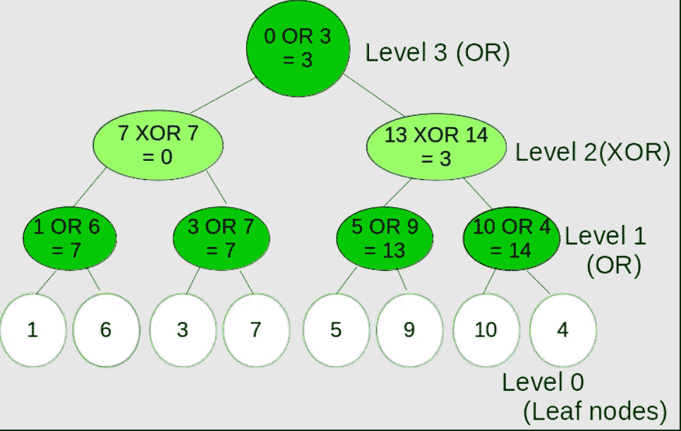
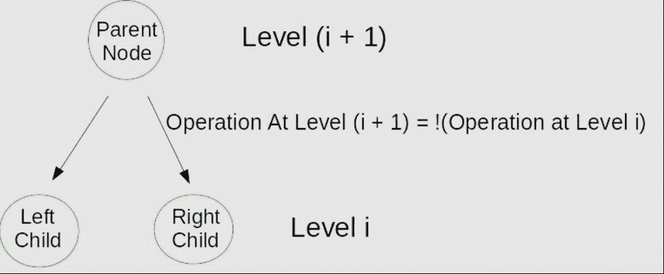
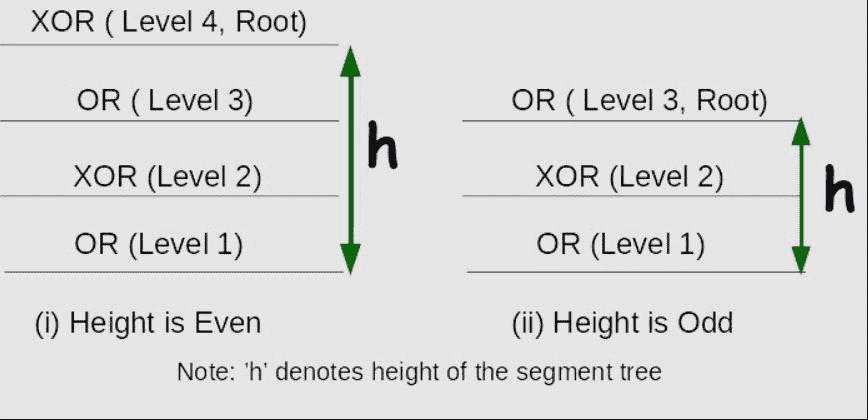

# 段树中的逐级交替或和异或运算

> 原文:[https://www . geesforgeks . org/level wise-alternating-xor-operations-segment-tree/](https://www.geeksforgeeks.org/levelwise-alternating-xor-operations-segment-tree/)

逐级或/异或交替段树是一种段树，这样在每一级，或和异或操作交替进行。换句话说，在第 1 层，左右子树通过“或”操作组合在一起，即父节点=左子节点**或**右子节点，在第 2 层为左子节点

和右子树通过异或运算组合在一起，即父节点=左子节点**异或**右子节点
这种类型的段树具有以下类型的结构:



操作(或)和(异或)指示执行了哪个操作来合并子节点
给定 2 个 <sup>N 个</sup>叶节点，任务是构建这样的段树并打印根节点

**示例:**

```
Input : Leaves = {1, 6, 3, 7, 5, 9, 10, 4}
Output : Value at Root Node = 3
Explanation : The image given above shows the 
segment tree corresponding to the given
set leaf nodes.
```

这是对[经典线段树](https://www.geeksforgeeks.org/segment-tree-set-1-sum-of-given-range/)的扩展，其中我们将每个节点表示为一个整数，父节点是通过首先构建左右子树，然后将左右子树的结果组合成父节点来构建的。这种将左右子节点合并到父节点的操作是通过一致的操作完成的，例如范围最小查询中的 MIN()/MAX()、Sum、Xor、OR、and 等。对于一致操作，我们的意思是，执行这个操作是为了通过对结果执行操作，比如 OP，将任何节点的左右子节点合并到父节点中，其中 OP 是一致操作。

在这个段树中，我们执行两个操作-: **或和**异或。
现在我们以类似于经典版本的方式构建 Segment 树，但是现在当我们递归地传递子树的信息时，我们也将传递关于要在该级别执行的操作的信息，因为这些操作是逐级交替的。需要注意的是，当一个父节点调用其左右子节点时，相同的操作信息会传递给这两个子节点，因为它们处于同一级别。

让我们分别用 0 和 1 来表示两个运算，即“或”和“异或”。那么如果在第一级，我们在第(i + 1)级有一个或运算，我们将有一个异或运算。如果 I 级有 0 作为操作，那么 i + 1 级将有 1 作为操作

```
Operation at Level (i + 1) = ! (Operation at Level i)
where,
Operation at Level i ∈ {0, 1}
```

段树节点的父子关系如下图所示:



现在，我们需要看看要在根节点执行的操作。



如果我们仔细观察图像，那么很容易发现，如果树的高度是偶数，那么根节点是其左右子节点异或运算的结果，否则是或运算的结果。

## C++

```
// C++ program to build levelwise OR/XOR alternating
// Segment tree
#include <bits/stdc++.h>

using namespace std;

// A utility function to get the middle index from 
// corner indexes.
int getMid(int s, int e) { return s + (e - s) / 2; }

// A recursive function that constructs Segment Tree
// for array[ss..se]. 
// si is index of current node in segment tree st
// operation denotes which operation is carried out 
// at that level to merge the left and right child. 
// It's either 0 or 1.
void constructSTUtil(int arr[], int ss, int se, int* st, 
                                  int si, int operation)
{
    // If there is one element in array, store it 
    // in current node of segment tree and return
    if (ss == se) {
        st[si] = arr[ss];
        return;
    }

    // If there are more than one elements, then
    // recur for left and right subtrees and store 
    // the sum of values in this node
    int mid = getMid(ss, se);

    // Build the left and the right subtrees by
    // using the fact that operation at level 
    // (i + 1) = ! (operation at level i)
    constructSTUtil(arr, ss, mid, st, si * 2 + 1, !operation);
    constructSTUtil(arr, mid + 1, se, st, si * 2 + 2, !operation);

    // merge the left and right subtrees by checking 
    // the operation to  be carried. If operation = 1,
    // then do OR else XOR
    if (operation == 1) {

        // OR operation
        st[si] = (st[2 * si + 1] | st[2 * si + 2]);
    }
    else {

        // XOR operation
        st[si] = (st[2 * si + 1] ^ st[2 * si + 2]);
    }
}

/* Function to construct segment tree from given array. 
   This function allocates memory for segment tree and 
   calls constructSTUtil() to fill the allocated memory */
int* constructST(int arr[], int n)
{
    // Allocate memory for segment tree

    // Height of segment tree
    int x = (int)(ceil(log2(n)));

    // Maximum size of segment tree
    int max_size = 2 * (int)pow(2, x) - 1;

    // Allocate memory
    int* st = new int[max_size];

    // operation = 1(XOR) if Height of tree is
    // even else it is 0(OR) for the root node
    int operationAtRoot = (x % 2 == 0 ? 0 : 1);

    // Fill the allocated memory st
    constructSTUtil(arr, 0, n - 1, st, 0, operationAtRoot);

    // Return the constructed segment tree
    return st;
}

// Driver Code
int main()
{

    // leaf nodes
    int leaves[] = { 1, 6, 3, 7, 5, 9, 10, 4 };

    int n = sizeof(leaves) / sizeof(leaves[0]);

    // Build the segment tree
    int* segmentTree = constructST(leaves, n);

    // Root node is at index 0 considering
    // 0-based indexing in segment Tree
    int rootIndex = 0;

    // print value at rootIndex
    cout << "Value at Root Node = " << segmentTree[rootIndex];
}
```

## Java 语言(一种计算机语言，尤用于创建网站)

```
// Java program to build levelwise OR/XOR alternating
// Segment tree
class GFG{

// A utility function to get the middle index from
// corner indexes.
static int getMid(int s, int e)
{
    return s + (e - s) / 2;
}

// A recursive function that constructs Segment Tree
// for array[ss..se].
// si is index of current node in segment tree st
// operation denotes which operation is carried out
// at that level to merge the left and right child.
// It's either 0 or 1.
static void constructSTUtil(int arr[], int ss, int se,
                            int st[], int si, 
                            boolean operation) 
{

    // If there is one element in array, store it
    // in current node of segment tree and return
    if (ss == se)
    {
        st[si] = arr[ss];
        return;
    }

    // If there are more than one elements, then
    // recur for left and right subtrees and store
    // the sum of values in this node
    int mid = getMid(ss, se);

    // Build the left and the right subtrees by
    // using the fact that operation at level
    // (i + 1) = ! (operation at level i)
    constructSTUtil(arr, ss, mid, st, 
                    si * 2 + 1, !operation);
    constructSTUtil(arr, mid + 1, se, st, 
                    si * 2 + 2, !operation);

    // Merge the left and right subtrees by checking
    // the operation to be carried. If operation = 1,
    // then do OR else XOR
    if (operation) 
    {

        // OR operation
        st[si] = (st[2 * si + 1] | st[2 * si + 2]);
    } 
    else
    {

        // XOR operation
        st[si] = (st[2 * si + 1] ^ st[2 * si + 2]);
    }
}

// Function to construct segment tree from
// given array. This function allocates 
// memory for segment tree and calls 
// constructSTUtil() to fill the allocated memory
static int[] constructST(int arr[], int n) 
{

    // Allocate memory for segment tree

    // Height of segment tree
    int x = (int)(Math.ceil(Math.log(n) / 
                            Math.log(2)));

    // Maximum size of segment tree
    int max_size = 2 * (int)Math.pow(2, x) - 1;

    // Allocate memory
    int[] st = new int[max_size];

    // Operation = 1(XOR) if Height of tree is
    // even else it is 0(OR) for the root node
    boolean operationAtRoot = !(x % 2 == 0);

    // Fill the allocated memory st
    constructSTUtil(arr, 0, n - 1, st, 
                    0, operationAtRoot);

    // Return the constructed segment tree
    return st;
}

// Driver Code
public static void main(String[] args)
{

    // Leaf nodes
    int leaves[] = { 1, 6, 3, 7, 
                     5, 9, 10, 4 };

    int n = leaves.length;

    // Build the segment tree
    int[] segmentTree = constructST(leaves, n);

    // Root node is at index 0 considering
    // 0-based indexing in segment Tree
    int rootIndex = 0;

    // Print value at rootIndex
    System.out.println("Value at Root Node = " + 
                       segmentTree[rootIndex]);
}
}

// This code is contributed by sanjeev2552
```

## 蟒蛇 3

```
# Python3 program to build levelwise 
# OR/XOR alternating Segment tree
import math

# A utility function to get the
#  middle index from corner indexes.
def getMid(s, e):
    return s + (e - s) // 2

# A recursive function that constructs
# Segment Tree for array[ss..se]. 
# 'si' is index of current node in segment 
# tree 'st', operation denotes which operation 
# is carried out at that level to merge the 
# left and right child. It's either 0 or 1.
def constructSTUtil(arr, ss, se, st, si, operation):

    # If there is one element in array, 
    # store it in current node of segment
    # tree and return
    if (ss == se) :
        st[si] = arr[ss]
        return

    # If there are more than one elements, 
    # then recur for left and right subtrees 
    # and store the sum of values in this node
    mid = getMid(ss, se)

    # Build the left and the right subtrees by
    # using the fact that operation at level 
    # (i + 1) = ! (operation at level i)
    constructSTUtil(arr, ss, mid, st, 
                    si * 2 + 1, not operation)
    constructSTUtil(arr, mid + 1, se, st, 
                    si * 2 + 2, not operation)

    # merge the left and right subtrees 
    # by checking the operation to be 
    # carried. If operation = 1, then 
    # do OR else XOR
    if (operation == 1) :

        # OR operation
        st[si] = (st[2 * si + 1] | 
                  st[2 * si + 2])

    else :

        # XOR operation
        st[si] = (st[2 * si + 1] ^ 
                  st[2 * si + 2])

''' Function to construct segment tree 
from given array. This function allocates 
memory for segment tree and calls 
constructSTUtil() to fill the allocated memory '''
def constructST(arr, n):

    # Allocate memory for segment tree

    # Height of segment tree
    x = int(math.ceil(math.log2(n)))

    # Maximum size of segment tree
    max_size = 2 * int(pow(2, x)) - 1

    # Allocate memory
    st = [0] * max_size

    # operation = 1(XOR) if Height of tree is
    # even else it is 0(OR) for the root node
    operationAtRoot = (0 if x % 2 == 0 else 1)

    # Fill the allocated memory st
    constructSTUtil(arr, 0, n - 1, 
                    st, 0, operationAtRoot)

    # Return the constructed segment tree
    return st

# Driver Code
if __name__ == "__main__":

    # leaf nodes
    leaves = [ 1, 6, 3, 7, 5, 9, 10, 4 ]

    n = len(leaves)

    # Build the segment tree
    segmentTree = constructST(leaves, n)

    # Root node is at index 0 considering
    # 0-based indexing in segment Tree
    rootIndex = 0

    # print value at rootIndex
    print("Value at Root Node = " , 
           segmentTree[rootIndex])

# This code is contributed by ChitraNayal
```

## C#

```
// C# program to build levelwise OR/XOR
// alternating Segment tree
using System;

class GFG{

// A utility function to get the middle
// index from corner indexes.
static int getMid(int s, int e)
{
    return s + (e - s) / 2;
}

// A recursive function that constructs Segment Tree
// for array[ss..se].
// si is index of current node in segment tree st
// operation denotes which operation is carried out
// at that level to merge the left and right child.
// It's either 0 or 1.
static void constructSTUtil(int[] arr, int ss, int se,
                            int[] st, int si, 
                            bool operation) 
{

    // If there is one element in array, store it
    // in current node of segment tree and return
    if (ss == se)
    {
        st[si] = arr[ss];
        return;
    }

    // If there are more than one elements, then
    // recur for left and right subtrees and store
    // the sum of values in this node
    int mid = getMid(ss, se);

    // Build the left and the right subtrees by
    // using the fact that operation at level
    // (i + 1) = ! (operation at level i)
    constructSTUtil(arr, ss, mid, st, 
                    si * 2 + 1, !operation);
    constructSTUtil(arr, mid + 1, se, st, 
                    si * 2 + 2, !operation);

    // Merge the left and right subtrees by checking
    // the operation to be carried. If operation = 1,
    // then do OR else XOR
    if (operation) 
    {

        // OR operation
        st[si] = (st[2 * si + 1] | st[2 * si + 2]);
    } 
    else
    {

        // XOR operation
        st[si] = (st[2 * si + 1] ^ st[2 * si + 2]);
    }
}

// Function to construct segment tree from
// given array. This function allocates 
// memory for segment tree and calls 
// constructSTUtil() to fill the allocated memory
static int[] constructST(int[] arr, int n) 
{

    // Allocate memory for segment tree

    // Height of segment tree
    int x = (int)(Math.Ceiling(Math.Log(n) / 
                               Math.Log(2)));

    // Maximum size of segment tree
    int max_size = 2 * (int)Math.Pow(2, x) - 1;

    // Allocate memory
    int[] st = new int[max_size];

    // Operation = 1(XOR) if Height of tree is
    // even else it is 0(OR) for the root node
    bool operationAtRoot = !(x % 2 == 0);

    // Fill the allocated memory st
    constructSTUtil(arr, 0, n - 1, st, 
                    0, operationAtRoot);

    // Return the constructed segment tree
    return st;
}

// Driver Code
static public void Main()
{

    // Leaf nodes
    int[] leaves = { 1, 6, 3, 7, 
                     5, 9, 10, 4 };

    int n = leaves.Length;

    // Build the segment tree
    int[] segmentTree = constructST(leaves, n);

    // Root node is at index 0 considering
    // 0-based indexing in segment Tree
    int rootIndex = 0;

    // Print value at rootIndex
    Console.WriteLine("Value at Root Node = " + 
                      segmentTree[rootIndex]);
}
}

// This code is contributed by rag2127
```

## java 描述语言

```
<script>
// Javascript program to build levelwise OR/XOR
// alternating Segment tree

// A utility function to get the middle
// index from corner indexes.
function getMid(s, e) {
    return s + Math.floor((e - s) / 2);
}

// A recursive function that constructs Segment Tree
// for array[ss..se].
// si is index of current node in segment tree st
// operation denotes which operation is carried out
// at that level to merge the left and right child.
// It's either 0 or 1.
function constructSTUtil(arr, ss, se, st, si, operation) {

    // If there is one element in array, store it
    // in current node of segment tree and return
    if (ss == se) {
        st[si] = arr[ss];
        return;
    }

    // If there are more than one elements, then
    // recur for left and right subtrees and store
    // the sum of values in this node
    let mid = getMid(ss, se);

    // Build the left and the right subtrees by
    // using the fact that operation at level
    // (i + 1) = ! (operation at level i)
    constructSTUtil(arr, ss, mid, st, si * 2 + 1, !operation);
    constructSTUtil(arr, mid + 1, se, st, si * 2 + 2, !operation);

    // Merge the left and right subtrees by checking
    // the operation to be carried. If operation = 1,
    // then do OR else XOR
    if (operation) {

        // OR operation
        st[si] = (st[2 * si + 1] | st[2 * si + 2]);
    }
    else {

        // XOR operation
        st[si] = (st[2 * si + 1] ^ st[2 * si + 2]);
    }
}

// Function to construct segment tree from
// given array. This function allocates
// memory for segment tree and calls
// constructSTUtil() to fill the allocated memory
function constructST(arr, n) {

    // Allocate memory for segment tree

    // Height of segment tree
    let x = Math.ceil(Math.log(n) / Math.log(2));

    // Maximum size of segment tree
    let max_size = 2 * Math.pow(2, x) - 1;

    // Allocate memory
    let st = new Array(max_size);

    // Operation = 1(XOR) if Height of tree is
    // even else it is 0(OR) for the root node
    let operationAtRoot = !(x % 2 == 0);

    // Fill the allocated memory st
    constructSTUtil(arr, 0, n - 1, st,
        0, operationAtRoot);

    // Return the constructed segment tree
    return st;
}

// Driver Code

// Leaf nodes
let leaves = [1, 6, 3, 7, 5, 9, 10, 4];

let n = leaves.length;

// Build the segment tree
let segmentTree = constructST(leaves, n);

// Root node is at index 0 considering
// 0-based indexing in segment Tree
let rootIndex = 0;

// Print value at rootIndex
document.write("Value at Root Node = " + segmentTree[rootIndex]);

// This code is contributed by gfgking
</script>
```

**Output:** 

```
Value at Root Node = 3
```

树构造的时间复杂度为 0(n)。总共有 2n-1 个节点，每个节点的值在树构造中只计算一次。

我们也可以以类似的方式执行点更新。如果我们得到一个更新来更新数组叶子索引 I 处的叶子，那么我们沿着树向下遍历到叶子节点并执行更新。回到根节点，我们再次构建树，类似于 build()函数，传递要在每个级别执行的操作，并存储对其左右子节点的值应用该操作的结果，并将结果存储到该节点中。
执行更新后，考虑以下分段树，
叶[0] = 13

现在更新后的线段树如下所示:


这里黑色的节点表示它们被更新的事实

## C++

```
// C++ program to build levelwise OR/XOR alternating 
// Segment tree (with updates)
#include <bits/stdc++.h>

using namespace std;

// A utility function to get the middle index from
// corner indexes.
int getMid(int s, int e) { return s + (e - s) / 2; }

// A recursive function that constructs Segment Tree 
// for array[ss..se].
// si is index of current node in segment tree st
// operation denotes which operation is carried out
// at that level to merge the left and right child. 
// Its either 0 or 1.
void constructSTUtil(int arr[], int ss, int se, int* st,
                                  int si, int operation)
{
    // If there is one element in array, store it in 
    // current node of segment tree and return
    if (ss == se) {
        st[si] = arr[ss];
        return;
    }

    // If there are more than one elements, then recur
    // for left and right subtrees and store the sum of 
    // values in this node
    int mid = getMid(ss, se);

    // Build the left and the right subtrees by using
    // the fact that operation at level (i + 1) = ! 
    // (operation at level i)
    constructSTUtil(arr, ss, mid, st, si * 2 + 1, !operation);
    constructSTUtil(arr, mid + 1, se, st, si * 2 + 2, !operation);

    // merge the left and right subtrees by checking
    // the operation to be carried. If operation = 1, 
    // then do OR else XOR
    if (operation == 1) {

        // OR operation
        st[si] = (st[2 * si + 1] | st[2 * si + 2]);
    }
    else {
        // XOR operation
        st[si] = (st[2 * si + 1] ^ st[2 * si + 2]);
    }
}

/* A recursive function to update the nodes which have the given 
   index in their range. The following are parameters
    st, si, ss and se are same as getSumUtil()
    i    --> index of the element to be updated. This index is 
             in input array.
   val --> Value to be assigned to arr[i] */
void updateValueUtil(int* st, int ss, int se, int i,
                     int val, int si, int operation)
{
    // Base Case: If the input index lies outside 
    //  this segment
    if (i < ss || i > se)
        return;

    // If the input index is in range of this node,
    // then update the value of the node and its 
    // children

    // leaf node
    if (ss == se && ss == i) {
        st[si] = val;
        return;
    }

    int mid = getMid(ss, se);

    // Update the left and the right subtrees by
    // using the fact that operation at level 
    // (i + 1) = ! (operation at level i)
    updateValueUtil(st, ss, mid, i, val, 2 * si + 1, !operation);
    updateValueUtil(st, mid + 1, se, i, val, 2 * si + 2, !operation);

    // merge the left and right subtrees by checking
    // the operation to be carried. If operation = 1, 
    // then do OR else XOR
    if (operation == 1) {

        // OR operation
        st[si] = (st[2 * si + 1] | st[2 * si + 2]);
    }
    else {

        // XOR operation
        st[si] = (st[2 * si + 1] ^ st[2 * si + 2]);
    }
}

// The function to update a value in input array and 
// segment tree. It uses updateValueUtil() to update the 
// value in segment tree
void updateValue(int arr[], int* st, int n, int i, int new_val)
{
    // Check for erroneous input index
    if (i < 0 || i > n - 1) {
        printf("Invalid Input");
        return;
    }

    // Height of segment tree
    int x = (int)(ceil(log2(n)));

    // operation = 1(XOR) if Height of tree is
    // even else it is 0(OR) for the root node
    int operationAtRoot = (x % 2 == 0 ? 0 : 1);

    arr[i] = new_val;

    // Update the values of nodes in segment tree
    updateValueUtil(st, 0, n - 1, i, new_val, 0, operationAtRoot);
}

/* Function to construct segment tree from given array.
   This function allocates memory for segment tree and 
   calls constructSTUtil() to fill the allocated memory */
int* constructST(int arr[], int n)
{
    // Allocate memory for segment tree

    // Height of segment tree
    int x = (int)(ceil(log2(n)));

    // Maximum size of segment tree
    int max_size = 2 * (int)pow(2, x) - 1;

    // Allocate memory
    int* st = new int[max_size];

    // operation = 1(XOR) if Height of tree is 
    // even else it is 0(OR) for the root node
    int operationAtRoot = (x % 2 == 0 ? 0 : 1);

    // Fill the allocated memory st
    constructSTUtil(arr, 0, n - 1, st, 0, operationAtRoot);

    // Return the constructed segment tree
    return st;
}

// Driver Code
int main()
{
    int leaves[] = { 1, 6, 3, 7, 5, 9, 10, 4 };
    int n = sizeof(leaves) / sizeof(leaves[0]);

    // Build the segment tree
    int* segmentTree = constructST(leaves, n);

    // Root node is at index 0 considering
    // 0-based indexing in segment Tree
    int rootIndex = 0;

    // print old value at rootIndex
    cout << "Old Value at Root Node = " 
         << segmentTree[rootIndex] << endl;

    // perform update leaves[0] = 13
    updateValue(leaves, segmentTree, n, 0, 13);

    cout << "New Value at Root Node = " 
         << segmentTree[rootIndex];
    return 0;
}
```

**Output:** 

```
Old Value at Root Node = 3
New Value at Root Node = 11
```

更新的时间复杂度也是 O(Logn)。为了更新叶值，我们在每个级别处理一个节点，级别数为 0(Logn)。