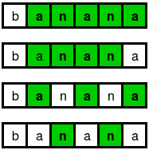

# 字典上最大的子序列，每个字符至少出现 k 次

> 原文:[https://www . geesforgeks . org/按字典顺序排列-最大-子序列-每个字符-出现-最少-k 次/](https://www.geeksforgeeks.org/lexicographically-largest-subsequence-every-character-occurs-least-k-times/)

给定一个字符串 **S** 和一个整数 **K** 。任务是找到 S 的字典上最大的子序列，比如 T，这样 T 中的每个字符必须出现至少 K 次。
**例:**

```
Input : S = "banana", K = 2.
Output : nn
Possible subsequence where each character exists at least 2 times are:
```



```
From the above subsequences, "nn" is the lexicographically largest.
```

想法是贪婪地解决上述问题。如果我们想使子序列在字典上最大，我们必须优先考虑字典上更大的字符。“z”是最大的字符，假设 z 在 S 中出现 f <sub>z</sub> 次，如果 f <sub>z</sub> > = K，则在字符串 T 中追加“z”z K 次，并继续从 S 的左侧移除字符，直到所有的 z 都被移除。用' y '，' w '，…应用策略..一个。最终，你会找到答案的。
我们来看一个例子。假设 S = "zzwzawa "和 K = 2。从最大的字符“z”开始。这里 f <sub>z</sub> = 3 > = K。所以 T 将变成“zzz”，我们将从 S 的左边移除字母，直到所有的 z 都被移除。所以现在的 S 会变成“awa”。下一个最大的是“y ”,但是在 k 中出现了 0 次，所以我们将跳过它。我们也将跳过“w”、“v”等，直到我们转到出现两次的“a”。现在 T 会变成“zzzaa”，S 会变成空字符串。我们的答案是“zzzaa”。
以下是该方法的实施:

## C++

```
// C++ program to find lexicographically largest
// subsequence where every character appears at
// least k times.
#include <bits/stdc++.h>
using namespace std;

// Find lexicographically largest subsequence of
// s[0..n-1] such that every character appears 
// at least k times. The result is filled in t[]
void subsequence(char s[], char t[], int n, int k)
{
    int last = 0, cnt = 0, new_last = 0, size = 0;

    // Starting from largest charter 'z' to 'a'
    for (char ch = 'z'; ch >= 'a'; ch--) {
        cnt = 0;

        // Counting the frequency of the character
        for (int i = last; i < n; i++) {
            if (s[i] == ch)
                cnt++;
        }

        // If frequency is greater than k
        if (cnt >= k) {

            // From the last point we leave
            for (int i = last; i < n; i++) {

                // check if string contain ch
                if (s[i] == ch) {

                    // If yes, append to output string
                    t[size++] = ch;
                    new_last = i;
                }
            }

            // Update the last point.
            last = new_last;
        }
    }
    t[size] = '\0';
}

// Driver code
int main()
{
    char s[] = "banana";
    int n = sizeof(s);
    int k = 2;
    char t[n];
    subsequence(s, t, n - 1, k);
    cout << t << endl;
    return 0;
}
```

## Java 语言(一种计算机语言，尤用于创建网站)

```
import java.util.Arrays;

// Java program to find lexicographically largest
// subsequence where every character appears at
// least k times.  
class GFG {

// Find lexicographically largest subsequence of
// s[0..n-1] such that every character appears 
// at least k times. The result is filled in t[]
static void subsequence(char s[], char t[], int n, int k)
{
    int last = 0, cnt = 0, new_last = 0, size = 0;

    // Starting from largest charter 'z' to 'a'
    for (char ch = 'z'; ch >= 'a'; ch--) {
        cnt = 0;

        // Counting the frequency of the character
        for (int i = last; i < n; i++) {
            if (s[i] == ch)
                cnt++;
        }

        // If frequency is greater than k
        if (cnt >= k) {

            // From the last point we leave
            for (int i = last; i < n; i++) {

                // check if string contain ch
                if (s[i] == ch) {

                    // If yes, append to output string
                    t[size++] = ch;
                    new_last = i;
                }
            }

            // Update the last point.
            last = new_last;
        }
    }
    t[size] = '\0';
}

// Driver code
    public static void main(String[] args) {
    char s[] = {'b','a','n','a','n','a'};
    int n = s.length;
    int k = 2;
    char t[] = new char[n];
    subsequence(s, t, n - 1, k);
    for(int i = 0;i<t.length;i++)
        if(t[i]!=0)
            System.out.print(t[i]);

    }
}

// This code is contributed by Jajput-Ji
```

## 蟒蛇 3

```
# Python3 program to find lexicographically largest
# subsequence where every character appears at
# least k times.

# Find lexicographically largest subsequence of
# s[0..n-1] such that every character appears
# at least k times. The result is filled in t[]
def subsequence(s, t, n, k):
    last = 0
    cnt = 0
    new_last = 0
    size = 0

    string = 'zyxwvutsrqponmlkjihgfedcba'

    # Starting from largest charter 'z' to 'a'
    for ch in string:
        cnt = 0
        for i in range(last, n):
            if s[i] == ch:
                cnt += 1

        # If frequency is greater than k
        if cnt >= k:

            # From the last point we leave
            for i in range(last, n):

                # check if string contain ch
                if s[i] == ch:

                    # If yes, append to output string
                    t[size] = ch
                    new_last = i
                    size += 1

            # Update the last point.
            last = new_last

# Driver Code
if __name__ == "__main__":
    s = ['b', 'a', 'n', 'a', 'n', 'a']
    n = len(s)
    k = 2
    t = [''] * n
    subsequence(s, t, n - 1, k)
    t = ''.join(t)
    print(t)

# This code is contributed by
# sanjeev2552
```

## C#

```
// C# program to find lexicographically 
// largest subsequence where every 
// character appears at least k times. 
using System;

class GFG
{

// Find lexicographically largest subsequence 
// of s[0..n-1] such that every character 
// appears at least k times. The result is 
// filled in t[] 
static void subsequence(char []s, char []t,
                        int n, int k) 
{ 
    int last = 0, cnt = 0, 
        new_last = 0, size = 0; 

    // Starting from largest character
    // 'z' to 'a' 
    for (char ch = 'z'; ch >= 'a'; ch--)
    { 
        cnt = 0; 

        // Counting the frequency of
        // the character 
        for (int i = last; i < n; i++)
        { 
            if (s[i] == ch) 
                cnt++; 
        } 

        // If frequency is greater than k 
        if (cnt >= k) 
        { 

            // From the last point we leave 
            for (int i = last; i < n; i++)
            { 

                // check if string contain ch 
                if (s[i] == ch) 
                { 

                    // If yes, append to output string 
                    t[size++] = ch; 
                    new_last = i; 
                } 
            } 

            // Update the last point. 
            last = new_last; 
        } 
    } 
    t[size] = '\0'; 
} 

// Driver code 
public static void Main() 
{ 
    char []s = {'b','a','n','a','n','a'}; 
    int n = s.Length; 
    int k = 2; 
    char []t = new char[n]; 
    subsequence(s, t, n - 1, k); 
    for(int i = 0; i < t.Length; i++) 
        if(t[i] != 0) 
            Console.Write(t[i]); 
} 
} 

// This code contributed by Rajput-Ji 
```

## java 描述语言

```
<script>

// Javascript program to find 
// lexicographically largest
// subsequence where every 
// character appears at
// least k times.

// Find lexicographically largest subsequence of
// s[0..n-1] such that every character appears 
// at least k times. The result is filled in t[]
function subsequence(s, t, n, k)
{
    var last = 0, cnt = 0, new_last = 0, size = 0;

    // Starting from largest charter 'z' to 'a'
    for (var ch = 'z'.charCodeAt(0); 
    ch >= 'a'.charCodeAt(0); ch--) 
    {
        cnt = 0;

        // Counting the frequency of the character
        for (var i = last; i < n; i++) {
            if (s[i].charCodeAt(0) == ch)
                cnt++;
        }

        // If frequency is greater than k
        if (cnt >= k) {

            // From the last point we leave
            for (var i = last; i < n; i++) {

                // check if string contain ch
                if (s[i].charCodeAt(0) == ch) {

                    // If yes, append to output string
                    t[size++] = String.fromCharCode(ch);
                    new_last = i;
                }
            }

            // Update the last point.
            last = new_last;
        }
    }
}

// Driver code
var s = "banana";
var n = s.length;
var k = 2;
var t = Array(n);
subsequence(s, t, n - 1, k);
document.write( t.join('') );

</script>
```

**输出:**

```
nn
```

本文由 **Anuj Chauhan (anuj0503)** 投稿。如果你喜欢 GeeksforGeeks 并想投稿，你也可以使用[write.geeksforgeeks.org](http://www.write.geeksforgeeks.org)写一篇文章或者把你的文章邮寄到 review-team@geeksforgeeks.org。看到你的文章出现在极客博客主页上，帮助其他极客。
如果你发现任何不正确的地方，或者你想分享更多关于上面讨论的话题的信息，请写评论。