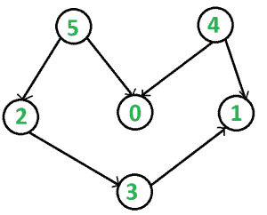

# 字典最小拓扑排序

> 原文:[https://www . geesforgeks . org/词典-最小-拓扑-排序/](https://www.geeksforgeeks.org/lexicographically-smallest-topological-ordering/)

给定一个具有 **N** 个顶点和 **M** 个可能包含循环的边的有向图，任务是找到该图的字典最小拓扑排序(如果存在的话)，否则打印 **-1** (如果该图有循环)。
lexigraphic 最小拓扑排序是指如果一个图中的两个顶点没有任何引入边，那么具有较小数量的顶点应该首先出现在排序中。
例如，在下图中，许多拓扑排序是可能的，例如 **5 2 3 4 0 1，5 0 2 4 3 1** 。
但最小的排序是 **4 5 0 2 3 1** 。
**举例:**

> **输入:**
> 
> 
> 
> **输出:** 4 5 0 2 3 1
> 尽管 5 4 0 2 3 1 也是给定图的有效拓扑
> 排序，但它在字典序上不是
> 最小的。

**方法:**我们将使用[卡恩算法](https://www.geeksforgeeks.org/topological-sorting-indegree-based-solution/)进行修改后的拓扑排序。不使用队列，我们将使用[多集](http://www.geeksforgeeks.org/multiset-in-cpp-stl/)来存储顶点，以确保每次我们选择一个顶点时，它都是所有顶点中最小的。整体时间复杂度变为
以下是上述方法的实现:

## 卡片打印处理机（Card Print Processor 的缩写）

```
// C++ implementation of the approach
#include<bits/stdc++.h>
using namespace std;

vector<vector<int>> adj;

// function to add edge to the graph
void addEdge(int x,int y)
{
    adj[x].push_back(y);
}

// Function to print the required topological
// sort of the given graph
void topologicalSort()
{
    int V = adj.size();
    // Create a vector to store indegrees of all
    // the vertices
    // Initialize all indegrees to 0
    vector<int> in_degree(V, 0);

    // Traverse adjacency lists to fill indegrees of
    // vertices
    // This step takes O(V+E) time
    for (int u = 0; u < V; u++) {
        for (auto x: adj[u])
            in_degree[x]++;
    }

    // Create a set and inserting all vertices with
    // indegree 0
    multiset<int> s;
    for (int i = 0; i < V; i++)
        if (in_degree[i] == 0)
            s.insert(i);

    // Initialize count of visited vertices
    int cnt = 0;

    // Create a vector to store result (A topological
    // ordering of the vertices)
    vector<int> top_order;

    // One by one erase vertices from setand insert
    // adjacents if indegree of adjacent becomes 0
    while (!s.empty()) {

        // Extract vertex with minimum number from multiset
        // and add it to topological order
        int u = *s.begin();
        s.erase(s.begin());
        top_order.push_back(u);

        // Iterate through all its neighbouring nodes
        // of erased node u and decrease their in-degree
        // by 1
        for (auto x:adj[u])

            // If in-degree becomes zero, add it to queue
            if (--in_degree[x] == 0)
                s.insert(x);

        cnt++;
    }

    // Check if there was a cycle
    if (cnt != V) {
        cout << -1;
        return;
    }

    // Print topological order
    for (int i = 0; i < top_order.size(); i++)
        cout << top_order[i] << " ";
}
int main()
{
  // number of vertices
  int v = 6;

  // adjacency matrix
  adj= vector<vector<int>>(v);

  addEdge(5,2);
  addEdge(5,0);
  addEdge(4,0);
  addEdge(4,1);
  addEdge(2,3);
  addEdge(3,1);

  // find required topological order
  topologicalSort();
}
```

## 蟒蛇 3

```
# Python3 implementation of the approach
import heapq as hq

# function to add edge to the graph
def addEdge(x, y):
    adj[x].append(y)

# Function to prthe required topological
# sort of the given graph
def topologicalSort():
    V = len(adj)
    # Create a vector to store indegrees of all
    # the vertices
    # Initialize all indegrees to 0
    in_degree = [0] * V

    # Traverse adjacency lists to fill indegrees of
    # vertices
    # This step takes O(V+E) time
    for u in range(V):
        for x in adj[u]:
            in_degree[x] += 1
    # Create a heap and inserting all vertices with
    # indegree 0
    s = []
    for i in range(V):
        if in_degree[i] == 0:
            hq.heappush(s, i)

    # Initialize count of visited vertices
    cnt = 0

    # Create a vector to store result (A topological
    # ordering of the vertices)
    top_order = []

    # One by one erase vertices from setand insert
    # adjacents if indegree of adjacent becomes 0
    while s:

        # Extract vertex with minimum number from multiset
        # and add it to topological order
        u = hq.heappop(s)
        top_order.append(u)

        # Iterate through all its neighbouring nodes
        # of erased node u and decrease their in-degree
        # by 1
        for x in adj[u]:
            in_degree[x] -= 1
            # If in-degree becomes zero, add it to queue
            if in_degree[x] == 0:
                hq.heappush(s, x)

        cnt += 1

    # Check if there was a cycle
    if cnt != V:
        print(-1)
        return

    # Print topological order
    for i in range(len(top_order)):
        print(top_order[i], end=" ")

if __name__ == "__main__":
    # number of vertices
    v = 6

    # adjacency matrix
    adj = [[] for _ in range(v)]

    addEdge(5, 2)
    addEdge(5, 0)
    addEdge(4, 0)
    addEdge(4, 1)
    addEdge(2, 3)
    addEdge(3, 1)

    # find required topological order
    topologicalSort()
```

**Output:** 

```
4 5 0 2 3 1
```

**时间复杂度:**O(N)
T3】辅助空间: O(N)