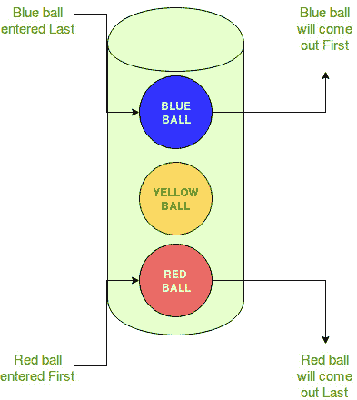

# 编程中的后进先出法

> 原文:[https://www . geesforgeks . org/LIFO-后进先出编程方法/](https://www.geeksforgeeks.org/lifo-last-in-first-out-approach-in-programming/)

先决条件–编程中的先进先出方法、[编程中的先进先出与后进先出方法](https://www.geeksforgeeks.org/fifo-vs-lifo-approach-in-programming/)、
是后进先出的缩写。是最后处理**第一个元素**，先处理**最后一个元素**的一种数据结构处理方法。
**现实生活中的例子:**



在本例中，需要考虑以下事项:

*   有一个装球的桶。
*   不同类型的球进入桶中。
*   最后进入水桶的球将首先被取出。
*   倒数第二个进入桶的球将在它上面的球(较新的那个)之后被取出。
*   这样，先进入水桶的球会最后离开水桶。
*   因此，最后一个进入铲斗的球(蓝色)首先被移除，最后一个进入铲斗的球(红色)被移除。

这就是所谓的后进先出法。
**后进先出法在哪里使用:**

1.  **数据结构–**
    某些数据结构，如堆栈和堆栈的其他变体，使用后进先出法处理数据。

2.  **提取最新信息–**
    有时，当从数组或数据缓冲区提取数据时，计算机会使用后进先出法。当需要输入最新信息时，使用后进先出法。

**后进先出法的程序示例–**
使用堆栈数据结构:

## C++

```
// C++ program to demonstrate
// working of LIFO
// using stack in C++
#include<bits/stdc++.h>
using namespace std;

// Pushing element on the top of the stack
stack<int> stack_push(stack<int> stack)
{
    for (int i = 0; i < 5; i++)
    {
        stack.push(i);
    }
    return stack;
}

// Popping element from the top of the stack
stack<int> stack_pop(stack<int> stack)
{
    cout << "Pop :";

    for (int i = 0; i < 5; i++)
    {
        int y = (int)stack.top();
        stack.pop();
        cout << (y) << endl;
    }
    return stack;
}

// Displaying element on the top of the stack
void stack_peek(stack<int> stack)
{
    int element = (int)stack.top();
    cout << "Element on stack top : " << element << endl;
}

// Searching element in the stack
void stack_search(stack<int> stack, int element)
{
    int pos = -1,co = 0;
    while(stack.size() > 0)
    {
        co++;
        if(stack.top() == element)
        {
            pos = co;
            break;
        }
        stack.pop();
    }

    if (pos == -1)
        cout << "Element not found" << endl;
    else
        cout << "Element is found at position " << pos << endl;
}

// Driver code
int main()
{
    stack<int> stack ;

    stack = stack_push(stack);
    stack = stack_pop(stack);
    stack = stack_push(stack);
    stack_peek(stack);
    stack_search(stack, 2);
    stack_search(stack, 6);
    return 0;
}

// This code is contributed by Arnab Kundu
```

## Java 语言(一种计算机语言，尤用于创建网站)

```
// Java program to demonstrate
// working of LIFO
// using Stack in Java

import java.io.*;
import java.util.*;

class GFG {
    // Pushing element on the top of the stack
    static void stack_push(Stack<Integer> stack)
    {
        for (int i = 0; i < 5; i++) {
            stack.push(i);
        }
    }

    // Popping element from the top of the stack
    static void stack_pop(Stack<Integer> stack)
    {
        System.out.println("Pop :");

        for (int i = 0; i < 5; i++) {
            Integer y = (Integer)stack.pop();
            System.out.println(y);
        }
    }

    // Displaying element on the top of the stack
    static void stack_peek(Stack<Integer> stack)
    {
        Integer element = (Integer)stack.peek();
        System.out.println("Element on stack top : " + element);
    }

    // Searching element in the stack
    static void stack_search(Stack<Integer> stack, int element)
    {
        Integer pos = (Integer)stack.search(element);

        if (pos == -1)
            System.out.println("Element not found");
        else
            System.out.println("Element is found at position " + pos);
    }

    public static void main(String[] args)
    {
        Stack<Integer> stack = new Stack<Integer>();

        stack_push(stack);
        stack_pop(stack);
        stack_push(stack);
        stack_peek(stack);
        stack_search(stack, 2);
        stack_search(stack, 6);
    }
}
```

## 蟒蛇 3

```
# Python3 program to demonstrate working of LIFO

# Pushing element on the top of the stack
def stack_push(stack):
    for i in range(5):
        stack.append(i)
    return stack

# Popping element from the top of the stack
def stack_pop(stack):
    print("Pop :")

    for i in range(5):
        y = stack[-1]
        stack.pop()
        print(y)
    return stack

# Displaying element on the top of the stack
def stack_peek(stack):
    element = stack[-1]
    print("Element on stack top :", element)

# Searching element in the stack
def stack_search(stack, element):
    pos = -1
    co = 0
    while(len(stack) > 0):
        co+=1
        if(stack[-1] == element):
            pos = co
            break
        stack.pop()

    if (pos == -1):
        print( "Element not found")
    else:
        print("Element is found at position", pos)

stack = []
stack_push(stack)
stack_pop(stack)
stack_push(stack)
stack_peek(stack)
stack_search(stack, 2)
stack_search(stack, 6)

# This code is contributed by rameshtravel07.
```

## C#

```
// C# program to demonstrate
// working of LIFO
// using Stack in C#
using System;
using System.Collections.Generic;

class GFG
{
    // Pushing element on the top of the stack
    static void stack_push(Stack<int> stack)
    {
        for (int i = 0; i < 5; i++)
        {
            stack.Push(i);
        }
    }

    // Popping element from the top of the stack
    static void stack_pop(Stack<int> stack)
    {
        Console.WriteLine("Pop :");

        for (int i = 0; i < 5; i++)
        {
            int y = (int)stack.Pop();
            Console.WriteLine(y);
        }
    }

    // Displaying element on the top of the stack
    static void stack_peek(Stack<int> stack)
    {
        int element = (int)stack.Peek();
        Console.WriteLine("Element on stack top : " + element);
    }

    // Searching element in the stack
    static void stack_search(Stack<int> stack, int element)
    {
        bool pos = stack.Contains(element);

        if (pos == false)
            Console.WriteLine("Element not found");
        else
            Console.WriteLine("Element is found at position " + pos);
    }

    // Driver code
    public static void Main(String[] args)
    {
        Stack<int> stack = new Stack<int>();

        stack_push(stack);
        stack_pop(stack);
        stack_push(stack);
        stack_peek(stack);
        stack_search(stack, 2);
        stack_search(stack, 6);
    }
}

// This code contributed by Rajput-Ji
```

## java 描述语言

```
<script>

// JavaScript program to demonstrate
// working of LIFO

// Pushing element on the top of the stack
function stack_push(stack)
{
    for (var i = 0; i < 5; i++)
    {
        stack.push(i);
    }
    return stack;
}

// Popping element from the top of the stack
function stack_pop(stack)
{
    document.write(  "Pop :<br>");

    for (var i = 0; i < 5; i++)
    {
        var y = parseInt(stack[stack.length-1]);
        stack.pop();
        document.write( y + "<br>");
    }
    return stack;
}

// Displaying element on the top of the stack
function stack_peek(stack)
{
    var element = parseInt(stack[stack.length-1]);
    document.write( "Element on stack top : " + element +
    "<br>");
}

// Searching element in the stack
function stack_search( stack,  element)
{
    var pos = -1,co = 0;
    while(stack.length > 0)
    {
        co++;
        if(stack[stack.length-1] == element)
        {
            pos = co;
            break;
        }
        stack.pop();
    }

    if (pos == -1)
        document.write( "Element not found" + "<br>");
    else
        document.write("Element is found at position "
        + pos + "<br>");
}

    stack=[] ;

    stack = stack_push(stack);
    stack = stack_pop(stack);
    stack = stack_push(stack);
    stack_peek(stack);
    stack_search(stack, 2);
    stack_search(stack, 6);

// This code is contributed by SoumikMondal

</script>
```

**输出:**

```
Pop:
4
3
2
1
0
Element on stack top : 4
Element is found at position 3
Element not found 
```