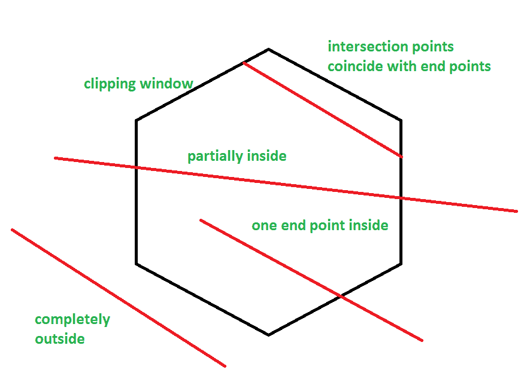
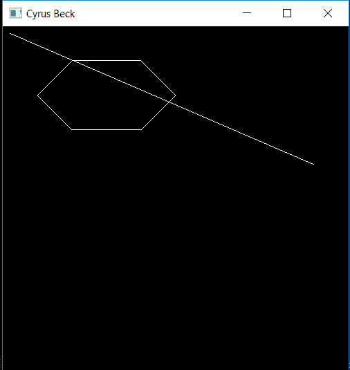
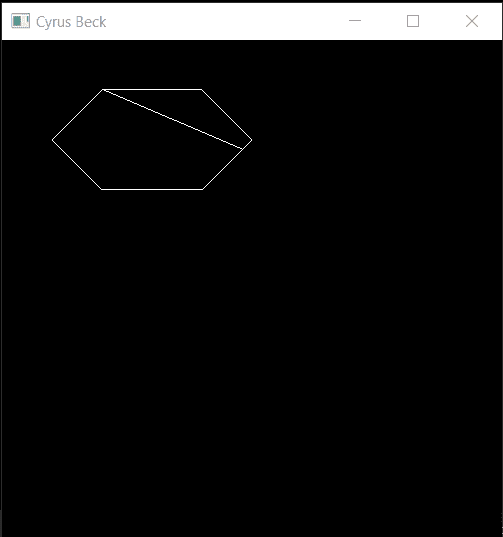

# 线裁剪|集合 2(赛勒斯·贝克算法)

> 原文:[https://www . geesforgeks . org/line-clipping-set-2-Cyrus-beck-algorithm/](https://www.geeksforgeeks.org/line-clipping-set-2-cyrus-beck-algorithm/)

**<u>背景</u> :**
赛勒斯·贝克是一款针对凸多边形的线裁剪算法。与[科恩萨瑟兰](https://www.geeksforgeeks.org/line-clipping-set-1-cohen-sutherland-algorithm/)或**尼科尔勒尼科尔**不同，它允许对非矩形窗口进行线条裁剪。它还消除了[科恩·萨瑟兰](https://www.geeksforgeeks.org/line-clipping-set-1-cohen-sutherland-algorithm/)中需要的重复剪裁。

```
Input: 
 1\. Convex area of interest 
    which is defined by a set of coordinates
    given in a clockwise fashion.
 2\. vertices which are an array of coordinates: 
    consisting of pairs (x, y)
 3\. n which is the number of vertices
 4\. A line to be clipped 
    given by a set of coordinates.
 5\. line which is an array of coordinates: 
    consisting of two pairs, (x0, y0) and (x1, y1)
Output:
 1\. Coordinates of line clipping which is the Accepted clipping
 2\. Coordinates (-1, -1) which is the Rejected clipping

```

**<u>算法:</u>**

*   计算每条边的法线。
*   计算裁剪线的向量。
*   计算每条边的一个顶点和裁剪线的一个选定端点与该边的法线之间的差的点积(对于所有边)。
*   计算裁剪线的矢量和边的法线(对于所有边)之间的点积。
*   前一点积除以后一点积，再乘以-1。这是 t。
*   “t”的值通过观察其分母(后一个点积)被分类为进入或退出(从所有边)。
*   从每组中选择一个“t”值，并将其放入直线的参数形式中以计算坐标。
*   如果输入的“t”值大于输出的“t”值，则剪切线被拒绝。

**<u>例</u> :**
[](https://media.geeksforgeeks.org/wp-content/uploads/20190529213705/CyrusBeckRevised.png)

1.  **情况 1:****线部分在**裁剪窗口内:

    ```
    0 < tE < tL < 1

    where tE is 't' value for entering intersection point
          tL is 't' value for exiting intersection point

    ```

2.  **情况 2:** 该**线在**窗内侧或两侧各有一点**或交点在线的端点** :

    ```
    0 ≤ tE ≤ tL ≤ 1
    ```

3.  **情况 3:** 线路完全在窗外

    ```
    tL < tE
    ```

**<u>伪代码:</u>**

首先，计算要裁剪的线的参数形式，然后遵循算法。

*   从线的两点中选择一个称为 P <sub>1</sub> 的点(P <sub>0</sub> P <sub>1</sub> )。*   现在对于多边形的每条边，计算远离多边形中心的法线，即 N <sub>1</sub> 、N <sub>2</sub> 等。*   现在为每条边选择 P <sub>Ei</sub> (i - > i <sup>th</sup> 边)(选择相应边的任意顶点，例如:对于多边形 ABCD，对于边 AB，P <sub>Ei</sub> 可以是点 A 或点 B)并计算

    ```
    P0 - PEi 
    ```

    *   然后计算

    ```
    P1 - P0
    ```

    *   然后计算每个边的下列点积:

    ```
    Ni . (P0 - PEi)
    Ni . (P1 - P0) 

    where i -> ith edge of the convex polygon
    ```

    *   然后通过以下方式计算每条边的相应“t”值:

    ```
        Ni . (P0 - PEi)
    t = ------------------
        -(Ni . (P1 - P0))
    ```

    *   然后俱乐部的' t '值的 **N <sub>我</sub>。(P<sub>1</sub>–P<sub>0</sub>)**出来是负数，取全部的最小值和 1。*   类似地，俱乐部所有的“t”值为 N <sub>i</sub> 。(P<sub>1</sub>–P<sub>0</sub>)结果为正，取所有“t”值和 0 的最大值。*   现在，从该算法中获得的两个“t”值被插入到“待裁剪”线的参数形式中，并且获得的结果两个点是裁剪点。
    *   **削波前:**

        [](https://media.geeksforgeeks.org/wp-content/uploads/20190527144821/CyrusBeckImplementation-1.png)

    *   **削波后:**
        [](https://media.geeksforgeeks.org/wp-content/uploads/20190527144840/CyrusBeckImplementation-2.png)

    **<u>实现</u> :** 下面是上述步骤在 SFML C++图形库中的一个实现。您也可以按任意键松开线路，按任意键夹住线路。

    ```
    // C++ Program to implement Cyrus Beck

    #include <SFML/Graphics.hpp>
    #include <iostream>
    #include <utility>
    #include <vector>

    using namespace std;
    using namespace sf;

    // Function to draw a line in SFML
    void drawline(RenderWindow* window, pair<int, int> p0, pair<int, int> p1)
    {
        Vertex line[] = {
            Vertex(Vector2f(p0.first, p0.second)),
            Vertex(Vector2f(p1.first, p1.second))
        };
        window->draw(line, 2, Lines);
    }

    // Function to draw a polygon, given vertices
    void drawPolygon(RenderWindow* window, pair<int, int> vertices[], int n)
    {
        for (int i = 0; i < n - 1; i++)
            drawline(window, vertices[i], vertices[i + 1]);
        drawline(window, vertices[0], vertices[n - 1]);
    }

    // Function to take dot product
    int dot(pair<int, int> p0, pair<int, int> p1)
    {
        return p0.first * p1.first + p0.second * p1.second;
    }

    // Function to calculate the max from a vector of floats
    float max(vector<float> t)
    {
        float maximum = INT_MIN;
        for (int i = 0; i < t.size(); i++)
            if (t[i] > maximum)
                maximum = t[i];
        return maximum;
    }

    // Function to calculate the min from a vector of floats
    float min(vector<float> t)
    {
        float minimum = INT_MAX;
        for (int i = 0; i < t.size(); i++)
            if (t[i] < minimum)
                minimum = t[i];
        return minimum;
    }

    // Cyrus Beck function, returns a pair of values
    // that are then displayed as a line
    pair<int, int>* CyrusBeck(pair<int, int> vertices[],
                              pair<int, int> line[], int n)
    {

        // Temporary holder value that will be returned
        pair<int, int>* newPair = new pair<int, int>[2];

        // Normals initialized dynamically(can do it statically also, doesn't matter)
        pair<int, int>* normal = new pair<int, int>[n];

        // Calculating the normals
        for (int i = 0; i < n; i++) {
            normal[i].second = vertices[(i + 1) % n].first - vertices[i].first;
            normal[i].first = vertices[i].second - vertices[(i + 1) % n].second;
        }

        // Calculating P1 - P0
        pair<int, int> P1_P0
            = make_pair(line[1].first - line[0].first,
                        line[1].second - line[0].second);

        // Initializing all values of P0 - PEi
        pair<int, int>* P0_PEi = new pair<int, int>[n];

        // Calculating the values of P0 - PEi for all edges
        for (int i = 0; i < n; i++) {

            // Calculating PEi - P0, so that the
            // denominator won't have to multiply by -1
            P0_PEi[i].first
                = vertices[i].first - line[0].first;

            // while calculating 't'
            P0_PEi[i].second = vertices[i].second - line[0].second;
        }

        int *numerator = new int[n], *denominator = new int[n];

        // Calculating the numerator and denominators
        // using the dot function
        for (int i = 0; i < n; i++) {
            numerator[i] = dot(normal[i], P0_PEi[i]);
            denominator[i] = dot(normal[i], P1_P0);
        }

        // Initializing the 't' values dynamically
        float* t = new float[n];

        // Making two vectors called 't entering'
        // and 't leaving' to group the 't's
        // according to their denominators
        vector<float> tE, tL;

        // Calculating 't' and grouping them accordingly
        for (int i = 0; i < n; i++) {

            t[i] = (float)(numerator[i]) / (float)(denominator[i]);

            if (denominator[i] > 0)
                tE.push_back(t[i]);
            else
                tL.push_back(t[i]);
        }

        // Initializing the final two values of 't'
        float temp[2];

        // Taking the max of all 'tE' and 0, so pushing 0
        tE.push_back(0.f);
        temp[0] = max(tE);

        // Taking the min of all 'tL' and 1, so pushing 1
        tL.push_back(1.f);
        temp[1] = min(tL);

        // Entering 't' value cannot be
        // greater than exiting 't' value,
        // hence, this is the case when the line
        // is completely outside
        if (temp[0] > temp[1]) {
            newPair[0] = make_pair(-1, -1);
            newPair[1] = make_pair(-1, -1);
            return newPair;
        }

        // Calculating the coordinates in terms of x and y
        newPair[0].firs
            t
            = (float)line[0].first
              + (float)P1_P0.first * (float)temp[0];
        newPair[0].second
            = (float)line[0].second
              + (float)P1_P0.second * (float)temp[0];
        newPair[1].first
            = (float)line[0].first
              + (float)P1_P0.first * (float)temp[1];
        newPair[1].second
            = (float)line[0].second
              + (float)P1_P0.second * (float)temp[1];
        cout << '(' << newPair[0].first << ", "
             << newPair[0].second << ") ("
             << newPair[1].first << ", "
             << newPair[1].second << ")";

        return newPair;
    }

    // Driver code
    int main()
    {

        // Setting up a window and loop
        // and the vertices of the polygon and line
        RenderWindow window(VideoMode(500, 500), "Cyrus Beck");
        pair<int, int> vertices[]
            = { make_pair(200, 50),
                make_pair(250, 100),
                make_pair(200, 150),
                make_pair(100, 150),
                make_pair(50, 100),
                make_pair(100, 50) };

        // Make sure that the vertices
        // are put in a clockwise order
        int n = sizeof(vertices) / sizeof(vertices[0]);
        pair<int, int> line[] = { make_pair(10, 10), make_pair(450, 200) };
        pair<int, int>* temp1 = CyrusBeck(vertices, line, n);
        pair<int, int> temp2[2];
        temp2[0] = line[0];
        temp2[1] = line[1];

        // To allow clipping and unclipping
        // of the line by just pressing a key
        bool trigger = false;
        while (window.isOpen()) {
            window.clear();
            Event event;
            if (window.pollEvent(event)) {
                if (event.type == Event::Closed)
                    window.close();
                if (event.type == Event::KeyPressed)
                    trigger = !trigger;
            }
            drawPolygon(&window, vertices, n);

            // Using the trigger value to clip
            // and unclip a line
            if (trigger) {
                line[0] = temp1[0];
                line[1] = temp1[1];
            }
            else {
                line[0] = temp2[0];
                line[1] = temp2[1];
            }
            drawline(&window, line[0], line[1]);
            window.display();
        }
        return 0;
    }
    ```

    **输出:**

    ```
    (102, 50) (240, 109)
    ```