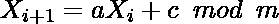

# 产生伪随机数的线性同余法

> 原文:[https://www . geeksforgeeks . org/线性同余生成伪随机数的方法/](https://www.geeksforgeeks.org/linear-congruence-method-for-generating-pseudo-random-numbers/)

**线性同余法**是一类[伪随机数生成器(PRNG)](https://www.geeksforgeeks.org/pseudo-random-number-generator-prng/) 算法，用于生成特定范围内的类随机数序列。这种方法可以定义为:

> 
> 
> 哪里，
> 
> **X、**是伪随机数的序列
> T3】m、 ( > 0)模数
> **a、** (0，m)乘数
> **c、** (0，m)增量
> **X <sub>0</sub>** <sub>、</sub>【0，m)–序列初始值称为种子
> 
> 应适当选择 m、a、c 和 X <sub>0</sub> ，以获得几乎等于 m 的周期。

对于 a = 1，它将是加法同余法。
对于 c = 0，将是乘法同余法。

**进场:**

*   选择种子值 X <sub>0、</sub>模数参数 m、乘数项 a 和增量项 c
*   初始化需要生成的随机数数量(比如，一个整数变量*nofrandomnums*)。
*   定义一个存储器来保存生成的大小为*的随机数(这里考虑*向量*)。*
*   用种子值初始化向量的第 0 <sup>个</sup>索引。
*   对于其余的索引，遵循线性同余法生成随机数。

> randomNums[i] = （（randomNums[i – 1] * a） + c） % m

最后，返回随机数。

下面是上述方法的实现:

## C++

```
// C++ implementation of the
// above approach

#include <bits/stdc++.h>
using namespace std;

// Function to generate random numbers
void linearCongruentialMethod(
    int Xo, int m, int a, int c,
    vector<int>& randomNums,
    int noOfRandomNums)
{

    // Initialize the seed state
    randomNums[0] = Xo;

    // Traverse to generate required
    // numbers of random numbers
    for (int i = 1; i < noOfRandomNums; i++) {
        // Follow the linear congruential method
        randomNums[i]
            = ((randomNums[i - 1] * a) + c) % m;
    }
}

// Driver Code
int main()
{
    int Xo = 5; // Seed value
    int m = 7; // Modulus parameter
    int a = 3; // Multiplier term
    int c = 3; // Increment term

    // Number of Random numbers
    // to be generated
    int noOfRandomNums = 10;

    // To store random numbers
    vector<int> randomNums(
        noOfRandomNums);

    // Function Call
    linearCongruentialMethod(
        Xo, m, a, c,
        randomNums, noOfRandomNums);

    // Print the generated random numbers
    for (int i = 0; i < noOfRandomNums; i++) {
        cout << randomNums[i] << " ";
    }

    return 0;
}
```

## Java 语言(一种计算机语言，尤用于创建网站)

```
// Java implementation of the above approach
import java.util.*;

class GFG{

// Function to generate random numbers
static void linearCongruentialMethod(int Xo, int m,
                                     int a, int c,
                                     int[] randomNums,
                                     int noOfRandomNums)
{

    // Initialize the seed state
    randomNums[0] = Xo;

    // Traverse to generate required
    // numbers of random numbers
    for(int i = 1; i < noOfRandomNums; i++)
    {

        // Follow the linear congruential method
        randomNums[i] = ((randomNums[i - 1] * a) + c) % m;
    }
}

// Driver code
public static void main(String[] args)
{

    // Seed value
    int Xo = 5;

    // Modulus parameter
    int m = 7;

    // Multiplier term
    int a = 3;

    // Increment term
    int c = 3;

    // Number of Random numbers
    // to be generated
    int noOfRandomNums = 10;

    // To store random numbers
    int[] randomNums = new int[noOfRandomNums];

    // Function Call
    linearCongruentialMethod(Xo, m, a, c,
                             randomNums,
                             noOfRandomNums);

    // Print the generated random numbers
    for(int i = 0; i < noOfRandomNums; i++)
    {
        System.out.print(randomNums[i] + " ");
    }
}
}

// This code is contributed by offbeat
```

## 蟒蛇 3

```
# Python3 implementation of the
# above approach

# Function to generate random numbers
def linearCongruentialMethod(Xo, m, a, c,
                             randomNums,
                             noOfRandomNums):

    # Initialize the seed state
    randomNums[0] = Xo

    # Traverse to generate required
    # numbers of random numbers
    for i in range(1, noOfRandomNums):

        # Follow the linear congruential method
        randomNums[i] = ((randomNums[i - 1] * a) +
                                         c) % m

# Driver Code
if __name__ == '__main__':

    # Seed value
    Xo = 5

    # Modulus parameter
    m = 7

    # Multiplier term
    a = 3

    # Increment term
    c = 3

    # Number of Random numbers
    # to be generated
    noOfRandomNums = 10

    # To store random numbers
    randomNums = [0] * (noOfRandomNums)

    # Function Call
    linearCongruentialMethod(Xo, m, a, c,
                             randomNums,
                             noOfRandomNums)

    # Print the generated random numbers
    for i in randomNums:
        print(i, end = " ")

# This code is contributed by mohit kumar 29
```

## C#

```
// C# implementation of the above approach
using System;

class GFG{

// Function to generate random numbers
static void linearCongruentialMethod(int Xo, int m,
                                     int a, int c,
                                     int[] randomNums,
                                     int noOfRandomNums)
{

    // Initialize the seed state
    randomNums[0] = Xo;

    // Traverse to generate required
    // numbers of random numbers
    for(int i = 1; i < noOfRandomNums; i++)
    {

        // Follow the linear congruential method
        randomNums[i] = ((randomNums[i - 1] * a) + c) % m;
    }
}

// Driver code
public static void Main(String[] args)
{

    // Seed value
    int Xo = 5;

    // Modulus parameter
    int m = 7;

    // Multiplier term
    int a = 3;

    // Increment term
    int c = 3;

    // Number of Random numbers
    // to be generated
    int noOfRandomNums = 10;

    // To store random numbers
    int[] randomNums = new int[noOfRandomNums];

    // Function call
    linearCongruentialMethod(Xo, m, a, c,
                             randomNums,
                             noOfRandomNums);

    // Print the generated random numbers
    for(int i = 0; i < noOfRandomNums; i++)
    {
        Console.Write(randomNums[i] + " ");
    }
}
}

// This code is contributed by sapnasingh4991
```

## java 描述语言

```
<script>

// Javascript program to implement
// the above approach

// Function to generate random numbers
function linearCongruentialMethod(Xo, m,  a, c,
                     randomNums, noOfRandomNums)
{

    // Initialize the seed state
    randomNums[0] = Xo;

    // Traverse to generate required
    // numbers of random numbers
    for(let i = 1; i < noOfRandomNums; i++)
    {

        // Follow the linear congruential method
        randomNums[i] = ((randomNums[i - 1] * a) + c) % m;
    }
}

    // Driver Code

        // Seed value
    let Xo = 5;

    // Modulus parameter
    let m = 7;

    // Multiplier term
    let a = 3;

    // Increment term
    let c = 3;

    // Number of Random numbers
    // to be generated
    let noOfRandomNums = 10;

    // To store random numbers
    let randomNums = new Array(noOfRandomNums).fill(0);

    // Function Call
    linearCongruentialMethod(Xo, m, a, c,
                             randomNums,
                             noOfRandomNums);

    // Print the generated random numbers
    for(let i = 0; i < noOfRandomNums; i++)
    {
        document.write(randomNums[i] + " ");
    }

</script>
```

**Output:** 

```
5 4 1 6 0 3 5 4 1 6
```

**伪**的字面意思是**假**。这些随机数被称为伪随机数，因为使用了一些已知的算术过程来生成。即使生成的序列形成一个模式，因此 ***生成的数字似乎是随机的，但可能不是真正随机的*** 。