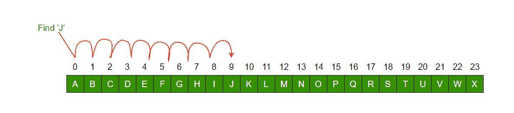
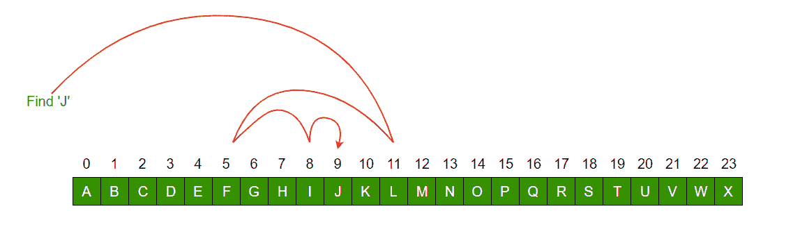

# 线性搜索 vs 二分搜索法

> 原文:[https://www . geesforgeks . org/linear-search-vs-binary-search/](https://www.geeksforgeeks.org/linear-search-vs-binary-search/)

先决条件:

*   [线性搜索](https://www.geeksforgeeks.org/linear-search/)
*   [二分搜索法](https://www.geeksforgeeks.org/binary-search/)

线性搜索一次扫描一个项目，不跳转到任何项目。

1.  最坏情况下的复杂性是 O(n)，有时称为 O(n)搜索
2.  随着元素数量的增加，搜索元素所需的时间不断增加。

然而，一找到排序列表的中间，就把你的搜索减少一半。

1.  查看中间元素以检查它是否大于或小于要搜索的值。
2.  因此，对给定列表的任一半进行搜索

**重要区别**

*   输入数据需要在二分搜索法排序，而不是在线性搜索中
*   线性搜索进行顺序访问，而二分搜索法随机访问数据。
*   线性搜索的时间复杂度——O(n)，二分搜索法有时间复杂度 O(log n)。
*   线性搜索执行等式比较，二分搜索法执行排序比较

让我们看一个例子来比较两者:

**线性搜索从 A-X 的给定排序列表中找到元素“J”**

**二分搜索法从 A-X 的给定排序列表中找到元素“J”**

You may also see

*   [搜索和整理文章](https://www.geeksforgeeks.org/fundamentals-of-algorithms/#SearchingandSorting)
*   [搜索](https://www.geeksforgeeks.org/algorithms-gq/searching-gq/)和[整理](https://www.geeksforgeeks.org/algorithms-gq/searching-and-sorting-gq/)小测验
*   [练习编码题](https://practice.geeksforgeeks.org/tag-page.php?tag=searching&isCmp=0)

如果您发现任何不正确的地方，或者您想分享更多关于上面讨论的主题的信息，请写评论