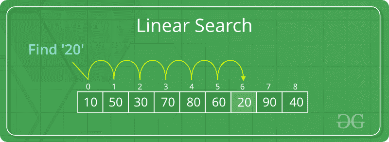

# 线性搜索

> 原文:[https://www.geeksforgeeks.org/linear-search/](https://www.geeksforgeeks.org/linear-search/)

**问题:**给定 n 个元素的数组 arr[]，编写一个函数在 arr[]中搜索给定的元素 x。

**示例:**

```
Input : arr[] = {10, 20, 80, 30, 60, 50, 
                     110, 100, 130, 170}
          x = 110;
Output : 6
Element x is present at index 6

Input : arr[] = {10, 20, 80, 30, 60, 50, 
                     110, 100, 130, 170}
           x = 175;
Output : -1
Element x is not present in arr[].
```

一个简单的方法是进行**线性搜索**，即

*   从 arr[]最左边的元素开始，逐一比较 x 和 arr[]的每个元素
*   如果 x 与元素匹配，则返回索引。
*   如果 x 与任何元素都不匹配，则返回-1。



**示例:**

## C++

```
// C++ code to linearly search x in arr[]. If x
// is present then return its location, otherwise
// return -1

#include <iostream>
using namespace std;

int search(int arr[], int n, int x)
{
    int i;
    for (i = 0; i < n; i++)
        if (arr[i] == x)
            return i;
    return -1;
}

// Driver code
int main(void)
{
    int arr[] = { 2, 3, 4, 10, 40 };
    int x = 10;
    int n = sizeof(arr) / sizeof(arr[0]);

    // Function call
    int result = search(arr, n, x);
    (result == -1)
        ? cout << "Element is not present in array"
        : cout << "Element is present at index " << result;
    return 0;
}
```

## C

```
// C code to linearly search x in arr[]. If x
// is present then return its location, otherwise
// return -1

#include <stdio.h>

int search(int arr[], int n, int x)
{
    int i;
    for (i = 0; i < n; i++)
        if (arr[i] == x)
            return i;
    return -1;
}

// Driver code
int main(void)
{
    int arr[] = { 2, 3, 4, 10, 40 };
    int x = 10;
    int n = sizeof(arr) / sizeof(arr[0]);

    // Function call
    int result = search(arr, n, x);
    (result == -1)
        ? printf("Element is not present in array")
        : printf("Element is present at index %d", result);
    return 0;
}
```

## Java 语言(一种计算机语言，尤用于创建网站)

```
// Java code for linearly searching x in arr[]. If x
// is present then return its location, otherwise
// return -1

class GFG
{
    public static int search(int arr[], int x)
    {
        int n = arr.length;
        for (int i = 0; i < n; i++)
        {
            if (arr[i] == x)
                return i;
        }
        return -1;
    }

    // Driver code
    public static void main(String args[])
    {
        int arr[] = { 2, 3, 4, 10, 40 };
        int x = 10;

        // Function call
        int result = search(arr, x);
        if (result == -1)
            System.out.print(
                "Element is not present in array");
        else
            System.out.print("Element is present at index "
                             + result);
    }
}
```

## 蟒蛇 3

```
# Python3 code to linearly search x in arr[].
# If x is present then return its location,
# otherwise return -1

def search(arr, n, x):

    for i in range(0, n):
        if (arr[i] == x):
            return i
    return -1

# Driver Code
arr = [2, 3, 4, 10, 40]
x = 10
n = len(arr)

# Function call
result = search(arr, n, x)
if(result == -1):
    print("Element is not present in array")
else:
    print("Element is present at index", result)
```

## C#

```
// C# code to linearly search x in arr[]. If x
// is present then return its location, otherwise
// return -1
using System;

class GFG {
    public static int search(int[] arr, int x)
    {
        int n = arr.Length;
        for (int i = 0; i < n; i++)
        {
            if (arr[i] == x)
                return i;
        }
        return -1;
    }

    // Driver code
    public static void Main()
    {
        int[] arr = { 2, 3, 4, 10, 40 };
        int x = 10;

        // Function call
        int result = search(arr, x);
        if (result == -1)
            Console.WriteLine(
                "Element is not present in array");
        else
            Console.WriteLine("Element is present at index "
                              + result);
    }
}

// This code is contributed by DrRoot_
```

## 服务器端编程语言（Professional Hypertext Preprocessor 的缩写）

```
<?php
// PHP code for linearly search x in arr[].
// If x is present then return its location,
// otherwise return -1

function search($arr, $x)
{
    $n = sizeof($arr);
    for($i = 0; $i < $n; $i++)
    {
        if($arr[$i] == $x)
            return $i;
    }
    return -1;
}

// Driver Code
$arr = array(2, 3, 4, 10, 40);
$x = 10;

// Function call
$result = search($arr, $x);
if($result == -1)
    echo "Element is not present in array";
else
    echo "Element is present at index " ,
                                 $result;

// This code is contributed
// by jit_t
?>
```

## java 描述语言

```
<script>

// Javascript code to linearly search x in arr[]. If x
// is present then return its location, otherwise
// return -1

function search(arr, n, x)
{
    let i;
    for (i = 0; i < n; i++)
        if (arr[i] == x)
            return i;
    return -1;
}

// Driver code

    let arr = [ 2, 3, 4, 10, 40 ];
    let x = 10;
    let n = arr.length;

    // Function call
    let result = search(arr, n, x);
    (result == -1)
        ? document.write("Element is not present in array")
        : document.write("Element is present at index " + result);

// This code is contributed by Manoj

</script>
```

**Output**

```
Element is present at index 3
```

上述算法的**时间复杂度**为 O(n)。

实际上很少使用线性搜索，因为其他搜索算法(如二分搜索法算法和哈希表)允许比线性搜索更快的搜索速度。

**提高线性搜索最坏情况复杂度**

1.  如果在最后 0(n)到 0(1)找到元素
2.  它与以前的方法相同，因为这里我们在循环的一次迭代中执行 2 个“if”操作，而在以前的方法中我们只执行 1 个“if”操作。这使得两者的时间复杂性相同。

下面是实现:

## C++14

```
// C++ program for linear search
#include<bits/stdc++.h>
using namespace std;

void search(vector<int> arr, int search_Element)
{
    int left = 0;
    int length = arr.size();
    int position = -1;
      int right = length - 1;

    // Run loop from 0 to right
    for(left = 0; left <= right;)
    {

        // If search_element is found with
        // left variable
        if (arr[left] == search_Element)
        {

            position = left;
            cout << "Element found in Array at "
                 << position + 1 << " Position with "
                 << left + 1 << " Attempt";

            break;
        }

        // If search_element is found with
        // right variable
        if (arr[right] == search_Element)
        {
            position = right;
            cout << "Element found in Array at "
                 << position + 1 << " Position with "
                 << length - right << " Attempt";

            break;
        }
        left++;
        right--;
    }

    // If element not found
    if (position == -1)
        cout << "Not found in Array with "
             << left << " Attempt";
}

// Driver code
int main()
{
    vector<int> arr{ 1, 2, 3, 4, 5 };
    int search_element = 5;

    // Function call
    search(arr, search_element);
}

// This code is contributed by mayanktyagi1709
```

## Java 语言(一种计算机语言，尤用于创建网站)

```
// Java program for linear search

import java.io.*;

class GFG
{

    public static void search(int arr[], int search_Element)
    {
        int left = 0;
        int length = arr.length;
        int right = length - 1;
        int position = -1;

        // run loop from 0 to right
        for (left = 0; left <= right;)
        {

            // if search_element is found with left variable
            if (arr[left] == search_Element)
            {
                position = left;
                System.out.println(
                    "Element found in Array at "
                    + (position + 1) + " Position with "
                    + (left + 1) + " Attempt");
                break;
            }

            // if search_element is found with right variable
            if (arr[right] == search_Element)
            {
                position = right;
                System.out.println(
                    "Element found in Array at "
                    + (position + 1) + " Position with "
                    + (length - right) + " Attempt");
                break;
            }

            left++;
            right--;
        }

        // if element not found
        if (position == -1)
            System.out.println("Not found in Array with "
                               + left + " Attempt");
    }

    // Driver code
    public static void main(String[] args)
    {
        int arr[] = { 1, 2, 3, 4, 5 };
        int search_element = 5;

        // Function call
        search(arr,search_element);
    }
}
```

## 蟒蛇 3

```
# Python3 program for linear search
def search(arr, search_Element):
    left = 0
    length = len(arr)
    position = -1
    right = length - 1

    # Run loop from 0 to right
    for left in range(0, right, 1):

        # If search_element is found with
        # left variable
        if (arr[left] == search_Element):
            position = left
            print("Element found in Array at ", position +
                  1, " Position with ", left + 1, " Attempt")
            break

        # If search_element is found with
        # right variable
        if (arr[right] == search_Element):
            position = right
            print("Element found in Array at ", position + 1,
                  " Position with ", length - right, " Attempt")
            break
        left += 1
        right -= 1

    # If element not found
    if (position == -1):
        print("Not found in Array with ", left, " Attempt")

# Driver code
arr = [1, 2, 3, 4, 5]
search_element = 5

# Function call
search(arr, search_element)

# This code is contributed by Dharanendra L V.
```

## C#

```
// C# program for linear search
using System;
class GFG
{

    public static void search(int []arr,
                              int search_Element)
    {
        int left = 0;
        int length = arr.Length;
        int right = length - 1;
        int position = -1;

        // run loop from 0 to right
        for (left = 0; left <= right;)
        {

            // if search_element is found with left variable
            if (arr[left] == search_Element)
            {
                position = left;
                Console.WriteLine(
                    "Element found in Array at "
                    + (position + 1) + " Position with "
                    + (left + 1) + " Attempt");
                break;
            }

            // if search_element is found with right variable
            if (arr[right] == search_Element)
            {
                position = right;
                Console.WriteLine(
                    "Element found in Array at "
                    + (position + 1) + " Position with "
                    + (length - right) + " Attempt");
                break;
            }

            left++;
            right--;
        }

        // if element not found
        if (position == -1)
            Console.WriteLine("Not found in Array with "
                               + left + " Attempt");
    }

    // Driver code
    public static void Main(String[] args)
    {
        int []arr = { 1, 2, 3, 4, 5 };
        int search_element = 5;

        // Function call
        search(arr,search_element);
    }
}

// This code is contributed by 29AjayKumar
```

## java 描述语言

```
<script>

// Javascript program for linear search

function search(arr, search_Element)
{
    let left = 0;
    let length = arr.length;
    let right = length - 1;
    let position = -1;

    // Run loop from 0 to right
    for(left = 0; left <= right;)
    {

        // If search_element is found
        // with left variable
        if (arr[left] == search_Element)
        {
            position = left;
            document.write(
                "Element found in Array at " +
                (position + 1) + " Position with " +
                    (left + 1) + " Attempt");
            break;
        }

        // If search_element is found
        // with right variable
        if (arr[right] == search_Element)
        {
            position = right;
            document.write(
                "Element found in Array at " +
                (position + 1) + " Position with " +
                (length - right) + " Attempt");
            break;
        }
        left++;
        right--;
    }

    // If element not found
    if (position == -1)
        document.write("Not found in Array with " +
                       left + " Attempt");
}

// Driver code
let arr = [ 1, 2, 3, 4, 5 ];
let search_element = 5;

// Function call
search(arr, search_element);

// This code is contributed by code_hunt

</script>
```

**Output**

```
Element found in Array at 5 Position with 1 Attempt
```

另请参见–[二分搜索法](https://www.geeksforgeeks.org/binary-search/)

如果你发现任何不正确的地方，或者你想分享更多关于上面讨论的话题的信息，请写评论。