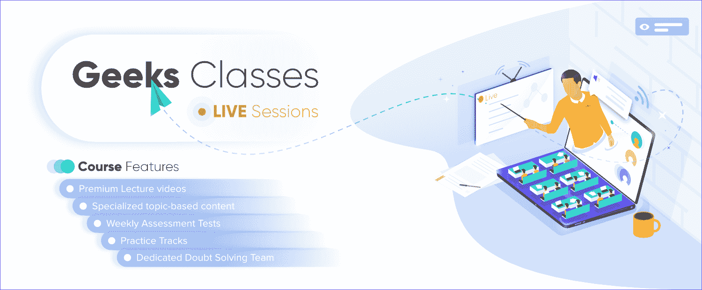
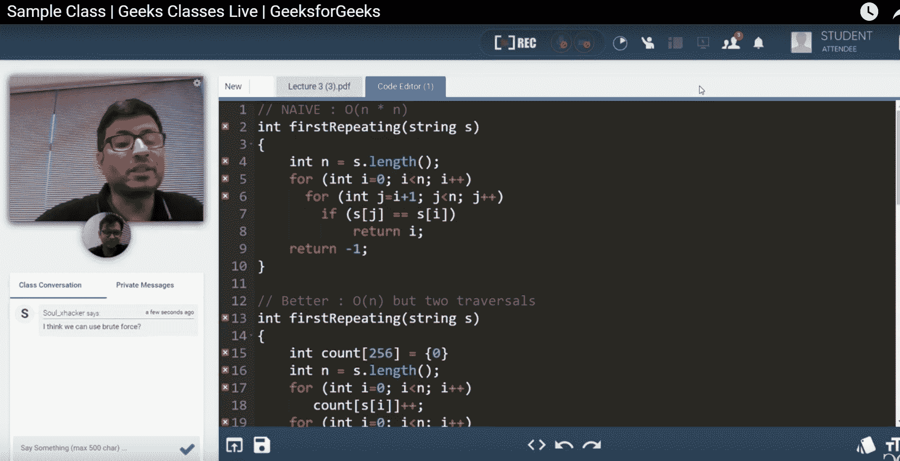

# 数据结构与算法直播课:面试准备重点课程

> 原文:[https://www . geeksforgeeks . org/live-class-for-data-structures-and-algorithms-interview-prevention-focused-course/](https://www.geeksforgeeks.org/live-classes-for-data-structures-and-algorithms-interview-preparation-focused-course/)

工程师有能力通过解决现实世界的问题来改变世界，但在它的数字减影血管造影下，数字减影血管造影在解决我们面临的所有问题中发挥着至关重要的作用。这些都是各个年龄段的人都喜欢走向编程并想学习编程的原因。此外，所有主要的科技公司(谷歌、微软、亚马逊、脸书等..)都在找能有这个本事的人来解决这些问题。

现在的问题是，如果你是他们中真正对学习这项技能感兴趣的人，那么你如何学习 DSA 的所有组成部分？。谁来教你，当面指导你？你会如何问你的疑问？你会怎么练习？如何从单一资源完成所有工作？你可能会获得某些资源来学习一切，但最有可能的是，不去任何地方是不可能的，坐在家里上课是不可能的，因为你在学校或传统的课堂上一直在学习。 

**GeeksforGeeks** 这次有一个惊喜给你，我们推出了[T3【Geeks DSA Live SessionT5【它可以解决你的问题，你不需要去任何地方，你可以从任何地理位置坐在家里上课。这门课将是一个在线互动环节，所以你不需要担心你会如何与你的导师互动，你会如何立即提出你的疑问。我们将一个接一个地告诉你如何利用这个现场互动会议，以及它如何类似于坐在教室里听讲座，就像你一直在做的那样。](https://practice.geeksforgeeks.org/courses/geeks-classes-live-weekdays)

*   上课将在工作日正常进行，不同的是，你可以在任何地方按照计划的时间使用笔记本电脑参加这个课程。你的导师会在那个时候出现，并且会指导你进行类似于你在传统课堂项目中所做的现场互动。
*   作为参与者，您可以使用聊天室询问您的疑问，该聊天室位于您的实时互动会话的左下角。
*   导师将使用讲义，其中将有讲座来解释主题，将有一个代码编辑器来演示解决方案，白板也将用于进行会议。
*   在线门户网站上将提供基于讲座主题的预先录制的短视频，建议参与者在参加会议之前观看这些视频。观看这些视频将有助于你在直播中更好地理解主题。
*   你可以从[这里](https://www.youtube.com/watch?v=X9aJBXeMP_4&feature=youtu.be)查看视频了解极客直播课的一切

#### 本课程的主要特点

本课程为期 6 周，每周将有三次讲座，您将学习 DSA 的基础知识(数组、链表、堆栈、队列、树、图形、动态编程等)，您还将在课堂上练习编码问题。

*   这门课最好的一点就是可以从 ***任何地理位置*** 参加。这将是一次**互动直播会议**，所以你不需要担心赶去某个地方上课。
*   您将学习并获得顶级专业人士的指导，geeks forgeek 创始人兼首席执行官 Sandeep Jain 先生和 geeks forgeek 的技术主管导师 Shashi Bhushan Kumar 也曾在 Adobe 和 Paytm 工作。
*   疑问解决团队
*   极客公司的实习机会。
*   课程结业**证书**
*   **免费获得价值 5999 卢比的每日生活津贴在线课程**，该课程将包括高级讲座视频、基于主题的专业内容、每周评估测试&练习曲目和许多其他内容。

#### 课程费用

本课程原价为**15，999 印度卢比**，但在优惠期间，可在**10，000 印度卢比**购买。您可以通过点击下面的按钮获得关于本课程的全部详细信息并注册。所以马上抓住机会成为这方面的高手。

[在此注册](https://practice.geeksforgeeks.org/courses/geeks-classes-live-weekdays?vb=173)