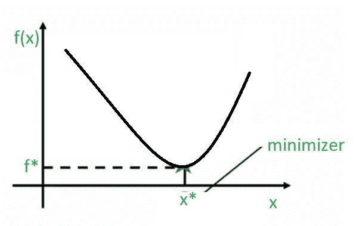
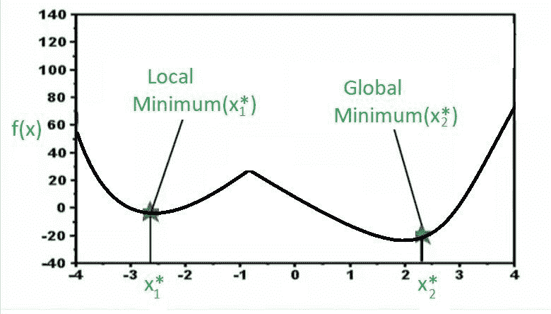

# 单变量优化中的局部和全局最优

> 原文:[https://www . geesforgeks . org/local-and-global-optimize-in-uni-variate-optimization/](https://www.geeksforgeeks.org/local-and-global-optimum-in-uni-variate-optimization/)

**单变量优化**是非线性优化问题的一个简单例子，它没有约束。单变量优化可以被定义为没有约束的非线性优化，并且在这个优化中只有一个决策变量，我们试图为其寻找一个值。

> 最小 f(x)使得 x ∈ R

其中，
*f(x) =目标函数
x =决策变量*

所以，当你看这个优化问题的时候，你通常把它写成上面这个形式，你说你要最小化 *f(x)* ，这个函数叫做目标函数。你可以用来最小化这个函数的变量，叫做决策变量，写在下面像这样 *w.r.t x* 这里你也可以说 x 是连续的，也就是说它可以取实数行中的任何值。因为这是一个单变量优化问题 *x* 是一个标量变量，而不是向量变量。

**凸函数:**

每当我们谈论单变量优化问题时，很容易在像这样的 2D 图像中想象出来。

我们在 x 轴上有不同的决策变量 *x* 的值，在 y 轴上有函数值。当你画出这个图时，你可以很容易地注意到，在图中，标记了这个函数达到最小值的点。因此，这个函数达到最小值的点可以通过在 x 轴上放置一个垂线来找到。所以，你可以说 *x** 是 *x* 的实际值，在这个点上这个函数取一个最小值，这个函数在它的最小点上取的值可以通过把这个垂线放到 y 轴上来识别，这个 *f** 是这个函数可能取的最佳值。所以，这种类型的函数称为**凸函数**，因为这里只有**一个最小值**。所以，不存在多个极小值可供选择的问题，这里只有一个极小值，并在图中标出。所以，在这种情况下，我们会说这个最小值既是**局部最小值**，也是**全局最小值**。事实上，我们可以说它是一个局部最小值，因为在这个点附近，这是你能得到的最好的解。如果我们在这个点附近得到的解也是全局最优解，那么我们也称之为**全局最小值**。

**非凸函数:**

现在，看一下上面的图表。这里我有一个函数，它还是一个单变量优化问题。因此，在 *x 轴上，*我有不同的决策变量值，在 *y 轴上，*我们绘制函数。现在，你可能会注意到，有两个点函数达到最小值，你可以看到，当我们说最小值时，我们自动实际上只意味着局部最小值，因为如果你注意到图中的这个 *x1** 点，在这个点附近，这个函数不能从最小化的角度得到任何更好的值。换句话说，如果我在 *x1** 并且函数取这个值，如果我向右移动，函数值会增加，这对我们来说基本上是不好的，因为我们试图找到最小值，如果我向左移动，函数值会再次增加，这是不好的，因为我们正在为这个函数找到最小值。这基本上说的是以下内容。

这就是说，在一个地方附近，你永远找不到比这更好的点。然而，如果你走得很远，那么你会到达这个点 *(x2*)* ，这里从局部的观点来看是最好的，因为如果我们走右边的方向，函数增加，如果我们走左边的方向，函数也增加，在这个特殊的例子中，也证明了全局这是最好的解决方案。因此，虽然这两个都是局部最小值，在附近它们是最好的，但是这个局部最小值 *(x2*)* 也是全局最小值，因为如果你拿整个区域来说，你仍然不能击败这个解。所以，当你有一个在整个地区最低的解决方案时，我们称之为全球最小值。这些是我们称之为*非凸*函数的函数类型，其中有多个局部最优解，优化器的工作是从可能的多个最优解中找出最佳解。

**为什么这个概念对数据科学很重要？**

让我们把这个概念和数据科学联系起来。这个寻找全局最小值的问题一直是几个数据科学算法中的一个实际问题。例如，在 20 世纪 90 年代，人们对神经网络等产生了极大的兴趣，几年来，大量的研究投入到神经网络中，在许多情况下，发现全局最优解是非常困难的，在许多情况下，这些神经网络被训练成局部最优，这对于正在解决的问题类型来说不够好。所以，这成为了神经网络概念的一个真正的问题，然后在最近几年这个问题被重新讨论，现在有了更好的算法，更好的函数形式，和更好的训练策略。这样你就可以获得一些全局最优的概念，这就是为什么我们让这些算法卷土重来并且非常有用。