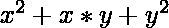

# 洛奇安号码

> 原文:[https://www.geeksforgeeks.org/loeschian-number/](https://www.geeksforgeeks.org/loeschian-number/)

给定一个数字 **N** ，任务是检查 **N** 是否是一个**洛奇安数字**。如果 **N** 是**洛希安号**，则打印**“是”**否则打印**“否”**。

> 如果 **N** 可以表示为任意两个整数 x 和 y 的形式，则数字 **N** 是洛希安数

**例:**

> **输入:** N = 19
> **输出:**是
> **解释:**
> 19 = 2<sup>2</sup>+2 * 3+3<sup>2</sup>
> **输入:** N = 20
> **输出:**否

**方法:**思路是在范围**【0，sqrt(N)】**内分别迭代 x 和 y 的两个嵌套循环。如果任意一对整数(x，y)满足等式，则打印**“是”**否则打印**“否”**。
以下是上述方法的实施:

## C++

```
// C++ program for the above approach
#include <bits/stdc++.h>
using namespace std;

// Function to check if N is a
// Loeschian Number
bool isLoeschian(int n)
{
    // Iterate [0, sqrt(N)] for x
    for (int x = 1; x <= sqrt(n); x++) {

        // Iterate [0, sqrt(N)] for y
        for (int y = 1; y <= sqrt(n); y++) {

            // Check the given criteria
            if (x * x + x * y + y * y == n)
                return true;
        }
    }

    // If no such pair found then
    // return false
    return false;
}

// Driver Code
int main()
{
    // Given Number N
    int N = 19;

    // Function Call
    if (isLoeschian(n))
        cout << "Yes";
    else
        cout << "No";
}
```

## Java 语言(一种计算机语言，尤用于创建网站)

```
// Java program for the above approach
class GFG{

// Function to check if N is a
// Loeschian Number
static boolean isLoeschian(int n)
{

    // Iterate [0, sqrt(N)] for x
    for(int x = 1; x <= Math.sqrt(n); x++)
    {

       // Iterate [0, sqrt(N)] for y
       for(int y = 1; y <= Math.sqrt(n); y++)
       {

          // Check the given criteria
          if (x * x + x * y + y * y == n)
              return true;
       }
    }

    // If no such pair found then
    // return false
    return false;
}

// Driver code
public static void main(String[] args)
{

    // Given Number N
    int n = 19;

    // Function Call
    if (isLoeschian(n))
    {
        System.out.println("Yes");
    }
    else
    {
        System.out.println("No");
    }
}
}

// This code is contributed by Pratima Pandey
```

## 蟒蛇 3

```
# Python3 program for the above approach
import math

# Function to check if N is a
# Loeschian Number
def isLoeschian(n):

    # Iterate [0, sqrt(N)] for x
    for x in range(1, (int)(math.sqrt(n)) + 1):

        # Iterate [0, sqrt(N)] for y
        for y in range(1, (int)(math.sqrt(n)) + 1):

            # Check the given criteria
            if (x * x + x * y + y * y == n):
                return True

    # If no such pair found then
    # return false
    return False

# Driver code

# Given Number N
N = 19

# Function Call
if (isLoeschian(N)):
    print("Yes")
else:
    print("No")

# This code is contributed by Vishal Maurya
```

## C#

```
// C# program for the above approach
using System;

class GFG{

// Function to check if N is a
// Loeschian Number
static bool isLoeschian(int n)
{

    // Iterate [0, sqrt(N)] for x
    for(int x = 1; x <= Math.Sqrt(n); x++)
    {

       // Iterate [0, sqrt(N)] for y
       for(int y = 1; y <= Math.Sqrt(n); y++)
       {

          // Check the given criteria
          if (x * x + x * y + y * y == n)
              return true;
       }
    }

    // If no such pair found then
    // return false
    return false;
}

// Driver code
public static void Main(String[] args)
{

    // Given Number N
    int n = 19;

    // Function Call
    if (isLoeschian(n))
    {
        Console.WriteLine("Yes");
    }
    else
    {
        Console.WriteLine("No");
    }
}
}

// This code is contributed by amal kumar choubey
```

## java 描述语言

```
<script>
// JavaScript program for the above approach

// Function to check if N is a
// Loeschian Number
function isLoeschian(n) {
    // Iterate [0, sqrt(N)] for x
    for (let x = 1; x <= Math.sqrt(n); x++) {

        // Iterate [0, sqrt(N)] for y
        for (let y = 1; y <= Math.sqrt(n); y++) {

            // Check the given criteria
            if (x * x + x * y + y * y == n)
                return true;
        }
    }

    // If no such pair found then
    // return false
    return false;
}

// Driver Code

// Given Number n
let n = 19;

// Function Call
if (isLoeschian(n))
    document.write("Yes");
else
    document.write("No");

// This code is contributed by blalverma92
</script>
```

**Output:** 

```
Yes
```

**时间复杂度:**T2【O(N)T4】