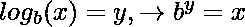
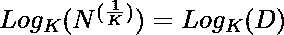
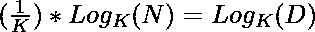

# 竞争性编程的对数技巧

> 原文:[https://www . geesforgeks . org/对数-技巧换竞技-编程/](https://www.geeksforgeeks.org/logarithm-tricks-for-competitive-programming/)

[**对数**](https://www.geeksforgeeks.org/logarithm/) **:** 是指数的反函数，即给定数 x 的对数值是另一数的指数。


下面是一些使用对数函数的技巧，在竞争性编程中会很方便。

### 检查一个数是否是二的幂:

给定一个整数 **N** ，任务是检查 N 是否是 2 的幂。

**示例:**

> **输入:**N = 8
> T3】输出:是
> 
> **输入:**N = 6
> T3】输出:否

**方法:**一个简单的方法是简单地取基数为 2 的数的对数，如果你得到一个整数，那么这个数就是 2 的幂。

下面是上述方法的实现:

## C++

```
// C++ implementation to check that
// a integer is a power of Two

#include <bits/stdc++.h>

using namespace std;

// Function to check if the number
// is a power of two
bool isPowerOfTwo(int n)
{
    return (ceil(log2(n)) == floor(log2(n)));
}

// Driver Code
int main()
{
    int N = 8;

    if (isPowerOfTwo(N)) {
        cout << "Yes";
    }
    else {
        cout << "No";
    }
}
```

## C

```
// C implementation to check that
// a integer is a power of Two
#include <stdio.h>
#include <math.h>

// Function to check if the number
// is a power of two
_Bool isPowerOfTwo(int n)
{
    return (ceil(log2(n)) == floor(log2(n)));
}

// Driver Code
int main()
{
    int N = 8;

    if (isPowerOfTwo(N))
    {
        printf("Yes");
    }
    else
    {
        printf("No");
    }
}

// This code is contributed by vikas_g
```

## Java 语言(一种计算机语言，尤用于创建网站)

```
// Java implementation to check that
// a integer is a power of Two
import java.lang.Math;

class GFG{

// Function to check if the number
// is a power of two
public static boolean isPowerOfTwo(int n)
{
    return(Math.ceil(Math.log(n) /
                     Math.log(2)) ==
          Math.floor(Math.log(n) /
                     Math.log(2)));
}

// Driver Code
public static void main(String[] args)
{
    int N = 8;

    if (isPowerOfTwo(N))
    {
        System.out.println("Yes");
    }
    else
    {
        System.out.println("No");
    }
}
}

// This code is contributed by divyeshrabadiya07
```

## 蟒蛇 3

```
# Python3 implementation to check that
# a integer is a power of two
import math

# Function to check if the number
# is a power of two            
def isPowerOfTwo(n):

    return(math.ceil(math.log(n) //
                     math.log(2)) ==
           math.floor(math.log(n) //
                      math.log(2)));

# Driver code
if __name__=='__main__':

    N = 8

    if isPowerOfTwo(N):
        print('Yes')
    else:
        print('No')

# This code is contributed by rutvik_56   
```

## C#

```
// C# implementation to check that
// a integer is a power of Two
using System;

class GFG{

// Function to check if the number
// is a power of two
public static bool isPowerOfTwo(int n)
{
    return(Math.Ceiling(Math.Log(n) /
                        Math.Log(2)) ==
             Math.Floor(Math.Log(n) /
                        Math.Log(2)));
}

// Driver Code
public static void Main(String[] args)
{
    int N = 8;

    if (isPowerOfTwo(N))
    {
        Console.WriteLine("Yes");
    }
    else
    {
        Console.WriteLine("No");
    }
}
}

// This code is contributed by 29AjayKumar
```

## java 描述语言

```
<script>
    // Java implementation to check that
      // a integer is a power of Two

    // Function to check if the number
    // is a power of two
    function isPowerOfTwo(n)
    {
        return (Math.ceil(Math.log(n) / Math.log(2)) == Math.floor(Math.log(n) / Math.log(2)));
    }

    let N = 8;

    if (isPowerOfTwo(N)) {
        document.write("Yes");
    }
    else {
        document.write("No");
    }

    // This code is contributed by Shubham.
</script>
```

**Output:** 

```
Yes
```

### 数的第几个根

给定两个整数 **N** 和 **K** ，任务是找到数字 N 的 K <sup>次</sup>根

**示例:**

> **输入:** N = 8，K = 3
> T3】输出: 2
> 
> **输入:** N = 32，K = 5
> T3】输出: 2

**方法:**一个简单的解决方法是用对数函数求数的 K <sup>次</sup>根。以下是该方法的示例:

> 让 D 成为我们的答案
> ，然后
> 在两侧应用
> =>
> =>
> =>

下面是上述方法的实现:

## C++

```
// C++ implementation to find
// Kth root of the number

#include <bits/stdc++.h>

using namespace std;

// Function to find the
// Kth root of the number
double kthRoot(double n, int k)
{
    return pow(k,
               (1.0 / k)
                   * (log(n)
                      / log(k)));
}

// Driver Code
int main()
{
    double N = 8.0;
    int K = 3;

    cout << kthRoot(N, K);

    return 0;
}
```

## Java 语言(一种计算机语言，尤用于创建网站)

```
// Java implementation to find
// Kth root of the number
class GFG{

// Function to find the
// Kth root of the number
static double kthRoot(double n, int k)
{
    return Math.pow(k, (1.0 / k) *
                    (Math.log(n) / Math.log(k)));
}

// Driver Code
public static void main(String[] args)
{
    double N = 8.0;
    int K = 3;

    System.out.print(kthRoot(N, K));
}
}

// This code is contributed by shivanisinghss2110
```

## 蟒蛇 3

```
# Python3 implementation to find
# Kth root of the number
import math

# Function to find the
# Kth root of the number
def kth_root(n, k):

    return(pow(k, ((1.0 / k) * (math.log(n) /
                                math.log(k)))))

# Driver code
if __name__=="__main__":

    n = 8.0
    k = 3

    print(round(kth_root(n, k)))

# This code is contributed by dipesh99kumar
```

## C#

```
// C# implementation to find
// Kth root of the number
using System;

// Function to find the
// Kth root of the number
class GFG{

static double kthRoot(double n, int k)
{
    return Math.Pow(k, (1.0 / k) *
                   (Math.Log(n) / Math.Log(k)));
}

// Driver Code
public static void Main()
{
    double N = 8.0;
    int K = 3;

    Console.Write(kthRoot(N, K));
}
}

// This code is contributed by vikas_g
```

## java 描述语言

```
<script>

// Javascript implementation to find
// Kth root of the number

// Function to find the
// Kth root of the number
function kthRoot(n, k)
{
    return Math.pow(k,
               (1.0 / k)
                   * (Math.log(n)
                      / Math.log(k)));
}

// Driver Code
var N = 8.0;
var K = 3;
document.write( kthRoot(N, K));

</script>
```

**Output:** 

```
2
```

### 计算数字中的位数:

给定一个整数 **N** ，任务是对数字 N 中的数字进行计数

**示例:**

> **输入:**N = 243
> T3】输出: 3
> 
> **输入:**N = 1000
> T3】输出: 4

**做法:**思路是求以 10 为底的数字的对数来计数位数。

下面是上述方法的实现:

## C++

```
// C++ implementation count the
// number of digits in a number

#include <bits/stdc++.h>

using namespace std;

// Function to count the
// number of digits in a number
int countDigit(long long n)
{
    return floor(log10(n) + 1);
}

// Driver Code
int main()
{
    double N = 80;

    cout << countDigit(N);

    return 0;
}
```

## C

```
// C implementation count the
// number of digits in a number
#include <stdio.h>
#include <math.h>

// Function to count the
// number of digits in a number
int countDigit(long long n)
{
    return (floor(log10(n) + 1));
}

// Driver Code
int main()
{
    double N = 80;

    printf("%d", countDigit(N));

    return 0;
}

// This code is contributed by vikas_g
```

## Java 语言(一种计算机语言，尤用于创建网站)

```
// Java implementation to count the
// number of digits in a number
class GFG{

// Function to count the
// number of digits in a number
static int countDigit(double n)
{
    return((int)Math.floor(Math.log10(n) + 1));

}

// Driver Code
public static void main(String[] args)
{
    double N = 80;

    System.out.println(countDigit(N));
}
}

// This code is contributed by vikas_g
```

## 蟒蛇 3

```
# Python3 implementation count the
# number of digits in a number
import math

# Function to count the
# number of digits in a number
def countDigit(n):

    return(math.floor(math.log10(n) + 1))

# Driver code
if __name__=="__main__":

    n = 80

    print(countDigit(n))

# This code is contributed by dipesh99kumar
```

## C#

```
// C# implementation count the
// number of digits in a number
using System;

// Function to count the
// number of digits in a number
class GFG{

static int countDigit(double n)
{
    return((int)Math.Floor(Math.Log10(n) + 1));
}

// Driver Code
public static void Main()
{
    double N = 80;

    Console.Write(countDigit(N));
}
}

// This code is contributed by vikas_g
```

## java 描述语言

```
<script>
//Javascript implementation

// Function to count the
// number of digits in a number
function countDigit(n)
{
    return Math.floor(Math.log10(n) + 1);
}

// Driver program to test above
var n = 80;
document.write(countDigit(n));
// This code is contributed by shivani.
</script>
```

**Output:** 

```
2
```

### 检查 N 是否是 K 的幂:

给定两个整数 **N** 和 **K** ，任务是检查 Y 是否是 X 的幂。

**示例:**

> **输入:** N = 8，K = 2
> T3】输出:是
> 
> **输入:** N = 27，K = 3
> T3】输出:是

**方法:**思路是取 N 在 k 基数上的对数，如果结果是整数，那么 N 就是 k 的幂。

下面是上述方法的实现:

## C++

```
// C++ implementation to check if
// the number is power of K

#include <bits/stdc++.h>

using namespace std;

// Function to check if
// the number is power of K
bool isPower(int N, int K)
{
    // logarithm function to
    // calculate value
    int res1 = log(N) / log(K);
    double res2 = log(N) / log(K);

    // compare to the result1
    // or result2 both are equal
    return (res1 == res2);
}

// Driver Code
int main()
{
    int N = 8;
    int K = 2;

    if (isPower(N, K)) {
        cout << "Yes";
    }
    else {
        cout << "No";
    }

    return 0;
}
```

## C

```
// C implementation to check if
// the number is power of K
#include <stdio.h>
#include <math.h>

// Function to check if
// the number is power of K
_Bool isPower(int N, int K)
{

    // Logarithm function to
    // calculate value
    int res1 = log(N) / log(K);
    double res2 = log(N) / log(K);

    // Compare to the result1
    // or result2 both are equal
    return (res1 == res2);
}

// Driver Code
int main()
{
    int N = 8;
    int K = 2;

    if (isPower(N, K))
    {
        printf("Yes");
    }
    else
    {
        printf("No");
    }
    return 0;
}

// This code is contributed by vikas_g
```

## Java 语言(一种计算机语言，尤用于创建网站)

```
// Java implementation to check if
// the number is power of K
class GFG{

// Function to check if
// the number is power of K
static boolean isPower(int N, int K)
{

    // Logarithm function to
    // calculate value
    int res1 = (int)(Math.log(N) / Math.log(K));
    double res2 = Math.log(N) / Math.log(K);

    // Compare to the result1
    // or result2 both are equal
    return (res1 == res2);
}

// Driver Code
public static void main(String[] args)
{
    int N = 8;
    int K = 2;

    if (isPower(N, K))
    {
        System.out.println("Yes");
    }
    else
    {
        System.out.println("No");
    }
}
}

// This code is contributed by vikas_g
```

## 蟒蛇 3

```
# Python3 implementation to check if a
# number is a power of the other number
from math import log

# Function to check if
# the number is power of K
def isPower(n, k):

    # Logarithm function to
    # calculate value
    res1 = int(log(n) / log(k))
    res2 = log(n) / log(k)

    # Compare to the result1
    # or result2 both are equal
    return(res1 == res2)

# Driver code
if __name__=="__main__":

    n = 8
    k = 2

    if (isPower(n, k)):
        print("Yes")
    else:
        print("No")

# This code is contributed by dipesh99kumar
```

## C#

```
// C# implementation to check if
// the number is power of K
using System;

// Function to count the
// number of digits in a number
class GFG{

static bool isPower(int N, int K)
{

    // Logarithm function to
    // calculate value
    int res1 = (int)(Math.Log(N) / Math.Log(K));
    double res2 = Math.Log(N) / Math.Log(K);

    // Compare to the result1
    // or result2 both are equal
    return (res1 == res2);
}

// Driver Code
public static void Main()
{
    int N = 8;
    int K = 2;

    if (isPower(N, K))
    {
        Console.Write("Yes");
    }
    else
    {
        Console.Write("No");
    }
}
}

// This code is contributed by vikas_g
```

## java 描述语言

```
<script>
//Javascript Implementation
// to check if
// the number is power of K

// Function to check if
// the number is power of K
function isPower(N, K)
{
    // logarithm function to
    // calculate value
    var res1 = Math.floor(Math.log(N) / Math.log(K));
    var res2 = Math.log(N) / Math.log(K);

    // compare to the result1
    // or result2 both are equal
    return (res1 == res2);
}

// Driver Code
var N = 8;
var K = 2;

if (isPower(N, K)) {
document.write("Yes");
}
else {
document.write("No");
}
// This code is contributed by shubhamsingh10
</script>
```

**Output:** 

```
Yes
```

### 求大于等于 N 且小于等于 N 的 K 的幂:

给定两个整数 **N** 和 **K** ，任务是求大于等于 N 小于等于 N 的 K 的幂

**示例:**

> **输入:** N = 7，K = 2
> T3】输出: 4 8
> 
> **输入:** N = 18，K = 3
> T3】输出: 9 27

**方法:**思路是求给定整数 N 的对数 K 值的底值，然后计算这个数的 K <sup>次</sup>次幂，计算上一次和下一次 K <sup>次</sup>次幂。

下面是上述方法的实现:

## C++

```
// C++ implementation to find the
// previous and next power of K

#include <bits/stdc++.h>

using namespace std;

// Function to return the highest power
// of k less than or equal to n
int prevPowerofK(int n, int k)
{
    int p = (int)(log(n) / log(k));
    return (int)pow(k, p);
}

// Function to return the smallest power
// of k greater than or equal to n
int nextPowerOfK(int n, int k)
{
    return prevPowerofK(n, k) * k;
}

// Driver Code
int main()
{
    int N = 7;
    int K = 2;

    cout << prevPowerofK(N, K) << " ";

    cout << nextPowerOfK(N, K) << endl;
    return 0;
}
```

## C

```
// C implementation to find the
// previous and next power of K
#include <stdio.h>
#include <math.h>

// Function to return the highest power
// of k less than or equal to n
int prevPowerofK(int n, int k)
{
    int p = (int)(log(n) / log(k));
    return (int)pow(k, p);
}

// Function to return the smallest power
// of k greater than or equal to n
int nextPowerOfK(int n, int k)
{
    return prevPowerofK(n, k) * k;
}

// Driver Code
int main()
{
    int N = 7;
    int K = 2;

    printf("%d ", prevPowerofK(N, K));
    printf("%d\n", nextPowerOfK(N, K));

    return 0;
}

// This code is contributed by vikas_g
```

## Java 语言(一种计算机语言，尤用于创建网站)

```
// Java implementation to find the
// previous and next power of K
class GFG{

// Function to return the highest power
// of k less than or equal to n
static int prevPowerofK(int n, int k)
{
    int p = (int)(Math.log(n) / Math.log(k));
    return (int)Math.pow(k, p);
}

// Function to return the smallest power
// of k greater than or equal to n
static int nextPowerOfK(int n, int k)
{
    return prevPowerofK(n, k) * k;
}

// Driver Code
public static void main(String[] args)
{
    int N = 7;
    int K = 2;

    System.out.print(prevPowerofK(N, K) + " ");
    System.out.println(nextPowerOfK(N, K));
}
}

// This code is contributed by vikas_g
```

## 蟒蛇 3

```
# Python3 implementation to find the
# previous and next power of K
from math import log

# Function to return the highest power
# of k less than or equal to n
def prevPowerofK(n, k):

    p = (int)(log(n) / log(k));
    return pow(k, p);

# Function to return the smallest power
# of k greater than or equal to n
def nextPowerOfK(n, k):

    return prevPowerofK(n, k) * k;

# Driver Code
if __name__=="__main__":

    N = 7
    K = 2

    print(prevPowerofK(N, K), end = " ")
    print(nextPowerOfK(N, K))

# This code is contributed by dipesh99kumar
```

## C#

```
// C# implementation to find the
// previous and next power of K
using System;

// Function to count the
// number of digits in a number
class GFG{

// Function to return the highest power
// of k less than or equal to n
static int prevPowerofK(int n, int k)
{
    int p = (int)(Math.Log(n) / Math.Log(k));
    return (int)Math.Pow(k, p);
}

// Function to return the smallest power
// of k greater than or equal to n
static int nextPowerOfK(int n, int k)
{
    return prevPowerofK(n, k) * k;

}

// Driver Code
public static void Main()
{
    int N = 7;
    int K = 2;

    Console.Write(prevPowerofK(N, K) + " ");
    Console.Write(nextPowerOfK(N, K));
}
}

// This code is contributed by vikas_g
```

## java 描述语言

```
<script>

// Javascript implementation to find the
// previous and next power of K

// Function to return the highest power
// of k less than or equal to n
function prevPowerofK(n, k)
{
    let p = parseInt(Math.log(n) /
                     Math.log(k), 10);
    return Math.pow(k, p);
}

// Function to return the smallest power
// of k greater than or equal to n
function nextPowerOfK(n, k)
{
    return prevPowerofK(n, k) * k;
}

// Driver code
let N = 7;
let K = 2;

document.write(prevPowerofK(N, K) + " ");
document.write(nextPowerOfK(N, K));

// This code is contributed by rameshtravel07

</script>
```

**Output:** 

```
4 8
```

### 要查找最右边设置位的位置:

给定一个整数 **N** ，任务是找到最右边设置位的位置。

**示例:**

> **输入:**N = 7
> T3】输出: 1
> 
> **输入:**N = 8
> T3】输出: 4

**进场:**

*   取给定“否”的二进制补码，因为除了第一个“1”之外，所有位都从右向左还原(0111)
*   做一点明智的选择&用原来的否，这将只返回所需的否(0100)
*   取否的对数 2，你会得到(位置-1)(2)

下面是上述方法的实现:

## C++

```
// C++ implementation to find the
// rightmost set bit

#include <bits/stdc++.h>

using namespace std;

// Function to find the rightmost
// bit set of the integer N
unsigned int getFirstSetBitPos(int n)
{
    return log2(n & -n) + 1;
}

// Driver Code
int main()
{
    int N = 8;

    cout << getFirstSetBitPos(N);
    return 0;
}
```

## C

```
// C implementation to find the
// rightmost set bit
#include <stdio.h>
#include <math.h>

// Function to find the rightmost
// bit set of the integer N
unsigned int getFirstSetBitPos(int n)
{
    return log2(n & -n) + 1;
}

// Driver Code
int main()
{
    int N = 8;

    printf("%d", getFirstSetBitPos(N));
    return 0;
}

// This code is contributed by vikas_g
```

## Java 语言(一种计算机语言，尤用于创建网站)

```
// Java implementation to find the
// rightmost set bit
class GFG{

// Function to find the rightmost
// bit set of the integer N
static int getFirstSetBitPos(int n)
{
    return (int)(Math.log(n & -n) /
                 Math.log(2)) + 1;
}

// Driver Code
public static void main(String[] args)
{
    int N = 8;

    System.out.println(getFirstSetBitPos(N));
}
}

// This code is contributed by vikas_g
```

## 蟒蛇 3

```
# Python3 implementation to find the
# rightmost set bit
import math

# Function to find the rightmost
# bit set of the integer N
def getFirstSetBitPos(n):

    return math.log2(n & -n) + 1;

# Driver Code
if __name__=="__main__":

    N = 8

    print(int(getFirstSetBitPos(N)))

# This code is contributed by dipesh99kumar
```

## C#

```
// C# implementation to find the
// rightmost set bit
using System;

class GFG{

// Function to find the rightmost
// bit set of the integer N
static int getFirstSetBitPos(int n)
{
    return (int)(Math.Log(n & -n) /
                 Math.Log(2)) + 1;
}

// Driver Code
public static void Main()
{
    int N = 8;

    Console.Write(getFirstSetBitPos(N));
}
}

// This code is contributed by vikas_g
```

## java 描述语言

```
<script>
    // Javascript implementation to find the rightmost set bit

    // Function to find the rightmost
    // bit set of the integer N
    function getFirstSetBitPos(n)
    {
        return parseInt(Math.log(n & -n) / Math.log(2), 10) + 1;
    }

    let N = 8;

    document.write(getFirstSetBitPos(N));

    // This code is contributed by mukesh07.

</script>
```

**Output:** 

```
4
```