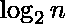

# 对数

> 原文:[https://www.geeksforgeeks.org/logarithm/](https://www.geeksforgeeks.org/logarithm/)

对数函数是指数函数的反函数。以 b 为底的对数是 b 的幂，要产生一个给定的数，必须将 b 升到这个幂。例如，等于为了产生 8 必须将 2 提升到的幂。显然，2^3 = 8 所以 = 3。一般来说，对于 b > 0 和 b 不等于 1。


**关于对数的事实:**

1.  对数很快被科学家采用，因为它有各种有用的特性，可以简化冗长乏味的计算。
2.  以 10 为底的对数(即 b = 10)称为**普通对数**，在科学和工程中有很多应用。
3.  **自然对数**，是一个以 e 为底数的对数，因其导数更简单而被用于数学和物理。
4.  **二进制对数**是以 2 为底的对数，常用于计算机科学。

**对数定律:**

<figure class="table">

| 法律 | 描述 |
| 

```
*** QuickLaTeX cannot compile formula:

*** Error message:
Error: Nothing to show, formula is empty

```

 |  +  |
| 

```
*** QuickLaTeX cannot compile formula:

*** Error message:
Error: Nothing to show, formula is empty

```

 | – |
| 

```
*** QuickLaTeX cannot compile formula:

*** Error message:
Error: Nothing to show, formula is empty

```

 |  |
| 

```
*** QuickLaTeX cannot compile formula:

*** Error message:
Error: Nothing to show, formula is empty

```

 |  |
| 

```
*** QuickLaTeX cannot compile formula:

*** Error message:
Error: Nothing to show, formula is empty

```

 |  |
| 

```
*** QuickLaTeX cannot compile formula:

*** Error message:
Error: Nothing to show, formula is empty

```

 |  |
| 

```
*** QuickLaTeX cannot compile formula:

*** Error message:
Error: Nothing to show, formula is empty

```

 |  |
|  ***** 

```
*** QuickLaTeX cannot compile formula:

*** Error message:
Error: Nothing to show, formula is empty

```

 |  |
| 

```
*** QuickLaTeX cannot compile formula:

*** Error message:
Error: Nothing to show, formula is empty

```

 |  |

</figure>

**如何求数的对数？**

**天真的解决方案:**
想法是创建一个计算并返回的函数。例如，如果 n = 64，那么你的函数应该返回 6，如果 n = 129，那么你的函数应该返回 7。

## C++

```
// C++ program to find log(n) using Recursion
#include <bits/stdc++.h>
using namespace std;

unsigned int Log2n(unsigned int n)
{
    return (n > 1) ? 1 + Log2n(n / 2) : 0;
}

int main()
{
    unsigned int n = 32;
    cout<< Log2n(n)<<"\n";
    return 0;
} 

// This code is contributed by UJJWAL BHARDWAJ
```

## C

```
// C program to find log(n) using Recursion
#include <stdio.h>

unsigned int Log2n(unsigned int n)
{
    return (n > 1) ? 1 + Log2n(n / 2) : 0;
}

int main()
{
    unsigned int n = 32;
    printf("%u", Log2n(n));
    getchar();
    return 0;
}
```

## Java 语言(一种计算机语言，尤用于创建网站)

```
// Java program to find log(n)
// using Recursion
class Gfg1 {

    static int Log2n(int n)
    {
        return (n > 1) ? 1 + Log2n(n / 2) : 0;
    }

    // Driver Code
    public static void main(String args[])
    {
        int n = 32;
        System.out.println(Log2n(n));
    }
}
```

## 蟒蛇 3

```
# Python 3 program to
# find log(n) using Recursion

def Log2n(n):

    return 1 + Log2n(n / 2) if (n > 1) else 0

# Driver code
n = 32
print(Log2n(n))
```

## C#

```
// C# program to find log(n)
// using Recursion
using System;

class GFG {

    static int Log2n(int n)
    {
        return (n > 1) ? 1 + Log2n(n / 2) : 0;
    }

    // Driver Code
    public static void Main()
    {
        int n = 32;

        Console.Write(Log2n(n));
    }
}
```

## 服务器端编程语言（Professional Hypertext Preprocessor 的缩写）

```
<?php
// PHP program
// to find log(n) using Recursion

function Log2n($n)
{
    return ($n > 1) ? 1 + Log2n($n / 2) : 0;
}

// Drive main

    $n = 32;
    echo Log2n($n);
?>
```

## java 描述语言

```
<script>

// Javascript program to find log(n)
// using Recursion
function Log2n(n)
{
    return (n > 1) ? 1 + Log2n(n / 2) : 0;
}

// Driver Code
var n = 32;
document.write(Log2n(n));

// This code is contributed by 29AjayKumar

</script>
```

**输出:**

```
5
```

**时间复杂度:**O(log n)
T3】辅助空间: O(log n)如果在递归过程中考虑了堆栈大小，否则为 O(1)

**高效解决方案:**

*   [使用内置日志功能](https://www.geeksforgeeks.org/program-to-compute-log-n/)

## 对数练习题:

**问题 1:** 求给定方程中 x 的值**8<sup>x+1</sup>–8<sup>x-1</sup>= 63**
**解:**从方程中取 8 <sup>x-1</sup> 公式化。
简化为
8<sup>x-1</sup>(8<sup>2</sup>–1)= 63
8<sup>x-1</sup>= 1
因此，x–1 = 0
**x = 1**
**问题 2:** 求方程的 x 值。给定**log<sub>0.25</sub>x = 16**
**解:** log <sub>0.25</sub> x = 16
可以写成
x =(0.25)<sup>16</sup>
x =(1/4) <sup>16</sup>T45】x = 4<sup>-16</sup>
T49】问题 3: 解方程**log<sub>12</sub>1728 x log<sub>9</sub>6561**
T58】解:可以写成
log <sub>12</sub> (12 <sup>3
= 3 log<sub>12</sub>12 x 4 log<sub>9</sub>9
= 3 x 4 =**12**
T78】问题 4: 求解为 x
T81】log<sub>x</sub>3+log<sub>x</sub>9+log<sub>x</sub>27+log【T88 = 10
原木<sub>x</sub>(3<sup>1</sup>x 3<sup>2</sup>x 3<sup>3</sup>x 3<sup>4</sup>)= 10
原木<sub>x</sub>(3<sup>10</sup>)= 10
10 原木<sub>x</sub>3 = 10</sup>
**解决方案:**原木<sub>10</sub>((a+3)(a–3))= 1
原木<sub>10</sub>(a<sup>2</sup>–9)= 1
(a<sup>2</sup>–9)= 10
a<sup>2</sup>= 19
a = =
**解:**
= log<sub>ABCD</sub>(ab)+log<sub>ABCD</sub>(BC)+log<sub>ABCD</sub>(CD)+log<sub>ABCD</sub>(da)
= log<sub>ABCD</sub>(ab * BC * CD * da)
= log
然后求解**log(x<sup>n</sup>y<sup>n</sup>/z<sup>n</sup>)+log(y<sup>n</sup>z<sup>n</sup>/x<sup>n</sup>)+log(z<sup>n</sup>x<sup>n</sup>/y<sup>n <sup>z<sup>n</sup>x<sup>n</sup>/y<sup>n</sup>)
= log x<sup>n</sup>y<sup>n</sup>z<sup>n</sup>T228】= log(XYZ)<sup>n</sup>T231】= log<sub>10</sub>10【T234 <sup>x</sup>= log<sub>(121/10)</sub>3
x =(log 3)/(log 121–log 10)
x =(log 3)/(2 log 11–1)
**问题 9:** 求解**log(2x<sup>2</sup>+17)= log(x–3) <sup>2x<sup>2</sup>+17 = x<sup>2</sup>–6x+9
x<sup>2</sup>+6x+8 = 0
x<sup>2</sup>+4x+2x+8 = 0
x(x+4)+2(x+4)= 0
(x+4)(x+2)= 0【T286 解为 x.
**解:**放 x = 0
原木<sub>2</sub>(33–1)= 10<sup>原木(5)</sup>T306】原木 <sub>2</sub> 32 = 5
5 原木<sub>2</sub>2 = 5
5 = 5
LHS = RHS【T314</sup>**</sup></sup>**

*   [找到计算对数所需的最小对数数值](https://www.geeksforgeeks.org/find-minimum-number-of-log-value-needed-to-calculate-log-upto-n/)
*   [在给出 x 和 y 的 x^(y^2)或 y^(x^2)中找到最大值](https://www.geeksforgeeks.org/find-maximum-among-xy2-or-yx2-where-x-and-y-are-given/)
*   [不做任何转换打印一个数字的所有子串](https://www.geeksforgeeks.org/print-all-substring-of-a-number-without-any-conversion/)
*   [比较 m^n 和 n^m 的程序](https://www.geeksforgeeks.org/program-to-compare-mn-and-nm/)
*   [找到 x^y 和 y^x 中较大的一个](https://www.geeksforgeeks.org/find-larger-xy-yx/)

[**对数近期文章！**](https://www.geeksforgeeks.org/tag/maths-log/v)