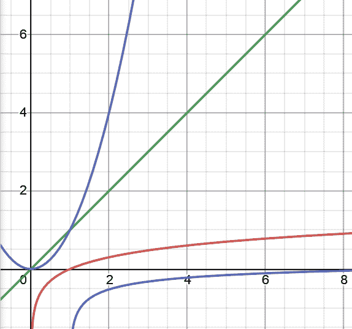
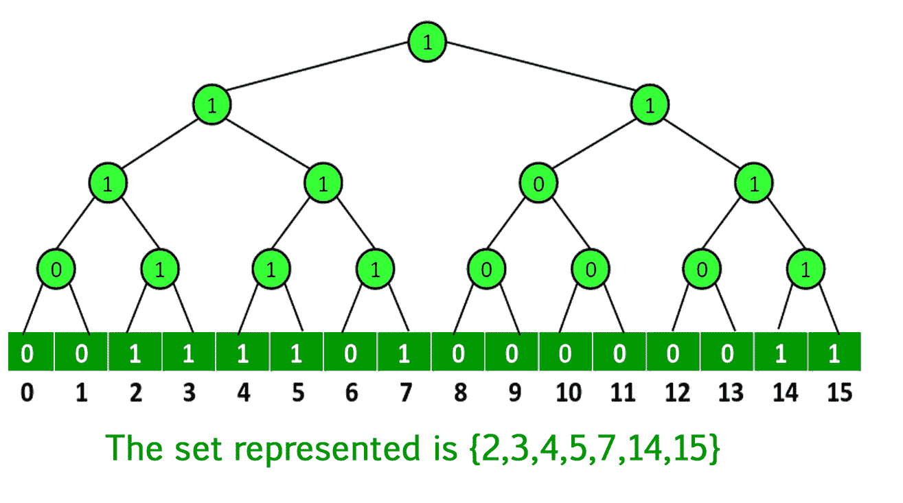

# 对数与双对数时间复杂度

> 原文:[https://www . geesforgeks . org/对数-vs-双对数-时间复杂度/](https://www.geeksforgeeks.org/logarithmic-vs-double-logarithmic-time-complexity/)

[时间复杂度](https://www.geeksforgeeks.org/understanding-time-complexity-simple-examples/)是描述运行算法所需时间的计算复杂度。"

现在，我们知道有多种方法可以解决任何特定的问题。但是，知道如何以最有效的方式解决问题在实际应用中很重要。要找到任何算法或问题的效率，最重要的是知道它的时间和空间复杂性是什么。要了解更多信息，请点击此处

红色-0(对数 n)，蓝色-0(对数 n)，绿色-0(n)，紫色-0(n2)

**对数时间复杂度:**

**1。什么是对数时间复杂度或 O(对数 N)？**
现在，如果你已经在竞争性编程或一般编程中有点脏了，那么你可能会遇到这个术语，O(log n)，也许是在学习二分搜索法的时候。没有的话继续读。

为了理解 O(log n)，让我们举最经典的例子，字典问题，并在其中找到“程序”这个词。如果你打开字典，开始在从 1 到 n 的每一页上寻找它…这将是一个 O(N)时间复杂性的例子，我们知道这不是一个有效的方法…

所以，我们把书大致翻到中间一页，看看我们从字母 P 开始的单词是落在当前所选页面的单词之前还是之后。如果“程序”应该在它之后，我们现在试图找到最后一页和我们当前页面之间的中心页面，以此类推……直到我们到达包含我们想要的单词的单个页面，即程序。

所以基本上我们继续在每一步把问题分成两半，直到找到结果。这就是我们所说的 O(对数 N)。在这里，时间将线性上升，N 将指数上升。例如，如果计算 100 个元素需要 5 秒钟，那么计算 1000 个元素需要 6 秒钟，以此类推…

**2。什么是双对数时间复杂度或 O(log (log N))？**
我们看到 **O(log(log N))** 在实现范埃姆德博阿斯树(VEBT)时的时间复杂度，代替了更常规的二分搜索法树(BST)。

埃姆德蟒蛇树

但是例如，如果我们取 N <10 6 ，那么在最好的情况下，双对数算法超过对数算法大约 5 倍。而且，总的来说，它的实现更加困难。

现在，在现实世界中，5 的因子是非常重要的，因此，这个数字的因子的加速是*巨大的*！但通常情况下，大多数真实用例中的数据量都大于 10 9 甚至 10 15 。因此，假设您的数据小于 10 6 ，您可以使用任何 **O(log (log N))** 算法而不是任何 **O(log(N))** 算法来获得一些很好的结果。

然而，由于 VEB 树的实现中涉及到更高的常数，加速可能会受到阻碍，您可能必须分析不同的运行时常数才能获得正确的想法。

无论如何，我们不能说一个特定的复杂性比另一个更好，因为有许多角色扮演的因素。根据要解决的问题的要求，可以选择最合适的一个。