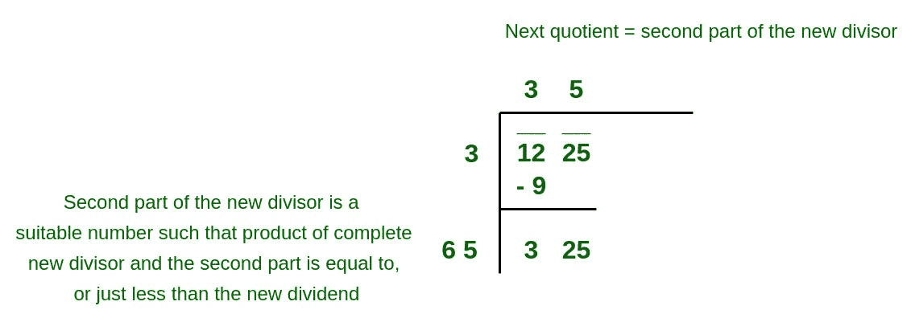
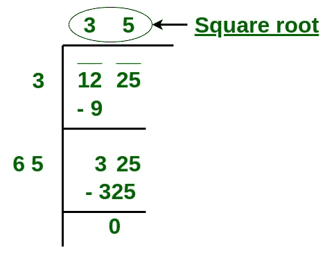

# 求平方根的长除法举例

> 原文:[https://www . geesforgeks . org/long-division-method-to-find-平方根-with-examples/](https://www.geeksforgeeks.org/long-division-method-to-find-square-root-with-examples/)

给定一个整数 **X** ，它是一个完美的正方形，任务是用**长除法**求它的平方根。

**示例:**

> **输入:**N = 484
> T3】输出: 22
> 22 <sup>2</sup> = 484
> 
> **输入:**N = 144
> T3】输出: 12
> 12 <sup>2</sup> = 144

**逼近:**
长除法是[求一个数的平方根](https://www.geeksforgeeks.org/square-root-of-an-integer/)非常常用的方法。以下是该方法的逐步解决方案:

**1。将数字的数字分成成对的**段，从单位处的数字开始。让我们将每一对和剩余的最后一个数字(以防数字中有奇数个数字)识别为一个段。
**例如:**

```
1225 is divided as (12 25)
```


2.将数字分成段后，从最左边的段开始。平方等于或略小于第一段的最大数作为**除数**，也作为商(这样乘积就是平方)。
**例如:**

```
9 is the closest perfect square to 12, the first segment 12
```


3.从第一段中减去除数的平方，然后将下一段移到余数的右边，得到新的被除数。
**例如:**

```
12 - 9 = 3 is concatenated with next segment 25.
New dividend = 325 
```


4.现在，新的除数是这样得到的:取前一个商的两倍(在上面的例子中是 3 作为 3 <sup>2</sup> = 9)，并将其与一个合适的数字连接起来，该数字也作为商的下一个数字，选择的方式是新的除数和这个数字的乘积等于或略小于新的被除数。
**例如:**

```
Two times quotient 3 is 6.
```


```
65 times 5 is 325 which is closest to the new dividend. 
```



5.重复步骤(2)、(3)和(4)，直到所有片段都被占用。这样得到的商就是给定数的平方根。



下面是上述方法的实现:

## 卡片打印处理机（Card Print Processor 的缩写）

```
// C++ program to find the square root of a
// number by using long division method

#include <bits/stdc++.h>
using namespace std;
#define INFINITY_ 9999999

// Function to find the square root of
// a number by using long division method
int sqrtByLongDivision(int n)
{
    int i = 0, udigit, j; // Loop counters
    int cur_divisor = 0;
    int quotient_units_digit = 0;
    int cur_quotient = 0;
    int cur_dividend = 0;
    int cur_remainder = 0;
    int a[10] = { 0 };

    // Dividing the number into segments
    while (n > 0) {
        a[i] = n % 100;
        n = n / 100;
        i++;
    }

    // Last index of the array of segments
    i--;

    // Start long division from the last segment(j=i)
    for (j = i; j >= 0; j--) {

        // Initialising the remainder to the maximum value
        cur_remainder = INFINITY_;
        // Including the next segment in new dividend
        cur_dividend = cur_dividend * 100 + a[j];

        // Loop to check for the perfect square
        // closest to each segment
        for (udigit = 0; udigit <= 9; udigit++) {

            // This condition is to find the
            // divisor after adding a digit
            // in the range 0 to 9
            if (cur_remainder >= cur_dividend
                                     - ((cur_divisor * 10 + udigit)
                                        * udigit)
                && cur_dividend
                           - ((cur_divisor * 10 + udigit) * udigit)
                       >= 0) {

                // Calculating the remainder
                cur_remainder = cur_dividend - ((cur_divisor * 10
                                                 + udigit)
                                                * udigit);

                // Updating the units digit of the quotient
                quotient_units_digit = udigit;
            }
        }

        // Adding units digit to the quotient
        cur_quotient = cur_quotient * 10
                       + quotient_units_digit;

        // New divisor is two times quotient
        cur_divisor = cur_quotient * 2;

        // Including the remainder in new dividend
        cur_dividend = cur_remainder;
    }

    return cur_quotient;
}

// Driver code
int main()
{
    int x = 1225;
    cout << sqrtByLongDivision(x) << endl;
    return 0;
}
```

## Java 语言(一种计算机语言，尤用于创建网站)

```
// Java program to find the square root of a
// number by using long division method
import java.util.*;

class GFG{
static final int INFINITY_ =9999999;

// Function to find the square root of
// a number by using long division method
static int sqrtByLongDivision(int n)
{
    int i = 0, udigit, j; // Loop counters
    int cur_divisor = 0;
    int quotient_units_digit = 0;
    int cur_quotient = 0;
    int cur_dividend = 0;
    int cur_remainder = 0;
    int a[] = new int[10];

    // Dividing the number into segments
    while (n > 0) {
        a[i] = n % 100;
        n = n / 100;
        i++;
    }

    // Last index of the array of segments
    i--;

    // Start long division from the last segment(j=i)
    for (j = i; j >= 0; j--) {

        // Initialising the remainder to the maximum value
        cur_remainder = INFINITY_;
        // Including the next segment in new dividend
        cur_dividend = cur_dividend * 100 + a[j];

        // Loop to check for the perfect square
        // closest to each segment
        for (udigit = 0; udigit <= 9; udigit++) {

            // This condition is to find the
            // divisor after adding a digit
            // in the range 0 to 9
            if (cur_remainder >= cur_dividend
                                     - ((cur_divisor * 10 + udigit)
                                        * udigit)
                && cur_dividend
                           - ((cur_divisor * 10 + udigit) * udigit)
                       >= 0) {

                // Calculating the remainder
                cur_remainder = cur_dividend - ((cur_divisor * 10
                                                 + udigit)
                                                * udigit);

                // Updating the units digit of the quotient
                quotient_units_digit = udigit;
            }
        }

        // Adding units digit to the quotient
        cur_quotient = cur_quotient * 10
                       + quotient_units_digit;

        // New divisor is two times quotient
        cur_divisor = cur_quotient * 2;

        // Including the remainder in new dividend
        cur_dividend = cur_remainder;
    }

    return cur_quotient;
}

// Driver code
public static void main(String[] args)
{
    int x = 1225;
    System.out.print(sqrtByLongDivision(x) +"\n");
}
}

// This code is contributed by Rajput-Ji
```

## 蟒蛇 3

```
# Python3 program to find the square root of a
# number by using long division method
INFINITY_ = 9999999

# Function to find the square root of
# a number by using long division method
def sqrtByLongDivision(n):
    i = 0
    udigit, j = 0, 0 # Loop counters
    cur_divisor = 0
    quotient_units_digit = 0
    cur_quotient = 0
    cur_dividend = 0
    cur_remainder = 0
    a = [0]*10

    # Dividing the number into segments
    while (n > 0):
        a[i] = n % 100
        n = n // 100
        i += 1

    # Last index of the array of segments
    i -= 1

    # Start long division from the last segment(j=i)
    for j in range(i, -1, -1):

        # Initialising the remainder to the maximum value
        cur_remainder = INFINITY_

        # Including the next segment in new dividend
        cur_dividend = cur_dividend * 100 + a[j]

        # Loop to check for the perfect square
        # closest to each segment
        for udigit in range(10):

            # This condition is to find the
            # divisor after adding a digit
            # in the range 0 to 9
            if (cur_remainder >= cur_dividend
                                - ((cur_divisor * 10 + udigit)
                                * udigit)
                                and cur_dividend
                                - ((cur_divisor * 10 + udigit) * udigit)
                                >= 0):

                # Calculating the remainder
                cur_remainder = cur_dividend - ((cur_divisor * 10
                                                + udigit)
                                                * udigit)

                # Updating the units digit of the quotient
                quotient_units_digit = udigit

        # Adding units digit to the quotient
        cur_quotient = cur_quotient * 10 + quotient_units_digit

        # New divisor is two times quotient
        cur_divisor = cur_quotient * 2

        # Including the remainder in new dividend
        cur_dividend = cur_remainder

    return cur_quotient

# Driver code

x = 1225
print(sqrtByLongDivision(x))

# This code is contributed by mohit kumar 29   
```

## C#

```
// C# program to find the square root of a
// number by using long division method
using System;

class GFG
{
static readonly int INFINITY_ =9999999;

// Function to find the square root of
// a number by using long division method
static int sqrtBylongDivision(int n)
{
    int i = 0, udigit, j; // Loop counters
    int cur_divisor = 0;
    int quotient_units_digit = 0;
    int cur_quotient = 0;
    int cur_dividend = 0;
    int cur_remainder = 0;
    int []a = new int[10];

    // Dividing the number into segments
    while (n > 0) {
        a[i] = n % 100;
        n = n / 100;
        i++;
    }

    // Last index of the array of segments
    i--;

    // Start long division from the last segment(j=i)
    for (j = i; j >= 0; j--) {

        // Initialising the remainder to the maximum value
        cur_remainder = INFINITY_;

        // Including the next segment in new dividend
        cur_dividend = cur_dividend * 100 + a[j];

        // Loop to check for the perfect square
        // closest to each segment
        for (udigit = 0; udigit <= 9; udigit++) {

            // This condition is to find the
            // divisor after adding a digit
            // in the range 0 to 9
            if (cur_remainder >= cur_dividend
                                    - ((cur_divisor * 10 + udigit)
                                        * udigit)
                && cur_dividend
                        - ((cur_divisor * 10 + udigit) * udigit)
                    >= 0) {

                // Calculating the remainder
                cur_remainder = cur_dividend - ((cur_divisor * 10
                                                + udigit)
                                                * udigit);

                // Updating the units digit of the quotient
                quotient_units_digit = udigit;
            }
        }

        // Adding units digit to the quotient
        cur_quotient = cur_quotient * 10
                    + quotient_units_digit;

        // New divisor is two times quotient
        cur_divisor = cur_quotient * 2;

        // Including the remainder in new dividend
        cur_dividend = cur_remainder;
    }

    return cur_quotient;
}

// Driver code
public static void Main(String[] args)
{
    int x = 1225;
    Console.Write(sqrtBylongDivision(x) +"\n");
}
}

// This code is contributed by Rajput-Ji
```

## java 描述语言

```
<script>
// Javascript program to find the square root of a
// number by using long division method

let INFINITY_ =9999999;

// Function to find the square root of
// a number by using long division method
function sqrtByLongDivision(n)
{
    let i = 0, udigit, j; // Loop counters
    let cur_divisor = 0;
    let quotient_units_digit = 0;
    let cur_quotient = 0;
    let cur_dividend = 0;
    let cur_remainder = 0;
    let a = new Array(10);

    // Dividing the number into segments
    while (n > 0) {
        a[i] = n % 100;
        n = Math.floor(n / 100);
        i++;
    }

    // Last index of the array of segments
    i--;

    // Start long division from the last segment(j=i)
    for (j = i; j >= 0; j--) {

        // Initialising the remainder to the maximum value
        cur_remainder = INFINITY_;
        // Including the next segment in new dividend
        cur_dividend = cur_dividend * 100 + a[j];

        // Loop to check for the perfect square
        // closest to each segment
        for (udigit = 0; udigit <= 9; udigit++) {

            // This condition is to find the
            // divisor after adding a digit
            // in the range 0 to 9
            if (cur_remainder >= cur_dividend
                                     - ((cur_divisor * 10 + udigit)
                                        * udigit)
                && cur_dividend
                           - ((cur_divisor * 10 + udigit) * udigit)
                       >= 0) {

                // Calculating the remainder
                cur_remainder = cur_dividend - ((cur_divisor * 10
                                                 + udigit)
                                                * udigit);

                // Updating the units digit of the quotient
                quotient_units_digit = udigit;
            }
        }

        // Adding units digit to the quotient
        cur_quotient = cur_quotient * 10
                       + quotient_units_digit;

        // New divisor is two times quotient
        cur_divisor = cur_quotient * 2;

        // Including the remainder in new dividend
        cur_dividend = cur_remainder;
    }

    return cur_quotient;
}

// Driver code
let x = 1225;
document.write(sqrtByLongDivision(x) +"<br>");

// This code is contributed by unknown2108
</script>
```

**Output:** 

```
35
```

时间复杂度:O((log<sub>100</sub>n)<sup>2</sup>* 10)

辅助空间:0(1)