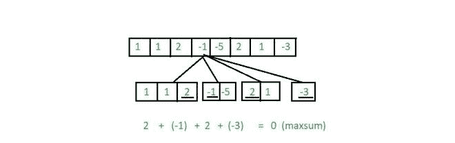

# 最大和最长交替子序列|集合 2

> 原文:[https://www . geesforgeks . org/最大和集最长交替子序列-2/](https://www.geeksforgeeks.org/longest-alternating-subsequence-with-maximum-sum-set-2/)

给定大小为 **N** 的数组 **arr[]** ，由正整数和负整数组成，任务是从给定的数组中找到最大和的最长交替子序列(即每个元素的符号与其前一个元素的符号相反)。
**例:**

> **输入:** arr[] = {-2，10，3，-8，-4，-1，5，-2，-3，1}
> **输出:** 11
> **解释:**
> 由于子序列需要尽可能长以及交替，因此可以从以下子阵列中的每一个中选择一个元素:
> {-2}、{10，3}、{-8，-4，-1}、{5}、{-2，-3}、{1}
> 因此，子序列是{-2，10，-1，5，-2，1}
> 因此，子序列的和是 11。
> **输入:** arr[] = {12，4，-5，7，-9}
> **输出:** 5
> **解释:**
> 和最大的最长子序列是{12，-5，7，-9}。
> 因此，最大和为 5。

**使用额外空间的线性方法:**
对于使用额外空间的线性方法，请参考[元素和最大的最长交替子序列](https://www.geeksforgeeks.org/longest-alternating-subsequence-which-has-maximum-sum-of-elements/)。
***时间复杂度:** O(N)*
***辅助空间:** O(N)*
**节省空间的方法:**
要解决问题，我们可以观察以下几点:

*   为了最大化交替子序列的长度，我们需要考虑
    的每个连续数字序列中的一个元素

> **图解:**
> 让我们考虑一个数组 arr[] = {1，1，2，-1，-5，2，1，-3}
> 相同符号的元素的连续序列是:
> {1，1，2}、{-1，-5}、{2，1}、{-3}
> 因此，通过从这些序列的每一个中选择一个元素，可以获得最长可能长度的交替子序列。

*   为了最大化子序列的和，我们需要从相同符号的元素的每个连续子序列中选择最大值。

> **图解:**
> 对于数组 arr[] = {1，1，2，-1，-5，2，1，-3}，观察到符号元素的连续序列为:
> {1，1，2}、{-1，-5}、{2，1}、{-3}
> 因此，具有最大和的子序列为{2，-1，2，-3}，通过从每个序列中选择最大元素而形成。
> 
> [](https://media.geeksforgeeks.org/wp-content/uploads/20200709232615/gfg-660x208.jpg)

按照以下步骤高效解决问题:

*   使用[两个指针](https://www.geeksforgeeks.org/two-pointers-technique/)迭代数组。
*   设置 **i = 0** ，设置 **j = i** 。
*   遍历数组，直到 **j** 指向一个由与 arr【I】符号相反的*符号元素组成的索引。每次遍历时，更新**【I，j】**之间遇到的最大元素。*
*   一旦找到符号相反的元素，将序列**【I，j】**中的最大值加到 **maxsum** 中。
*   设置 **i = j** ，重复以上两个步骤，直到遍历整个数组。
*   打印 **maxsum** 的最终值作为答案。

以下是上述方法的实现:

## C++

```
// C++ Program to implement
// the above approach

#include <bits/stdc++.h>
using namespace std;

// Function to check the
// sign of the element
int sign(int x)
{
    if (x > 0)
        return 1;
    else
        return -1;
}

// Function to calculate and
// return the maximum sum of
// longest alternating subsequence
int findMaxSum(int arr[], int size)
{
    int max_sum = 0, pres, i, j;

    // Iterate through the array
    for (i = 0; i < size; i++) {

        // Stores the first element of
        // a sequence of same sign
        pres = arr[i];
        j = i;

        // Traverse until an element with
        // opposite sign is encountered
        while (j < size
               && sign(arr[i])
                      == sign(arr[j])) {

            // Update the maximum
            pres = max(pres, arr[j]);
            j++;
        }

        // Update the maximum sum
        max_sum = max_sum + pres;

        // Update i
        i = j - 1;
    }

    // Return the maximum sum
    return max_sum;
}

// Driver Code
int main()
{
    int arr[] = { -2, 8, 3, 8, -4,
                  -15, 5, -2, -3, 1 };

    int size = sizeof(arr)
/ sizeof(arr[0]);

    cout << findMaxSum(arr, size);

    return 0;
}
```

## Java 语言(一种计算机语言，尤用于创建网站)

```
// Java Program to implement
// the above approach
import java.util.*;
class GFG{

    // Function to check the
    // sign of the element
    static int sign(int x)
    {
        if (x > 0)
            return 1;
        else
            return -1;
    }

    // Function to calculate and
    // return the maximum sum of
    // longest alternating subsequence
    static int findMaxSum(int arr[], int size)
    {
        int max_sum = 0, pres, i, j;

        // Iterate through the array
        for (i = 0; i < size; i++)
        {

            // Stores the first element of
            // a sequence of same sign
            pres = arr[i];
            j = i;

            // Traverse until an element with
            // opposite sign is encountered
            while (j < size &&
                   sign(arr[i]) == sign(arr[j]))
            {

                // Update the maximum
                pres = Math.max(pres, arr[j]);
                j++;
            }

            // Update the maximum sum
            max_sum = max_sum + pres;

            // Update i
            i = j - 1;
        }

        // Return the maximum sum
        return max_sum;
    }

    // Driver Code
    public static void main(String[] args)
    {
        int arr[] = { -2, 8, 3, 8, -4, -15, 5, -2, -3, 1 };

        int size = arr.length;

        System.out.println(findMaxSum(arr, size));
    }
}

// This code is contributed by sapnasingh4991
```

## 计算机编程语言

```
# Python3 program to implement
# the above approach

# Function to check the
# sign of the element
def sign(x):

    if (x > 0):
        return 1
    else:
        return -1

# Function to calculate and
# return the maximum sum of
# longest alternating subsequence
def findMaxSum(arr, size):

    max_sum = 0

    # Iterate through the array
    i = 0
    while i < size:

        # Stores the first element of
        # a sequence of same sign
        pres = arr[i]
        j = i

        # Traverse until an element with
        # opposite sign is encountered
        while (j < size and
              (sign(arr[i]) == sign(arr[j]))):

            # Update the maximum
            pres = max(pres, arr[j])
            j += 1

        # Update the maximum sum
        max_sum = max_sum + pres

        # Update i
        i = j - 1
        i += 1

    # Return the maximum sum
    return max_sum

# Driver Code
if __name__ == "__main__":

    arr = [ -2, 8, 3, 8, -4,
            -15, 5, -2, -3, 1 ]

    size = len(arr)

    print(findMaxSum(arr, size))

# This code is contributed by chitranayal
```

## C#

```
// C# Program to implement
// the above approach
using System;
class GFG{

    // Function to check the
    // sign of the element
    static int sign(int x)
    {
        if (x > 0)
            return 1;
        else
            return -1;
    }

    // Function to calculate and
    // return the maximum sum of
    // longest alternating subsequence
    static int findMaxSum(int []arr, int size)
    {
        int max_sum = 0, pres, i, j;

        // Iterate through the array
        for (i = 0; i < size; i++)
        {

            // Stores the first element of
            // a sequence of same sign
            pres = arr[i];
            j = i;

            // Traverse until an element with
            // opposite sign is encountered
            while (j < size &&
                   sign(arr[i]) == sign(arr[j]))
            {

                // Update the maximum
                pres = Math.Max(pres, arr[j]);
                j++;
            }

            // Update the maximum sum
            max_sum = max_sum + pres;

            // Update i
            i = j - 1;
        }

        // Return the maximum sum
        return max_sum;
    }

    // Driver Code
    public static void Main(String[] args)
    {
        int []arr = { -2, 8, 3, 8, -4,
                     -15, 5, -2, -3, 1 };

        int size = arr.Length;

        Console.WriteLine(findMaxSum(arr, size));
    }
}

// This code is contributed by gauravrajput1
```

## java 描述语言

```
<script>
// javascript program to implement
// the above approach

    // Function to check the
    // sign of the element
    function sign(x)
    {
        if (x > 0)
            return 1;
        else
            return -1;
    }

    // Function to calculate and
    // return the maximum sum of
    // longest alternating subsequence
   function findMaxSum(arr, size)
    {
        let max_sum = 0, pres, i, j;

        // Iterate through the array
        for (i = 0; i < size; i++)
        {

            // Stores the first element of
            // a sequence of same sign
            pres = arr[i];
            j = i;

            // Traverse until an element with
            // opposite sign is encountered
            while (j < size &&
                   sign(arr[i]) == sign(arr[j]))
            {

                // Update the maximum
                pres = Math.max(pres, arr[j]);
                j++;
            }

            // Update the maximum sum
            max_sum = max_sum + pres;

            // Update i
            i = j - 1;
        }

        // Return the maximum sum
        return max_sum;
    }

    // Driver Code

        let arr = [ -2, 8, 3, 8, -4, -15, 5, -2, -3, 1 ];
        let size = arr.length;
        document.write(findMaxSum(arr, size));

 // This code is contributed by avijitmondal1998.
</script>
```

**Output:**

```
6
```

***时间复杂度:**O(N)*
T5**辅助空间:** O(1)