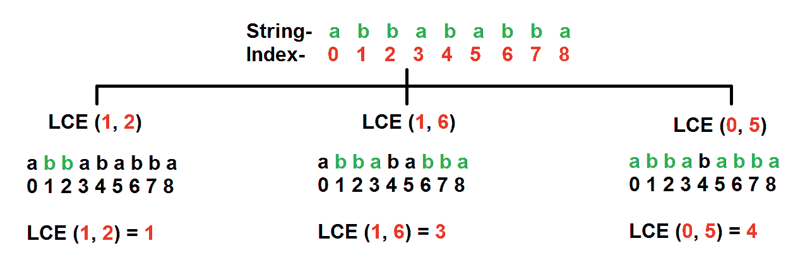
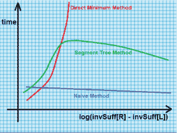

# 最长公共扩展/ LCE |集合 3(段树法)

> 原文:[https://www . geesforgeks . org/long-common-extension-lce-set-3-segment-tree-method/](https://www.geeksforgeeks.org/longest-common-extension-lce-set-3-segment-tree-method/)

先决条件: [LCE(第 1 集)](https://www.geeksforgeeks.org/longest-common-extension-lce-set-1-introduction-and-naive-method/)、 [LCE(第 2 集)](https://www.geeksforgeeks.org/longest-common-extension-lce-set-2-reduction-rmq/)、[后缀数组(n Log Log n)](https://www.geeksforgeeks.org/suffix-array-set-2-a-nlognlogn-algorithm/) 、 [Kasai 的算法](https://www.geeksforgeeks.org/%C2%AD%C2%ADkasais-algorithm-for-construction-of-lcp-array-from-suffix-array/)和[段树](https://www.geeksforgeeks.org/segment-tree-set-1-range-minimum-query/)

最长公共扩展(LCE)问题考虑一个字符串 **s** ，并为每对(L，R)计算从 L 和 R 开始的 **s** 的最长子字符串。在 LCE，在每个查询中，我们必须回答从索引 L 和 R 开始的最长公共前缀的长度

**示例:**
**字符串**:【阿巴巴巴】
**查询:** LCE(1，2)，LCE(1，6)和 LCE(0，5)

从给定的索引 **(1，2)、(1，6)和(0，5)** 开始，找出最长公共前缀的长度。

突出显示的字符串“绿色”是从相应查询的索引- L 和 R 开始的最长公共前缀。我们必须找到从索引- **(1，2)、(1，6)和(0，5)** 开始的最长公共前缀的长度。



在这一集里，我们将讨论解决 LCE 问题的分段树方法。

在[集 2](https://www.geeksforgeeks.org/longest-common-extension-lce-set-2-reduction-rmq/) 中，我们看到一个 LCE 问题可以转化为一个 RMQ 问题。

为了高效地处理 RMQ，我们在 lcp 阵列上构建一个段树，然后高效地回答 LCE 的查询。

为了找到低和高，我们必须首先计算后缀数组，然后从后缀数组中计算逆后缀数组。

我们还需要 lcp 数组，因此我们使用 [Kasai 的算法从后缀数组](https://www.geeksforgeeks.org/%C2%AD%C2%ADkasais-algorithm-for-construction-of-lcp-array-from-suffix-array/)中找到 lcp 数组。

一旦完成以上工作，我们只需为每个查询从索引低到索引高(如上所述)找到 lcp 数组中的最小值。

在不证明的情况下，我们将使用直接结果(在数学证明后推导出来)-

LCE (L，r)= rmq<sub>LCP</sub>(inv uff[r]，inv uff[l]-1)

下标 lcp 意味着我们必须在 lcp 数组上执行 RMQ，因此我们将在 lcp 数组上构建一个段树。

```
// A C++ Program to find the length of longest common
// extension using Segment Tree
#include<bits/stdc++.h>
using namespace std;

// Structure to represent a query of form (L,R)
struct Query
{
    int L, R;
};

// Structure to store information of a suffix
struct suffix
{
    int index;  // To store original index
    int rank[2]; // To store ranks and next rank pair
};

// A utility function to get minimum of two numbers
int minVal(int x, int y)
{
    return (x < y)? x: y;
}

// A utility function to get the middle index from
// corner indexes.
int getMid(int s, int e)
{
    return s + (e -s)/2;
}

/*  A recursive function to get the minimum value
    in a given range of array indexes. The following
    are parameters for this function.

    st    --> Pointer to segment tree
    index --> Index of current node in the segment
              tree. Initially 0 is passed as root
              is always at index 0
    ss & se  --> Starting and ending indexes of the
                  segment represented by current
                  node, i.e., st[index]
    qs & qe  --> Starting and ending indexes of query
                 range */
int RMQUtil(int *st, int ss, int se, int qs, int qe,
                                           int index)
{
    // If segment of this node is a part of given range,
    // then return the min of the segment
    if (qs <= ss && qe >= se)
        return st[index];

    // If segment of this node is outside the given range
    if (se < qs || ss > qe)
        return INT_MAX;

    // If a part of this segment overlaps with the given
    // range
    int mid = getMid(ss, se);
    return minVal(RMQUtil(st, ss, mid, qs, qe, 2*index+1),
                  RMQUtil(st, mid+1, se, qs, qe, 2*index+2));
}

// Return minimum of elements in range from index qs
// (query start) to qe (query end).  It mainly uses RMQUtil()
int RMQ(int *st, int n, int qs, int qe)
{
    // Check for erroneous input values
    if (qs < 0 || qe > n-1 || qs > qe)
    {
        printf("Invalid Input");
        return -1;
    }

    return RMQUtil(st, 0, n-1, qs, qe, 0);
}

// A recursive function that constructs Segment Tree
// for array[ss..se]. si is index of current node in
// segment tree st
int constructSTUtil(int arr[], int ss, int se, int *st,
                                               int si)
{
    // If there is one element in array, store it in
    // current node of segment tree and return
    if (ss == se)
    {
        st[si] = arr[ss];
        return arr[ss];
    }

    // If there are more than one elements, then recur
    // for left and right subtrees and store the minimum
    // of two values in this node
    int mid = getMid(ss, se);
    st[si] =  minVal(constructSTUtil(arr, ss, mid, st, si*2+1),
                  constructSTUtil(arr, mid+1, se, st, si*2+2));
    return st[si];
}

/* Function to construct segment tree from given array.
   This function allocates memory for segment tree and
   calls constructSTUtil() to fill the allocated memory */
int *constructST(int arr[], int n)
{
    // Allocate memory for segment tree

    //Height of segment tree
    int x = (int)(ceil(log2(n)));

    // Maximum size of segment tree
    int max_size = 2*(int)pow(2, x) - 1;

    int *st = new int[max_size];

    // Fill the allocated memory st
    constructSTUtil(arr, 0, n-1, st, 0);

    // Return the constructed segment tree
    return st;
}

// A comparison function used by sort() to compare
// two suffixes Compares two pairs, returns 1 if
// first pair is smaller
int cmp(struct suffix a, struct suffix b)
{
    return (a.rank[0] == b.rank[0])?
           (a.rank[1] < b.rank[1] ?1: 0):
           (a.rank[0] < b.rank[0] ?1: 0);
}

// This is the main function that takes a string
// 'txt' of size n as an argument, builds and return
// the suffix array for the given string
vector<int> buildSuffixArray(string txt, int n)
{
    // A structure to store suffixes and their indexes
    struct suffix suffixes[n];

    // Store suffixes and their indexes in an array
    // of structures. The structure is needed to sort
    // the suffixes alphabetically and maintain their
    // old indexes while sorting
    for (int i = 0; i < n; i++)
    {
        suffixes[i].index = i;
        suffixes[i].rank[0] = txt[i] - 'a';
        suffixes[i].rank[1] = ((i+1) < n)?
                            (txt[i + 1] - 'a'): -1;
    }

    // Sort the suffixes using the comparison function
    // defined above.
    sort(suffixes, suffixes+n, cmp);

    // At his point, all suffixes are sorted according to first
    // 2 characters.  Let us sort suffixes according to first 4
    // characters, then first 8 and so on
    int ind[n];  // This array is needed to get the index
                 // in suffixes[]
    // from original index.  This mapping is needed to get
    // next suffix.
    for (int k = 4; k < 2*n; k = k*2)
    {
        // Assigning rank and index values to first suffix
        int rank = 0;
        int prev_rank = suffixes[0].rank[0];
        suffixes[0].rank[0] = rank;
        ind[suffixes[0].index] = 0;

        // Assigning rank to suffixes
        for (int i = 1; i < n; i++)
        {
            // If first rank and next ranks are same as
            // that of previous suffix in array, assign
            // the same new rank to this suffix
            if (suffixes[i].rank[0] == prev_rank &&
              suffixes[i].rank[1] == suffixes[i-1].rank[1])
            {
                prev_rank = suffixes[i].rank[0];
                suffixes[i].rank[0] = rank;
            }
            else // Otherwise increment rank and assign
            {
                prev_rank = suffixes[i].rank[0];
                suffixes[i].rank[0] = ++rank;
            }
            ind[suffixes[i].index] = i;
        }

        // Assign next rank to every suffix
        for (int i = 0; i < n; i++)
        {
            int nextindex = suffixes[i].index + k/2;
            suffixes[i].rank[1] = (nextindex < n)?
                  suffixes[ind[nextindex]].rank[0]: -1;
        }

        // Sort the suffixes according to first k characters
        sort(suffixes, suffixes+n, cmp);
    }

    // Store indexes of all sorted suffixes in the suffix array
    vector<int>suffixArr;
    for (int i = 0; i < n; i++)
        suffixArr.push_back(suffixes[i].index);

    // Return the suffix array
    return  suffixArr;
}

/* To construct and return LCP */
vector<int> kasai(string txt, vector<int> suffixArr,
                              vector<int> &invSuff)
{
    int n = suffixArr.size();

    // To store LCP array
    vector<int> lcp(n, 0);

    // Fill values in invSuff[]
    for (int i=0; i < n; i++)
        invSuff[suffixArr[i]] = i;

    // Initialize length of previous LCP
    int k = 0;

    // Process all suffixes one by one starting from
    // first suffix in txt[]
    for (int i=0; i<n; i++)
    {
        /* If the current suffix is at n-1, then we don?t
           have next substring to consider. So lcp is not
           defined for this substring, we put zero. */
        if (invSuff[i] == n-1)
        {
            k = 0;
            continue;
        }

        /* j contains index of the next substring to
           be considered  to compare with the present
           substring, i.e., next string in suffix array */
        int j = suffixArr[invSuff[i]+1];

        // Directly start matching from k'th index as
        // at-least k-1 characters will match
        while (i+k<n && j+k<n && txt[i+k]==txt[j+k])
            k++;

        lcp[invSuff[i]] = k; // lcp for the present suffix.

        // Deleting the starting character from the string.
        if (k>0)
            k--;
    }

    // return the constructed lcp array
    return lcp;
}

// A utility function to find longest common extension
// from index - L and index - R
int LCE(int *st, vector<int>lcp, vector<int>invSuff,
        int n, int L, int R)
{
    // Handle the corner case
    if (L == R)
        return (n-L);

    // Use the formula  -
    // LCE (L, R) = RMQ lcp (invSuff[R], invSuff[L]-1)
    return (RMQ(st, n, invSuff[R], invSuff[L]-1));
}

// A function to answer queries of longest common extension
void LCEQueries(string str, int n, Query q[],
                int m)
{
    // Build a suffix array
    vector<int>suffixArr = buildSuffixArray(str, str.length());

    // An auxiliary array to store inverse of suffix array
    // elements. For example if suffixArr[0] is 5, the
    // invSuff[5] would store 0.  This is used to get next
    // suffix string from suffix array.
    vector<int> invSuff(n, 0);

    // Build a lcp vector
    vector<int>lcp = kasai(str, suffixArr, invSuff);

    int lcpArr[n];
    // Convert to lcp array
    for (int i=0; i<n; i++)
        lcpArr[i] = lcp[i];

    // Build segment tree from lcp array
    int *st = constructST(lcpArr, n);

    for (int i=0; i<m; i++)
    {
        int L = q[i].L;
        int R = q[i].R;

        printf("LCE (%d, %d) = %d\n", L, R,
             LCE(st, lcp, invSuff, n, L, R));
    }

    return;
}

// Driver Program to test above functions
int main()
{
    string str = "abbababba";
    int n = str.length();

    // LCA Queries to answer
    Query q[] = {{1, 2}, {1, 6}, {0, 5}};
    int m = sizeof(q)/sizeof(q[0]);

    LCEQueries(str, n, q, m);

    return (0);
}
```

输出:

```
LCE (1, 2) = 1
LCE (1, 6) = 3
LCE (0, 5) = 4

```

**时间复杂度:**构造 lcp 和后缀数组需要 O(N.logN)个时间。回答每个查询需要 0(对数 N)。因此，总的时间复杂度为 0(n = 0+1)。虽然我们可以用其他算法在 O(N)时间内构造 lcp 数组和后缀数组。
其中，
Q = LCE 查询数。
N =输入字符串的长度。

**辅助空间:**
我们使用 O(N)辅助空间来存储 lcp、后缀和逆后缀数组以及段树。

**性能比较:**我们已经看到了三种计算 LCE 长度的算法。

**集 1 :** 天真法【O(N . Q)】
**集 2:**RMQ-直接最小法【O(N . logn+Q .(| invsuf[R]–invsuf[L]|))】
**集 3 :** 段树法【O(N.logN + Q.logN)】

invSuff[] =输入字符串的反向后缀数组。

从渐近时间复杂度来看，似乎分段树方法是最有效的，而其他两种方法是非常低效的。

但在现实世界中，情况并非如此。如果我们为不同运行的具有随机字符串的典型文件绘制时间与日志之间的图表((| invSuff[R]–invSuff[L]|)，那么结果如下所示。

[](https://media.geeksforgeeks.org/wp-content/uploads/LCE.png) 
上图取自[本](http://www.sciencedirect.com/science/article/pii/S1570866710000377)参考。测试在 25 个文件上运行，这些文件的随机字符串从 0.7 兆字节到 2 GB 不等。字符串的确切大小还不知道，但是很明显一个 2 GB 的文件中有很多字符。这是因为 1 个字符= 1 个字节。所以，大约 1000 个字符等于 1 千字节。如果一个页面上有 2000 个字符(双倍行距页面的合理平均值)，那么它将占用 2K (2 千字节)。这意味着大约 500 页的文本等于 1 兆字节。因此，2gb = 2000 兆字节= 2000*500 = 10，000，000 页文本！

从上图可以清楚地看出，朴素方法(在集合 1 中讨论)表现最好(比分段树方法更好)。

这是令人惊讶的，因为分段树方法的渐近时间复杂度比朴素方法小得多。

事实上，在具有随机字符串的典型文件上，朴素方法通常比分段树方法快 5-6 倍。也不要忘记，天真的方法是一个就地算法，从而使它成为最理想的算法来计算 LCE。

底线是，当涉及到一般情况下的性能时，天真的方法是回答 LCE 问题的最佳选择。

当一个看起来更快的算法在实际测试中被一个效率更低的算法击败时，这种想法在计算机科学中很少发生。

我们了解到，虽然渐近分析是比较纸上两种算法的最有效方法之一，但在实际应用中，有时事情可能会反过来。

 **参考文献:**
[http://www . science direct . com/science/article/pii/s 1570866710000377](http://www.sciencedirect.com/science/article/pii/S1570866710000377)

本文由**拉希特·贝尔瓦亚尔**供稿。如果你喜欢 GeeksforGeeks 并想投稿，你也可以使用[write.geeksforgeeks.org](https://write.geeksforgeeks.org)写一篇文章或者把你的文章邮寄到 review-team@geeksforgeeks.org。看到你的文章出现在极客博客主页上，帮助其他极客。

如果你发现任何不正确的地方，或者你想分享更多关于上面讨论的话题的信息，请写评论。