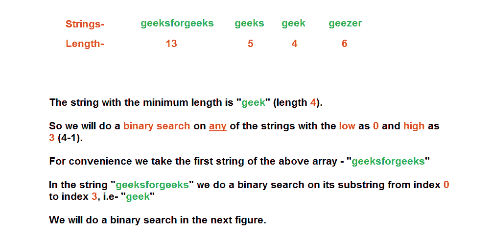
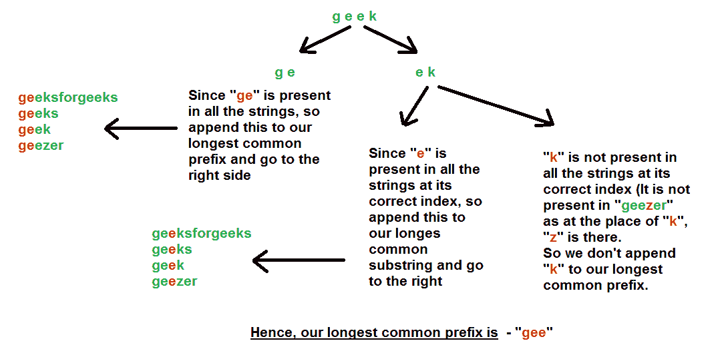

# 使用二分搜索法的最长公共前缀

> 原文:[https://www . geesforgeks . org/最长-常用-前缀-使用-二进制-搜索/](https://www.geeksforgeeks.org/longest-common-prefix-using-binary-search/)

给定一组字符串，找到最长的公共前缀。

```
Input  : {“geeksforgeeks”, “geeks”, “geek”, “geezer”}
Output : "gee"

Input  : {"apple", "ape", "april"}
Output : "ap"

Input  : {"abcd"}
Output : "abcd"

```

以前的方法–[逐词匹配](https://www.geeksforgeeks.org/longest-common-prefix-set-1-word-by-word-matching/)、[逐字匹配](https://www.geeksforgeeks.org/longest-common-prefix-set-2-character-by-character-matching/)、[分而治之](https://www.geeksforgeeks.org/longest-common-prefix-set-3-divide-and-conquer/)

本文讨论了一种使用[二分搜索法](https://www.geeksforgeeks.org/binary-search-tree/)的方法。
T3】步骤:

1.  找到最小长度的字符串。让这个长度为 **L** 。
2.  对任意一个字符串(来自输入字符串数组)执行二分搜索法运算。让我们取第一个字符串，对从索引–**0 到 L-1** 的字符进行二分搜索法运算。
3.  首先，取**低= 0，高= L-1** ，将弦分成两半——左**(低到中)和右(中+1 到高)**。
4.  检查左半部分的所有字符是否出现在所有字符串的相应索引处(从低到中)。如果它存在，那么我们将这一半附加到我们的前缀字符串中，我们查看右半部分，希望找到一个更长的前缀。(保证有一个公共前缀字符串。)
5.  否则，如果左半部分的所有字符没有出现在所有字符串的相应索引处(从低到中)，那么我们不需要看右半部分，因为左半部分本身有一些字符不是最长前缀字符串的一部分。所以我们确实看了左半部分，希望找到一个共同的前缀字符串。(可能我们没有找到任何常见的前缀字符串)

将字符串视为“极客”、“极客”、“极客”、“怪客”的算法说明





下面是上述方法的实现。

## C++

```
//  A C++ Program to find the longest common prefix
#include<bits/stdc++.h>
using namespace std;

// A Function to find the string having the minimum
// length and returns that length
int findMinLength(string arr[], int n)
{
    int min = INT_MAX;

    for (int i=0; i<=n-1; i++)
        if (arr[i].length() < min)
            min = arr[i].length();
    return(min);
}

bool allContainsPrefix(string arr[], int n, string str,
                       int start, int end)
{
    for (int i=0; i<=n-1; i++)
        for (int j=start; j<=end; j++)
            if (arr[i][j] != str[j])
                return (false);
    return (true);
}

// A Function that returns the longest common prefix
// from the array of strings
string commonPrefix(string arr[], int n)
{
    int index = findMinLength(arr, n);
    string prefix; // Our resultant string

    // We will do an in-place binary search on the
    // first string of the array in the range 0 to
    // index
    int low = 0, high = index;

    while (low <= high)
    {
        // Same as (low + high)/2, but avoids overflow
        // for large low and high
        int mid = low + (high - low) / 2;

        if (allContainsPrefix (arr, n, arr[0], low, mid))
        {
            // If all the strings in the input array contains
            // this prefix then append this substring to
            // our answer
            prefix = prefix + arr[0].substr(low, mid-low+1);

            // And then go for the right part
            low = mid + 1;
        }

        else // Go for the left part
            high = mid - 1;
    }

    return (prefix);
}

// Driver program to test above function
int main()
{
    string arr[] = {"geeksforgeeks", "geeks",
                    "geek", "geezer"};
    int n = sizeof (arr) / sizeof (arr[0]);

    string ans = commonPrefix(arr, n);

    if (ans.length())
        cout << "The longest common prefix is "
             << ans;
    else
        cout << "There is no common prefix";
    return (0);
}
```

## Java 语言(一种计算机语言，尤用于创建网站)

```
// A Java Program to find the longest common prefix

class GFG {

    // A Function to find the string having the 
    // minimum length and returns that length
    static int findMinLength(String arr[], int n)
    {
        int min = Integer.MAX_VALUE;
        for (int i = 0; i <= (n - 1); i++) 
        {
            if (arr[i].length() < min) {
                min = arr[i].length();
            }
        }
        return min;
    }

    static boolean allContainsPrefix(String arr[], int n, 
                         String str, int start, int end)
    {
        for (int i = 0; i <= (n - 1); i++)
        {
            String arr_i = arr[i];

            for (int j = start; j <= end; j++)
                if (arr_i.charAt(j) != str.charAt(j))
                    return false;
        }
        return true;
    }

    // A Function that returns the longest common prefix
    // from the array of strings
    static String commonPrefix(String arr[], int n)
    {
        int index = findMinLength(arr, n);
        String prefix = ""; // Our resultant string

        // We will do an in-place binary search on the
        // first string of the array in the range 0 to
        // index
        int low = 0, high = index-1;
        while (low <= high) {

            // Same as (low + high)/2, but avoids 
            // overflow for large low and high
            int mid = low + (high - low) / 2;

            if (allContainsPrefix(arr, n, arr[0], low,
                                                  mid))
            {
                // If all the strings in the input array
                // contains this prefix then append this
                // substring to our answer
                prefix = prefix + arr[0].substring(low,
                                          mid + 1);

                // And then go for the right part
                low = mid + 1;
            } 
            else // Go for the left part
            {
                high = mid - 1;
            }
        }

        return prefix;
    }

    // Driver program to test above function
    public static void main(String args[])
    {
        String arr[] = {"geeksforgeeks", "geeks",
                               "geek", "geezer"};
        int n = arr.length;

        String ans = commonPrefix(arr, n);

        if (ans.length() > 0)
            System.out.println("The longest common"
                            + " prefix is " + ans);
        else 
            System.out.println("There is no common" 
                                      + " prefix");
    }
}

// This code is contributed by Indrajit Sinha.
```

## 蟒蛇 3

```
# A Python3 Program to find
# the longest common prefix

# A Function to find the string having the 
# minimum length and returns that length
def findMinLength(strList):
    return len(min(arr, key = len))

def allContainsPrefix(strList, str, 
                      start, end):
    for i in range(0, len(strList)):
        word = strList[i]
        for j in range(start, end + 1):
            if word[j] != str[j]:
                return False
    return True

# A Function that returns the longest
# common prefix from the array of strings
def CommonPrefix(strList):
    index = findMinLength(strList)
    prefix = ""     # Our resultant string

    # We will do an in-place binary search 
    # on the first string of the array
    # in the range 0 to index 
    low, high = 0, index - 1
    while low <= high:

        # Same as (low + high)/2, but avoids
        # overflow for large low and high
        mid = int(low + (high - low) / 2)
        if allContainsPrefix(strList,   
                             strList[0], low, mid):

            # If all the strings in the input array 
            # contains this prefix then append this 
            # substring to our answer
            prefix = prefix + strList[0][low:mid + 1]

            # And then go for the right part 
            low = mid + 1
        else:

            # Go for the left part 
            high = mid - 1

    return prefix

# Driver Code
arr = ["geeksforgeeks", "geeks", 
       "geek", "geezer"]
lcp = CommonPrefix(arr)

if len(lcp) > 0:
    print ("The longest common prefix is " + 
                                 str(lcp))
else:
    print ("There is no common prefix")

# This code is contributed by garychan8523
```

## C#

```
// C# Program to find the longest common prefix using System;
using System;                
public class GFG {

    // A Function to find the string having the 
    // minimum length and returns that length
    static int findMinLength(string []arr, int n)
    {
        int min = int.MaxValue;
        for (int i = 0; i <= (n - 1); i++) 
        {
            if (arr[i].Length < min) {
                min = arr[i].Length;
            }
        }
        return min;
    }

    static bool allContainsPrefix(string []arr, int n, 
                         string str, int start, int end)
    {
        for (int i = 0; i <= (n - 1); i++)
        {
            string arr_i = arr[i];

            for (int j = start; j <= end; j++)
                if (arr_i[j] != str[j])
                    return false;
        }
        return true;
    }

    // A Function that returns the longest common prefix
    // from the array of strings
    static string commonPrefix(string []arr, int n)
    {
        int index = findMinLength(arr, n);
        string prefix = ""; // Our resultant string

        // We will do an in-place binary search on the
        // first string of the array in the range 0 to
        // index
        int low = 0, high = index;
        while (low <= high) {

            // Same as (low + high)/2, but avoids 
            // overflow for large low and high
            int mid = low + (high - low) / 2;

            if (allContainsPrefix(arr, n, arr[0], low,
                                                  mid))
            {
                // If all the strings in the input array
                // contains this prefix then append this
                // substring to our answer
                prefix = prefix + arr[0].Substring(low,
                                          mid + 1);

                // And then go for the right part
                low = mid + 1;
            } 
            else // Go for the left part
            {
                high = mid - 1;
            }
        }

        return prefix;
    }

    // Driver program to test above function
    public static void Main()
    {
        string []arr = {"geeksforgeeks", "geeks",
                               "geek", "geezer"};
        int n = arr.Length;

        string ans = commonPrefix(arr, n);

        if (ans.Length > 0)
            Console.WriteLine("The longest common"
                            + " prefix is - " + ans);
        else
            Console.WriteLine("There is no common"
                                      + " prefix");
    }
}

// This code is contributed by PrinciRaj1992
```

**输出:**

```
The longest common prefix is - gee
```

**时间复杂度:**
递推关系为

```
T(M) = T(M/2) + O(MN) 
```

在哪里

```
N = Number of strings
M = Length of the largest string

```

所以我们可以说时间复杂度是 O(NM log M)

**辅助空间:**为了存储最长的前缀字符串，我们分配的空间是 O(N)，其中 N =所有字符串中最大字符串的长度

本文由**拉希特·贝尔瓦亚尔**供稿。如果你喜欢 GeeksforGeeks 并想投稿，你也可以使用[contribute.geeksforgeeks.org](http://www.contribute.geeksforgeeks.org)写一篇文章或者把你的文章邮寄到 contribute@geeksforgeeks.org。看到你的文章出现在极客博客主页上，帮助其他极客。

如果您发现任何不正确的地方，或者您想分享更多关于上面讨论的主题的信息，请写评论