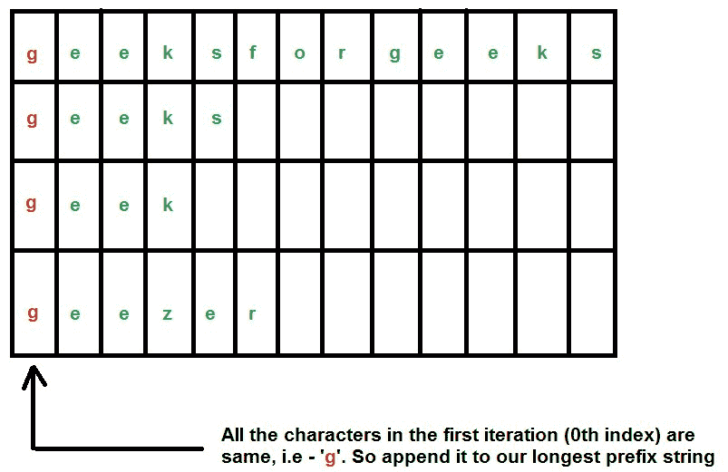
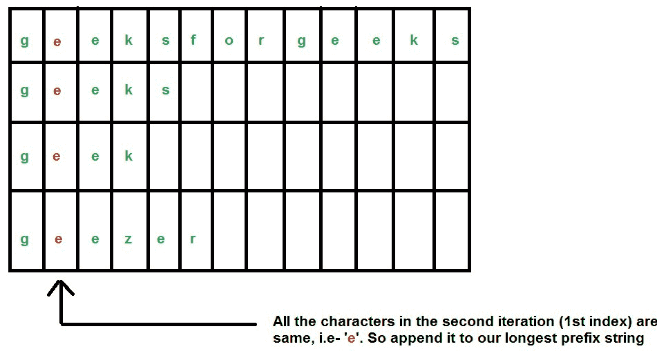
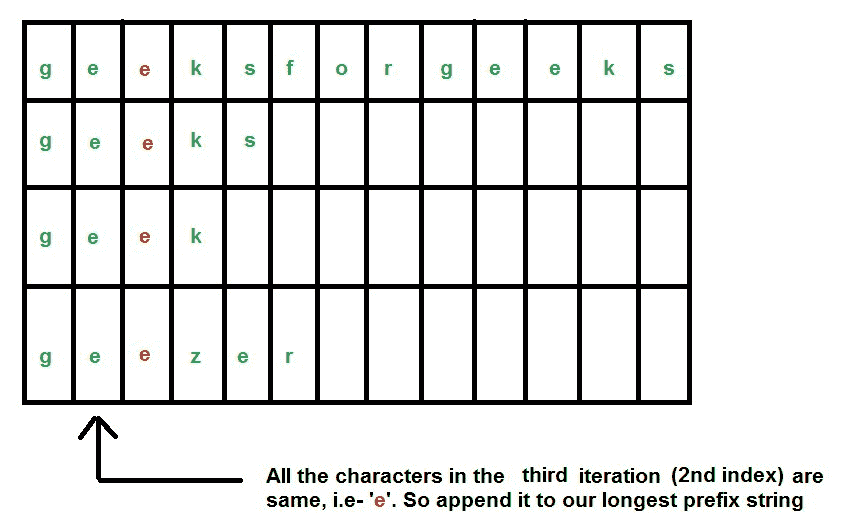
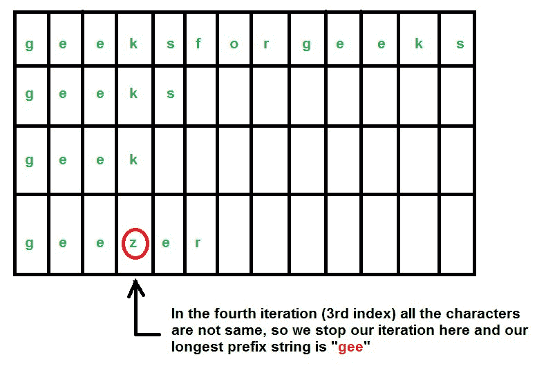

# 使用逐字符匹配的最长公共前缀

> 原文:[https://www . geesforgeks . org/最长公共前缀使用逐字符匹配/](https://www.geeksforgeeks.org/longest-common-prefix-using-character-by-character-matching/)

给定一组字符串，找到最长的公共前缀。

```
Input  : {“geeksforgeeks”, “geeks”, “geek”, “geezer”}
Output : "gee"

Input  : {"apple", "ape", "april"}
Output : "ap"
```

我们已经在[之前的帖子](https://www.geeksforgeeks.org/longest-common-prefix-set-1-word-by-word-matching/)中讨论了逐词匹配算法。
在这个算法中，我们将一个接一个地遍历字符，而不是一个接一个地遍历字符串。
我们认为我们的琴弦是——“极客”、“极客”、“极客”、“怪客”。









下面是这个方法的实现。

## C++

```
//  A C++ Program to find the longest common prefix
#include<bits/stdc++.h>
using namespace std;

// A Function to find the string having the minimum
// length and returns that length
int findMinLength(string arr[], int n)
{
    int min = arr[0].length();

    for (int i=1; i<n; i++)
        if (arr[i].length() < min)
            min = arr[i].length();

    return(min);
}

// A Function that returns the longest common prefix
// from the array of strings
string commonPrefix(string arr[], int n)
{
    int minlen = findMinLength(arr, n);

    string result; // Our resultant string
    char current;  // The current character

    for (int i=0; i<minlen; i++)
    {
        // Current character (must be same
        // in all strings to be a part of
        // result)
        current = arr[0][i];

        for (int j=1 ; j<n; j++)
            if (arr[j][i] != current)
                return result;

        // Append to result
        result.push_back(current);
    }

    return (result);
}

// Driver program to test above function
int main()
{
    string arr[] = {"geeksforgeeks", "geeks",
                    "geek", "geezer"};
    int n = sizeof (arr) / sizeof (arr[0]);

    string ans = commonPrefix (arr, n);

    if (ans.length())
        cout << "The longest common prefix is "
             << ans;
    else
        cout << "There is no common prefix";
    return (0);
}
```

## Java 语言(一种计算机语言，尤用于创建网站)

```
// A Java Program to find the longest common prefix
class GFG
{

    // A Function to find the string having the minimum
    // length and returns that length
    static int findMinLength(String arr[], int n)
    {
        int min = arr[0].length();

        for (int i = 1; i < n; i++)
        {
            if (arr[i].length() < min)
            {
                min = arr[i].length();
            }
        }

        return (min);
    }

    // A Function that returns the longest common prefix
    // from the array of strings
    static String commonPrefix(String arr[], int n)
    {
        int minlen = findMinLength(arr, n);

        String result = ""; // Our resultant string
        char current; // The current character

        for (int i = 0; i < minlen; i++)
        {
            // Current character (must be same
            // in all strings to be a part of
            // result)
            current = arr[0].charAt(i);

            for (int j = 1; j < n; j++)
            {
                if (arr[j].charAt(i) != current)
                {
                    return result;
                }
            }

            // Append to result
            result += (current);
        }

        return (result);
    }

    // Driver program to test above function
    public static void main(String[] args)
    {
        String arr[] = {"geeksforgeeks", "geeks",
            "geek", "geezer"};
        int n = arr.length;

        String ans = commonPrefix(arr, n);

        if (ans.length() > 0) {
            System.out.println("The longest common prefix is "
                    + ans);
        } else {
            System.out.println("There is no common prefix");
        }
    }
}

// This code contributed by Rajput-Ji
```

## 蟒蛇 3

```
# Python 3 Program to find the longest common prefix

# A Function to find the string having the minimum
# length and returns that length
def findMinLength(arr, n):

    min = len(arr[0])

    for i in range(1,n):
        if (len(arr[i])< min):
            min = len(arr[i])

    return(min)

# A Function that returns the longest common prefix
# from the array of strings
def commonPrefix(arr, n):

    minlen = findMinLength(arr, n)
    result =""
    for i in range(minlen):

        # Current character (must be same
        # in all strings to be a part of
        # result)
        current = arr[0][i]

        for j in range(1,n):
            if (arr[j][i] != current):
                return result

        # Append to result
        result = result+current

    return (result)

# Driver program to test above function
if __name__ == "__main__":

    arr = ["geeksforgeeks", "geeks",
                    "geek", "geezer"]
    n = len(arr)

    ans = commonPrefix (arr, n)

    if (len(ans)):
        print("The longest common prefix is ",ans)
    else:
        print("There is no common prefix")
```

## C#

```
// A C# Program to find the longest common prefix
using System;

class GFG
{

    // A Function to find the string having the minimum
    // length and returns that length
    static int findMinLength(String []arr, int n)
    {
        int min = arr[0].Length;

        for (int i = 1; i < n; i++)
        {
            if (arr[i].Length < min)
            {
                min = arr[i].Length;
            }
        }

        return (min);
    }

    // A Function that returns the longest common prefix
    // from the array of strings
    static String commonPrefix(String []arr, int n)
    {
        int minlen = findMinLength(arr, n);

        String result = ""; // Our resultant string
        char current; // The current character

        for (int i = 0; i < minlen; i++)
        {
            // Current character (must be same
            // in all strings to be a part of
            // result)
            current = arr[0][i];

            for (int j = 1; j < n; j++)
            {
                if (arr[j][i] != current)
                {
                    return result;
                }
            }

            // Append to result
            result += (current);
        }

        return (result);
    }

    // Driver code
    public static void Main(String[] args)
    {
        String []arr = {"geeksforgeeks", "geeks",
            "geek", "geezer"};
        int n = arr.Length;

        String ans = commonPrefix(arr, n);

        if (ans.Length > 0)
        {
            Console.WriteLine("The longest common prefix is "
                    + ans);
        }
        else
        {
            Console.WriteLine("There is no common prefix");
        }
    }
}

/* This code contributed by PrinciRaj1992 */
```

## java 描述语言

```
<script>
// A Javascript Program to find the longest common prefix

    // A Function to find the string having the minimum
    // length and returns that length
    function findMinLength(arr,n)
    {
        let min = arr[0].length;
        for (let i = 1; i < n; i++)
        {
            if (arr[i].length < min)
            {
                min = arr[i].length;
            }
        }

        return (min);
    }

    // A Function that returns the longest common prefix
    // from the array of strings
    function commonPrefix(arr,n)
    {
        let minlen = findMinLength(arr, n);
        let result = ""; // Our resultant string
        let current; // The current character
        for (let i = 0; i < minlen; i++)
        {
            // Current character (must be same
            // in all strings to be a part of
            // result)
            current = arr[0][i];

            for (let j = 1; j < n; j++)
            {
                if (arr[j][i] != current)
                {
                    return result;
                }
            }

            // Append to result
            result += (current);
        }

        return (result);
    }

    // Driver program to test above function
    let arr=["geeksforgeeks", "geeks",
            "geek", "geezer"]
    let n = arr.length;

    let ans = commonPrefix(arr, n);
    if (ans.length > 0) {
        document.write("The longest common prefix is "
                + ans);
    } else {
        document.write("There is no common prefix");
    }

    //  This code is contributed by avanitrachhadiya2155
</script>
```

**输出:**

```
The longest common prefix is  gee
```

**这个算法怎么比** [**逐字匹配**](https://www.geeksforgeeks.org/longest-common-prefix-set-1-word-by-word-matching/) **算法好？-**
在[第 1 集](https://www.geeksforgeeks.org/longest-common-prefix-set-1-word-by-word-matching/)中，我们讨论了“逐词匹配”算法。
假设输入字符串为-" geeks forgeeks " " geeks " " geek " " geek " " Gezer " " x "。
现在以上字符串没有共同的前缀字符串。通过集合 1 中讨论的“逐词匹配”算法，我们得出结论:通过遍历所有字符串，不存在公共前缀字符串。但是如果我们使用这个算法，那么在第一次迭代中，我们会知道没有公共前缀字符串，因为我们不会进一步寻找每个字符串的第二个字符。
该算法在字符串过多的情况下有巨大的优势。
**时间复杂度:**由于我们是迭代所有字符串的所有字符，所以可以说时间复杂度是 O(N ^ M)其中，

```
N = Number of strings
M = Length of the largest string string 
```

**辅助空间:**为了存储最长的前缀字符串，我们分配的空间是 O(M)。
本文由**拉希特·贝尔瓦亚尔**供稿。如果你喜欢极客博客并想投稿，你也可以写一篇文章并把你的文章邮寄到 contribute@geeksforgeeks.org。看到你的文章出现在极客博客主页上，帮助其他极客。
发现有不正确的地方请写评论，或者想分享更多以上讨论话题的信息