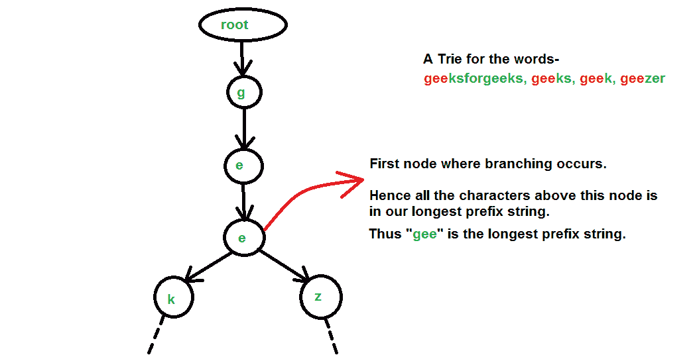

# 使用 Trie 的最长公共前缀

> 原文:[https://www . geesforgeks . org/long-common-prefix-use-trie/](https://www.geeksforgeeks.org/longest-common-prefix-using-trie/)

给定一组字符串，找到最长的公共前缀。

```
Input  : {“geeksforgeeks”, “geeks”, “geek”, “geezer”}
Output : "gee"

Input  : {"apple", "ape", "april"}
Output : "ap"

```

以往做法:[逐字匹配](https://www.geeksforgeeks.org/longest-common-prefix-set-1-word-by-word-matching/)、[逐字匹配](https://www.geeksforgeeks.org/longest-common-prefix-set-2-character-by-character-matching/)、[分而治之](https://www.geeksforgeeks.org/longest-common-prefix-set-3-divide-and-conquer/)、[二分搜索法](https://www.geeksforgeeks.org/longest-common-prefix-set-4-binary-search/)。

本文讨论了一种使用[数据结构](https://www.geeksforgeeks.org/trie-insert-and-search/)的方法。
T3】步骤:

*   把所有的单词一个接一个地插入表格中。插入后，我们在特里尔进行散步。
*   In this walk, go deeper until we find a node having more than **1 children(branching occurs) or 0 children (one of the string gets exhausted).**

    这是因为出现在最长公共前缀中的字符(trie 中的节点)必须是其父节点的单个子节点，也就是说，在这些节点中不应该有分支。

将字符串视为“极客”、“极客”、“极客”、“怪客”的算法说明



## C++

```
// A Program to find the longest common
// prefix of the given words

#include<bits/stdc++.h>
using namespace std;

// Alphabet size (# of symbols)
#define ALPHABET_SIZE (26)

// Converts key current character into index
// use only 'a' through 'z' and lower case
#define CHAR_TO_INDEX(c) ((int)c - (int)'a')

// Trie node
struct TrieNode
{
    struct TrieNode *children[ALPHABET_SIZE];

    // isLeaf is true if the node represents
    // end of a word
    bool isLeaf;
};

// Returns new trie node (initialized to NULLs)
struct TrieNode *getNode(void)
{
    struct TrieNode *pNode = new TrieNode;

    if (pNode)
    {
        int i;

        pNode->isLeaf = false;

        for (i = 0; i < ALPHABET_SIZE; i++)
            pNode->children[i] = NULL;
    }

    return pNode;
}

// If not present, inserts the key into the trie
// If the key is a prefix of trie node, just marks leaf node
void insert(struct TrieNode *root, string key)
{
    int length = key.length();
    int index;

    struct TrieNode *pCrawl = root;

    for (int level = 0; level < length; level++)
    {
        index = CHAR_TO_INDEX(key[level]);
        if (!pCrawl->children[index])
            pCrawl->children[index] = getNode();

        pCrawl = pCrawl->children[index];
    }

    // mark last node as leaf
    pCrawl->isLeaf = true;
}

// Counts and returns the number of children of the
// current node
int countChildren(struct TrieNode *node, int *index)
{
    int count = 0;
    for (int i=0; i<ALPHABET_SIZE; i++)
    {
        if (node->children[i] != NULL)
        {
            count++;
            *index = i;
        }
    }
    return (count);
}

// Perform a walk on the trie and return the
// longest common prefix string
string walkTrie(struct TrieNode *root)
{
    struct TrieNode *pCrawl = root;
    int index;
    string prefix;

    while (countChildren(pCrawl, &index) == 1 &&
            pCrawl->isLeaf == false)
    {
        pCrawl = pCrawl->children[index];
        prefix.push_back('a'+index);
    }
    return (prefix);
}

// A Function to construct trie
void constructTrie(string arr[], int n, struct TrieNode *root)
{
    for (int i = 0; i < n; i++)
        insert (root, arr[i]);
    return;
}

// A Function that returns the longest common prefix
// from the array of strings
string commonPrefix(string arr[], int n)
{
    struct TrieNode *root = getNode();
    constructTrie(arr, n, root);

    // Perform a walk on the trie
    return walkTrie(root);
}

// Driver program to test above function
int main()
{
    string arr[] = {"geeksforgeeks", "geeks",
                    "geek", "geezer"};
    int n = sizeof (arr) / sizeof (arr[0]);

    string ans = commonPrefix(arr, n);

    if (ans.length())
        cout << "The longest common prefix is "
             << ans;
    else
        cout << "There is no common prefix";
    return (0);
}
```

## Java 语言(一种计算机语言，尤用于创建网站)

```
// Java Program to find the longest common
// prefix of the given words
public class Longest_common_prefix {

    // Alphabet size (# of symbols)
    static final int ALPHABET_SIZE = 26;

    // Trie node
    static class TrieNode
    {
        TrieNode[] children = new TrieNode[ALPHABET_SIZE];

        // isLeaf is true if the node represents
        // end of a word
        boolean isLeaf;

        // constructor
        public TrieNode() {
            isLeaf = false;
            for (int i = 0; i < ALPHABET_SIZE; i++)
                children[i] = null;
        }
    };

    static TrieNode root;
    static int indexs;

    // If not present, inserts the key into the trie
    // If the key is a prefix of trie node, just marks
    // leaf node
    static void insert(String key)
    {
        int length = key.length();
        int index;

        TrieNode pCrawl = root;

        for (int level = 0; level < length; level++)
        {
            index = key.charAt(level) - 'a';
            if (pCrawl.children[index] == null)
                pCrawl.children[index] = new TrieNode();

            pCrawl = pCrawl.children[index];
        }

        // mark last node as leaf
        pCrawl.isLeaf = true;
    }

    // Counts and returns the number of children of the
    // current node
    static int countChildren(TrieNode node)
    {
        int count = 0;
        for (int i=0; i<ALPHABET_SIZE; i++)
        {
            if (node.children[i] != null)
            {
                count++;
                indexs = i;
            }
        }
        return (count);
    }

    // Perform a walk on the trie and return the
    // longest common prefix string
    static String walkTrie()
    {
        TrieNode pCrawl = root;
        indexs = 0;
        String prefix = "";

        while (countChildren(pCrawl) == 1 &&
                pCrawl.isLeaf == false)
        {
            pCrawl = pCrawl.children[indexs];
            prefix += (char)('a' + indexs);
        }
        return prefix;
    }

    // A Function to construct trie
    static void constructTrie(String arr[], int n)
    {
        for (int i = 0; i < n; i++)
            insert (arr[i]);
        return;
    }

    // A Function that returns the longest common prefix
    // from the array of strings
    static String commonPrefix(String arr[], int n)
    {
        root = new TrieNode();
        constructTrie(arr, n);

        // Perform a walk on the trie
        return walkTrie();
    }

    // Driver program to test above function
    public static void main(String args[])
    {
        String arr[] = {"geeksforgeeks", "geeks",
                        "geek", "geezer"};
        int n = arr.length;

        String ans = commonPrefix(arr, n);

        if (ans.length() != 0)
            System.out.println("The longest common prefix is "+ans);
        else
            System.out.println("There is no common prefix");
    }
}
// This code is contributed by Sumit Ghosh
```

## 蟒蛇 3

```
# Python 3 program to find the longest common prefix
ALPHABET_SIZE = 26
indexs = 0
class TrieNode:
    # constructor
    def __init__(self):
        self.isLeaf = False
        self.children = [None]*ALPHABET_SIZE

# Function to facilitate insertion in Trie
# If not present, insert the node in the Trie
def insert(key, root):
    pCrawl = root
    for level in range(len(key)):
        index = ord(key[level]) - ord('a')
        if pCrawl.children[index] == None:
            pCrawl.children[index] = TrieNode()
        pCrawl = pCrawl.children[index]
    pCrawl.isLeaf = True

# Function to construct Trie
def constructTrie(arr, n, root):
    for i in range(n):
        insert(arr[i], root)

# Counts and returns number of children of the node
def countChildren(node):
    count = 0
    for i in range(ALPHABET_SIZE):
        if node.children[i] != None:
            count +=1
            # Keeping track of diversion in the trie
            global indexs
            indexs = i
    return count

# Perform walk on trie and return longest common prefix 
def walkTrie(root):
    pCrawl = root
    prefix = ""
    while(countChildren(pCrawl) == 1 and pCrawl.isLeaf == False):
        pCrawl = pCrawl.children[indexs]
        prefix += chr(97 + indexs)
    return prefix or -1

# Function that returns longest common prefix 
def commonPrefix(arr, n, root):
    constructTrie(arr, n, root)
    return walkTrie(root)

# Driver code to test the code
n = 4
arr = ["geeksforgeeks", "geeks", "geek", "geezer"]
root = TrieNode()
print(commonPrefix(arr,n, root))

# This code is Contributed by Akshay Jain (DA-IICT)
```

## C#

```
// C# Program to find the longest common
// prefix of the given words
using System;

public class Longest_common_prefix 
{

    // Alphabet size (# of symbols)
    static readonly int ALPHABET_SIZE = 26;

    // Trie node
    public class TrieNode
    {
        public TrieNode[] children = new TrieNode[ALPHABET_SIZE];

        // isLeaf is true if the node represents
        // end of a word
        public bool isLeaf;

        // constructor
        public TrieNode() 
        {
            isLeaf = false;
            for (int i = 0; i < ALPHABET_SIZE; i++)
                children[i] = null;
        }
    };

    static TrieNode root;
    static int indexs;

    // If not present, inserts the key into the trie
    // If the key is a prefix of trie node, just marks
    // leaf node
    static void insert(String key)
    {
        int length = key.Length;
        int index;

        TrieNode pCrawl = root;

        for (int level = 0; level < length; level++)
        {
            index = key[level] - 'a';
            if (pCrawl.children[index] == null)
                pCrawl.children[index] = new TrieNode();

            pCrawl = pCrawl.children[index];
        }

        // mark last node as leaf
        pCrawl.isLeaf = true;
    }

    // Counts and returns the number of children of the
    // current node
    static int countChildren(TrieNode node)
    {
        int count = 0;
        for (int i = 0; i < ALPHABET_SIZE; i++)
        {
            if (node.children[i] != null)
            {
                count++;
                indexs = i;
            }
        }
        return (count);
    }

    // Perform a walk on the trie and return the
    // longest common prefix string
    static String walkTrie()
    {
        TrieNode pCrawl = root;
        indexs = 0;
        String prefix = "";

        while (countChildren(pCrawl) == 1 &&
                pCrawl.isLeaf == false)
        {
            pCrawl = pCrawl.children[indexs];
            prefix += (char)('a' + indexs);
        }
        return prefix;
    }

    // A Function to construct trie
    static void constructTrie(String []arr, int n)
    {
        for (int i = 0; i < n; i++)
            insert (arr[i]);
        return;
    }

    // A Function that returns the longest common prefix
    // from the array of strings
    static String commonPrefix(String []arr, int n)
    {
        root = new TrieNode();
        constructTrie(arr, n);

        // Perform a walk on the trie
        return walkTrie();
    }

    // Driver program to test above function
    public static void Main(String []args)
    {
        String []arr = {"geeksforgeeks", "geeks",
                        "geek", "geezer"};
        int n = arr.Length;

        String ans = commonPrefix(arr, n);

        if (ans.Length != 0)
            Console.WriteLine("The longest common prefix is "+ans);
        else
            Console.WriteLine("There is no common prefix");
    }
}

// This code contributed by Rajput-Ji
```

**Output :**

```
The longest common prefix is gee
```

**时间复杂度:**在 trie 中插入所有单词需要 O(MN)时间，在 trie 上执行行走需要 O(M)时间，其中-

```
N = Number of strings
M = Length of the largest string

```

**辅助空间:**为了存储所有字符串，我们需要为 Trie 分配 O(26*M*N) ~ O(MN)空间。

本文由**拉希特·贝尔瓦亚尔**供稿。如果你喜欢 GeeksforGeeks 并想投稿，你也可以使用[contribute.geeksforgeeks.org](http://www.contribute.geeksforgeeks.org)写一篇文章或者把你的文章邮寄到 contribute@geeksforgeeks.org。看到你的文章出现在极客博客主页上，帮助其他极客。

如果您发现任何不正确的地方，或者您想分享关于上面讨论的主题的更多信息，请写评论