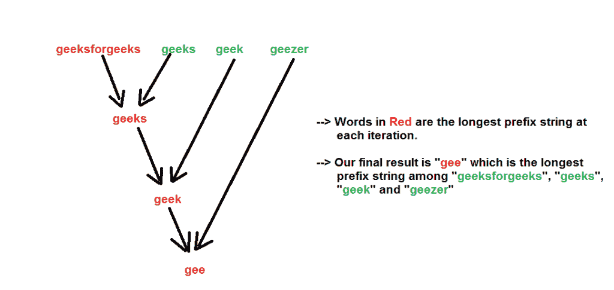

# 使用逐词匹配的最长公共前缀

> 原文:[https://www . geeksforgeeks . org/最长常用前缀使用逐词匹配/](https://www.geeksforgeeks.org/longest-common-prefix-using-word-by-word-matching/)

给定一组字符串，找到最长的公共前缀。
**例:**

```
Input  : {“geeksforgeeks”, “geeks”, “geek”, “geezer”}
Output : "gee"

Input  : {"apple", "ape", "april"}
Output : "ap"
```

我们从一个例子开始。假设有两个字符串——“极客”和“极客”。两者中最长的共同前缀是什么？它是“极客”。
现在我们再介绍一个词“极客”。那么现在这三个字中最长的共同前缀是什么呢？是“极客”
我们可以看到最长的公共前缀持有联想属性，即-

```
LCP(string1, string2, string3) 
         = LCP (LCP (string1, string2), string3)

Like here

LCP (“geeksforgeeks”, “geeks”, “geek”)
     =  LCP (LCP (“geeksforgeeks”, “geeks”), “geek”)
     =  LCP (“geeks”, “geek”) = “geek”
```

所以我们可以利用上面的关联属性来找到给定字符串的 LCP。我们一个接一个地计算每个给定字符串的 LCP。最终结果将是所有字符串中最长的公共前缀。
注意，给定的字符串可能没有公共前缀。当所有字符串的第一个字符不同时，就会出现这种情况。
我们通过下图展示了带有输入字符串的算法——“极客”、“极客”、“极客”、“极客”。



以下是上述方法的实现:

## C++

```
//  A C++ Program to find the longest common prefix
#include<bits/stdc++.h>
using namespace std;

// A Utility Function to find the common prefix between
// strings- str1 and str2
string commonPrefixUtil(string str1, string str2)
{
    string result;
    int n1 = str1.length(), n2 = str2.length();

    // Compare str1 and str2
    for (int i=0, j=0; i<=n1-1&&j<=n2-1; i++,j++)
    {
        if (str1[i] != str2[j])
            break;
        result.push_back(str1[i]);
    }

    return (result);
}

// A Function that returns the longest common prefix
// from the array of strings
string commonPrefix (string arr[], int n)
{
    string prefix =  arr[0];

    for (int i=1; i<=n-1; i++)
        prefix = commonPrefixUtil(prefix, arr[i]);

    return (prefix);
}

// Driver program to test above function
int main()
{
    string arr[] = {"geeksforgeeks", "geeks",
                    "geek", "geezer"};
    int n = sizeof(arr) / sizeof(arr[0]);

    string ans = commonPrefix(arr, n);

    if (ans.length())
        printf ("The longest common prefix is - %s",
                 ans.c_str());
    else
        printf("There is no common prefix");

    return (0);
}
```

## Java 语言(一种计算机语言，尤用于创建网站)

```
// Java Program to find the longest common prefix

class GFG {

// A Utility Function to find the common prefix between
// strings- str1 and str2
    static String commonPrefixUtil(String str1, String str2) {
        String result = "";
        int n1 = str1.length(), n2 = str2.length();

        // Compare str1 and str2
        for (int i = 0, j = 0; i <= n1 - 1 && j <= n2 - 1; i++, j++) {
            if (str1.charAt(i) != str2.charAt(j)) {
                break;
            }
            result += str1.charAt(i);
        }

        return (result);
    }

// A Function that returns the longest common prefix
// from the array of strings
    static String commonPrefix(String arr[], int n) {
        String prefix = arr[0];

        for (int i = 1; i <= n - 1; i++) {
            prefix = commonPrefixUtil(prefix, arr[i]);
        }

        return (prefix);
    }

// Driver program to test above function
    public static void main(String[] args) {
        String arr[] = {"geeksforgeeks", "geeks",
            "geek", "geezer"};
        int n = arr.length;

        String ans = commonPrefix(arr, n);

        if (ans.length() > 0) {
            System.out.printf("The longest common prefix is - %s",
                    ans);
        } else {
            System.out.printf("There is no common prefix");
        }
    }
}
// This code is contributed by 29AjayKumar
```

## 蟒蛇 3

```
# A python3 Program to find the longest
# common prefix

# A Utility Function to find the common
# prefix between strings- str1 and str2
def commonPrefixUtil(str1, str2):

    result = "";
    n1 = len(str1)
    n2 = len(str2)

    # Compare str1 and str2
    i = 0
    j = 0
    while i <= n1 - 1 and j <= n2 - 1:

        if (str1[i] != str2[j]):
            break

        result += str1[i]
        i += 1
        j += 1

    return (result)

# A Function that returns the longest
# common prefix from the array of strings
def commonPrefix (arr, n):

    prefix = arr[0]

    for i in range (1, n):
        prefix = commonPrefixUtil(prefix, arr[i])

    return (prefix)

# Driver Code
if __name__ =="__main__":

    arr = ["geeksforgeeks", "geeks",
                    "geek", "geezer"]
    n = len(arr)

    ans = commonPrefix(arr, n)

    if (len(ans)):
        print ("The longest common prefix is -",
                ans);
    else:
        print("There is no common prefix")

# This code is contributed by ita_c
```

## C#

```
// C# Program to find the longest
// common prefix
using System;

class GFG
{

// A Utility Function to find
// the common prefix between
// strings- str1 and str2
static String commonPrefixUtil(String str1,
                               String str2)
{
    String result = "";
    int n1 = str1.Length,
        n2 = str2.Length;

    // Compare str1 and str2
    for (int i = 0, j = 0;
             i <= n1 - 1 && j <= n2 - 1;
             i++, j++)
    {
        if (str1[i] != str2[j])
        {
            break;
        }
        result += str1[i];
    }

    return (result);
}

// A Function that returns the longest
// common prefix from the array of strings
static String commonPrefix(String []arr, int n)
{
    String prefix = arr[0];

    for (int i = 1; i <= n - 1; i++)
    {
        prefix = commonPrefixUtil(prefix,
                     arr.GetValue(i).ToString());
    }

    return (prefix);
}

// Driver Code
public static void Main()
{
    String []arr = {"geeksforgeeks", "geeks",
                    "geek", "geezer"};
    int n = arr.Length;

    String ans = commonPrefix(arr, n);

    if (ans.Length > 0)
    {
        Console.Write("The longest common " +
                       "prefix is - " + ans);
    }
    else
    {
        Console.Write("There is no common prefix");
    }
}
}

// This code is contributed
// by 29AjayKumar
```

## java 描述语言

```
<script>
// Javascript Program to find the longest common prefix

    // A Utility Function to find the common prefix between
    // strings- str1 and str2
    function commonPrefixUtil(str1,str2)
    {
        let  result = "";
        let n1 = str1.length, n2 = str2.length;
        // Compare str1 and str2
        for (let i = 0, j = 0; i <= n1 - 1 && j <= n2 - 1; i++, j++) {
            if (str1[i] != str2[j]) {
                break;
            }
            result += str1[i];
        }

        return (result);
    }

    // A Function that returns the longest common prefix
    // from the array of strings
    function commonPrefix(arr,n)
    {
        let prefix = arr[0];

        for (let i = 1; i <= n - 1; i++) {
            prefix = commonPrefixUtil(prefix, arr[i]);
        }

        return (prefix);
    }

    // Driver program to test above function
    let arr=["geeksforgeeks", "geeks",
            "geek", "geezer"];
    let n = arr.length;
    let ans = commonPrefix(arr, n);
    if (ans.length > 0) {
        document.write("The longest common prefix is - ",
                ans);
    } else {
        document.write("There is no common prefix ");
    }

    // This code is contributed by rag2127

</script>
```

**输出:**

```
The longest common prefix is - gee
```

**时间复杂度:**因为我们在迭代所有的字符串，对于每个字符串，我们在迭代每个字符，所以我们可以说时间复杂度是 O(N ^ M)，其中，

```
N = Number of strings
M = Length of the largest string string 
```

**辅助空间:**为了存储最长的前缀字符串，我们分配的空间是 O(M)。
**如何改善这一点？**
请看[最长常用前缀|集合 2(逐字符匹配)](https://www.geeksforgeeks.org/longest-common-prefix-set-2-character-by-character-matching/)
本文由 **Rachit Belwariar** 供稿。如果你喜欢极客博客并想投稿，你也可以写一篇文章并把你的文章邮寄到 contribute@geeksforgeeks.org。看到你的文章出现在极客博客主页上，帮助其他极客。
发现有不正确的地方请写评论，或者想分享更多以上讨论话题的信息