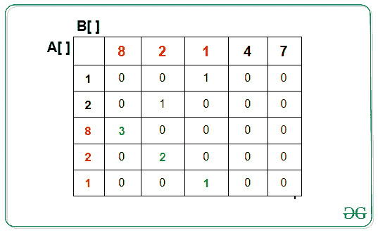

# 给定两个阵列中最长的公共子阵列

> 原文:[https://www . geesforgeks . org/给定两个阵列中最长的公共子阵列/](https://www.geeksforgeeks.org/longest-common-subarray-in-the-given-two-arrays/)

给定两个分别为 **N 和 M** 整数的[阵列](https://www.geeksforgeeks.org/introduction-to-arrays/) **A[]和 B[]** ，任务是找出两个给定的[阵列](https://www.geeksforgeeks.org/introduction-to-arrays/)之间相等的[子阵列](https://www.geeksforgeeks.org/subarraysubstring-vs-subsequence-and-programs-to-generate-them/)的最大长度或最长的公共子阵列。

**示例:**

> **输入:** A[] = {1，2，8，2，1}，B[] = {8，2，1，4，7}
> **输出:** 3
> **说明:**
> 两个阵列共有的子阵列为{8，2，1}，子阵列的长度为 3。
> **输入:** A[] = {1，2，3，2，1}，B[] = {8，7，6，4，7}
> **输出:** 0
> **说明:**
> 数组 A[]和 B[]中没有相等的子数组。

**天真方法:**想法是生成两个给定的[阵](https://www.geeksforgeeks.org/introduction-to-arrays/) **A[]** 和 **B[]** 的所有子阵，找到最长的匹配子阵。这个解决方案在时间复杂度方面是指数级的。
**时间复杂度:** O(2 <sup>N+M</sup> ，其中 N 为[数组](https://www.geeksforgeeks.org/introduction-to-arrays/)的长度**A[]**M 为 [**数组**](https://www.geeksforgeeks.org/introduction-to-arrays/)T21】B[]的长度。

**高效方法:**
高效方法是使用[动态规划(DP)](https://www.geeksforgeeks.org/dynamic-programming/) 。这个问题是[最长公共子序列(LCS)](https://www.geeksforgeeks.org/longest-common-subsequence-dp-4/) 的变异。
让输入序列为**A【0..n-1]** 和**B【0..长度分别为 **m & n** 的 m-1】**。以下是相等子阵列的递归实现:

1.  由于 **A[]** 和 **B[]** 的公共子阵列必须从某个索引 **i** 和 **j** 开始，使得**A【I】**等于**B【j】**。让 **dp[i][j]** 成为 **A[i…]和 B[j…]** 最长的公共子阵。
2.  因此，对于任何指标 I 和 j，如果 A[i]等于 B[j]，那么 **dp[i][j] = dp[i+1][j+1] + 1** 。
3.  [阵列](https://www.geeksforgeeks.org/introduction-to-arrays/) **dp[][]** 中所有元素的最大值将给出相等子阵列的最大长度。

**例如:**
如果给定数组 **A[]** = {1，2，8，2，1}和 **B[]** = {8，2，1，4，7}。如果数组 **A[]** 和 **B[]** 的索引 **i** 和 **j** 处的字符匹配，则 **dp[i][j]** 将更新为 **1 + dp[i+1][j+1]** 。
以下是给定数组 **A[]** 和 **B[]** 的更新后的 **dp[][]** 表。

[](https://media.geeksforgeeks.org/wp-content/uploads/20200324151540/LCSA.jpg)

下面是上述方法的实现:

## C++

```
// C++ program to DP approach
// to above solution
#include <bits/stdc++.h>
using namespace std;

// Function to find the maximum
// length of equal subarray
int FindMaxLength(int A[], int B[], int n, int m)
{

    // Auxiliary dp[][] array
    int dp[n + 1][m + 1];
    for (int i = 0; i <= n; i++)
        for (int j = 0; j <= m; j++)
            dp[i][j] = 0;

    // Updating the dp[][] table
    // in Bottom Up approach
    for (int i = n - 1; i >= 0; i--)
    {
        for (int j = m - 1; j >= 0; j--)
        {
            // If A[i] is equal to B[i]
            // then dp[j][i] = dp[j + 1][i + 1] + 1
            if (A[i] == B[j])
                dp[j][i] = dp[j + 1][i + 1] + 1;
        }
    }
    int maxm = 0;

    // Find maximum of all the values
    // in dp[][] array to get the
    // maximum length
    for (int i = 0; i < n; i++)
    {
        for (int j = 0; j < m; j++)
        {
            // Update the length
            maxm = max(maxm, dp[i][j]);
        }
    }

    // Return the maximum length
    return maxm;
}

// Driver Code
int main()
{
    int A[] = { 1, 2, 8, 2, 1 };
    int B[] = { 8, 2, 1, 4, 7 };

    int n = sizeof(A) / sizeof(A[0]);
    int m = sizeof(B) / sizeof(B[0]);

    // Function call to find
    // maximum length of subarray
    cout << (FindMaxLength(A, B, n, m));
}

// This code is contributed by chitranayal
```

## Java 语言(一种计算机语言，尤用于创建网站)

```
// Java program to DP approach
// to above solution
class GFG
{
    // Function to find the maximum
    // length of equal subarray
    static int FindMaxLength(int A[], int B[], int n, int m)
    {

        // Auxiliary dp[][] array
        int[][] dp = new int[n + 1][m + 1];
        for (int i = 0; i <= n; i++)
            for (int j = 0; j <= m; j++)
                dp[i][j] = 0;

        // Updating the dp[][] table
        // in Bottom Up approach
        for (int i = n - 1; i >= 0; i--)
        {
            for (int j = m - 1; j >= 0; j--)
            {
                // If A[i] is equal to B[i]
                // then dp[j][i] = dp[j + 1][i + 1] + 1
                if (A[i] == B[j])
                    dp[j][i] = dp[j + 1][i + 1] + 1;
            }
        }
        int maxm = 0;

        // Find maximum of all the values
        // in dp[][] array to get the
        // maximum length
        for (int i = 0; i < n; i++)
        {
            for (int j = 0; j < m; j++)
            {
                // Update the length
                maxm = Math.max(maxm, dp[i][j]);
            }
        }

        // Return the maximum length
        return maxm;
    }

    // Driver Code
    public static void main(String[] args)
    {
        int A[] = { 1, 2, 8, 2, 1 };
        int B[] = { 8, 2, 1, 4, 7 };

        int n = A.length;
        int m = B.length;

        // Function call to find
        // maximum length of subarray
        System.out.print(FindMaxLength(A, B, n, m));
    }
}

// This code is contributed by PrinciRaj1992
```

## 蟒蛇 3

```
# Python program to DP approach
# to above solution

# Function to find the maximum
# length of equal subarray

def FindMaxLength(A, B):
    n = len(A)
    m = len(B)

    # Auxiliary dp[][] array
    dp = [[0 for i in range(n + 1)] for i in range(m + 1)]

    # Updating the dp[][] table
    # in Bottom Up approach
    for i in range(n - 1, -1, -1):
        for j in range(m - 1, -1, -1):

            # If A[i] is equal to B[i]
            # then dp[j][i] = dp[j + 1][i + 1] + 1
            if A[i] == B[j]:
                dp[j][i] = dp[j + 1][i + 1] + 1
    maxm = 0

    # Find maximum of all the values
    # in dp[][] array to get the
    # maximum length
    for i in dp:
        for j in i:

            # Update the length
            maxm = max(maxm, j)

    # Return the maximum length
    return maxm

# Driver Code
if __name__ == '__main__':
    A = [1, 2, 8, 2, 1]
    B = [8, 2, 1, 4, 7]

    # Function call to find
    # maximum length of subarray
    print(FindMaxLength(A, B))
```

## C#

```
// C# program to DP approach
// to above solution
using System;

class GFG
{
    // Function to find the maximum
    // length of equal subarray
    static int FindMaxLength(int[] A, int[] B, int n, int m)
    {

        // Auxiliary [,]dp array
        int[, ] dp = new int[n + 1, m + 1];
        for (int i = 0; i <= n; i++)
            for (int j = 0; j <= m; j++)
                dp[i, j] = 0;

        // Updating the [,]dp table
        // in Bottom Up approach
        for (int i = n - 1; i >= 0; i--)
        {
            for (int j = m - 1; j >= 0; j--)
            {
                // If A[i] is equal to B[i]
                // then dp[j, i] = dp[j + 1, i + 1] + 1
                if (A[i] == B[j])
                    dp[j, i] = dp[j + 1, i + 1] + 1;
            }
        }
        int maxm = 0;

        // Find maximum of all the values
        // in [,]dp array to get the
        // maximum length
        for (int i = 0; i < n; i++) {
            for (int j = 0; j < m; j++) {

                // Update the length
                maxm = Math.Max(maxm, dp[i, j]);
            }
        }

        // Return the maximum length
        return maxm;
    }

    // Driver Code
    public static void Main(String[] args)
    {
        int[] A = { 1, 2, 8, 2, 1 };
        int[] B = { 8, 2, 1, 4, 7 };

        int n = A.Length;
        int m = B.Length;

        // Function call to find
        // maximum length of subarray
        Console.Write(FindMaxLength(A, B, n, m));
    }
}

// This code is contributed by PrinciRaj1992
```

## java 描述语言

```
<script>
// Javascript program to DP approach
// to above solution

    // Function to find the maximum
    // length of equal subarray
    function FindMaxLength(A,B,n,m)
    {
        // Auxiliary dp[][] array
        let dp = new Array(n + 1);
        for (let i = 0; i <= n; i++)
        {
            dp[i]=new Array(m+1);
            for (let j = 0; j <= m; j++)
                dp[i][j] = 0;
         }
        // Updating the dp[][] table
        // in Bottom Up approach
        for (let i = n - 1; i >= 0; i--)
        {
            for (let j = m - 1; j >= 0; j--)
            {
                // If A[i] is equal to B[i]
                // then dp[j][i] = dp[j + 1][i + 1] + 1
                if (A[i] == B[j])
                    dp[j][i] = dp[j + 1][i + 1] + 1;
            }
        }
        let maxm = 0;

        // Find maximum of all the values
        // in dp[][] array to get the
        // maximum length
        for (let i = 0; i < n; i++)
        {
            for (let j = 0; j < m; j++)
            {
                // Update the length
                maxm = Math.max(maxm, dp[i][j]);
            }
        }

        // Return the maximum length
        return maxm;
    }

    // Driver Code
    let A=[1, 2, 8, 2, 1 ];
    let B=[8, 2, 1, 4, 7];
    let n = A.length;
    let m = B.length;

    // Function call to find
        // maximum length of subarray
    document.write(FindMaxLength(A, B, n, m));

// This code is contributed by avanitrachhadiya2155
</script>
```

**Output**

```
3
```

**时间复杂度:** O(N*M)，其中 N 为数组 A[]的长度，M 为数组 B[]的长度。
**辅助空间:** O(N*M)