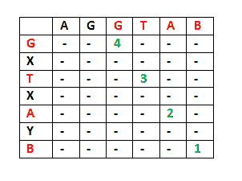

# 最长公共子序列| DP-4

> 原文:[https://www . geesforgeks . org/最长-公共-子序列-dp-4/](https://www.geeksforgeeks.org/longest-common-subsequence-dp-4/)

我们分别在[集 1](https://www.geeksforgeeks.org/dynamic-programming-set-1/) 和[集 2](https://www.geeksforgeeks.org/dynamic-programming-set-2-optimal-substructure-property/) 中讨论了重叠子问题和最优子结构性质。我们还讨论了[第三集](https://www.geeksforgeeks.org/longest-increasing-subsequence/)中的一个例题。让我们讨论最长公共子序列(LCS)问题，作为另一个可以使用动态规划解决的示例问题。

*LCS 问题陈述:*给定两个序列，求两个序列中最长子序列的长度。子序列是以相同的相对顺序出现的序列，但不一定是连续的。例如，“abc”、“abg”、“bdf”、“aeg”、“acefg”，..etc 是“abcdefg”的子序列。

为了找出蛮力方法的复杂性，我们需要首先知道长度为 n 的字符串的可能的不同子序列的数量，即找到长度为 1，2，..n-1。从排列组合理论回忆，1 个元素的组合数为 <sup>n</sup> C <sub>1</sub> 。有 2 个元素的组合数量为 <sup>n</sup> C <sub>2</sub> 等等。我们知道<sup>n</sup>C<sub>0</sub>+<sup>n</sup>C<sub>1</sub>+<sup>n</sup>C<sub>2</sub>+……<sup>n</sup>C<sub>n</sub>= 2<sup>n</sup>。因此长度为 n 的字符串有 2 <sup>n</sup> -1 个不同的可能子序列，因为我们没有考虑长度为 0 的子序列。这意味着强力方法的时间复杂度将是 O(n * 2 <sup>n</sup> )。请注意，检查子序列是否为两个字符串所共有需要 O(n)个时间。使用动态编程可以提高时间复杂度。

是一个经典的计算机科学问题， [diff](http://en.wikipedia.org/wiki/Diff) (输出两个文件之间差异的文件比较程序)的基础，在生物信息学中有应用。

**示例:**
LCS 对于输入序列“ABCDGH”和“AEDFHR”是长度为 3 的“ADH”。
LCS 为输入序列“AGGTAB”而“GXTXAYB”为长度为 4 的“GTAB”。

这个问题的原始解决方案是生成两个给定序列的所有子序列，并找到最长的匹配子序列。这个解决方案在时间复杂度方面是指数级的。让我们看看这个问题如何同时具有动态规划问题的两个重要性质。

**1)最优子结构:**
让输入序列为 X[0..m-1]和 Y[0..长度分别为 m 和 n 的 n-1]。并让 L(X[0..m-1]，Y[0..n-1])是两个序列 X 和 y 的 LCS 长度。下面是 L(X[0..m-1]，Y[0..n-1])。

如果两个序列的最后一个字符匹配(或 X[m-1] == Y[n-1])，则
L(X[0..m-1]，Y[0..n-1]) = 1 + L(X[0..m-2]，Y[0..n-2])

如果两个序列的最后一个字符不匹配(或 X[m-1]！= Y[n-1])然后
L(X[0..m-1]，Y[0..n-1]) = MAX ( L(X[0..m-2]，Y[0..n-1])，L(X[0..m-1]，Y[0..n-2])

示例:
1)考虑输入字符串“AGGTAB”和“GXTXAYB”。字符串的最后一个字符匹配。所以 LCS 的长度可以写成:
L(“AGGTAB”，“GXTXAYB”)= 1+L(“AGGTA”，“GXTXAY”)



2)考虑输入字符串“ABCDGH”和“AEDFHR”。字符串的最后一个字符不匹配。所以 LCS 的长度可以写成:
L(“ABCDGH”，“AEDFHR”)= MAX(L(“ABCDG”，“AEDFH”**R**)、L(“ABCDG**H**、“AEDFH”))
所以 LCS 问题具有最优子结构性质，因为主要问题可以用子问题的解来解决。

**2)重叠子问题:**
下面是 LCS 问题的简单递归实现。实现简单地遵循上面提到的递归结构。

## C++

```
/* A Naive recursive implementation of LCS problem */
#include <bits/stdc++.h>
using namespace std;

/* Returns length of LCS for X[0..m-1], Y[0..n-1] */
int lcs( char *X, char *Y, int m, int n )
{
    if (m == 0 || n == 0)
        return 0;
    if (X[m-1] == Y[n-1])
        return 1 + lcs(X, Y, m-1, n-1);
    else
        return max(lcs(X, Y, m, n-1), lcs(X, Y, m-1, n));
}

/* Driver code */
int main()
{
    char X[] = "AGGTAB";
    char Y[] = "GXTXAYB";

    int m = strlen(X);
    int n = strlen(Y);

    cout<<"Length of LCS is "<< lcs( X, Y, m, n ) ;

    return 0;
}

// This code is contributed by rathbhupendra
```

## C

```
/* A Naive recursive implementation of LCS problem */
#include<bits/stdc++.h>

int max(int a, int b);

/* Returns length of LCS for X[0..m-1], Y[0..n-1] */
int lcs( char *X, char *Y, int m, int n )
{
if (m == 0 || n == 0)
    return 0;
if (X[m-1] == Y[n-1])
    return 1 + lcs(X, Y, m-1, n-1);
else
    return max(lcs(X, Y, m, n-1), lcs(X, Y, m-1, n));
}

/* Utility function to get max of 2 integers */
int max(int a, int b)
{
    return (a > b)? a : b;
}

/* Driver program to test above function */
int main()
{
char X[] = "AGGTAB";
char Y[] = "GXTXAYB";

int m = strlen(X);
int n = strlen(Y);

printf("Length of LCS is %d", lcs( X, Y, m, n ) );

return 0;
}
```

## Java 语言(一种计算机语言，尤用于创建网站)

```
/* A Naive recursive implementation of LCS problem in java*/
public class LongestCommonSubsequence
{

/* Returns length of LCS for X[0..m-1], Y[0..n-1] */
int lcs( char[] X, char[] Y, int m, int n )
{
    if (m == 0 || n == 0)
    return 0;
    if (X[m-1] == Y[n-1])
    return 1 + lcs(X, Y, m-1, n-1);
    else
    return max(lcs(X, Y, m, n-1), lcs(X, Y, m-1, n));
}

/* Utility function to get max of 2 integers */
int max(int a, int b)
{
    return (a > b)? a : b;
}

public static void main(String[] args)
{
    LongestCommonSubsequence lcs = new LongestCommonSubsequence();
    String s1 = "AGGTAB";
    String s2 = "GXTXAYB";

    char[] X=s1.toCharArray();
    char[] Y=s2.toCharArray();
    int m = X.length;
    int n = Y.length;

    System.out.println("Length of LCS is" + " " +
                                lcs.lcs( X, Y, m, n ) );
}

}

// This Code is Contributed by Saket Kumar
```

## 计算机编程语言

```
# A Naive recursive Python implementation of LCS problem

def lcs(X, Y, m, n):

    if m == 0 or n == 0:
    return 0;
    elif X[m-1] == Y[n-1]:
    return 1 + lcs(X, Y, m-1, n-1);
    else:
    return max(lcs(X, Y, m, n-1), lcs(X, Y, m-1, n));

# Driver program to test the above function
X = "AGGTAB"
Y = "GXTXAYB"
print "Length of LCS is ", lcs(X , Y, len(X), len(Y))
```

## C#

```
/* C# Naive recursive implementation of LCS problem */
using System;

class GFG
{

    /* Returns length of LCS for X[0..m-1], Y[0..n-1] */
    static int lcs( char[] X, char[] Y, int m, int n )
    {
        if (m == 0 || n == 0)
        return 0;
        if (X[m - 1] == Y[n - 1])
        return 1 + lcs(X, Y, m - 1, n - 1);
        else
        return max(lcs(X, Y, m, n - 1), lcs(X, Y, m - 1, n));
    }

    /* Utility function to get max of 2 integers */
    static int max(int a, int b)
    {
        return (a > b)? a : b;
    }

    public static void Main()
    {
        String s1 = "AGGTAB";
        String s2 = "GXTXAYB";

        char[] X=s1.ToCharArray();
        char[] Y=s2.ToCharArray();
        int m = X.Length;
        int n = Y.Length;

        Console.Write("Length of LCS is" + " "
                    +lcs( X, Y, m, n ) );
    }
}
// This code is Contributed by Sam007
```

## 服务器端编程语言（Professional Hypertext Preprocessor 的缩写）

```
<?php
// A Naive recursive PHP
// implementation of LCS problem
function lcs($X, $Y, $m, $n)
{
    if($m == 0 || $n == 0)
    return 0;
    else if ($X[$m - 1] == $Y[$n - 1])
        return 1 + lcs($X, $Y,
                    $m - 1, $n - 1);
    else
        return max(lcs($X, $Y, $m, $n - 1),
                lcs($X, $Y, $m - 1, $n));
}

// Driver Code
$X = "AGGTAB";
$Y = "GXTXAYB";
echo "Length of LCS is ";
echo lcs($X , $Y, strlen($X),
                strlen($Y));

// This code is contributed
// by Shivi_Aggarwal
?>
```

## java 描述语言

```
<script>
/* A Naive recursive implementation of LCS problem in java*/

/* Returns length of LCS for X[0..m-1], Y[0..n-1] */
function lcs(  X,  Y , m , n )
{
    if (m == 0 || n == 0)
    return 0;
    if (X[m-1] == Y[n-1])
    return 1 + lcs(X, Y, m-1, n-1);
    else
    return max(lcs(X, Y, m, n-1), lcs(X, Y, m-1, n));
}

/* Utility function to get max of 2 integers */
function max(a , b)
{
    return (a > b)? a : b;
}

    var s1 = "AGGTAB";
    var s2 = "GXTXAYB";

    var X=s1;
    var Y=s2;
    var m = X.length;
    var n = Y.length;

    document.write("Length of LCS is" + " " +
                                lcs( X, Y, m, n ) );

// This code contributed by umadevi9616
</script>
```

**输出:**

```
Length of LCS is 4
```

上述朴素递归方法的时间复杂度是 O(2^n)，并且当 x 和 y 不匹配的所有字符，即 LCS 的长度为 0 时，最坏的情况发生。

考虑到上面的实现，下面是输入字符串“AXYT”和“AYZX”的部分递归树

```
                         lcs("AXYT", "AYZX")
                       /                 
         lcs("AXY", "AYZX")            lcs("AXYT", "AYZ")
         /                              /               
lcs("AX", "AYZX") lcs("AXY", "AYZ")   lcs("AXY", "AYZ") lcs("AXYT", "AY")
```

在上面的部分递归树中，LCS(“AXY”、“AYZ”)被求解了两次。如果我们画出完整的递归树，那么我们可以看到有许多子问题被一次又一次地解决。因此，该问题具有重叠子结构性质，用记忆法或制表法都可以避免同一子问题的重新计算。下面是 LCS 问题的表格实现。

## 蟒蛇 3

```
def lcs(s1 , s2):
   m, n = len(s1), len(s2)
   prev, cur = [0]*(n+1), [0]*(n+1)
   for i in range(1, m+1):
       for j in range(1, n+1):
           if s1[i-1] == s2[j-1]:
               cur[j] = 1 + prev[j-1]
           else:
               if cur[j-1] > prev[j]:
                   cur[j] = cur[j-1]
               else:
                   cur[j] = prev[j]
       cur, prev = prev, cur
   return prev[n]

#end of function lcs

# Driver program to test the above function
s1 = "AGGTAB"
s2 = "GXTXAYB"
print("Length of LCS is ", lcs(s1, s2))
# BY PRASHANT SHEKHAR MISHRA
```

## C

```
/* Dynamic Programming C implementation of LCS problem */
#include<bits/stdc++.h>

int max(int a, int b);

/* Returns length of LCS for X[0..m-1], Y[0..n-1] */
int lcs( char *X, char *Y, int m, int n )
{
int L[m+1][n+1];
int i, j;

/* Following steps build L[m+1][n+1] in bottom up fashion. Note
    that L[i][j] contains length of LCS of X[0..i-1] and Y[0..j-1] */
for (i=0; i<=m; i++)
{
    for (j=0; j<=n; j++)
    {
    if (i == 0 || j == 0)
        L[i][j] = 0;

    else if (X[i-1] == Y[j-1])
        L[i][j] = L[i-1][j-1] + 1;

    else
        L[i][j] = max(L[i-1][j], L[i][j-1]);
    }
}

/* L[m][n] contains length of LCS for X[0..n-1] and Y[0..m-1] */
return L[m][n];
}

/* Utility function to get max of 2 integers */
int max(int a, int b)
{
    return (a > b)? a : b;
}

/* Driver program to test above function */
int main()
{
char X[] = "AGGTAB";
char Y[] = "GXTXAYB";

int m = strlen(X);
int n = strlen(Y);

printf("Length of LCS is %d", lcs( X, Y, m, n ) );

return 0;
}
```

## Java 语言(一种计算机语言，尤用于创建网站)

```
/* Dynamic Programming Java implementation of LCS problem */
public class LongestCommonSubsequence
{

/* Returns length of LCS for X[0..m-1], Y[0..n-1] */
int lcs( char[] X, char[] Y, int m, int n )
{
    int L[][] = new int[m+1][n+1];

    /* Following steps build L[m+1][n+1] in bottom up fashion. Note
        that L[i][j] contains length of LCS of X[0..i-1] and Y[0..j-1] */
    for (int i=0; i<=m; i++)
    {
    for (int j=0; j<=n; j++)
    {
        if (i == 0 || j == 0)
            L[i][j] = 0;
        else if (X[i-1] == Y[j-1])
            L[i][j] = L[i-1][j-1] + 1;
        else
            L[i][j] = max(L[i-1][j], L[i][j-1]);
    }
    }
return L[m][n];
}

/* Utility function to get max of 2 integers */
int max(int a, int b)
{
    return (a > b)? a : b;
}

public static void main(String[] args)
{
    LongestCommonSubsequence lcs = new LongestCommonSubsequence();
    String s1 = "AGGTAB";
    String s2 = "GXTXAYB";

    char[] X=s1.toCharArray();
    char[] Y=s2.toCharArray();
    int m = X.length;
    int n = Y.length;

    System.out.println("Length of LCS is" + " " +
                                lcs.lcs( X, Y, m, n ) );
}

}

// This Code is Contributed by Saket Kumar
```

## 计算机编程语言

```
# Dynamic Programming implementation of LCS problem

def lcs(X , Y):
    # find the length of the strings
    m = len(X)
    n = len(Y)

    # declaring the array for storing the dp values
    L = [[None]*(n+1) for i in xrange(m+1)]

    """Following steps build L[m+1][n+1] in bottom up fashion
    Note: L[i][j] contains length of LCS of X[0..i-1]
    and Y[0..j-1]"""
    for i in range(m+1):
        for j in range(n+1):
            if i == 0 or j == 0 :
                L[i][j] = 0
            elif X[i-1] == Y[j-1]:
                L[i][j] = L[i-1][j-1]+1
            else:
                L[i][j] = max(L[i-1][j] , L[i][j-1])

    # L[m][n] contains the length of LCS of X[0..n-1] & Y[0..m-1]
    return L[m][n]
#end of function lcs

# Driver program to test the above function
X = "AGGTAB"
Y = "GXTXAYB"
print "Length of LCS is ", lcs(X, Y)

# This code is contributed by Nikhil Kumar Singh(nickzuck_007)
```

## C#

```
// Dynamic Programming C# implementation
// of LCS problem
using System;

class GFG
{

    /* Returns length of LCS for X[0..m-1], Y[0..n-1] */
    static int lcs( char[] X, char[] Y, int m, int n )
    {
        int [,]L = new int[m+1,n+1];

        /* Following steps build L[m+1][n+1]
        in bottom up fashion. Note
        that L[i][j] contains length of
        LCS of X[0..i-1] and Y[0..j-1] */
        for (int i = 0; i <= m; i++)
        {
            for (int j = 0; j <= n; j++)
            {
                if (i == 0 || j == 0)
                    L[i, j] = 0;
                else if (X[i - 1] == Y[j - 1])
                    L[i, j] = L[i - 1, j - 1] + 1;
                else
                    L[i, j] = max(L[i - 1, j], L[i, j - 1]);
            }
        }
        return L[m, n];
    }

    /* Utility function to get max of 2 integers */
    static int max(int a, int b)
    {
        return (a > b)? a : b;
    }

    // Driver code
    public static void Main()
    {

        String s1 = "AGGTAB";
        String s2 = "GXTXAYB";

        char[] X=s1.ToCharArray();
        char[] Y=s2.ToCharArray();
        int m = X.Length;
        int n = Y.Length;

        Console.Write("Length of LCS is" + " " +lcs( X, Y, m, n ) );
    }
}
// This Code is Contributed by Sam007
```

## 服务器端编程语言（Professional Hypertext Preprocessor 的缩写）

```
<?php
// Dynamic Programming C#
// implementation of LCS problem
function lcs($X , $Y)
{
// find the length of the strings
$m = strlen($X);
$n = strlen($Y) ;

// declaring the array for
// storing the dp values

/*Following steps build L[m+1][n+1]
in bottom up fashion .
Note: L[i][j] contains length of
LCS of X[0..i-1] and Y[0..j-1] */
for ($i = 0; $i <= $m; $i++)
{
for ($j = 0; $j <= $n; $j++)
{
    if ($i == 0 || $j == 0)
    $L[$i][$j] = 0;

    else if ($X[$i - 1] == $Y[$j - 1])
    $L[$i][$j] = $L[$i - 1][$j - 1] + 1;

    else
    $L[$i][$j] = max($L[$i - 1][$j],
                    $L[$i][$j - 1]);
}
}

// L[m][n] contains the length of
// LCS of X[0..n-1] & Y[0..m-1]

return $L[$m][$n];
}

// Driver Code
$X = "AGGTAB";
$Y = "GXTXAYB";
echo "Length of LCS is ";
echo lcs($X, $Y);

// This code is contributed
// by Shivi_Aggarwal
?>
```

## java 描述语言

```
<script>

// Dynamic Programming Java implementation of LCS problem

// Utility function to get max of 2 integers
function max(a, b)
{
    if (a > b)
        return a;
    else
        return b;
}

// Returns length of LCS for X[0..m-1], Y[0..n-1]
function lcs(X, Y, m, n)
{
    var L = new Array(m + 1);
    for(var i = 0; i < L.length; i++)
    {
        L[i] = new Array(n + 1);
    }
    var i, j;

    /* Following steps build L[m+1][n+1] in
    bottom up fashion. Note that L[i][j]
    contains length of LCS of X[0..i-1]
    and Y[0..j-1] */
    for(i = 0; i <= m; i++)
    {
        for(j = 0; j <= n; j++)
        {
            if (i == 0 || j == 0)
                L[i][j] = 0;
            else if (X[i - 1] == Y[j - 1])
                L[i][j] = L[i - 1][j - 1] + 1;
            else
                L[i][j] = max(L[i - 1][j], L[i][j - 1]);
        }
    }

    /* L[m][n] contains length of LCS
    for X[0..n-1] and Y[0..m-1] */
    return L[m][n];
}

// Driver code
var x = "AGGTAB";
var y = "GXTXAYB";

var m = x.length;
var n = y.length;

document.write("Length of LCS is " + lcs(x, y, m, n));

// This code is contributed by akshitsaxenaa09

</script>
```

**输出:**

```
Length of LCS is 4
```

上述实现的时间复杂度为 O(mn)，比朴素递归实现的最坏情况时间复杂度好得多。
上述算法/代码只返回 LCS 长度。请参阅下面的帖子来打印 LCS。
[打印最长公共子序列](https://www.geeksforgeeks.org/printing-longest-common-subsequence/)
还可以查看
[LCS 的空间优化版本 LCS 的空间优化解](https://www.geeksforgeeks.org/space-optimized-solution-lcs/)

如果你发现任何不正确的地方，或者你想分享更多关于上面讨论的话题的信息，请写评论。
[近期基于 LCS 的文章！](https://www.geeksforgeeks.org/tag/lcs/)

**参考文献:**
[【http://www.youtube.com/watch?v=V5hZoJ6uK-s】](http://www.youtube.com/watch?v=V5hZoJ6uK-s)
[http://www . algorithm ist . com/index . PHP/long _ Common _ subsequel](http://www.algorithmist.com/index.php/Longest_Common_Subsequence)
[http://www.ics.uci.edu/~eppstein/161/960229.html](http://www.ics.uci.edu/~eppstein/161/960229.html)
[http://en . Wikipedia . org/wiki/long _ Common _ subsequel _ problem](http://en.wikipedia.org/wiki/Longest_common_subsequence_problem)