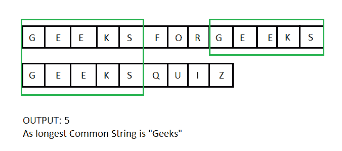

# 最长公共子串| DP-29

> 原文:[https://www . geesforgeks . org/long-common-substring-DP-29/](https://www.geeksforgeeks.org/longest-common-substring-dp-29/)

给定两个字符串“X”和“Y”，求最长公共子字符串的长度。

**示例:**

> **输入:**X =“Geeks forgeeks”，y =“GeeksQuiz”
> T3】输出 : 5
> **解释:**
> 最长的常见子串是“Geeks”，长度为 5。
> 
> **输入:**X =“abcdxyz”，y =“xyzabcd”
> **输出:** 4
> **解释:**
> 最长的常见子串是“abcd”，长度为 4。
> 
> **输入:**X =“zxabcdezy”，y =“yzabcdez”
> T3】输出: 6
> **解释:**
> 最长的常见子串是“abcdez”，长度为 6。



**逼近:**
设 m 和 n 分别为第一和第二弦的长度。

一个**简单的解决方案**是逐个考虑第一个字符串的所有子字符串，对于每个子字符串，检查它是否是第二个字符串中的子字符串。跟踪最大长度的子字符串。会有 O(m^2)子字符串，我们可以在 O(n)时间内找到一个字符串是否是另一个字符串上的子字符串(参见[本](https://www.geeksforgeeks.org/searching-for-patterns-set-2-kmp-algorithm/))。因此该方法的总时间复杂度为 0(n * m<sup>2</sup>

**动态规划**可以用来寻找 O(m*n)时间内最长的公共子串。其思想是为两个字符串的所有子字符串找到最长公共后缀的长度，并将这些长度存储在一个表中。

> 最长公共后缀具有以下最优子结构性质。
> 如果最后一个字符匹配，那么我们将两个长度都减少 1
> lcsuf(X，Y，m，n)= lcsuf(X，Y，m-1，n-1) + 1 如果 X[m-1] = Y[n-1]
> 如果最后一个字符不匹配，那么结果为 0，即
> lcsuf(X，Y，m，n) = 0 如果(X[m-1]！= Y[n-1])
> 现在我们考虑以不同索引结束的不同子串的后缀。
> 最大长度最长公共后缀是最长的公共子串。
> LCSubStr(X，Y，m，n) = Max(LCSuff(X，Y，I，j))，其中 1 < = i < = m，1 < = j < = n

以下是上述解决方案的迭代实现。

## C++

```
/* Dynamic Programming solution to
   find length of the
   longest common substring */
#include <iostream>
#include <string.h>
using namespace std;

/* Returns length of longest
   common substring of X[0..m-1]
   and Y[0..n-1] */
int LCSubStr(char* X, char* Y, int m, int n)
{
    // Create a table to store
    // lengths of longest
    // common suffixes of substrings.  
    // Note that LCSuff[i][j] contains
    // length of longest common suffix
    // of X[0..i-1] and Y[0..j-1].

    int LCSuff[m + 1][n + 1];
    int result = 0; // To store length of the
                    // longest common substring

    /* Following steps build LCSuff[m+1][n+1] in
        bottom up fashion. */
    for (int i = 0; i <= m; i++)
    {
        for (int j = 0; j <= n; j++)
        {
            // The first row and first column
            // entries have no logical meaning,
            // they are used only for simplicity
            // of program
            if (i == 0 || j == 0)
                LCSuff[i][j] = 0;

            else if (X[i - 1] == Y[j - 1]) {
                LCSuff[i][j] = LCSuff[i - 1][j - 1] + 1;
                result = max(result, LCSuff[i][j]);
            }
            else
                LCSuff[i][j] = 0;
        }
    }
    return result;
}

// Driver code
int main()
{
    char X[] = "OldSite:GeeksforGeeks.org";
    char Y[] = "NewSite:GeeksQuiz.com";

    int m = strlen(X);
    int n = strlen(Y);

    cout << "Length of Longest Common Substring is "
         << LCSubStr(X, Y, m, n);
    return 0;
}
```

## Java 语言(一种计算机语言，尤用于创建网站)

```
//  Java implementation of
// finding length of longest
// Common substring using
// Dynamic Programming
class GFG {
    /*
       Returns length of longest common substring
       of X[0..m-1] and Y[0..n-1]
    */
    static int LCSubStr(char X[], char Y[],
                         int m, int n)
    {
        // Create a table to store
        // lengths of longest common
        // suffixes of substrings.
        // Note that LCSuff[i][j]
        // contains length of longest
        // common suffix of
        // X[0..i-1] and Y[0..j-1].
        // The first row and first
        // column entries have no
        // logical meaning, they are
        // used only for simplicity of program
        int LCStuff[][] = new int[m + 1][n + 1];

        // To store length of the longest
        // common substring
        int result = 0;

        // Following steps build
        // LCSuff[m+1][n+1] in bottom up fashion
        for (int i = 0; i <= m; i++)
        {
            for (int j = 0; j <= n; j++)
            {
                if (i == 0 || j == 0)
                    LCStuff[i][j] = 0;
                else if (X[i - 1] == Y[j - 1])
                {
                    LCStuff[i][j]
                        = LCStuff[i - 1][j - 1] + 1;
                    result = Integer.max(result,
                                         LCStuff[i][j]);
                }
                else
                    LCStuff[i][j] = 0;
            }
        }
        return result;
    }

    // Driver Code
    public static void main(String[] args)
    {
        String X = "OldSite:GeeksforGeeks.org";
        String Y = "NewSite:GeeksQuiz.com";

        int m = X.length();
        int n = Y.length();

        System.out.println(LCSubStr(X.toCharArray(),
                                    Y.toCharArray(), m,
                       n));
    }
}

// This code is contributed by Sumit Ghosh
```

## 蟒蛇 3

```
# Python3 implementation of Finding
# Length of Longest Common Substring

# Returns length of longest common
# substring of X[0..m-1] and Y[0..n-1]

def LCSubStr(X, Y, m, n):

    # Create a table to store lengths of
    # longest common suffixes of substrings.
    # Note that LCSuff[i][j] contains the
    # length of longest common suffix of
    # X[0...i-1] and Y[0...j-1]. The first
    # row and first column entries have no
    # logical meaning, they are used only
    # for simplicity of the program.

    # LCSuff is the table with zero
    # value initially in each cell
    LCSuff = [[0 for k in range(n+1)] for l in range(m+1)]

    # To store the length of
    # longest common substring
    result = 0

    # Following steps to build
    # LCSuff[m+1][n+1] in bottom up fashion
    for i in range(m + 1):
        for j in range(n + 1):
            if (i == 0 or j == 0):
                LCSuff[i][j] = 0
            elif (X[i-1] == Y[j-1]):
                LCSuff[i][j] = LCSuff[i-1][j-1] + 1
                result = max(result, LCSuff[i][j])
            else:
                LCSuff[i][j] = 0
    return result

# Driver Code
X = 'OldSite:GeeksforGeeks.org'
Y = 'NewSite:GeeksQuiz.com'

m = len(X)
n = len(Y)

print('Length of Longest Common Substring is',
      LCSubStr(X, Y, m, n))

# This code is contributed by Soumen Ghosh
```

## C#

```
// C# implementation of finding length of longest
// Common substring using Dynamic Programming
using System;

class GFG {

    // Returns length of longest common
    // substring of X[0..m-1] and Y[0..n-1]
    static int LCSubStr(string X, string Y, int m, int n)
    {

        // Create a table to store lengths of
        // longest common suffixes of substrings.
        // Note that LCSuff[i][j] contains length
        // of longest common suffix of X[0..i-1]
        // and Y[0..j-1]. The first row and first
        // column entries have no logical meaning,
        // they are used only for simplicity of
        // program
        int[, ] LCStuff = new int[m + 1, n + 1];

        // To store length of the longest common
        // substring
        int result = 0;

        // Following steps build LCSuff[m+1][n+1]
        // in bottom up fashion
        for (int i = 0; i <= m; i++)
        {
            for (int j = 0; j <= n; j++)
            {
                if (i == 0 || j == 0)
                    LCStuff[i, j] = 0;
                else if (X[i - 1] == Y[j - 1])
                {
                    LCStuff[i, j]
                        = LCStuff[i - 1, j - 1] + 1;

                    result
                        = Math.Max(result, LCStuff[i, j]);
                }
                else
                    LCStuff[i, j] = 0;
            }
        }

        return result;
    }

    // Driver Code
    public static void Main()
    {
        String X = "OldSite:GeeksforGeeks.org";
        String Y = "NewSite:GeeksQuiz.com";

        int m = X.Length;
        int n = Y.Length;

        Console.Write("Length of Longest Common"
                      + " Substring is "
                      + LCSubStr(X, Y, m, n));
    }
}

// This code is contributed by Sam007.
```

## 服务器端编程语言（Professional Hypertext Preprocessor 的缩写）

```
<?php
// Dynamic Programming solution to find
// length of the longest common substring

// Returns length of longest common
// substring of X[0..m-1] and Y[0..n-1]
function LCSubStr($X, $Y, $m, $n)
{
    // Create a table to store lengths of
    // longest common suffixes of substrings.
    // Notethat LCSuff[i][j] contains length
    // of longest common suffix of X[0..i-1]
    // and Y[0..j-1]. The first row and
    // first column entries have no logical
    // meaning, they are used only for
    // simplicity of program
    $LCSuff = array_fill(0, $m + 1,
              array_fill(0, $n + 1, NULL));
    $result = 0; // To store length of the
                 // longest common substring

    // Following steps build LCSuff[m+1][n+1]
    // in bottom up fashion.
    for ($i = 0; $i <= $m; $i++)
    {
        for ($j = 0; $j <= $n; $j++)
        {
            if ($i == 0 || $j == 0)
                $LCSuff[$i][$j] = 0;

            else if ($X[$i - 1] == $Y[$j - 1])
            {
                $LCSuff[$i][$j] = $LCSuff[$i - 1][$j - 1] + 1;
                $result = max($result,
                              $LCSuff[$i][$j]);
            }
            else $LCSuff[$i][$j] = 0;
        }
    }
    return $result;
}

// Driver Code
$X = "OldSite:GeeksforGeeks.org";
$Y = "NewSite:GeeksQuiz.com";

$m = strlen($X);
$n = strlen($Y);

echo "Length of Longest Common Substring is " .
                      LCSubStr($X, $Y, $m, $n);

// This code is contributed by ita_c
?>
```

## java 描述语言

```
<script>

// JavaScript implementation of
// finding length of longest
// Common substring using
// Dynamic Programming

    /*
     Returns length of longest common
     substring of X[0..m-1] and Y[0..n-1]
     */
    function LCSubStr( X,  Y , m , n) {
        // Create a table to store
        // lengths of longest common
        // suffixes of substrings.
        // Note that LCSuff[i][j]
        // contains length of longest
        // common suffix of
        // X[0..i-1] and Y[0..j-1].
        // The first row and first
        // column entries have no
        // logical meaning, they are
        // used only for simplicity of program

        var LCStuff =
        Array(m + 1).fill().map(()=>Array(n + 1).fill(0));

        // To store length of the longest
        // common substring
        var result = 0;

        // Following steps build
        // LCSuff[m+1][n+1] in bottom up fashion
        for (i = 0; i <= m; i++) {
            for (j = 0; j <= n; j++) {
                if (i == 0 || j == 0)
                    LCStuff[i][j] = 0;
                else if (X[i - 1] == Y[j - 1]) {
                    LCStuff[i][j] = LCStuff[i - 1][j - 1] + 1;
                    result = Math.max(result, LCStuff[i][j]);
                } else
                    LCStuff[i][j] = 0;
            }
        }
        return result;
    }

    // Driver Code

        var X = "OldSite:GeeksforGeeks.org";
        var Y = "NewSite:GeeksQuiz.com";

        var m = X.length;
        var n = Y.length;

        document.write("Length of Longest Common Substring is " +
        LCSubStr(X, Y, m, n));

// This code contributed by Rajput-Ji

</script>
```

**Output**

```
Length of Longest Common Substring is 10
```