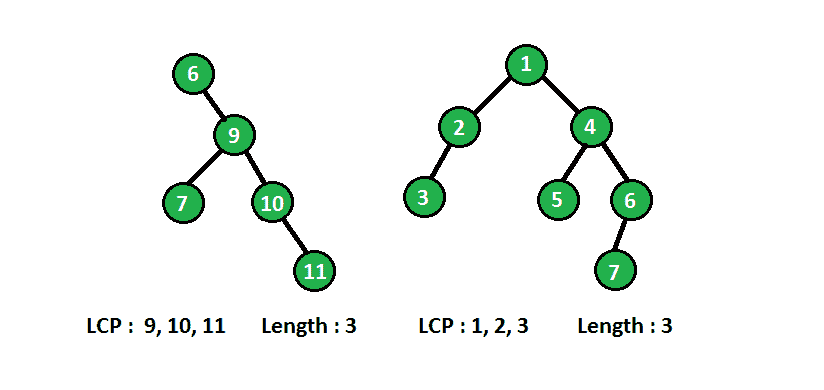

# 二叉树中最长的连续序列

> 原文:[https://www . geesforgeks . org/最长连续序列二叉树/](https://www.geeksforgeeks.org/longest-consecutive-sequence-binary-tree/)

给定一棵二叉树，找出最长路径的长度，该路径由具有递增顺序的连续值的节点组成。每个节点都被视为长度为 1 的路径。
**例:**

```
In below diagram binary tree with longest consecutive path(LCP) are shown :

```



我们可以递归地解决上述问题。在每个节点上，我们需要它的父节点的信息，如果当前节点的值比它的父节点多一个，那么它就形成一条连续的路径，在每个节点上，我们将节点的值与其父节点的值进行比较，并相应地更新最长的连续路径。
为了得到父节点的值，我们将把(node_value + 1)作为参数传递给递归方法，并将节点值与这个参数值进行比较，如果满足，则更新当前连续路径的长度，否则将当前路径长度重新初始化 1。
为了更好的理解，请看下面的代码:

## C++

```
// C/C++ program to find longest consecutive
// sequence in binary tree
#include <bits/stdc++.h>
using namespace std;

/* A binary tree node has data, pointer to left
   child and a pointer to right child */
struct Node
{
    int data;
    Node *left, *right;
};

// A utility function to create a node
Node* newNode(int data)
{
    Node* temp = new Node;
    temp->data = data;
    temp->left = temp->right = NULL;
    return temp;
}

// Utility method to return length of longest
// consecutive sequence of tree
void longestConsecutiveUtil(Node* root, int curLength,
                              int expected, int& res)
{
    if (root == NULL)
        return;

    // if root data has one more than its parent
    // then increase current length
    if (root->data == expected)
        curLength++;
    else
        curLength = 1;

    //  update the maximum by current length
    res = max(res, curLength);

    // recursively call left and right subtree with
    // expected value 1 more than root data
    longestConsecutiveUtil(root->left, curLength,
                           root->data + 1, res);
    longestConsecutiveUtil(root->right, curLength,
                           root->data + 1, res);
}

// method returns length of longest consecutive
// sequence rooted at node root
int longestConsecutive(Node* root)
{
    if (root == NULL)
        return 0;

    int res = 0;

    //  call utility method with current length 0
    longestConsecutiveUtil(root, 0, root->data, res);

    return res;
}

//  Driver code to test above methods
int main()
{
    Node* root = newNode(6);
    root->right = newNode(9);
    root->right->left = newNode(7);
    root->right->right = newNode(10);
    root->right->right->right = newNode(11);

    printf("%d\n", longestConsecutive(root));
    return 0;
}
```

## Java 语言(一种计算机语言，尤用于创建网站)

```
// Java program to find longest consecutive
// sequence in binary tree

class Node
{
    int data;
    Node left, right;

    Node(int item)
    {
        data = item;
        left = right = null;
    }
}

class Result
{
    int res = 0;
}

class BinaryTree
{
    Node root;

    // method returns length of longest consecutive
    // sequence rooted at node root
    int longestConsecutive(Node root)
    {
        if (root == null)
            return 0;

        Result res = new Result();

        // call utility method with current length 0
        longestConsecutiveUtil(root, 0, root.data, res);

        return res.res;
    }

    // Utility method to return length of longest
    // consecutive sequence of tree
    private void longestConsecutiveUtil(Node root, int curlength,
                                        int expected, Result res)
    {
        if (root == null)
            return;

        // if root data has one more than its parent
        // then increase current length
        if (root.data == expected)
            curlength++;
        else
            curlength = 1;

        // update the maximum by current length
        res.res = Math.max(res.res, curlength);

        // recursively call left and right subtree with
        // expected value 1 more than root data
        longestConsecutiveUtil(root.left, curlength, root.data + 1, res);
        longestConsecutiveUtil(root.right, curlength, root.data + 1, res);
    }

    // Driver code
    public static void main(String args[])
    {
        BinaryTree tree = new BinaryTree();

        tree.root = new Node(6);
        tree.root.right = new Node(9);
        tree.root.right.left = new Node(7);
        tree.root.right.right = new Node(10);
        tree.root.right.right.right = new Node(11);

        System.out.println(tree.longestConsecutive(tree.root));
    }
}

// This code is contributed by shubham96301
```

## 蟒蛇 3

```
# Python3 program to find longest consecutive
# sequence in binary tree

# A utility class to create a node
class newNode:
    def __init__(self, data):
        self.data = data
        self.left = self.right = None

# Utility method to return length of
# longest consecutive sequence of tree
def longestConsecutiveUtil(root, curLength,
                           expected, res):
    if (root == None):
        return

    # if root data has one more than its
    # parent then increase current length
    if (root.data == expected):
        curLength += 1
    else:
        curLength = 1

    # update the maximum by current length
    res[0] = max(res[0], curLength)

    # recursively call left and right subtree
    # with expected value 1 more than root data
    longestConsecutiveUtil(root.left, curLength,
                           root.data + 1, res)
    longestConsecutiveUtil(root.right, curLength,
                           root.data + 1, res)

# method returns length of longest consecutive
# sequence rooted at node root
def longestConsecutive(root):
    if (root == None):
        return 0

    res = [0]

    # call utility method with current length 0
    longestConsecutiveUtil(root, 0, root.data, res)

    return res[0]

# Driver Code
if __name__ == '__main__':

    root = newNode(6)
    root.right = newNode(9)
    root.right.left = newNode(7)
    root.right.right = newNode(10)
    root.right.right.right = newNode(11)

    print(longestConsecutive(root))

# This code is contributed by PranchalK
```

## C#

```
// C# program to find longest consecutive
// sequence in binary tree
using System;
class Node
{
    public int data;
    public Node left, right;

    public Node(int item)
    {
        data = item;
        left = right = null;
    }
}

class Result
{
    public int res = 0;
}

class GFG
{
    Node root;

    // method returns length of longest consecutive
    // sequence rooted at node root
    int longestConsecutive(Node root)
    {
        if (root == null)
            return 0;

        Result res = new Result();

        // call utility method with current length 0
        longestConsecutiveUtil(root, 0, root.data, res);

        return res.res;
    }

    // Utility method to return length of longest
    // consecutive sequence of tree
    private void longestConsecutiveUtil(Node root, int curlength,
                                        int expected, Result res)
    {
        if (root == null)
            return;

        // if root data has one more than its parent
        // then increase current length
        if (root.data == expected)
            curlength++;
        else
            curlength = 1;

        // update the maximum by current length
        res.res = Math.Max(res.res, curlength);

        // recursively call left and right subtree with
        // expected value 1 more than root data
        longestConsecutiveUtil(root.left, curlength,
                               root.data + 1, res);
        longestConsecutiveUtil(root.right, curlength,
                               root.data + 1, res);
    }

    // Driver code
    public static void Main(String []args)
    {
        GFG tree = new GFG();

        tree.root = new Node(6);
        tree.root.right = new Node(9);
        tree.root.right.left = new Node(7);
        tree.root.right.right = new Node(10);
        tree.root.right.right.right = new Node(11);

        Console.WriteLine(tree.longestConsecutive(tree.root));
    }
}

// This code is contributed by 29AjayKumar
```

## java 描述语言

```
<script>

// JavaScript program to find longest consecutive
// sequence in binary tree

class Node
{
    constructor(item)
    {
        this.data=item;
        this.left = this.right = null;
    }
}

let res = 0;

let root;
function longestConsecutive(root)
{
     if (root == null)
            return 0;

          res=[0];     

        // call utility method with current length 0
        longestConsecutiveUtil(root, 0, root.data, res);

        return res[0];
}

 // Utility method to return length of longest
    // consecutive sequence of tree
function longestConsecutiveUtil(root,curlength, expected,res)
{
    if (root == null)
            return;

        // if root data has one more than its parent
        // then increase current length
        if (root.data == expected)
            curlength++;
        else
            curlength = 1;

        // update the maximum by current length
        res[0] = Math.max(res[0], curlength);

        // recursively call left and right subtree with
        // expected value 1 more than root data
        longestConsecutiveUtil(root.left, curlength,
        root.data + 1, res);
        longestConsecutiveUtil(root.right, curlength,
        root.data + 1, res);
}

// Driver code
root = new Node(6);
root.right = new Node(9);
root.right.left = new Node(7);
root.right.right = new Node(10);
root.right.right.right = new Node(11);

document.write(longestConsecutive(root));

// This code is contributed by rag2127

</script>
```

**输出:**

```
3
```

也在下面的链接中讨论:
[**【二叉树中最大连续递增路径长度】**](https://www.geeksforgeeks.org/maximum-consecutive-increasing-path-length-in-binary-tree/)
本文由 [**乌卡什·特里维迪**](https://in.linkedin.com/in/utkarsh-trivedi-253069a7) 供稿。如果你喜欢 GeeksforGeeks 并想投稿，你也可以使用[write.geeksforgeeks.org](https://write.geeksforgeeks.org)写一篇文章或者把你的文章邮寄到 review-team@geeksforgeeks.org。看到你的文章出现在极客博客主页上，帮助其他极客。
如果发现有不正确的地方，或者想分享更多关于上述话题的信息，请写评论。