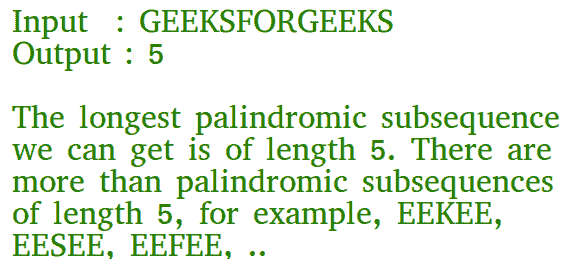

# 最长回文子序列| DP-12

> 原文:[https://www . geesforgeks . org/最长回文-子序列-dp-12/](https://www.geeksforgeeks.org/longest-palindromic-subsequence-dp-12/)

给定一个序列，求其中最长回文子序列的长度。



作为另一个例子，如果给定的序列是“bbabcbab”，那么输出应该是 7，因为“BABCBAB”是其中最长的回文子序列。“bbbbbbb”和“BBCBB”也是给定序列的回文子序列，但不是最长的。
这个问题的天真解决方案是生成给定序列的所有子序列，并找到最长的回文子序列。这个解决方案在时间复杂度方面是指数级的。让我们看看这个问题是如何同时具有动态规划问题的重要性质，并且可以用动态规划来有效地解决。
**1)最优子结构:**
让 X[0..n-1]是长度为 n 的输入序列，L(0，n-1)是 X[0]的最长回文子序列的长度..n-1]。
如果 X 的最后一个和第一个字符相同，那么 L(0，n-1) = L(1，n-2) + 2。
否则 L(0，n-1) = MAX (L(1，n-1)，L(0，n-2))。

以下是处理所有情况的一般递归解决方案。

```
// Every single character is a palindrome of length 1
L(i, i) = 1 for all indexes i in given sequence

// IF first and last characters are not same
If (X[i] != X[j])  L(i, j) =  max{L(i + 1, j),L(i, j - 1)} 

// If there are only 2 characters and both are same
Else if (j == i + 1) L(i, j) = 2  

// If there are more than two characters, and first and last 
// characters are same
Else L(i, j) =  L(i + 1, j - 1) + 2 
```

**2)重叠子问题**
下面是 LPS 问题的简单递归实现。实现简单地遵循上面提到的递归结构。

## C++

```
// C++ program of above approach
#include<bits/stdc++.h>
using namespace std;

// A utility function to get max of two integers
int max (int x, int y) { return (x > y)? x : y; }

// Returns the length of the longest palindromic subsequence in seq
int lps(char *seq, int i, int j)
{
// Base Case 1: If there is only 1 character
if (i == j)
    return 1;

// Base Case 2: If there are only 2
// characters and both are same
if (seq[i] == seq[j] && i + 1 == j)
    return 2;

// If the first and last characters match
if (seq[i] == seq[j])
    return lps (seq, i+1, j-1) + 2;

// If the first and last characters do not match
return max( lps(seq, i, j-1), lps(seq, i+1, j) );
}

/* Driver program to test above functions */
int main()
{
    char seq[] = "GEEKSFORGEEKS";
    int n = strlen(seq);
    cout << "The length of the LPS is "
         << lps(seq, 0, n-1);
    return 0;
}

// This code is contributed
// by Akanksha Rai
```

## C

```
// C program of above approach
#include<stdio.h>
#include<string.h>

// A utility function to get max of two integers
int max (int x, int y) { return (x > y)? x : y; }

// Returns the length of the longest palindromic subsequence in seq
int lps(char *seq, int i, int j)
{
   // Base Case 1: If there is only 1 character
   if (i == j)
     return 1;

   // Base Case 2: If there are only 2 characters and both are same
   if (seq[i] == seq[j] && i + 1 == j)
     return 2;

   // If the first and last characters match
   if (seq[i] == seq[j])
      return lps (seq, i+1, j-1) + 2;

   // If the first and last characters do not match
   return max( lps(seq, i, j-1), lps(seq, i+1, j) );
}

/* Driver program to test above functions */
int main()
{
    char seq[] = "GEEKSFORGEEKS";
    int n = strlen(seq);
    printf ("The length of the LPS is %d", lps(seq, 0, n-1));
    getchar();
    return 0;
}
```

## Java 语言(一种计算机语言，尤用于创建网站)

```
//Java program of above approach

class GFG {

    // A utility function to get max of two integers
    static int max(int x, int y) {
        return (x > y) ? x : y;
    }
    // Returns the length of the longest palindromic subsequence in seq

    static int lps(char seq[], int i, int j) {
    // Base Case 1: If there is only 1 character
        if (i == j) {
            return 1;
        }

    // Base Case 2: If there are only 2 characters and both are same
        if (seq[i] == seq[j] && i + 1 == j) {
            return 2;
        }

    // If the first and last characters match
        if (seq[i] == seq[j]) {
            return lps(seq, i + 1, j - 1) + 2;
        }

    // If the first and last characters do not match
        return max(lps(seq, i, j - 1), lps(seq, i + 1, j));
    }

    /* Driver program to test above function */
    public static void main(String[] args) {
        String seq = "GEEKSFORGEEKS";
        int n = seq.length();
        System.out.printf("The length of the LPS is %d", lps(seq.toCharArray(), 0, n - 1));

    }
}
```

## 蟒蛇 3

```
# Python 3 program of above approach

# A utility function to get max
# of two egers
def max(x, y):
    if(x > y):
        return x
    return y

# Returns the length of the longest
# palindromic subsequence in seq
def lps(seq, i, j):

    # Base Case 1: If there is
    # only 1 character
    if (i == j):
        return 1

    # Base Case 2: If there are only 2
    # characters and both are same
    if (seq[i] == seq[j] and i + 1 == j):
        return 2

    # If the first and last characters match
    if (seq[i] == seq[j]):
        return lps(seq, i + 1, j - 1) + 2

    # If the first and last characters
    # do not match
    return max(lps(seq, i, j - 1),
               lps(seq, i + 1, j))

# Driver Code
if __name__ == '__main__':
    seq = "GEEKSFORGEEKS"
    n = len(seq)
    print("The length of the LPS is",
                  lps(seq, 0, n - 1))

# This code contributed by Rajput-Ji
```

## C#

```
// C# program of the above approach
using System;

public class GFG{

    // A utility function to get max of two integers
    static int max(int x, int y) {
        return (x > y) ? x : y;
    }
    // Returns the length of the longest palindromic subsequence in seq

    static int lps(char []seq, int i, int j) {
    // Base Case 1: If there is only 1 character
        if (i == j) {
            return 1;
        }

    // Base Case 2: If there are only 2 characters and both are same
        if (seq[i] == seq[j] && i + 1 == j) {
            return 2;
        }

    // If the first and last characters match
        if (seq[i] == seq[j]) {
            return lps(seq, i + 1, j - 1) + 2;
        }

    // If the first and last characters do not match
        return max(lps(seq, i, j - 1), lps(seq, i + 1, j));
    }

    /* Driver program to test above function */
    public static void Main() {
        String seq = "GEEKSFORGEEKS";
        int n = seq.Length;
        Console.Write("The length of the LPS is "+lps(seq.ToCharArray(), 0, n - 1));

    }
}

// This code is contributed by Rajput-Ji
```

## 服务器端编程语言（Professional Hypertext Preprocessor 的缩写）

```
<?php
// PHP program of above approach

// Returns the length of the longest
// palindromic subsequence in seq
function lps($seq, $i, $j)
{

    // Base Case 1: If there is
    // only 1 character
    if ($i == $j)
        return 1;

    // Base Case 2: If there are only 2
    // characters and both are same
    if ($seq[$i] == $seq[$j] && $i + 1 == $j)
        return 2;

    // If the first and last characters match
    if ($seq[$i] == $seq[$j])
        return lps ($seq, $i + 1, $j - 1) + 2;

    // If the first and last characters
    // do not match
    return max(lps($seq, $i, $j - 1),
               lps($seq, $i + 1, $j));
}

// Driver Code
$seq = "GEEKSFORGEEKS";
$n = strlen($seq);
echo "The length of the LPS is ".
            lps($seq, 0, $n - 1);

// This code is contributed by ita_c
?>
```

## java 描述语言

```
<script>

    // A utility function to get max of two integers 
    function max(x, y)
    {
        return (x > y) ? x : y;
    }

    // Returns the length of the longest palindromic subsequence in seq    
    function lps(seq, i, j)
    {
        // Base Case 1: If there is only 1 character
        if (i == j)
        {
            return 1;
        }

        // Base Case 2: If there are only 2 characters and both are same 
            if (seq[i] == seq[j] && i + 1 == j)
            {
                return 2;
            }

        // If the first and last characters match 
            if (seq[i] == seq[j])
            {
                return lps(seq, i + 1, j - 1) + 2;
            }

        // If the first and last characters do not match 
            return max(lps(seq, i, j - 1), lps(seq, i + 1, j));
    }

    /* Driver program to test above function */
    let seq = "GEEKSFORGEEKS";
    let n = seq.length;
    document.write("The length of the LPS is ", lps(seq.split(""), 0, n - 1));

    // This code is contributed by avanitrachhadiya2155
</script>
```

**输出:**

```
The length of the LPS is 5
```

考虑到上面的实现，下面是长度为 6 的序列的部分递归树，其中包含所有不同的字符。

```
               L(0, 5)
             /        \ 
            /          \  
        L(1,5)          L(0,4)
       /    \            /    \
      /      \          /      \
  L(2,5)    L(1,4)  L(1,4)  L(0,3)
```

在上面的部分递归树中，L(1，4)被求解了两次。如果我们画出完整的递归树，那么我们可以看到有许多子问题被一次又一次地解决。由于相同的子问题被再次调用，这个问题具有重叠子问题的性质。所以 LPS 问题同时具有动态规划问题的两个性质(参见[这个](https://www.geeksforgeeks.org/overlapping-subproblems-property-in-dynamic-programming-dp-1/)和[这个](https://www.geeksforgeeks.org/optimal-substructure-property-in-dynamic-programming-dp-2/))。像其他典型的[动态规划(DP)问题](https://www.geeksforgeeks.org/archives/tag/dynamic-programming)一样，通过自下而上的方式构造临时数组 L[][]，可以避免相同子问题的重新计算。
**动态规划解决方案**

## C++

```
// A Dynamic Programming based C++ program for LPS problem
// Returns the length of the longest palindromic subsequence in seq
#include<stdio.h>
#include<string.h>

// A utility function to get max of two integers
int max (int x, int y) { return (x > y)? x : y; }

// Returns the length of the longest palindromic subsequence in seq
int lps(char *str)
{
   int n = strlen(str);
   int i, j, cl;
   int L[n][n];  // Create a table to store results of subproblems

   // Strings of length 1 are palindrome of length 1
   for (i = 0; i < n; i++)
      L[i][i] = 1;

    // Build the table. Note that the lower diagonal values of table are
    // useless and not filled in the process. The values are filled in a
    // manner similar to Matrix Chain Multiplication DP solution (See
    // https://www.geeksforgeeks.org/matrix-chain-multiplication-dp-8/). cl is length of
    // substring
    for (cl=2; cl<=n; cl++)
    {
        for (i=0; i<n-cl+1; i++)
        {
            j = i+cl-1;
            if (str[i] == str[j] && cl == 2)
               L[i][j] = 2;
            else if (str[i] == str[j])
               L[i][j] = L[i+1][j-1] + 2;
            else
               L[i][j] = max(L[i][j-1], L[i+1][j]);
        }
    }

    return L[0][n-1];
}

/* Driver program to test above functions */
int main()
{
    char seq[] = "GEEKS FOR GEEKS";
    int n = strlen(seq);
    printf ("The length of the LPS is %d", lps(seq));
    getchar();
    return 0;
}
```

## Java 语言(一种计算机语言，尤用于创建网站)

```
// A Dynamic Programming based Java
// Program for the Egg Dropping Puzzle
class LPS
{

    // A utility function to get max of two integers
    static int max (int x, int y) { return (x > y)? x : y; }

    // Returns the length of the longest
    // palindromic subsequence in seq
    static int lps(String seq)
    {
    int n = seq.length();
    int i, j, cl;
    // Create a table to store results of subproblems
    int L[][] = new int[n][n];

    // Strings of length 1 are palindrome of length 1
    for (i = 0; i < n; i++)
        L[i][i] = 1;

        // Build the table. Note that the lower
        // diagonal values of table are
        // useless and not filled in the process.
        // The values are filled in a manner similar
        //  to Matrix Chain Multiplication DP solution (See
        // https://www.geeksforgeeks.org/matrix-chain-multiplication-dp-8/).
        // cl is length of substring
        for (cl=2; cl<=n; cl++)
        {
            for (i=0; i<n-cl+1; i++)
            {
                j = i+cl-1;
                if (seq.charAt(i) == seq.charAt(j) && cl == 2)
                L[i][j] = 2;
                else if (seq.charAt(i) == seq.charAt(j))
                L[i][j] = L[i+1][j-1] + 2;
                else
                L[i][j] = max(L[i][j-1], L[i+1][j]);
            }
        }

        return L[0][n-1];
    }

    /* Driver program to test above functions */
    public static void main(String args[])
    {
        String seq = "GEEKSFORGEEKS";
        int n = seq.length();
        System.out.println("The length of the lps is "+ lps(seq));
    }
}
/* This code is contributed by Rajat Mishra */
```

## 计算机编程语言

```
# A Dynamic Programming based Python
# program for LPS problem Returns the length
#  of the longest palindromic subsequence in seq
def lps(str):
    n = len(str)

    # Create a table to store results of subproblems
    L = [[0 for x in range(n)] for x in range(n)]

    # Strings of length 1 are palindrome of length 1
    for i in range(n):
        L[i][i] = 1

    # Build the table. Note that the lower
    # diagonal values of table are
    # useless and not filled in the process.
    # The values are filled in a
    # manner similar to Matrix Chain
    # Multiplication DP solution (See
    # https://www.geeksforgeeks.org/dynamic-programming-set-8-matrix-chain-multiplication/
    # cl is length of substring
    for cl in range(2, n+1):
        for i in range(n-cl+1):
            j = i+cl-1
            if str[i] == str[j] and cl == 2:
                L[i][j] = 2
            elif str[i] == str[j]:
                L[i][j] = L[i+1][j-1] + 2
            else:
                L[i][j] = max(L[i][j-1], L[i+1][j]);

    return L[0][n-1]

# Driver program to test above functions
seq = "GEEKS FOR GEEKS"
n = len(seq)
print("The length of the LPS is " + str(lps(seq)))

# This code is contributed by Bhavya Jain
```

## C#

```
// A Dynamic Programming based C# Program
// for the Egg Dropping Puzzle
using System;

class GFG {

    // A utility function to get max of
    // two integers
    static int max (int x, int y)
    {
        return (x > y)? x : y;
    }

    // Returns the length of the longest
    // palindromic subsequence in seq
    static int lps(string seq)
    {
    int n = seq.Length;
    int i, j, cl;

    // Create a table to store results
    // of subproblems
    int [,]L = new int[n,n];

    // Strings of length 1 are
    // palindrome of length 1
    for (i = 0; i < n; i++)
        L[i,i] = 1;

        // Build the table. Note that the
        // lower diagonal values of table
        // are useless and not filled in
        // the process. The values are
        // filled in a manner similar to
        // Matrix Chain Multiplication DP
        // solution (See
        // https://www.geeksforgeeks.org/matrix-chain-multiplication-dp-8/
        // cl is length of substring
        for (cl = 2; cl <= n; cl++)
        {
            for (i = 0; i < n-cl+1; i++)
            {
                j = i + cl - 1;

                if (seq[i] == seq[j] &&
                                  cl == 2)
                    L[i,j] = 2;
                else if (seq[i] == seq[j])
                    L[i,j] = L[i+1,j-1] + 2;
                else
                    L[i,j] =
                     max(L[i,j-1], L[i+1,j]);
            }
        }

        return L[0,n-1];
    }

    /* Driver program to test above
    functions */
    public static void Main()
    {
        string seq = "GEEKS FOR GEEKS";
        int n = seq.Length;
        Console.Write("The length of the "
                  + "lps is "+ lps(seq));
    }
}

// This code is contributed by nitin mittal.
```

## 服务器端编程语言（Professional Hypertext Preprocessor 的缩写）

```
<?php
// A Dynamic Programming based
// PHP program for LPS problem
// Returns the length of the
// longest palindromic
// subsequence in seq

// A utility function to get
// max of two integers
// function max( $x, $y)
// { return ($x > $y)? $x : $y; }

// Returns the length of the
// longest palindromic
// subsequence in seq
function lps($str)
{
$n = strlen($str);
$i; $j; $cl;

// Create a table to store
// results of subproblems
$L[][] = array(array());

// Strings of length 1 are
// palindrome of length 1
for ($i = 0; $i < $n; $i++)
    $L[$i][$i] = 1;

    // Build the table. Note that
    // the lower diagonal values
    // of table are useless and
    // not filled in the process.
    // The values are filled in a
    // manner similar to Matrix
    // Chain Multiplication DP
    // solution (See
    // https://www.geeksforgeeks.org/matrix-chain-multiplication-dp-8/).
    // cl is length of substring
    for ($cl = 2; $cl <= $n; $cl++)
    {
        for ($i = 0; $i < $n - $cl + 1; $i++)
        {
            $j = $i + $cl - 1;
            if ($str[$i] == $str[$j] &&
                            $cl == 2)
            $L[$i][$j] = 2;
            else if ($str[$i] == $str[$j])
            $L[$i][$j] = $L[$i + 1][$j - 1] + 2;
            else
            $L[$i][$j] = max($L[$i][$j - 1],
                             $L[$i + 1][$j]);
        }
    }

    return $L[0][$n - 1];
}

// Driver Code
$seq = 'GEEKS FOR GEEKS';
$n = strlen($seq);
echo "The length of the " .
      "LPS is ", lps($seq);

// This code is contributed
// by shiv_bhakt.
?>
```

## java 描述语言

```
<script>
// A Dynamic Programming based Javascript
// Program for the Egg Dropping Puzzle

// A utility function to get max of two integers
function max(x,y)
{
    return (x > y)? x : y;
}

// Returns the length of the longest
    // palindromic subsequence in seq
function lps(seq)
{
    let n = seq.length;
    let i, j, cl;
    // Create a table to store results of subproblems
    let L = new Array(n);
    for(let x=0;x<n;x++)
    {
        L[x] = new Array(n);
        for(let y = 0; y < n; y++)
            L[x][y] = 0;
    }

    // Strings of length 1 are palindrome of length 1
    for (i = 0; i < n; i++)
        L[i][i] = 1;

        // Build the table. Note that the lower
        // diagonal values of table are
        // useless and not filled in the process.
        // The values are filled in a manner similar
        //  to Matrix Chain Multiplication DP solution (See
        // https://www.geeksforgeeks.org/matrix-chain-multiplication-dp-8/).
        // cl is length of substring
        for (cl = 2; cl <= n; cl++)
        {
            for (i = 0; i < n -cl + 1; i++)
            {
                j = i + cl - 1;
                if (seq[i] == seq[j] && cl == 2)
                    L[i][j] = 2;
                else if (seq[i] == seq[j])
                    L[i][j] = L[i + 1][j - 1] + 2;
                else
                    L[i][j] = max(L[i][j - 1], L[i + 1][j]);
            }
        }

        return L[0][n - 1];
}

 /* Driver program to test above functions */
let seq = "GEEKS FOR GEEKS";
let n = seq.length;
document.write("The length of the lps is "+ lps(seq));

// This code is contributed by rag2127
</script>
```

**输出:**

```
The length of the LPS is 7
```

上述实现的时间复杂度是 O(n^2)，这比朴素递归实现的最坏情况时间复杂度好得多。

[**打印最长回文子序列**](https://www.geeksforgeeks.org/print-longest-palindromic-subsequence/)
[**最长回文子序列带 O(n)空格**](https://www.geeksforgeeks.org/longest-palindrome-subsequence-space/)
如发现有不正确的地方，或想分享更多关于以上讨论话题的信息，请写评论。
**参考文献:**
[http://users.eecs.northwestern.edu/~dda902/336/hw6-sol.pdf](http://users.eecs.northwestern.edu/~dda902/336/hw6-sol.pdf)