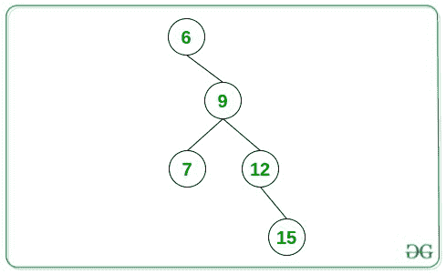
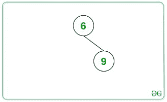

# 形成等差数列的二叉树底部的最长路径

> 原文:[https://www . geesforgeks . org/最长路径到二叉树底部形成算术级数/](https://www.geeksforgeeks.org/longest-path-to-the-bottom-of-a-binary-tree-forming-an-arithmetic-progression/)

给定一个由 **N** 个节点组成的[二叉树](https://www.geeksforgeeks.org/binary-tree-data-structure/)，任务是找到从任意节点到树的底部的最长[路径的长度，使得所有节点值形成一个](https://www.geeksforgeeks.org/print-path-root-given-node-binary-tree/)[算术级数](https://www.geeksforgeeks.org/arithmetic-progression/)。

**示例:**

> **输入:**
> 
> 
> 
> **输出:** 4
> **解释:**
> 从上面给定的树来看，节点值构成 AP 的最长路径是{6，9，12，15}(长度= 4)。
> 
> **输入:**
> 
> 
> 
> **输出:** 2

**方法:**给定的问题可以通过使用[递归](https://www.geeksforgeeks.org/recursion/)并在给定的树上执行 [DFS 遍历来解决。其思想是跟踪当前根节点和下一个后代节点之间的差异，并相应地更新最长路径的长度。按照以下步骤解决给定的问题:](https://www.geeksforgeeks.org/dfs-traversal-of-a-tree-using-recursion/)

*   初始化一个变量，比如说**最大长度**为 **1** ，它存储了从任意节点到树的底部形成算术级数的路径的最大长度。
*   定义一个[函数](https://www.geeksforgeeks.org/functions-in-c/)，比如说 **dfs(根，currentDifference，count，maxLength)** ，它以当前根节点，当前差，形成 AP 的节点数，以及最终的最大长度为参数，执行以下步骤:
    *   如果根的左节点存在，则执行以下步骤:
        *   找出根的值与其左节点的值之间的差异。
        *   如果发现**差值**为**当前差值**，则将**最大长度**的值更新为**最大长度**和**(计数+ 1)** 的最大值，并递归调用函数 **dfs(根- >左，当前差值，计数+ 1，最大长度)**。
        *   否则，[递归调用 **dfs 的**](https://www.geeksforgeeks.org/recursion/)(根- >左，差，2，最大长度)。
    *   如果根的右节点存在，则执行以下步骤:
        *   找出根的值与其右节点的值之间的差异。
        *   如果发现**差值**为**当前差值**，则将**最大长度**的值更新为**最大长度**和**(计数+ 1)** 的最大值，并递归调用函数 **dfs(根- >右，当前差值，计数+ 1，最大长度)**。
        *   否则，递归调用 **dfs(根- >左，差，2，最大长度)**。
*   如果给定根节点的左子节点存在，则调用 **dfs(root- > left，difference，2，maxLength)** ，其中 **difference** 是根与其左节点的值之间的差值。
*   如果给定根节点的右子节点存在，则调用 **dfs(root- > right，difference，2，maxLength)** ，其中 **difference** 是根与其右节点的值之间的差值。
*   完成上述步骤后，将**最大长度**的值打印为从任意节点到树底部形成[等差数列](https://www.geeksforgeeks.org/arithmetic-progression/)的路径的合成最大长度。

下面是上述方法的实现:

## C++

```
// C++ program for the above approach

#include "bits/stdc++.h"
using namespace std;

// Structure of the Tree Node
struct Tree {
    int val;
    Tree *left, *right;
};

// Function to create a new node
Tree* newNode(int data)
{
    Tree* temp = new Tree();
    temp->val = data;
    temp->left = temp->right = NULL;
    return temp;
}

// Function to perform DFS Traversal
// to find the maximum length of a path
// to a bottom node forming an AP
void dfs(Tree* root, int currentDifference,
         int count, int& maxLength)
{
    // If the root's left child exists
    if (root->left) {

        // Calculate the difference
        int difference = root->left->val
                         - root->val;

        // If the difference is same
        // as the current difference
        if (difference == currentDifference) {
            dfs(root->left, currentDifference,
                count + 1, maxLength);

            // Update the maxLength
            maxLength = max(maxLength,
                            count + 1);
        }

        // Otherwise
        else {
            dfs(root->left, difference,
                2, maxLength);
        }
    }

    // If the root's right child exists
    if (root->right) {

        // Find the difference
        int difference = root->right->val
                         - root->val;

        // If the difference is the same
        // as the current difference
        if (difference == currentDifference) {

            dfs(root->right, currentDifference,
                count + 1, maxLength);

            // Update the maxLength
            maxLength = max(maxLength,
                            count + 1);
        }

        // Otherwise
        else {
            dfs(root->right, difference,
                2, maxLength);
        }
    }
}

// Function to find the maximum length
// of the path from any node to bottom
// of the tree forming an AP
int maximumLengthAP(Tree* root)
{

    // Base Cases
    if (root == NULL)
        return 0;

    if (root->left == NULL
        and root->right == NULL) {
        return 1;
    }

    // Stores the resultant
    // maximum length of the path
    int maxLength = 2;

    // If the root's left child exists
    if (root->left) {

        int difference = root->left->val
                         - root->val;
        dfs(root->left, difference, 2,
            maxLength);
    }

    // If the root's right child exists
    if (root->right) {
        int difference = root->right->val
                         - root->val;
        dfs(root->right, difference, 2,
            maxLength);
    }

    // Return the maximum length obtained
    return maxLength;
}

// Driver Code
int main()
{

    // Given Tree
    Tree* root = newNode(6);
    root->right = newNode(9);
    root->right->left = newNode(7);
    root->right->right = newNode(12);
    root->right->right->right = newNode(15);

    cout << maximumLengthAP(root);

    return 0;
}
```

## Java 语言(一种计算机语言，尤用于创建网站)

```
// Java program for the above approach
import java.lang.*;
import java.util.*;

class GFG{

static int maxLength;   

// TreeNode class
static class Node
{
    public int val;
    public Node left, right;
};

static Node newNode(int key)
{
    Node temp = new Node();
    temp.val = key;
    temp.left = temp.right = null;
    return temp;
}

// Function to perform DFS Traversal
// to find the maximum length of a path
// to a bottom node forming an AP
static void dfs(Node root, int currentDifference,
                int count)
{

    // If the root's left child exists
    if (root.left != null)
    {

        // Calculate the difference
        int difference = root.left.val - root.val;

        // If the difference is same
        // as the current difference
        if (difference == currentDifference)
        {
            dfs(root.left, currentDifference,
                count + 1);

            // Update the maxLength
            maxLength = Math.max(maxLength,
                                 count + 1);
        }

        // Otherwise
        else
        {
            dfs(root.left, difference, 2);
        }
    }

    // If the root's right child exists
    if (root.right != null)
    {

        // Find the difference
        int difference = root.right.val - root.val;

        // If the difference is the same
        // as the current difference
        if (difference == currentDifference)
        {
            dfs(root.right, currentDifference,
                count + 1);

            // Update the maxLength
            maxLength = Math.max(maxLength,
                                 count + 1);
        }

        // Otherwise
        else
        {
            dfs(root.right, difference, 2);
        }
    }
}

// Function to find the maximum length
// of the path from any node to bottom
// of the tree forming an AP
static int maximumLengthAP(Node root)
{

    // Base Cases
    if (root == null)
        return 0;

    if (root.left == null &&
        root.right == null)
    {
        return 1;
    }

    // Stores the resultant
    // maximum length of the path
     maxLength = 2;

    // If the root's left child exists
    if (root.left != null)
    {
        int difference = root.left.val - root.val;
        dfs(root.left, difference, 2);
    }

    // If the root's right child exists
    if (root.right != null)
    {
        int difference = root.right.val - root.val;
        dfs(root.right, difference, 2);
    }

    // Return the maximum length obtained
    return maxLength;
}   

// Driver code
public static void main(String[] args)
{

    // Given Tree
    Node root = newNode(6);
    root.right = newNode(9);
    root.right.left = newNode(7);
    root.right.right = newNode(12);
    root.right.right.right = newNode(15);

    System.out.println(maximumLengthAP(root));
}
}

// This code is contributed by offbeat
```

## 蟒蛇 3

```
# Python3 program for the above approach
maxLength = 2

class Node:

    # Constructor to set the data of
    # the newly created tree node
    def __init__(self, key):
        self.val = key
        self.left = None
        self.right = None

# Function to perform DFS Traversal
# to find the maximum length of a path
# to a bottom node forming an AP
def dfs(root, currentDifference, count):

    global maxLength

    # If the root's left child exists
    if (root.left != None):
        # Calculate the difference
        difference = root.left.val - root.val

        # If the difference is same
        # as the current difference
        if (difference == currentDifference):

            dfs(root.left, currentDifference, count + 1)

            # Update the maxLength
            maxLength = max(maxLength, count + 1)

        # Otherwise
        else:
            dfs(root.left, difference, 2)

    # If the root's right child exists
    if (root.right != None):
        # Find the difference
        difference = root.right.val - root.val

        # If the difference is the same
        # as the current difference
        if (difference == currentDifference):

            dfs(root.right, currentDifference, count + 1)

            # Update the maxLength
            maxLength = max(maxLength, count + 1)

        # Otherwise
        else:
            dfs(root.right, difference, 2)

# Function to find the maximum length
# of the path from any node to bottom
# of the tree forming an AP
def maximumLengthAP(root):

    global maxLength

    # Base Cases
    if (root == None):
        return 0

    if (root.left == None and root.right == None):
        return 1

    # If the root's left child exists
    if (root.left != None):
        difference = root.left.val - root.val
        dfs(root.left, difference, 2)

    # If the root's right child exists
    if (root.right != None):
        difference = root.right.val - root.val
        dfs(root.right, difference, 2)

    # Return the maximum length obtained
    return maxLength

# Given Tree
root = Node(6)
root.right = Node(9)
root.right.left = Node(7)
root.right.right = Node(12)
root.right.right.right = Node(15)

print(maximumLengthAP(root))

# This code is contributed by decode2207.
```

## C#

```
// C# program for the above approach
using System;

class GFG{

static int maxLength;   

// TreeNode class
class Node
{
    public int val;
    public Node left, right;
};

static Node newNode(int key)
{
    Node temp = new Node();
    temp.val = key;
    temp.left = temp.right = null;
    return temp;
}

// Function to perform DFS Traversal
// to find the maximum length of a path
// to a bottom node forming an AP
static void dfs(Node root, int currentDifference,
                int count)
{

    // If the root's left child exists
    if (root.left != null)
    {

        // Calculate the difference
        int difference = root.left.val - root.val;

        // If the difference is same
        // as the current difference
        if (difference == currentDifference)
        {
            dfs(root.left, currentDifference,
                count + 1);

            // Update the maxLength
            maxLength = Math.Max(maxLength,
                                 count + 1);
        }

        // Otherwise
        else
        {
            dfs(root.left, difference, 2);
        }
    }

    // If the root's right child exists
    if (root.right != null)
    {

        // Find the difference
        int difference = root.right.val - root.val;

        // If the difference is the same
        // as the current difference
        if (difference == currentDifference)
        {
            dfs(root.right, currentDifference,
                count + 1);

            // Update the maxLength
            maxLength = Math.Max(maxLength,
                                 count + 1);
        }

        // Otherwise
        else
        {
            dfs(root.right, difference, 2);
        }
    }
}

// Function to find the maximum length
// of the path from any node to bottom
// of the tree forming an AP
static int maximumLengthAP(Node root)
{

    // Base Cases
    if (root == null)
        return 0;

    if (root.left == null &&
        root.right == null)
    {
        return 1;
    }

    // Stores the resultant
    // maximum length of the path
     maxLength = 2;

    // If the root's left child exists
    if (root.left != null)
    {
        int difference = root.left.val - root.val;
        dfs(root.left, difference, 2);
    }

    // If the root's right child exists
    if (root.right != null)
    {
        int difference = root.right.val - root.val;
        dfs(root.right, difference, 2);
    }

    // Return the maximum length obtained
    return maxLength;
}   

// Driver code
public static void Main(String[] args)
{

    // Given Tree
    Node root = newNode(6);
    root.right = newNode(9);
    root.right.left = newNode(7);
    root.right.right = newNode(12);
    root.right.right.right = newNode(15);

    Console.WriteLine(maximumLengthAP(root));
}
}

// This code is contributed by gauravrajput1
```

## java 描述语言

```
<script>

    // JavaScript program for the above approach

    let maxLength;  

    class Node
    {
        constructor(key) {
           this.left = null;
           this.right = null;
           this.val = key;
        }
    }

    function newNode(key)
    {
        let temp = new Node(key);
        return temp;
    }

    // Function to perform DFS Traversal
    // to find the maximum length of a path
    // to a bottom node forming an AP
    function dfs(root, currentDifference, count)
    {

        // If the root's left child exists
        if (root.left != null)
        {

            // Calculate the difference
            let difference = root.left.val - root.val;

            // If the difference is same
            // as the current difference
            if (difference == currentDifference)
            {
                dfs(root.left, currentDifference,
                    count + 1);

                // Update the maxLength
                maxLength = Math.max(maxLength,
                                     count + 1);
            }

            // Otherwise
            else
            {
                dfs(root.left, difference, 2);
            }
        }

        // If the root's right child exists
        if (root.right != null)
        {

            // Find the difference
            let difference = root.right.val - root.val;

            // If the difference is the same
            // as the current difference
            if (difference == currentDifference)
            {
                dfs(root.right, currentDifference,
                    count + 1);

                // Update the maxLength
                maxLength = Math.max(maxLength,
                                     count + 1);
            }

            // Otherwise
            else
            {
                dfs(root.right, difference, 2);
            }
        }
    }

    // Function to find the maximum length
    // of the path from any node to bottom
    // of the tree forming an AP
    function maximumLengthAP(root)
    {

        // Base Cases
        if (root == null)
            return 0;

        if (root.left == null &&
            root.right == null)
        {
            return 1;
        }

        // Stores the resultant
        // maximum length of the path
         maxLength = 2;

        // If the root's left child exists
        if (root.left != null)
        {
            let difference = root.left.val - root.val;
            dfs(root.left, difference, 2);
        }

        // If the root's right child exists
        if (root.right != null)
        {
            let difference = root.right.val - root.val;
            dfs(root.right, difference, 2);
        }

        // Return the maximum length obtained
        return maxLength;
    } 

    // Given Tree
    let root = newNode(6);
    root.right = newNode(9);
    root.right.left = newNode(7);
    root.right.right = newNode(12);
    root.right.right.right = newNode(15);

    document.write(maximumLengthAP(root));

</script>
```

**Output:** 

```
4
```

***时间复杂度:**O(N)*
T5**辅助空间:** O(1)