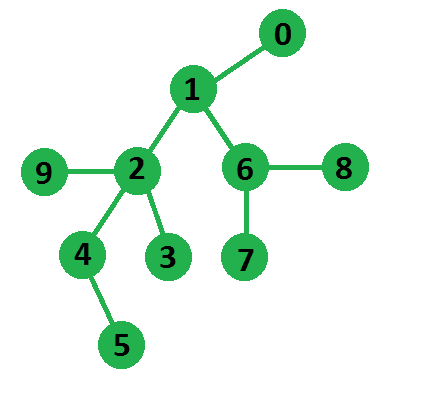

# 无向树中最长的路径

> 原文:[https://www.geeksforgeeks.org/longest-path-undirected-tree/](https://www.geeksforgeeks.org/longest-path-undirected-tree/)

给定一棵无向树，我们需要找到这棵树的最长路径，其中一条路径被定义为一系列节点。

**示例:**

```
Input : Below shown Tree using adjacency list 
        representation:
Output : 5
In below tree longest path is of length 5
from node 5 to node 7
```



这个问题和 [n 元树](https://www.geeksforgeeks.org/diameter-n-ary-tree/)的[直径一样。我们在这里讨论了一个简单的解决方案](https://www.geeksforgeeks.org/diameter-n-ary-tree/)。
本文讨论了一种高效的解决方案。我们可以利用两个 [BFS](https://www.geeksforgeeks.org/breadth-first-traversal-for-a-graph/) s 找到最长的路径，这个想法是基于以下事实:如果我们从任意一个节点 x 开始 BFS，找到一个与 x 距离最长的节点，它一定是最长路径的一个端点。可以用矛盾来证明。所以我们的算法简化为两个简单的 bfs。首先 BFS 找到最长路径的一个端点，其次 BFS 从这个端点找到实际的最长路径。对于这个算法为什么有效的证明，这里有一个很好的解释[正确性证明:图论中树的](https://stackoverflow.com/questions/20010472/proof-of-correctness-algorithm-for-diameter-of-a-tree-in-graph-theory)[直径的算法](https://stackoverflow.com/questions/20010472/proof-of-correctness-algorithm-for-diameter-of-a-tree-in-graph-theory)
从上图可以看出，如果我们从节点-0 开始我们的 BFS，距离它最远的节点将是节点-5，现在如果我们从节点-5 开始我们的 BFS，距离最远的节点将是节点-7，最后，从节点-5 到节点-7 的路径将构成我们最长的路径。

## C++

```
// C++ program to find longest path of the tree
#include <bits/stdc++.h>
using namespace std;

// This class represents a undirected graph using adjacency list
class Graph
{
    int V;              // No. of vertices
    list<int> *adj;     // Pointer to an array containing
                        // adjacency lists
public:
    Graph(int V);              // Constructor
    void addEdge(int v, int w);// function to add an edge to graph
    void longestPathLength();  // prints longest path of the tree
    pair<int, int> bfs(int u); // function returns maximum distant
                               // node from u with its distance
};

Graph::Graph(int V)
{
    this->V = V;
    adj = new list<int>[V];
}

void Graph::addEdge(int v, int w)
{
    adj[v].push_back(w);    // Add w to v’s list.
    adj[w].push_back(v);    // Since the graph is undirected
}

//  method returns farthest node and its distance from node u
pair<int, int> Graph::bfs(int u)
{
    //  mark all distance with -1
    int dis[V];
    memset(dis, -1, sizeof(dis));

    queue<int> q;
    q.push(u);

    //  distance of u from u will be 0
    dis[u] = 0;

    while (!q.empty())
    {
        int t = q.front();       q.pop();

        //  loop for all adjacent nodes of node-t
        for (auto it = adj[t].begin(); it != adj[t].end(); it++)
        {
            int v = *it;

            // push node into queue only if
            // it is not visited already
            if (dis[v] == -1)
            {
                q.push(v);

                // make distance of v, one more
                // than distance of t
                dis[v] = dis[t] + 1;
            }
        }
    }

    int maxDis = 0;
    int nodeIdx;

    //  get farthest node distance and its index
    for (int i = 0; i < V; i++)
    {
        if (dis[i] > maxDis)
        {
            maxDis = dis[i];
            nodeIdx = i;
        }
    }
    return make_pair(nodeIdx, maxDis);
}

//  method prints longest path of given tree
void Graph::longestPathLength()
{
    pair<int, int> t1, t2;

    // first bfs to find one end point of
    // longest path
    t1 = bfs(0);

    //  second bfs to find actual longest path
    t2 = bfs(t1.first);

    cout << "Longest path is from " << t1.first << " to "
         << t2.first << " of length " << t2.second;
}

// Driver code to test above methods
int main()
{
    // Create a graph given in the example
    Graph g(10);
    g.addEdge(0, 1);
    g.addEdge(1, 2);
    g.addEdge(2, 3);
    g.addEdge(2, 9);
    g.addEdge(2, 4);
    g.addEdge(4, 5);
    g.addEdge(1, 6);
    g.addEdge(6, 7);
    g.addEdge(6, 8);

    g.longestPathLength();
    return 0;
}
```

## Java 语言(一种计算机语言，尤用于创建网站)

```
// Java program to find longest path of the tree

import java.util.Arrays;
import java.util.LinkedList;
import java.util.Queue;

class LongestPathUndirectedTree {

    // Utility Pair class for storing maximum distance
    // Node with its distance
    static class Pair<T,V> {
        T first; // maximum distance Node
        V second; // distance of maximum distance node

        //Constructor
        Pair(T first, V second) {
            this.first = first;
            this.second = second;
        }
    }

    // This class represents a undirected graph using adjacency list
    static class Graph {
        int V; // No. of vertices
        LinkedList<Integer>[] adj; //Adjacency List

        // Constructor
        Graph(int V) {
            this.V = V;
            // Initializing Adjacency List
            adj = new LinkedList[V];
            for(int i = 0; i < V; ++i) {
                adj[i] = new LinkedList<Integer>();
            }
        }

        // function to add an edge to graph
        void addEdge(int s, int d) {
            adj[s].add(d); // Add d to s's list.
            adj[d].add(s); // Since the graph is undirected
        }

        // method returns farthest node and its distance from node u
        Pair<Integer, Integer> bfs(int u) {
            int[] dis = new int[V];

            // mark all distance with -1
            Arrays.fill(dis, -1);

            Queue<Integer> q = new LinkedList<>();

            q.add(u);

            // distance of u from u will be 0
            dis[u] = 0;
            while (!q.isEmpty()) {
                int t = q.poll();

                // loop for all adjacent nodes of node-t
                for(int i = 0; i < adj[t].size(); ++i) {
                    int v = adj[t].get(i);

                    // push node into queue only if
                    // it is not visited already
                    if(dis[v] == -1) {
                        q.add(v);
                        // make distance of v, one more
                        // than distance of t
                        dis[v] = dis[t] + 1;
                    }
                }
            }

            int maxDis = 0;
            int nodeIdx = 0;

            // get farthest node distance and its index
            for(int i = 0; i < V; ++i) {
                if(dis[i] > maxDis) {
                    maxDis = dis[i];
                    nodeIdx = i;
                }
            }

            return new Pair<Integer, Integer>(nodeIdx, maxDis);
        }

        // method prints longest path of given tree
        void longestPathLength() {
            Pair<Integer, Integer> t1, t2;

            // first bfs to find one end point of
            // longest path
            t1 = bfs(0);

            // second bfs to find actual longest path
            t2 = bfs(t1.first);

            System.out.println("Longest path is from "+ t1.first
            + " to "+ t2.first +" of length "+t2.second);
        }
    }

    // Driver code to test above methods
    public static void main(String[] args){
        // Create a graph given in the example

        Graph graph = new Graph(10);
        graph.addEdge(0, 1);
        graph.addEdge(1, 2);
        graph.addEdge(2, 3);
        graph.addEdge(2, 9);
        graph.addEdge(2, 4);
        graph.addEdge(4, 5);
        graph.addEdge(1, 6);
        graph.addEdge(6, 7);
        graph.addEdge(6, 8);

        graph.longestPathLength();
    }

}
// Added By Brij Raj Kishore
```

## C#

```
// C# program to find longest path of the tree
using System;
using System.Collections.Generic;

class GFG
{

// Utility Pair class for storing
// maximum distance Node with its distance
public class Pair<T, V>
{
    // maximum distance Node
    public T first;

    // distance of maximum distance node
    public V second;

    // Constructor
    public Pair(T first, V second)
    {
        this.first = first;
        this.second = second;
    }
}

// This class represents a undirected graph
// using adjacency list
class Graph
{
    int V; // No. of vertices
    List<int>[] adj; //Adjacency List

    // Constructor
    public Graph(int V)
    {
        this.V = V;

        // Initializing Adjacency List
        adj = new List<int>[V];
        for(int i = 0; i < V; ++i)
        {
            adj[i] = new List<int>();
        }
    }

    // function to add an edge to graph
    public void addEdge(int s, int d)
    {
        adj[s].Add(d); // Add d to s's list.
        adj[d].Add(s); // Since the graph is undirected
    }

    // method returns farthest node and
    // its distance from node u
    public Pair<int, int> bfs(int u)
    {
        int[] dis = new int[V];

        // mark all distance with -1
        for(int i = 0; i < V; i++)
            dis[i] = -1;

        Queue<int> q = new Queue<int>();

        q.Enqueue(u);

        // distance of u from u will be 0
        dis[u] = 0;
        while (q.Count != 0)
        {
            int t = q.Dequeue();

            // loop for all adjacent nodes of node-t
            for(int i = 0; i < adj[t].Count; ++i)
            {
                int v = adj[t][i];

                // push node into queue only if
                // it is not visited already
                if(dis[v] == -1)
                {
                    q.Enqueue(v);

                    // make distance of v, one more
                    // than distance of t
                    dis[v] = dis[t] + 1;
                }
            }
        }
        int maxDis = 0;
        int nodeIdx = 0;

        // get farthest node distance and its index
        for(int i = 0; i < V; ++i)
        {
            if(dis[i] > maxDis)
            {
                maxDis = dis[i];
                nodeIdx = i;
            }
        }
        return new Pair<int, int>(nodeIdx, maxDis);
    }

    // method prints longest path of given tree
    public void longestPathLength()
    {
        Pair<int, int> t1, t2;

        // first bfs to find one end point of
        // longest path
        t1 = bfs(0);

        // second bfs to find actual longest path
        t2 = bfs(t1.first);

        Console.WriteLine("longest path is from " + t1.first +
                " to " + t2.first + " of length " + t2.second);
    }
}

// Driver Code
public static void Main(String[] args)
{    
    // Create a graph given in the example
    Graph graph = new Graph(10);
    graph.addEdge(0, 1);
    graph.addEdge(1, 2);
    graph.addEdge(2, 3);
    graph.addEdge(2, 9);
    graph.addEdge(2, 4);
    graph.addEdge(4, 5);
    graph.addEdge(1, 6);
    graph.addEdge(6, 7);
    graph.addEdge(6, 8);

    graph.longestPathLength();
}
}

// This code is contributed by Rajput-Ji
```

## 蟒蛇 3

```
# Python program to find the Longest Path of the Tree
# By Aaditya Upadhyay

from collections import deque

class Graph:

    # Initialisation of graph
    def __init__(self, vertices):

        # No. of vertices
        self.vertices = vertices

        # adjacency list
        self.adj = {i: [] for i in range(self.vertices)}

    def addEdge(self, u, v):
        # add u to v's list
        self.adj[u].append(v)
        # since the graph is undirected
        self.adj[v].append(u)

    # method return farthest node and its distance from node u
    def BFS(self, u):
        # marking all nodes as unvisited
        visited = [False for i in range(self.vertices + 1)]
        # mark all distance with -1
        distance = [-1 for i in range(self.vertices + 1)]

        # distance of u from u will be 0
        distance[u] = 0
        # in-built library for queue which performs fast operations on both the ends
        queue = deque()
        queue.append(u)
        # mark node u as visited
        visited[u] = True

        while queue:

            # pop the front of the queue(0th element)
            front = queue.popleft()
            # loop for all adjacent nodes of node front

            for i in self.adj[front]:
                if not visited[i]:
                    # mark the ith node as visited
                    visited[i] = True
                    # make distance of i , one more than distance of front
                    distance[i] = distance[front]+1
                    # Push node into the stack only if it is not visited already
                    queue.append(i)

        maxDis = 0

        # get farthest node distance and its index
        for i in range(self.vertices):
            if distance[i] > maxDis:

                maxDis = distance[i]
                nodeIdx = i

        return nodeIdx, maxDis

    # method prints longest path of given tree
    def LongestPathLength(self):

        # first DFS to find one end point of longest path
        node, Dis = self.BFS(0)

        # second DFS to find the actual longest path
        node_2, LongDis = self.BFS(node)

        print('Longest path is from', node, 'to', node_2, 'of length', LongDis)

# create a graph given in the example

G = Graph(10)
G.addEdge(0, 1)
G.addEdge(1, 2)
G.addEdge(2, 3)
G.addEdge(2, 9)
G.addEdge(2, 4)
G.addEdge(4, 5)
G.addEdge(1, 6)
G.addEdge(6, 7)
G.addEdge(6, 8)

G.LongestPathLength()
```

## java 描述语言

```
<script>

// Javascript program to find longest path of the tree

// Utility Pair class for storing
// maximum distance Node with its distance
class Pair
{
    // Constructor
    constructor(first, second)
    {
        this.first = first;
        this.second = second;
    }
}

// This class represents a undirected graph
// using adjacency list
var V; // No. of vertices
var adj; //Adjacency List

// Constructor
function initialize(V)
{
    this.V = V;

    // Initializing Adjacency List
    adj = Array.from(Array(V), ()=>Array());
}

// function to add an edge to graph
function addEdge(s, d)
{
    adj[s].push(d); // push d to s's list.
    adj[d].push(s); // Since the graph is undirected
}

// method returns farthest node and
// its distance from node u
function bfs(u)
{
    var dis = Array(V);

    // mark all distance with -1
    for(var i = 0; i < V; i++)
        dis[i] = -1;
    var q = [];
    q.push(u);

    // distance of u from u will be 0
    dis[u] = 0;
    while (q.length != 0)
    {
        var t = q.shift();

        // loop for all adjacent nodes of node-t
        for(var i = 0; i < adj[t].length; ++i)
        {
            var v = adj[t][i];

            // push node into queue only if
            // it is not visited already
            if(dis[v] == -1)
            {
                q.push(v);

                // make distance of v, one more
                // than distance of t
                dis[v] = dis[t] + 1;
            }
        }
    }
    var maxDis = 0;
    var nodeIdx = 0;

    // get farthest node distance and its index
    for(var i = 0; i < V; ++i)
    {
        if(dis[i] > maxDis)
        {
            maxDis = dis[i];
            nodeIdx = i;
        }
    }
    return new Pair(nodeIdx, maxDis);
}

// method prints longest path of given tree
function longestPathLength()
{
    var t1, t2;

    // first bfs to find one end point of
    // longest path
    t1 = bfs(0);

    // second bfs to find actual longest path
    t2 = bfs(t1.first);
    document.write("longest path is from " + t1.first +
            " to " + t2.first + " of length " + t2.second);
}

// Create a graph given in the example
initialize(10)
addEdge(0, 1);
addEdge(1, 2);
addEdge(2, 3);
addEdge(2, 9);
addEdge(2, 4);
addEdge(4, 5);
addEdge(1, 6);
addEdge(6, 7);
addEdge(6, 8);
longestPathLength();

// This code is contributed by famously.
</script>
```

**输出:**

```
Longest path is from 5 to 7 of length 5
```

本文由 [**乌卡什·特里维迪**](https://in.linkedin.com/in/utkarsh-trivedi-253069a7) 供稿。如果你喜欢 GeeksforGeeks 并想投稿，你也可以使用[write.geeksforgeeks.org](https://write.geeksforgeeks.org)写一篇文章或者把你的文章邮寄到 review-team@geeksforgeeks.org。看到你的文章出现在极客博客主页上，帮助其他极客。
如果发现有不正确的地方，或者想分享更多关于上述话题的信息，请写评论。