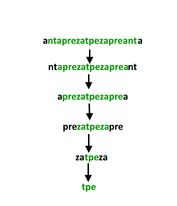

# 最长可能分块回文

> 原文:[https://www . geesforgeks . org/最长可能分块回文/](https://www.geeksforgeeks.org/longest-possible-chunked-palindrome/)

给定一个字符串，任务是返回其最长的可能分块回文的长度。在不是由字符串的字符组成的情况下，表示由子字符串组成的回文。为了更好的理解，请看这个例子

**示例:**

```
Input : ghiabcdefhelloadamhelloabcdefghi 
Output : 7
(ghi)(abcdef)(hello)(adam)(hello)(abcdef)(ghi)

Input : merchant
Output : 1
(merchant)

Input : antaprezatepzapreanta
Output : 11
(a)(nt)(a)(pre)(za)(tpe)(za)(pre)(a)(nt)(a)

Input : geeksforgeeks
Output : 3
(geeks)(for)(geeks)

```

整个想法是从左到右递归地创建块。



如您所见，我们可以匹配左侧区块的子字符串，并将其与右侧区块完全匹配。一旦我们得到匹配，我们递归地计算剩余字符串中最长可能的分块回文的长度。一旦没有剩余字符串，或者找不到有效的分块部分，我们就结束递归。

## Java 语言(一种计算机语言，尤用于创建网站)

```
/* Java program to find the length of longest palindromic
   chunk */
import java.util.*;
import java.lang.*;
import java.io.*;

class LongestPalindromicChunk
{
    // Here s is the string whose LCP is needed
    // ln is length of string evaluated till now
    // and str is original string
    private static int LPCRec(String curr_str, int count,
                             int len, String str)
    {
        // if there is noting at all!!
        if (curr_str == null || curr_str.isEmpty())
            return (0);

        // if a single letter is left out
        if (curr_str.length() <= 1)
        {
            if (count != 0 && str.length() - len <= 1)
                return (count + 1);
            else
                return (1);
        }

        // for each length of substring chunk in string
        int n = curr_str.length();
        for (int i = 0; i < n/2; i++)
        {
            // if left side chunk and right side chunk
            // are same
            if (curr_str.substring(0, i + 1).
                equals(curr_str.substring(n-1-i, n)))
            {
                // Call LCP for the part between the
                // chunks and add 2 to the result.
                // Length of string evaluated till
                // now is increased by (i+1)*2
                return LPCRec(curr_str.substring(i+1, n-1-i),
                           count + 2,
                           len + (i+1)*2, str);
            }
        }

        return count + 1;
    }

    // Wrapper over LPCRec()
    public static int LPC(String str)
    {
        return LPCRec(str, 0, 0, str);
    }

    // driver function
    public static void main(String[] args)
    {
        System.out.println("V : " + LPC("V"));
        System.out.println("VOLVO : " + LPC("VOLVO"));
        System.out.println("VOLVOV : " + LPC("VOLVOV"));
        System.out.println("ghiabcdefhelloadamhelloabcdefghi : " +
                        LPC("ghiabcdefhelloadamhelloabcdefghi"));

        System.out.println("ghiabcdefhelloadamhelloabcdefghik : " +
                        LPC("ghiabcdefhelloadamhelloabcdefghik"));

        System.out.println("antaprezatepzapreanta : " +
                        LPC("antaprezatepzapreanta"));
    }
}
```

## 蟒蛇 3

```
# Python3 program to find length of 
# longest palindromic chunk

# Here curr_str is the string whose 
# LCP is needed leng is length of 
# string evaluated till now and s  
# is original string 
def LPCRec(curr_str, count, leng, s):

    # If there is nothing at all!! 
    if not curr_str:
        return 0

    # If a single letter is left out 
    if len(curr_str) <= 1: 
        if count != 0 and len(s) - leng <= 1: 
            return (count + 1) 
        else:
            return 1

    # For each length of substring 
    # chunk in string 
    n = len(curr_str) 
    for i in range(n // 2): 

        # If left side chunk and right 
        # side chunk are same 
        if (curr_str[0 : i + 1] == 
            curr_str[n - 1 - i : n]): 

            # Call LCP for the part between the 
            # chunks and add 2 to the result. 
            # Length of string evaluated till 
            # now is increased by (i+1)*2 
            return LPCRec(curr_str[i + 1 : n - 1 - i], 
                          count + 2, leng + (i + 1) * 2, s)

    return count + 1

# Wrapper over LPCRec() 
def LPC(s): 

    return LPCRec(s, 0, 0, s)

# Driver code 
print("V :", LPC("V"))
print("VOLVO :", LPC("VOLVO"))
print("VOLVOV :", LPC("VOLVOV"))
print("ghiabcdefhelloadamhelloabcdefghi :", 
  LPC("ghiabcdefhelloadamhelloabcdefghi"))

print("ghiabcdefhelloadamhelloabcdefghik :",
  LPC("ghiabcdefhelloadamhelloabcdefghik"))

print("antaprezatepzapreanta :", 
  LPC("antaprezatepzapreanta"))

# This code is contributed by Prateek Gupta 
```

## C#

```
// C# program to find length of 
// longest palindromic chunk
using System;

class GFG
{
// Here s is the string whose LCP 
// is needed ln is length of string 
// evaluated till now and str is 
// original string 
private static int LPCRec(string curr_str, int count, 
                          int len, string str)
{
    // if there is noting at all!! 
    if (string.ReferenceEquals(curr_str, null) || 
                               curr_str.Length == 0)
    {
        return (0);
    }

    // if a single letter is left out 
    if (curr_str.Length <= 1)
    {
        if (count != 0 && str.Length - len <= 1)
        {
            return (count + 1);
        }
        else
        {
            return (1);
        }
    }

    // for each length of substring 
    // chunk in string 
    int n = curr_str.Length;
    for (int i = 0; i < n / 2; i++)
    {
        // if left side chunk and right side chunk 
        // are same 
        if (curr_str.Substring(0, i + 1).Equals(
            curr_str.Substring(n - 1 - i, n - (n - 1 - i))))
        {
            // Call LCP for the part between the 
            // chunks and add 2 to the result. 
            // Length of string evaluated till 
            // now is increased by (i+1)*2 
            return LPCRec(curr_str.Substring(i + 1, (n - 1 - i) - 
                         (i + 1)), count + 2, len + (i + 1) * 2, str);
        }
    }

    return count + 1;
}

// Wrapper over LPCRec() 
public static int LPC(string str)
{
    return LPCRec(str, 0, 0, str);
}

// Driver Code
public static void Main(string[] args)
{
    Console.WriteLine("V : " + LPC("V"));
    Console.WriteLine("VOLVO : " + LPC("VOLVO"));
    Console.WriteLine("VOLVOV : " + LPC("VOLVOV"));
    Console.WriteLine("ghiabcdefhelloadamhelloabcdefghi : " + 
                    LPC("ghiabcdefhelloadamhelloabcdefghi"));

    Console.WriteLine("ghiabcdefhelloadamhelloabcdefghik : " + 
                    LPC("ghiabcdefhelloadamhelloabcdefghik"));

    Console.WriteLine("antaprezatepzapreanta : " + 
                    LPC("antaprezatepzapreanta"));
}
}

// This code is contributed by Shrikant13
```

**Output:**

```
V : 1
VOLVO : 3
VOLVOV : 5
ghiabcdefhelloadamhelloabcdefghi : 7
ghiabcdefhelloadamhelloabcdefghik : 1
antaprezatepzapreanta : 11

```

下面是针对上述问题的带记忆的 C++实现。

```
#include <iostream>
#include <climits>
#include <unordered_map>
using namespace std;

unordered_map<string, int> mem;

int process(string& s, int l, int r) {
    int ans = 1;
    if (l > r)
        return 0;
    // check if we've already solved this
    if (mem.find(s.substr(l, r-l+1)) != mem.end())
        return mem[s.substr(l, r-l+1)];
    for (int len = 1; len <= (r-l+1)/2; len++) {
        if (s.substr(l, len) == s.substr(r-len+1, len))
            ans = max(ans, 2 + process(s, l+len, r-len));
    }
    // remember result for future
    mem[s.substr(l, r-l+1)] = ans;
    return ans;
}

int LPC(string s) {
    return process(s, 0, s.length()-1);
}

int main() {
    cout << LPC("aaaaabaababbaabaaababababababababbbbaaaaa") << endl;
    return 0;
}
```

来源: [CareerCup](https://www.careercup.com/question?id=5693718846767104)

本文由**阿迪蒂亚·尼哈尔·库马尔·辛格**供稿。如果你喜欢 GeeksforGeeks 并想投稿，你也可以使用[contribute.geeksforgeeks.org](http://www.contribute.geeksforgeeks.org)写一篇文章或者把你的文章邮寄到 contribute@geeksforgeeks.org。看到你的文章出现在极客博客主页上，帮助其他极客。

如果你发现任何不正确的地方，或者你想分享更多关于上面讨论的话题的信息，请写评论。