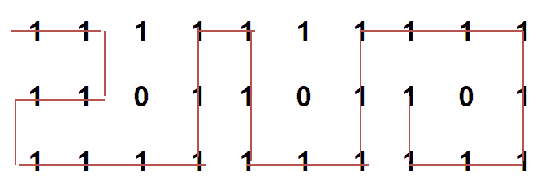

# 有障碍矩阵中最长的可能路线

> 原文:[https://www . geesforgeks . org/最长可能路线-有障碍的矩阵/](https://www.geeksforgeeks.org/longest-possible-route-in-a-matrix-with-hurdles/)

给定一个 M×N 矩阵，任意放置几个障碍，计算矩阵中从源到目的地的最长可能路线的长度。我们只能移动到没有障碍的相邻牢房。路线不能包含任何对角线移动，并且在特定路径中曾经访问过的位置不能再次访问。
例如，从源到目的地没有障碍的最长路径在下面突出显示。路径长度为 24。



这个想法是使用回溯。我们从矩阵的源单元开始，在所有四个允许的方向上向前移动，并递归地检查它们是否导致解。如果找到了目的地，我们就更新最长路径的值，否则如果上面的解决方案都不起作用，我们就从函数中返回 false。
下面是上述思想的 C++实现–

## 卡片打印处理机（Card Print Processor 的缩写）

```
// C++ program to find Longest Possible Route in a
// matrix with hurdles
#include <bits/stdc++.h>
using namespace std;
#define R 3
#define C 10

// A Pair to store status of a cell. found is set to
// true of destination is reachable and value stores
// distance of longest path
struct Pair {
    // true if destination is found
    bool found;

    // stores cost of longest path from current cell to
    // destination cell
    int value;
};

// Function to find Longest Possible Route in the
// matrix with hurdles. If the destination is not reachable
// the function returns false with cost INT_MAX.
// (i, j) is source cell and (x, y) is destination cell.
Pair findLongestPathUtil(int mat[R][C], int i, int j, int x,
                         int y, bool visited[R][C])
{

    // if (i, j) itself is destination, return true
    if (i == x && j == y) {
        Pair p = { true, 0 };
        return p;
    }

    // if not a valid cell, return false
    if (i < 0 || i >= R || j < 0 || j >= C || mat[i][j] == 0
        || visited[i][j]) {
        Pair p = { false, INT_MAX };
        return p;
    }

    // include (i, j) in current path i.e.
    // set visited(i, j) to true
    visited[i][j] = true;

    // res stores longest path from current cell (i, j) to
    // destination cell (x, y)
    int res = INT_MIN;

    // go left from current cell
    Pair sol
        = findLongestPathUtil(mat, i, j - 1, x, y, visited);

    // if destination can be reached on going left from
    // current cell, update res
    if (sol.found)
        res = max(res, sol.value);

    // go right from current cell
    sol = findLongestPathUtil(mat, i, j + 1, x, y, visited);

    // if destination can be reached on going right from
    // current cell, update res
    if (sol.found)
        res = max(res, sol.value);

    // go up from current cell
    sol = findLongestPathUtil(mat, i - 1, j, x, y, visited);

    // if destination can be reached on going up from
    // current cell, update res
    if (sol.found)
        res = max(res, sol.value);

    // go down from current cell
    sol = findLongestPathUtil(mat, i + 1, j, x, y, visited);

    // if destination can be reached on going down from
    // current cell, update res
    if (sol.found)
        res = max(res, sol.value);

    // Backtrack
    visited[i][j] = false;

    // if destination can be reached from current cell,
    // return true
    if (res != INT_MIN) {
        Pair p = { true, 1 + res };
        return p;
    }

    // if destination can't be reached from current cell,
    // return false
    else {
        Pair p = { false, INT_MAX };
        return p;
    }
}

// A wrapper function over findLongestPathUtil()
void findLongestPath(int mat[R][C], int i, int j, int x,
                     int y)
{
    // create a boolean matrix to store info about
    // cells already visited in current route
    bool visited[R][C];

    // initialize visited to false
    memset(visited, false, sizeof visited);

    // find longest route from (i, j) to (x, y) and
    // print its maximum cost
    Pair p = findLongestPathUtil(mat, i, j, x, y, visited);
    if (p.found)
        cout << "Length of longest possible route is "
             << p.value;

    // If the destination is not reachable
    else
        cout << "Destination not reachable from given "
                "source";
}

// Driver code
int main()
{
    // input matrix with hurdles shown with number 0
    int mat[R][C] = { { 1, 1, 1, 1, 1, 1, 1, 1, 1, 1 },
                      { 1, 1, 0, 1, 1, 0, 1, 1, 0, 1 },
                      { 1, 1, 1, 1, 1, 1, 1, 1, 1, 1 } };

    // find longest path with source (0, 0) and
    // destination (1, 7)
    findLongestPath(mat, 0, 0, 1, 7);

    return 0;
}
```

## Java 语言(一种计算机语言，尤用于创建网站)

```
/*package whatever //do not write package name here */

// Java program to find Longest Possible Route in a
// matrix with hurdles
import java.io.*;

class GFG {
  static int R = 3;
  static int C = 10;

  // A Pair to store status of a cell. found is set to
  // true of destination is reachable and value stores
  // distance of longest path
  static class Pair {

    // true if destination is found
    boolean found;

    // stores cost of longest path from current cell to
    // destination cell
    int val;

    Pair (boolean x, int y){
      found = x;
      val = y;
    }
  }

  // Function to find Longest Possible Route in the
  // matrix with hurdles. If the destination is not reachable
  // the function returns false with cost Integer.MAX_VALUE.
  // (i, j) is source cell and (x, y) is destination cell.

  static Pair findLongestPathUtil (int mat[][], int i, int j, int x, int y, boolean visited[][]) {

    // if (i, j) itself is destination, return true
    if(i == x && j == y)
      return new Pair(true, 0);

    // if not a valid cell, return false 
    if(i < 0 || i >= R || j < 0 || j >= C || mat[i][j] == 0 || visited[i][j] )
      return new Pair(false, Integer.MAX_VALUE);

    // include (i, j) in current path i.e.
    // set visited(i, j) to true
    visited[i][j] = true;

    // res stores longest path from current cell (i, j) to
    // destination cell (x, y)
    int res = Integer.MIN_VALUE;

    // go left from current cell
    Pair sol = findLongestPathUtil(mat, i, j-1, x, y, visited);

    // if destination can be reached on going left from current
    // cell, update res
    if(sol.found)
      res = Math.max(sol.val, res);

    // go right from current cell
    sol = findLongestPathUtil(mat, i, j+1, x, y, visited);

    // if destination can be reached on going right from current
    // cell, update res
    if(sol.found)
      res = Math.max(sol.val, res);

    // go up from current cell
    sol = findLongestPathUtil(mat, i-1, j, x, y, visited);

    // if destination can be reached on going up from current
    // cell, update res
    if(sol.found)
      res = Math.max(sol.val, res);

    // go down from current cell
    sol = findLongestPathUtil(mat, i+1, j, x, y, visited);

    // if destination can be reached on going down from current
    // cell, update res
    if(sol.found)
      res = Math.max(sol.val, res);

    // Backtrack
    visited[i][j] = false;

    // if destination can be reached from current cell,
    // return true
    if(res != Integer.MIN_VALUE)
      return new Pair(true, res+1);

    // if destination can't be reached from current cell,
    // return false
    else
      return new Pair(false, Integer.MAX_VALUE);

  } 

  // A wrapper function over findLongestPathUtil()
  static void findLongestPath (int mat[][], int i, int j, int x, int y) {

    // create a boolean matrix to store info about
    // cells already visited in current route
    boolean visited[][] = new boolean[R][C];

    // find longest route from (i, j) to (x, y) and
    // print its maximum cost
    Pair p = findLongestPathUtil(mat, i, j, x, y, visited);

    if(p.found)
      System.out.println("Length of longest possible route is " + p.val);

    // If the destination is not reachable
    else
      System.out.println("Destination not reachable from given source");

  }

  // Driver Code
  public static void main (String[] args) {

    // input matrix with hurdles shown with number 0
    int mat[][] = { { 1, 1, 1, 1, 1, 1, 1, 1, 1, 1 },
                   { 1, 1, 0, 1, 1, 0, 1, 1, 0, 1 },
                   { 1, 1, 1, 1, 1, 1, 1, 1, 1, 1 } };

    // find longest path with source (0, 0) and
    // destination (1, 7)
    findLongestPath(mat, 0, 0, 1, 7);

  }
}

// This code is contributed by th_aditi.
```

输出:

```
Length of longest possible route is 24
```

本文由**阿迪蒂亚·戈尔**供稿。如果你喜欢 GeeksforGeeks 并想投稿，你也可以使用[write.geeksforgeeks.org](https://write.geeksforgeeks.org)写一篇文章或者把你的文章邮寄到 review-team@geeksforgeeks.org。看到你的文章出现在极客博客主页上，帮助其他极客。
如果你发现任何不正确的地方，或者你想分享更多关于上面讨论的话题的信息，请写评论。