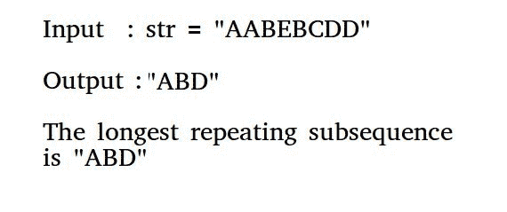

# 最长重复子序列

> 原文:[https://www.geeksforgeeks.org/longest-repeated-subsequence/](https://www.geeksforgeeks.org/longest-repeated-subsequence/)

给定一个字符串，打印最长的重复子序列，这样两个子序列在相同的位置就不会有相同的字符串，也就是说，两个子序列中的任何第 I 个字符在原始字符串中都不会有相同的索引。



**示例:**

```
Input: str = "aabb"
Output: "ab"

Input: str = "aab"
Output: "a"
The two subsequence are 'a'(first) and 'a' 
(second). Note that 'b' cannot be considered 
as part of subsequence as it would be at same
index in both.
```

这个问题只是[最长公共子序列问题](https://www.geeksforgeeks.org/dynamic-programming-set-4-longest-common-subsequence/)的修改。其思想是找到 **LCS(str，str)，其中 str 是输入字符串，限制是当两个字符相同时，它们不应该在两个字符串的同一索引上。**
我们已经讨论了寻找[长度最长重复子序列的解决方案。](https://www.geeksforgeeks.org/longest-repeating-subsequence/)

## C++

```
// Refer https://www.geeksforgeeks.org/longest-repeating-subsequence/
// for complete code.
// This function mainly returns LCS(str, str)
// with a condition that same characters at
// same index are not considered. 
int findLongestRepeatingSubSeq(string str)
{
    int n = str.length();

    // Create and initialize DP table
    int dp[n+1][n+1];
  //initializing first row and column in dp table
    for(int i=0;i<=n;i++){
      dp[i][0] =0;
      dp[0][i] =0;
    }

    // Fill dp table (similar to LCS loops)
    for (int i=1; i<=n; i++)
    {
        for (int j=1; j<=n; j++)
        {
            // If characters match and indexes are 
            // not same
            if (str[i-1] == str[j-1] && i != j)
                dp[i][j] =  1 + dp[i-1][j-1];          

            // If characters do not match
            else
                dp[i][j] = max(dp[i][j-1], dp[i-1][j]);
        }
    }
    return dp[n][n];
}
```

## Java 语言(一种计算机语言，尤用于创建网站)

```

// Refer https://www.geeksforgeeks.org/longest-repeating-subsequence/
// for complete code.
// This function mainly returns LCS(str, str)
// with a condition that same characters at
// same index are not considered. 
static int findLongestRepeatingSubSeq(String str)
{
    int n = str.length();

    // Create and initialize DP table
    int dp[][] = new int[n+1][n+1];
    for (int i=0; i<=n; i++)
        for (int j=0; j<=n; j++)
            dp[i][j] = 0;

    // Fill dp table (similar to LCS loops)
    for (int i=1; i<=n; i++)
    {
        for (int j=1; j<=n; j++)
        {
            // If characters match and indexes are 
            // not same
            if (str.charAt(i-1)== str.charAt(j-1) && i != j)
                dp[i][j] =  1 + dp[i-1][j-1];          

            // If characters do not match
            else
                dp[i][j] = Math.max(dp[i][j-1], dp[i-1][j]);
        }
    }
    return dp[n][n];
}
```

## 蟒蛇 3

```
# Python method for Longest Repeated
# Subsequence

# Refer https://www.geeksforgeeks.org/longest-repeating-subsequence/
# for complete code.
# This function mainly returns LCS(str, str)
# with a condition that same characters at
# same index are not considered.
def findLongestRepeatingSubSeq(str):
    n = len(str)

    # Create and initialize DP table
    dp = [[0 for k in range(n+1)] for l in range(n+1)]

    # Fill dp table (similar to LCS loops)
    for i in range(1, n+1):
        for j in range(1, n+1):
            # If characters match and indices are not same
            if (str[i-1] == str[j-1] and i != j):
                dp[i][j] = 1 + dp[i-1][j-1]

            # If characters do not match
            else:
                dp[i][j] = max(dp[i][j-1], dp[i-1][j])

    return dp[n][n]

# This code is contributed by Soumen Ghosh
```

## C#

```
// Refer https://www.geeksforgeeks.org/longest-repeating-subsequence/
// for complete code.
// This function mainly returns LCS(str, str)
// with a condition that same characters at
// same index are not considered. 
static int findLongestRepeatingSubSeq(String str)
{
    int n = str.Length;

    // Create and initialize DP table
    int [,]dp = new int[n+1,n+1];
    for (int i = 0; i <= n; i++)
        for (int j = 0; j <= n; j++)
            dp[i, j] = 0;

    // Fill dp table (similar to LCS loops)
    for (int i = 1; i <= n; i++)
    {
        for (int j = 1; j <= n; j++)
        {
            // If characters match and indexes are 
            // not same
            if (str[i-1]== str[j-1] && i != j)
                dp[i, j] = 1 + dp[i-1, j-1];         

            // If characters do not match
            else
                dp[i,j] = Math.Max(dp[i, j-1], dp[i-1, j]);
        }
    }
    return dp[n, n];
}

// This code is contributed by 29AjayKumar
```

## 服务器端编程语言（Professional Hypertext Preprocessor 的缩写）

```
<?php 
// Refer https://www.geeksforgeeks.org/longest-repeating-subsequence/
// for complete code.
// This function mainly returns LCS(str, str)
// with a condition that same characters at
// same index are not considered. 
function findLongestRepeatingSubSeq($str)
{
    $n = strlen($str);

    // Create and initialize DP table
    $dp = array_fill(0, $n + 1, 
          array_fill(0, $n + 1, NULL));
    for ($i = 0; $i <= $n; $i++)
        for ($j = 0; $j <= $n; $j++)
            $dp[$i][$j] = 0;

    // Fill dp table (similar to LCS loops)
    for ($i = 1; $i <= $n; $i++)
    {
        for ($j = 1; $j <= $n; $j++)
        {
            // If characters match and indexes 
            // are not same
            if ($str[$i - 1] == $str[$j - 1] &&
                                     $i != $j)
                $dp[$i][$j] = 1 + $dp[$i - 1][$j - 1];         

            // If characters do not match
            else
                $dp[$i][$j] = max($dp[$i][$j - 1], 
                                  $dp[$i - 1][$j]);
        }
    }
    return $dp[$n][$n];
}

// This code is contributed by ita_c
?>
```

## java 描述语言

```
<script>
// Refer https://www.geeksforgeeks.org/longest-repeating-subsequence/
// for complete code.
// This function mainly returns LCS(str, str)
// with a condition that same characters at
// same index are not considered.
    function findLongestRepeatingSubSeq(str)
    {
        let n = str.length;

    // Create and initialize DP table
    let dp = new Array(n+1);
    for (let i = 0; i <= n; i++)
    {
        dp[i] = new Array(n+1);
        for (let j = 0; j <= n; j++)
            dp[i][j] = 0;
       }

    // Fill dp table (similar to LCS loops)
    for (let i = 1; i <= n; i++)
    {
        for (let j = 1; j <= n; j++)
        {

            // If characters match and indexes are
            // not same
            if (str[i - 1] == str[j - 1] && i != j)
                dp[i][j] =  1 + dp[i - 1][j - 1];         

            // If characters do not match
            else
                dp[i][j] = Math.max(dp[i][j - 1], dp[i - 1][j]);
        }
    }
    return dp[n][n];
    }

    // This code is contributed by avanitrachhadiya2155
</script>
```

**时间复杂度:**o(n^2)
T3】如何打印子序列？
以上解只求子序列的长度。我们可以使用建立的 dp[n+1][n+1]表打印子序列。这个想法类似于[印刷 LCS](https://www.geeksforgeeks.org/printing-longest-common-subsequence/) 。

```

// Pseudo code to find longest repeated
// subsequence using the dp[][] table filled
// above.

// Initialize result
string res = "";

// Traverse dp[][] from bottom right
i = n, j = n;
while (i > 0 && j > 0)
{
   // If this cell is same as diagonally
   // adjacent cell just above it, then 
   // same characters are present at 
   // str[i-1] and str[j-1]. Append any 
   // of them to result.
   if (dp[i][j] == dp[i-1][j-1] + 1)
   {
       res = res + str[i-1];
       i--;
       j--;
   }

   // Otherwise we move to the side
   // that that gave us maximum result
   else if (dp[i][j] == dp[i-1][j])
      i--;
   else
      j--;
 }

 // Since we traverse dp[][] from bottom,
 // we get result in reverse order.
 reverse(res.begin(), res.end());

return res;
```

下面是上述步骤的实现。

## C++

```
// C++ program to find the longest repeated
// subsequence
#include <bits/stdc++.h>
using namespace std;

// This function mainly returns LCS(str, str)
// with a condition that same characters at
// same index are not considered.
string longestRepeatedSubSeq(string str)
{
    // THIS PART OF CODE IS SAME AS BELOW POST. 
    // IT FILLS dp[][]
    // https://www.geeksforgeeks.org/longest-repeating-subsequence/
    // OR the code mentioned above.
    int n = str.length();
    int dp[n+1][n+1];
    for (int i=0; i<=n; i++)
        for (int j=0; j<=n; j++)
            dp[i][j] = 0;
    for (int i=1; i<=n; i++)
        for (int j=1; j<=n; j++)
            if (str[i-1] == str[j-1] && i != j)
                dp[i][j] =  1 + dp[i-1][j-1];
            else
                dp[i][j] = max(dp[i][j-1], dp[i-1][j]);

    // THIS PART OF CODE FINDS THE RESULT STRING USING DP[][]
    // Initialize result
    string res = "";

    // Traverse dp[][] from bottom right
    int i = n, j = n;
    while (i > 0 && j > 0)
    {
        // If this cell is same as diagonally
        // adjacent cell just above it, then 
        // same characters are present at 
        // str[i-1] and str[j-1]. Append any 
        // of them to result.
        if (dp[i][j] == dp[i-1][j-1] + 1)
        {
           res = res + str[i-1];
           i--;
           j--;
        }

        // Otherwise we move to the side
        // that that gave us maximum result
        else if (dp[i][j] == dp[i-1][j])
            i--;
        else
            j--;
    }

    // Since we traverse dp[][] from bottom,
    // we get result in reverse order.
    reverse(res.begin(), res.end());

    return res;
}

// Driver Program
int main()
{
    string str = "AABEBCDD";
    cout << longestRepeatedSubSeq(str);
    return 0;
}
```

## Java 语言(一种计算机语言，尤用于创建网站)

```
// Java program to find the longest repeated
// subsequence
import java.util.*;

class GFG
{

// This function mainly returns LCS(str, str)
// with a condition that same characters at
// same index are not considered.
static String longestRepeatedSubSeq(String str)
{
    // THIS PART OF CODE IS SAME AS BELOW POST. 
    // IT FILLS dp[][]
    // https://www.geeksforgeeks.org/longest-repeating-subsequence/
    // OR the code mentioned above.
    int n = str.length();
    int[][] dp = new int[n + 1][n + 1];
    for (int i = 0; i <= n; i++)
        for (int j = 0; j <= n; j++)
            dp[i][j] = 0;
    for (int i = 1; i <= n; i++)
        for (int j = 1; j <= n; j++)
            if (str.charAt(i - 1) == str.charAt(j - 1) && i != j)
                dp[i][j] = 1 + dp[i - 1][j - 1];
            else
                dp[i][j] = Math.max(dp[i][j - 1], dp[i - 1][j]);

    // THIS PART OF CODE FINDS 
    // THE RESULT STRING USING DP[][]
    // Initialize result
    String res = "";

    // Traverse dp[][] from bottom right
    int i = n, j = n;
    while (i > 0 && j > 0)
    {
        // If this cell is same as diagonally
        // adjacent cell just above it, then 
        // same characters are present at 
        // str[i-1] and str[j-1]. Append any 
        // of them to result.
        if (dp[i][j] == dp[i - 1][j - 1] + 1)
        {
        res = res + str.charAt(i - 1);
        i--;
        j--;
        }

        // Otherwise we move to the side
        // that that gave us maximum result
        else if (dp[i][j] == dp[i - 1][j])
            i--;
        else
            j--;
    }

    // Since we traverse dp[][] from bottom,
    // we get result in reverse order.
    String reverse = "";

    for(int k = res.length() - 1; k >= 0; k--)
        {
            reverse = reverse + res.charAt(k);
        } 

    return reverse;
}

// Driver code
public static void main(String args[])
{
    String str = "AABEBCDD";
    System.out.println(longestRepeatedSubSeq(str));
}
}

// This code is contributed by
// Surendra_Gangwar
```

## 蟒蛇 3

```
# Python3 program to find the 
# longest repeated subsequence

# This function mainly returns LCS(str, str) 
# with a condition that same characters 
# at same index are not considered.
def longestRepeatedSubSeq(str):
    # This part of code is same as 
    # below post it fills dp[][]
    # https://www.geeksforgeeks.org/longest-repeating-subsequence/
    # OR the code mentioned above
    n = len(str)
    dp = [[0 for i in range(n+1)] for j in range(n+1)]

    for i in range(1, n + 1):
        for j in range(1, n + 1):
            if (str[i-1] == str[j-1] and i != j):
                dp[i][j] = 1 + dp[i-1][j-1]
            else:
                dp[i][j] = max(dp[i][j-1], dp[i-1][j])

    # This part of code finds the result
    # string using dp[][] Initialize result
    res = ''

    # Traverse dp[][] from bottom right
    i = n
    j = n
    while (i > 0 and j > 0):
        # If this cell is same as diagonally
        # adjacent cell just above it, then
        # same characters are present at
        # str[i-1] and str[j-1]. Append any
        # of them to result.
        if (dp[i][j] == dp[i-1][j-1] + 1):
            res += str[i-1]
            i -= 1
            j -= 1

        # Otherwise we move to the side
        # that gave us maximum result.
        elif (dp[i][j] == dp[i-1][j]):
            i -= 1
        else:
            j -= 1

    # Since we traverse dp[][] from bottom,
    # we get result in reverse order.
    res = ''.join(reversed(res))

    return res

# Driver Program
str = 'AABEBCDD'
print(longestRepeatedSubSeq(str))

# This code is contributed by Soumen Ghosh
```

## 服务器端编程语言（Professional Hypertext Preprocessor 的缩写）

```
<?php
// Php program to find the longest repeated 
// subsequence 

// This function mainly returns LCS(str, str) 
// with a condition that same characters at 
// same index are not considered. 
function longestRepeatedSubSeq($str) 
{ 
    // THIS PART OF CODE IS SAME AS BELOW POST. 
    // IT FILLS dp[][] 
    // https://www.geeksforgeeks.org/longest-repeating-subsequence/ 
    // OR the code mentioned above. 
    $n = strlen($str);
    $dp = array(array());
    for ($i = 0; $i <= $n; $i++) 
        for ($j = 0; $j <= $n; $j++) 
            $dp[$i][$j] = 0; 
    for ($i = 1; $i <= $n; $i++) 
        for ($j = 1; $j <= $n; $j++) 
            if ($str[$i - 1] == $str[$j - 1] && $i != $j) 
                $dp[$i][$j] = 1 + $dp[$i - 1][$j - 1]; 
            else
                $dp[$i][$j] = max($dp[$i][$j - 1], 
                                  $dp[$i - 1][$j]); 

    // THIS PART OF CODE FINDS THE RESULT 
    // STRING USING DP[][], Initialize result 
    $res = ""; 

    // Traverse dp[][] from bottom right 
    $i = $n;
    $j = $n; 
    while ($i > 0 && $j > 0) 
    { 
        // If this cell is same as diagonally 
        // adjacent cell just above it, then 
        // same characters are present at 
        // str[i-1] and str[j-1]. Append any 
        // of them to result. 
        if ($dp[$i][$j] == $dp[$i - 1][$j - 1] + 1) 
        { 
            $res = $res.$str[$i - 1]; 
            $i--; 
            $j--; 
        } 

        // Otherwise we move to the side 
        // that that gave us maximum result 
        else if ($dp[$i][$j] == $dp[$i - 1][$j]) 
            $i--; 
        else
            $j--; 
    } 

    // Since we traverse dp[][] from bottom, 
    // we get result in reverse order. 
    return strrev($res) ;
} 

// Driver Code 
$str = "AABEBCDD"; 
echo longestRepeatedSubSeq($str); 

// This code is contributed by Ryuga
?>
```

## C#

```
// C# program to find the longest repeated
// subsequence
using System;
using System.Collections.Generic;

class GFG
{

// This function mainly returns LCS(str, str)
// with a condition that same characters at
// same index are not considered.
static String longestRepeatedSubSeq(String str)
{
    // THIS PART OF CODE IS SAME AS BELOW POST. 
    // IT FILLS dp[,]
    // https://www.geeksforgeeks.org/longest-repeating-subsequence/
    // OR the code mentioned above.
    int n = str.Length,i,j;
    int[,] dp = new int[n + 1,n + 1];
    for (i = 0; i <= n; i++)
        for (j = 0; j <= n; j++)
            dp[i, j] = 0;
    for (i = 1; i <= n; i++)
        for (j = 1; j <= n; j++)
            if (str[i - 1] == str[j - 1] && i != j)
                dp[i, j] = 1 + dp[i - 1, j - 1];
            else
                dp[i, j] = Math.Max(dp[i, j - 1], dp[i - 1, j]);

    // THIS PART OF CODE FINDS 
    // THE RESULT STRING USING DP[,]
    // Initialize result
    String res = "";

    // Traverse dp[,] from bottom right
    i = n; j= n;
    while (i > 0 && j > 0)
    {
        // If this cell is same as diagonally
        // adjacent cell just above it, then 
        // same characters are present at 
        // str[i-1] and str[j-1]. Append any 
        // of them to result.
        if (dp[i, j] == dp[i - 1,j - 1] + 1)
        {
            res = res + str[i - 1];
            i--;
            j--;
        }

        // Otherwise we move to the side
        // that that gave us maximum result
        else if (dp[i,j] == dp[i - 1,j])
            i--;
        else
            j--;
    }

    // Since we traverse dp[,] from bottom,
    // we get result in reverse order.
    String reverse = "";

    for(int k = res.Length - 1; k >= 0; k--)
        {
            reverse = reverse + res[k];
        } 

    return reverse;
}

// Driver code
public static void Main(String []args)
{
    String str = "AABEBCDD";
    Console.WriteLine(longestRepeatedSubSeq(str));
}
}

// This code is contributed by Princi Singh
```

## java 描述语言

```
<script>

// Javascript program to find the longest repeated
// subsequence

    // This function mainly returns LCS(str, str)
// with a condition that same characters at
// same index are not considered.
    function longestRepeatedSubSeq(str)
    {
        // THIS PART OF CODE IS SAME AS BELOW POST.
    // IT FILLS dp[][]
    // https://www.geeksforgeeks.org/longest-repeating-
                                            subsequence/
    // OR the code mentioned above.
    let n = str.length;
    let dp = new Array(n + 1);
    for (let i = 0; i <= n; i++)
    {
        dp[i]=new Array(n+1);
        for (let j = 0; j <= n; j++)
            dp[i][j] = 0;
    }       

    for (let i = 1; i <= n; i++)
        for (let j = 1; j <= n; j++)
            if (str[i-1] == str[j-1] && i != j)
                dp[i][j] = 1 + dp[i - 1][j - 1];
            else
                dp[i][j] = Math.max(dp[i][j - 1],
                dp[i - 1][j]);

    // THIS PART OF CODE FINDS
    // THE RESULT STRING USING DP[][]
    // Initialize result
    let res = "";

    // Traverse dp[][] from bottom right
    let i = n, j = n;
    while (i > 0 && j > 0)
    {
        // If this cell is same as diagonally
        // adjacent cell just above it, then
        // same characters are present at
        // str[i-1] and str[j-1]. Append any
        // of them to result.
        if (dp[i][j] == dp[i - 1][j - 1] + 1)
        {
        res = res + str[i-1];
        i--;
        j--;
        }

        // Otherwise we move to the side
        // that that gave us maximum result
        else if (dp[i][j] == dp[i - 1][j])
            i--;
        else
            j--;
    }

    // Since we traverse dp[][] from bottom,
    // we get result in reverse order.
    let reverse = "";

    for(let k = res.length - 1; k >= 0; k--)
        {
            reverse = reverse + res[k];
        }

    return reverse;
    }

    // Driver code
    let str = "AABEBCDD";
    document.write(longestRepeatedSubSeq(str));

    // This code is contributed by rag2127

</script>
```

**输出:**

```
ABD
```

**时间复杂度:**O(n<sup>2</sup>)
T5】辅助空间: O(n <sup>2</sup> )
本文由 **Kartik** 供稿。如果你喜欢 GeeksforGeeks 并想投稿，你也可以使用[write.geeksforgeeks.org](http://www.write.geeksforgeeks.org)写一篇文章或者把你的文章邮寄到 review-team@geeksforgeeks.org。看到你的文章出现在极客博客主页上，帮助其他极客。
如果发现有不正确的地方，或者想分享更多关于上述话题的信息，请写评论。