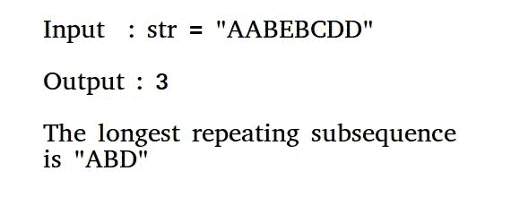

# 最长重复子序列

> 原文:[https://www . geesforgeks . org/最长重复子序列/](https://www.geeksforgeeks.org/longest-repeating-subsequence/)

给定一个字符串，找到最长重复子序列的长度，这样两个子序列在相同的位置就不会有相同的字符串字符，也就是说，两个子序列中的任何第 I 个字符在原始字符串中都不会有相同的索引。



**示例:**

```
Input: str = "abc"
Output: 0
There is no repeating subsequence

Input: str = "aab"
Output: 1
The two subssequence are 'a'(first) and 'a'(second). 
Note that 'b' cannot be considered as part of subsequence 
as it would be at same index in both.

Input: str = "aabb"
Output: 2

Input: str = "axxxy"
Output: 2
```

这个问题只是[最长公共子序列问题](https://www.geeksforgeeks.org/dynamic-programming-set-4-longest-common-subsequence/)的修改。其思想是找到 **LCS(str，str)，其中 str 是输入字符串，限制是当两个字符相同时，它们不应该在两个字符串的同一索引上。**

下面是这个想法的实现。

## C++

```
// C++ program to find the longest repeating
// subsequence
#include <iostream>
#include <string>
using namespace std;

// This function mainly returns LCS(str, str)
// with a condition that same characters at
// same index are not considered.
int findLongestRepeatingSubSeq(string str)
{
    int n = str.length();

    // Create and initialize DP table
    int dp[n+1][n+1];
    for (int i=0; i<=n; i++)
        for (int j=0; j<=n; j++)
            dp[i][j] = 0;

    // Fill dp table (similar to LCS loops)
    for (int i=1; i<=n; i++)
    {
        for (int j=1; j<=n; j++)
        {
            // If characters match and indexes are
            // not same
            if (str[i-1] == str[j-1] && i != j)
                dp[i][j] =  1 + dp[i-1][j-1];         

            // If characters do not match
            else
                dp[i][j] = max(dp[i][j-1], dp[i-1][j]);
        }
    }
    return dp[n][n];
}

// Driver Program
int main()
{
    string str = "aabb";
    cout << "The length of the largest subsequence that"
            " repeats itself is : "
        << findLongestRepeatingSubSeq(str);
    return 0;
}
```

## Java 语言(一种计算机语言，尤用于创建网站)

```
// Java program to find the longest
// repeating subsequence
import java.io.*;
import java.util.*;

class LRS
{
    // Function to find the longest repeating subsequence
    static int findLongestRepeatingSubSeq(String str)
    {
        int n = str.length();

        // Create and initialize DP table
        int[][] dp = new int[n+1][n+1];

        // Fill dp table (similar to LCS loops)
        for (int i=1; i<=n; i++)
        {
            for (int j=1; j<=n; j++)
            {
                // If characters match and indexes are not same
                if (str.charAt(i-1) == str.charAt(j-1) && i!=j)
                    dp[i][j] =  1 + dp[i-1][j-1];         

                // If characters do not match
                else
                    dp[i][j] = Math.max(dp[i][j-1], dp[i-1][j]);
            }
        }
        return dp[n][n];
    }

    // driver program to check above function
    public static void main (String[] args)
    {
        String str = "aabb";
        System.out.println("The length of the largest subsequence that"
            +" repeats itself is : "+findLongestRepeatingSubSeq(str));
    }
}

// This code is contributed by Pramod Kumar
```

## 蟒蛇 3

```
# Python 3 program to find the longest repeating
# subsequence

# This function mainly returns LCS(str, str)
# with a condition that same characters at
# same index are not considered.
def findLongestRepeatingSubSeq( str):

    n = len(str)

    # Create and initialize DP table
    dp=[[0 for i in range(n+1)] for j in range(n+1)]

    # Fill dp table (similar to LCS loops)
    for i in range(1,n+1):
        for j in range(1,n+1):
            # If characters match and indexes are
            # not same
            if (str[i-1] == str[j-1] and i != j):
                dp[i][j] = 1 + dp[i-1][j-1]        

            # If characters do not match
            else:
                dp[i][j] = max(dp[i][j-1], dp[i-1][j])

    return dp[n][n]

# Driver Program
if __name__=='__main__':
    str = "aabb"
    print("The length of the largest subsequence that repeats itself is : "
          ,findLongestRepeatingSubSeq(str))

# this code is contributed by ash264
```

## C#

```
// C# program to find the longest repeating
// subsequence
using System;

class GFG {

    // Function to find the longest repeating
    // subsequence
    static int findLongestRepeatingSubSeq(string str)
    {
        int n = str.Length;

        // Create and initialize DP table
        int [,]dp = new int[n+1,n+1];

        // Fill dp table (similar to LCS loops)
        for (int i = 1; i <= n; i++)
        {
            for (int j = 1; j <= n; j++)
            {

                // If characters match and indexes
                // are not same
                if (str[i-1] == str[j-1] && i != j)
                    dp[i,j] = 1 + dp[i-1,j-1];        

                // If characters do not match
                else
                    dp[i,j] = Math.Max(dp[i,j-1],
                                       dp[i-1,j]);
            }
        }
        return dp[n,n];
    }

    // driver program to check above function
    public static void Main ()
    {
        string str = "aabb";
        Console.Write("The length of the largest "
         + "subsequence that repeats itself is : "
               + findLongestRepeatingSubSeq(str));
    }
}

// This code is contributed by nitin mittal.
```

## 服务器端编程语言（Professional Hypertext Preprocessor 的缩写）

```
<?php
// PHP program to find the
// longest repeating subsequence

// This function mainly returns
// LCS(str, str) with a condition
// that same characters at same
// index are not considered.
function findLongestRepeatingSubSeq($str)
{
    $n = strlen($str);

    // Create and initialize
    // DP table
    $dp = array(array());
    for ($i = 0; $i <= $n; $i++)
        for ($j = 0; $j <= $n; $j++)
            $dp[$i][$j] = 0;

    // Fill dp table
    // (similar to LCS loops)
    for ($i = 1; $i <= $n; $i++)
    {
        for ($j = 1; $j <= $n; $j++)
        {
            // If characters match and
            // indexes are not same
            if ($str[$i - 1] == $str[$j - 1] &&
                                $i != $j)
                $dp[$i][$j] = 1 + $dp[$i - 1][$j - 1];    

            // If characters
            // do not match
            else
                $dp[$i][$j] = max($dp[$i][$j - 1],
                                  $dp[$i - 1][$j]);
        }
    }
    return $dp[$n][$n];
}

// Driver Code
$str = "aabb";
echo "The length of the largest ".
     "subsequence that repeats itself is : ",
            findLongestRepeatingSubSeq($str);

// This code is contributed
// by shiv_bhakt.
?>
```

## java 描述语言

```
<script>
    // Javascript program to find the longest repeating
    // subsequence

    // This function mainly returns LCS(str, str)
    // with a condition that same characters at
    // same index are not considered.
    function findLongestRepeatingSubSeq(str)
    {
        var n = str.length;

        // Create and initialize DP table
        var dp = new Array(n + 1);

        for (var i=0; i<=n; i++)
        {
            dp[i] = new Array(n + 1);
            for (var j=0; j<=n; j++)
            {
                dp[i][j] = 0;
            }
        }

        // Fill dp table (similar to LCS loops)
        for (var i=1; i<=n; i++)
        {
            for (var j=1; j<=n; j++)
            {
                // If characters match and indexes are
                // not same
                if ((str[i-1] == str[j-1]) && (i != j))
                    dp[i][j] =  1 + dp[i-1][j-1];         

                // If characters do not match
                else
                    dp[i][j] = Math.max(dp[i][j-1], dp[i-1][j]);
            }
        }
        return dp[n][n];
    }
    // Driver Code

    var str = "aabb";
    document.write("The length of the largest subsequence that repeats itself is : " + findLongestRepeatingSubSeq(str));

</script>
```

**输出:**

```
The length of the largest subsequence that repeats itself is : 2
```

**另一种方法:**(使用递归)

## C++

```
// C++ program to find the longest repeating
// subsequence using recursion
#include <bits/stdc++.h>
using namespace std;

int dp[1000][1000];

// This function mainly returns LCS(str, str)
// with a condition that same characters at
// same index are not considered.

int findLongestRepeatingSubSeq(string X, int m, int n)
{

    if(dp[m][n]!=-1)
    return dp[m][n];

    // return if we have reached the end of either string
    if (m == 0 || n == 0)
        return dp[m][n] = 0;

    // if characters at index m and n matches
    // and index is different
    if (X[m - 1] == X[n - 1] && m != n)
        return dp[m][n] = findLongestRepeatingSubSeq(X,
                            m - 1, n - 1) + 1;

    // else if characters at index m and n don't match
    return dp[m][n] = max (findLongestRepeatingSubSeq(X, m, n - 1),
                           findLongestRepeatingSubSeq(X, m - 1, n));
}

// Longest Repeated Subsequence Problem
int main()
{
    string str = "aabb";
    int m = str.length();

memset(dp,-1,sizeof(dp));
cout << "The length of the largest subsequence that"
            " repeats itself is : "
        << findLongestRepeatingSubSeq(str,m,m);

    return 0;
// this code is contributed by Kushdeep Mittal
}
```

## Java 语言(一种计算机语言，尤用于创建网站)

```
import java.util.Arrays;

// Java program to find the longest repeating
// subsequence using recursion
public class GFG {

    static int dp[][] = new int[1000][1000];

// This function mainly returns LCS(str, str)
// with a condition that same characters at
// same index are not considered.
    static int findLongestRepeatingSubSeq(char X[], int m, int n) {

        if (dp[m][n] != -1) {
            return dp[m][n];
        }

        // return if we have reached the end of either string
        if (m == 0 || n == 0) {
            return dp[m][n] = 0;
        }

        // if characters at index m and n matches
        // and index is different
        if (X[m - 1] == X[n - 1] && m != n) {
            return dp[m][n] = findLongestRepeatingSubSeq(X,
                    m - 1, n - 1) + 1;
        }

        // else if characters at index m and n don't match
        return dp[m][n] = Math.max(findLongestRepeatingSubSeq(X, m, n - 1),
                findLongestRepeatingSubSeq(X, m - 1, n));
    }

// Longest Repeated Subsequence Problem
    static public void main(String[] args) {
        String str = "aabb";
        int m = str.length();
        for (int[] row : dp) {
            Arrays.fill(row, -1);
        }
        System.out.println("The length of the largest subsequence that"
                + " repeats itself is : "
                + findLongestRepeatingSubSeq(str.toCharArray(), m, m));

    }
}

// This code is contributed by 29AjayKumar
```

## 蟒蛇 3

```
# Python 3 program to find the longest repeating
# subsequence using recursion

dp = [[0 for i in range(1000)] for j in range(1000)]

# This function mainly returns LCS(str, str)
# with a condition that same characters at
# same index are not considered.

def findLongestRepeatingSubSeq( X, m, n):

    if(dp[m][n]!=-1):
        return dp[m][n]

    # return if we have reached the end of either string
    if (m == 0 or n == 0):
        dp[m][n] = 0
        return dp[m][n]

    # if characters at index m and n matches
    # and index is different
    if (X[m - 1] == X[n - 1] and m != n):
        dp[m][n] = findLongestRepeatingSubSeq(X,
                            m - 1, n - 1) + 1

        return dp[m][n]

    # else if characters at index m and n don't match
    dp[m][n] = max (findLongestRepeatingSubSeq(X, m, n - 1),
                        findLongestRepeatingSubSeq(X, m - 1, n))
    return dp[m][n]

# Longest Repeated Subsequence Problem
if __name__ == "__main__":
    str = "aabb"
    m = len(str)

dp =[[-1 for i in range(1000)] for j in range(1000)]
print( "The length of the largest subsequence that"
            " repeats itself is : "
        , findLongestRepeatingSubSeq(str,m,m))

# this code is contributed by
# ChitraNayal
```

## C#

```
//C# program to find the longest repeating
// subsequence using recursion
using System;
public class GFG {

    static int [,]dp = new int[1000,1000];

// This function mainly returns LCS(str, str)
// with a condition that same characters at
// same index are not considered.
    static int findLongestRepeatingSubSeq(char []X, int m, int n) {

        if (dp[m,n] != -1) {
            return dp[m,n];
        }

        // return if we have reached the end of either string
        if (m == 0 || n == 0) {
            return dp[m,n] = 0;
        }

        // if characters at index m and n matches
        // and index is different
        if (X[m - 1] == X[n - 1] && m != n) {
            return dp[m,n] = findLongestRepeatingSubSeq(X,
                    m - 1, n - 1) + 1;
        }

        // else if characters at index m and n don't match
        return dp[m,n] = Math.Max(findLongestRepeatingSubSeq(X, m, n - 1),
                findLongestRepeatingSubSeq(X, m - 1, n));
    }

// Longest Repeated Subsequence Problem
    static public void Main() {
        String str = "aabb";
        int m = str.Length;
        for (int i = 0; i < dp.GetLength(0); i++)
            for (int j = 0; j < dp.GetLength(1); j++)
                dp[i, j] = -1;
        Console.WriteLine("The length of the largest subsequence that"
                + " repeats itself is : "
                + findLongestRepeatingSubSeq(str.ToCharArray(), m, m));

    }
}

// This code is contributed by 29AjayKumar
```

## 服务器端编程语言（Professional Hypertext Preprocessor 的缩写）

```
<?php
// PHP program to find the longest repeating
// subsequence using recursion

$dp = array_fill(0, 1000, array_fill(0, 1000, -1));

// This function mainly returns LCS(str, str)
// with a condition that same characters at
// same index are not considered.

function findLongestRepeatingSubSeq($X, $m, $n)
{
    global $dp;

    if($dp[$m][$n] != -1)
    return $dp[$m][$n];

    // return if we have reached the end of either string
    if ($m == 0 || $n == 0)
        return $dp[$m][$n] = 0;

    // if characters at index m and n matches
    // and index is different
    if ($X[$m - 1] == $X[$n - 1] && $m != $n)
        return $dp[$m][$n] = findLongestRepeatingSubSeq($X,
                            $m - 1, $n - 1) + 1;

    // else if characters at index m and n don't match
    return $dp[$m][$n] = max (findLongestRepeatingSubSeq($X, $m, $n - 1),
                        findLongestRepeatingSubSeq($X, $m - 1, $n));
}

// Driver code

    $str = "aabb";
    $m = strlen($str);

    echo "The length of the largest subsequence".
    "that repeats itself is : ".findLongestRepeatingSubSeq($str,$m,$m);

// this code is contributed by mits
?>
```

## java 描述语言

```
<script>

let dp=new Array(1000);

for(let i=0;i<1000;i++)
{
    dp[i]=new Array(1000);
    for(let j=0;j<1000;j++)
    {
        dp[i][j]=-1;
    }

}

function findLongestRepeatingSubSeq(X,m,n)
{
        if (dp[m][n] != -1) {
            return dp[m][n];
        }

        // return if we have reached the end of either string
        if (m == 0 || n == 0) {
            return dp[m][n] = 0;
        }

        // if characters at index m and n matches
        // and index is different
        if (X[m - 1] == X[n - 1] && m != n) {
            return dp[m][n] = findLongestRepeatingSubSeq(X,
                    m - 1, n - 1) + 1;
        }

        // else if characters at index m and n don't match
        return dp[m][n] = Math.max(findLongestRepeatingSubSeq(X, m, n - 1),
                findLongestRepeatingSubSeq(X, m - 1, n));
}

let str = "aabb";
let m = str.length;

document.write("The length of the largest subsequence that"
                   + " repeats itself is : "
                   + findLongestRepeatingSubSeq(str.split(""), m, m));

// This code is contributed by ab2127
</script>
```

**输出:**

```
The length of the largest subsequence that repeats itself is : 2
```

本文由 [Ekta Goel](https://www.linkedin.com/pub/ekta-goel/75/12a/3a6) 供稿。如果你发现任何不正确的地方，或者你想分享更多关于上面讨论的话题的信息，请写评论。

**进场 3:**

寻找最长重复子序列的长度动态规划自顶向下方法:

*   取输入字符串。
*   执行最长公共子序列，其中 s1[i]==s1[j]和 I！=j。
*   返回长度。

## Java 语言(一种计算机语言，尤用于创建网站)

```
import java.lang.*;
import java.io.*;
import java.util.*;

class GFG
{   
  static int lrs(StringBuilder s1, int i, int j, int[][] dp)
  {
    if(i >= s1.length() || j >= s1.length())
    {
      return 0;
    }

    if(dp[i][j] != -1)
    {
      return dp[i][j];
    }

    if(dp[i][j] == -1)
    {
      if(s1.charAt(i) == s1.charAt(j) && i != j)
      {
        dp[i][j] = 1 + lrs(s1, i + 1, j + 1, dp);
      }
      else
      {
        dp[i][j] = Math.max(lrs(s1, i, j + 1, dp), lrs(s1, i + 1, j, dp));
      }
    }
    return dp[i][j];

  }

  // Driver code
  public static void main (String[] args)
  {   
    String s1 = "aabb";  
    StringBuilder input1 = new StringBuilder();

    // append a string into StringBuilder input1
    input1.append(s1);

    // reverse StringBuilder input1
    input1.reverse();
    int[][] dp = new int[1000][1000];
    for(int[] row : dp)
    {
      Arrays.fill(row, -1);
    }
    System.out.println("LENGTH OF LONGEST REPEATING SUBSEQUENCE IS :" +
                       lrs(input1, 0, 0, dp));
  }
}

// This code is contributed by rag2127.
```

## 蟒蛇 3

```
# Python 3 program to find the longest repeating
# subsequence Length

# This function mainly returns LRS(str, str,i,j,dp)
# with a condition that same characters at
# same index are not considered.
def lrs(s1, i, j, dp):

    # return if we have reached the
    #end of either string
    if i >= len(s1) or j >= len(s1):
        return 0

    if dp[i][j] != -1:
        return dp[i][j]

    # while dp[i][j] is not computed earlier
    if dp[i][j] == -1:

        # if characters at index m and n matches
        # and index is different
        # Index should not match
        if s1[i] == s1[j] and i != j:
            dp[i][j] = 1+lrs(s1, i+1, j+1, dp)

        # else if characters at index m and n don't match
        else: 
            dp[i][j] = max(lrs(s1, i, j+1, dp),
                                lrs(s1, i+1, j, dp))

    # return answer
    return dp[i][j]

# Driver Code
if __name__ == "__main__":
    s1 = "aabb"

    # Reversing the same string
    s2 = s1[::-1] 
    dp =[[-1 for i in range(1000)] for j in range(1000)]
    print("LENGTH OF LONGEST REPEATING SUBSEQUENCE IS :",
                                    lrs(s1, 0, 0, dp))

# this code is contributed by saikumar kudikala
```

## C#

```
using System;

public class GFG{

  static int lrs(string s1, int i, int j, int[,] dp)
  {
    if(i >= s1.Length || j >= s1.Length)
    {
      return 0;
    }

    if(dp[i, j] != -1)
    {
      return dp[i, j];
    }

    if(dp[i, j] == -1)
    {
      if(s1[i] == s1[j] && i != j)
      {
        dp[i, j] = 1 + lrs(s1, i + 1, j + 1, dp);
      }
      else
      {
        dp[i, j] = Math.Max(lrs(s1, i, j + 1, dp), lrs(s1, i + 1, j, dp));
      }
    }
    return dp[i, j];

  }

  // Driver code
  static public void Main (){
    string s1 = "aabb";
    char[] chars = s1.ToCharArray();
    Array.Reverse(chars);
    s1= new String(chars);

    int[,] dp = new int[1000,1000];
    for(int i = 0; i < 1000; i++)
    {
      for(int j = 0; j < 1000; j++)
      {
        dp[i, j] = -1;
      }
    }
    Console.WriteLine("LENGTH OF LONGEST REPEATING SUBSEQUENCE IS :" +
                      lrs(s1, 0, 0, dp));
  }
}

// This code is contributed by avanitrachhadiya2155
```

## java 描述语言

```
<script>

function lrs(s1, i, j, dp)
{
    if (i >= s1.length || j >= s1.length)
    {
        return 0;
    }

    if (dp[i][j] != -1)
    {
        return dp[i][j];
    }

    if (dp[i][j] == -1)
    {
        if (s1[i] == s1[j] && i != j)
        {
            dp[i][j] = 1 + lrs(s1, i + 1,
                                   j + 1, dp);
        }
        else
        {
            dp[i][j] = Math.max(lrs(s1, i, j + 1, dp),
                                lrs(s1, i + 1, j, dp));
        }
    }
    return dp[i][j];
}

// Driver code
let  s1 = "aabb";

// Append a string into StringBuilder input1
let input1 = s1.split("");

// Reverse StringBuilder input1
input1.reverse();
let dp = new Array(1000);
for(let i = 0; i < 1000; i++)
{
    dp[i] = new Array(1000);
    for(let j = 0; j < 1000; j++)
    {
        dp[i][j] = -1;
    }
}

document.write("LENGTH OF LONGEST REPEATING " +
               "SUBSEQUENCE IS :" +
               lrs(input1, 0, 0, dp));

// This code is contributed by unknown2108

</script>
```

**Output**

```
LENGTH OF LONGEST REPEATING SUBSEQUENCE IS : 2
```