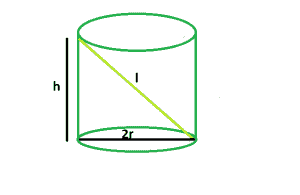

# 可插入右圆柱体内的最长杆

> 原文:[https://www . geesforgeks . org/最长可插入右圆柱杆/](https://www.geeksforgeeks.org/longest-rod-that-can-be-inserted-within-a-right-circular-cylinder/)

给定高度为、&半径为的右圆柱体。任务是找到可以插入其中的最长杆的长度。
**示例** :

```
Input : h = 4, r = 1.5
Output : 5

Input : h= 12, r = 2.5
Output : 13
```



**逼近** :
从图中可以清楚的看到，我们可以利用 [**勾股定理**](https://www.geeksforgeeks.org/find-pythagorean-triplet-in-an-unsorted-array/) ，将圆柱体的**高度**视为**垂线**，将**直径**视为**底**，将杆件的**长度**视为**斜边**来得到杆件的长度。
所以，**l<sup>2</sup>= h<sup>2</sup>+4 * r<sup>2</sup>**。
因此，

```
l = √(h<sup>2 + 4*r2)</sup>
```

以下是上述方法的实现:

## C++

```
// C++ Program to find the longest rod
// that can be fit within a right circular cylinder
#include <bits/stdc++.h>
using namespace std;

// Function to find the side of the cube
float rod(float h, float r)
{

    // height and radius cannot be negative
    if (h < 0 && r < 0)
        return -1;

    // length of rod
    float l = sqrt(pow(h, 2) + 4 * pow(r, 2));
    return l;
}

// Driver code
int main()
{
    float h = 4, r = 1.5;

    cout << rod(h, r) << endl;

    return 0;
}
```

## Java 语言(一种计算机语言，尤用于创建网站)

```
// Java Program to find the longest rod
// that can be fit within a right circular cylinder

import java.io.*;

class GFG {

// Function to find the side of the cube
static float rod(float h, float r)
{

    // height and radius cannot be negative
    if (h < 0 && r < 0)
        return -1;

    // length of rod
    float l = (float)(Math.sqrt(Math.pow(h, 2) + 4 * Math.pow(r, 2)));
    return l;
}

// Driver code

    public static void main (String[] args) {
            float h = 4;
            float r = 1.5f;
            System.out.print(rod(h, r));
    }
}
// This code is contributed by anuj_67..
```

## 蟒蛇 3

```
# Python 3 Program to find the longest
# rod that can be fit within a right
# circular cylinder
import math

# Function to find the side of the cube
def rod(h, r):

    # height and radius cannot
    # be negative
    if (h < 0 and r < 0):
        return -1

    # length of rod
    l = (math.sqrt(math.pow(h, 2) +
               4 * math.pow(r, 2)))
    return float(l)

# Driver code
h , r = 4, 1.5
print(rod(h, r))

# This code is contributed
# by PrinciRaj1992
```

## C#

```
// C# Program to find the longest
// rod that can be fit within a
// right circular cylinder
using System;

class GFG
{

// Function to find the side
// of the cube
static float rod(float h, float r)
{

    // height and radius cannot
    // be negative
    if (h < 0 && r < 0)
        return -1;

    // length of rod
    float l = (float)(Math.Sqrt(Math.Pow(h, 2) +
                            4 * Math.Pow(r, 2)));
    return l;
}

// Driver code
public static void Main ()
{
    float h = 4;
    float r = 1.5f;
    Console.WriteLine(rod(h, r));
}
}

// This code is contributed by shs
```

## 服务器端编程语言（Professional Hypertext Preprocessor 的缩写）

```
<?php
// PHP Program to find the longest
// rod that can be fit within a
// right circular cylinder

// Function to find the side
// of the cube
function rod($h, $r)
{

    // height and radius cannot
    // be negative
    if ($h < 0 && $r < 0)
        return -1;

    // length of rod
    $l = sqrt(pow($h, 2) + 4 * pow($r, 2));
    return $l;
}

// Driver code
$h = 4; $r = 1.5;

echo rod($h, $r) . "\n";

// This code is contributed
// by Akanksha Rai
?>
```

## java 描述语言

```
<script>

// javascript Program to find the longest rod
// that can be fit within a right circular cylinder

// Function to find the side of the cube
function rod(h , r)
{

    // height and radius cannot be negative
    if (h < 0 && r < 0)
        return -1;

    // length of rod
    var l = (Math.sqrt(Math.pow(h, 2) + 4 * Math.pow(r, 2)));
    return l;
}

// Driver code
var h = 4;
var r = 1.5;
document.write(rod(h, r));

// This code contributed by shikhasingrajput

</script>
```

**Output:** 

```
5
```