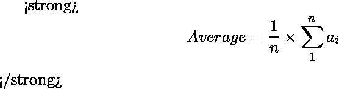

# 平均值最大的最长子阵列

> 原文:[https://www . geesforgeks . org/最大平均值最长子数组/](https://www.geeksforgeeks.org/longest-sub-array-with-maximum-average-value/)

给定一个由 **n** 个整数组成的数组 **arr[]** 。任务是找到具有最大平均值(子阵列元素的平均值)的子阵列的最大长度。



**例:**

> **输入:** arr[] = {2，3，4，5，6}
> **输出:** 1
> {6}是所需的子阵列
> **输入:** arr[] = {6，1，6，6，0}
> **输出:** 2
> {6}和{6，6}是平均值最大的子阵列。

**进场:**

*   任何子数组的平均值都不能超过数组的最大值。
*   平均值的可能最大值将是数组中的最大元素。
*   因此，要找到平均值最大的最大长度子阵列，我们必须找到子阵列的最大长度，其中子阵列的每个元素都相同，并且等于阵列中的最大元素。

以下是上述方法的实现:

## C++

```
// C++ implementation of the approach
#include <bits/stdc++.h>
using namespace std;

// Function to return the max length of the
// sub-array that have the maximum average
// (average value of the elements)
int maxLenSubArr(int a[], int n)
{
    int count, j;
    int cm = 1, max = 0;

    // Finding the maximum value
    for (int i = 0; i < n; i++) {
        if (a[i] > max)
            max = a[i];
    }

    for (int i = 0; i < n - 1;) {
        count = 1;

        // If consecutive maximum found
        if (a[i] == a[i + 1] && a[i] == max) {

            // Find the max length of consecutive max
            for (j = i + 1; j < n; j++) {
                if (a[j] == max) {
                    count++;
                    i++;
                }
                else
                    break;
            }

            if (count > cm)
                cm = count;
        }
        else
            i++;
    }

    return cm;
}

// Driver code
int main()
{
    int arr[] = { 6, 1, 6, 6, 0 };
    int n = sizeof(arr) / sizeof(arr[0]);

    cout << maxLenSubArr(arr, n);

    return 0;
}
```

## Java 语言(一种计算机语言，尤用于创建网站)

```
// Java implementation of the approach
class GFG
{

// Function to return the max length of the
// sub-array that have the maximum average
// (average value of the elements)
static int maxLenSubArr(int a[], int n)
{
    int count, j;
    int cm = 1, max = 0;

    // Finding the maximum value
    for (int i = 0; i < n; i++)
    {
        if (a[i] > max)
            max = a[i];
    }

    for (int i = 0; i < n - 1; )
    {
        count = 1;

        // If consecutive maximum found
        if (a[i] == a[i + 1] && a[i] == max)
        {

            // Find the max length of consecutive max
            for (j = i + 1; j < n; j++)
            {
                if (a[j] == max)
                {
                    count++;
                    i++;
                }
                else
                    break;
            }

            if (count > cm)
                cm = count;
        }
        else
            i++;
    }

    return cm;
}

// Driver code
public static void main(String[] args)
{
    int arr[] = { 6, 1, 6, 6, 0 };
    int n = arr.length;

    System.out.println(maxLenSubArr(arr, n));
}
}

// This code is contributed by Code_Mech.
```

## 蟒蛇 3

```
# Python3 implementation of the approach

# Function to return the max length of the
# sub-array that have the maximum average
# (average value of the elements)
def maxLenSubArr(a, n):

    cm, Max = 1, 0

    # Finding the maximum value
    for i in range(0, n):
        if a[i] > Max:
            Max = a[i]

    i = 0
    while i < n - 1:
        count = 1

        # If consecutive maximum found
        if a[i] == a[i + 1] and a[i] == Max:

            # Find the max length of
            # consecutive max
            for j in range(i + 1, n):
                if a[j] == Max:
                    count += 1
                    i += 1

                else:
                    break

            if count > cm:
                cm = count

        else:
            i += 1

        i += 1

    return cm

# Driver code
if __name__ == "__main__":

    arr = [6, 1, 6, 6, 0]
    n = len(arr)

    print(maxLenSubArr(arr, n))

# This code is contributed by
# Rituraj Jain
```

## C#

```
// C# implementation of the approach
using System;

class GFG
{

// Function to return the max length of the
// sub-array that have the maximum average
// (average value of the elements)
static int maxLenSubArr(int []a, int n)
{
    int count, j;
    int cm = 1, max = 0;

    // Finding the maximum value
    for (int i = 0; i < n; i++)
    {
        if (a[i] > max)
            max = a[i];
    }

    for (int i = 0; i < n - 1; )
    {
        count = 1;

        // If consecutive maximum found
        if (a[i] == a[i + 1] && a[i] == max)
        {

            // Find the max length of consecutive max
            for (j = i + 1; j < n; j++)
            {
                if (a[j] == max)
                {
                    count++;
                    i++;
                }
                else
                    break;
            }
            if (count > cm)
                cm = count;
        }
        else
            i++;
    }
    return cm;
}

    // Driver code
    static public void Main ()
    {

        int []arr = { 6, 1, 6, 6, 0 };
        int n = arr.Length;
        Console.WriteLine(maxLenSubArr(arr, n));
    }
}

// This code is contributed by ajit.
```

## 服务器端编程语言（Professional Hypertext Preprocessor 的缩写）

```
<?php
// PHP implementation of the approach

// Function to return the max length of the
// sub-array that have the maximum average
// (average value of the elements)
function maxLenSubArr($a, $n)
{
    $cm = 1 ;
    $max = 0;

    // Finding the maximum value
    for ($i = 0; $i < $n; $i++)
    {
        if ($a[$i] > $max)
            $max = $a[$i];
    }

    for ($i = 0; $i < $n - 1;)
    {
        $count = 1;

        // If consecutive maximum found
        if ($a[$i] == $a[$i + 1] &&
            $a[$i] == $max)
        {

            // Find the max length of
            // consecutive max
            for ($j = $i + 1; $j < $n; $j++)
            {
                if ($a[$j] == $max)
                {
                    $count++;
                    $i++;
                }
                else
                    break;
            }

            if ($count > $cm)
                $cm = $count;
        }
        else
            $i++;
    }

    return $cm;
}

// Driver code
$arr = array( 6, 1, 6, 6, 0 );
$n = sizeof($arr);

echo maxLenSubArr($arr, $n);

// This code is contributed by Ryuga
?>
```

## java 描述语言

```
<script>
    // Javascript implementation of the approach

    // Function to return the max length of the
    // sub-array that have the maximum average
    // (average value of the elements)
    function maxLenSubArr(a, n)
    {
        let count, j;
        let cm = 1, max = 0;

        // Finding the maximum value
        for (let i = 0; i < n; i++)
        {
            if (a[i] > max)
                max = a[i];
        }

        for (let i = 0; i < n - 1; )
        {
            count = 1;

            // If consecutive maximum found
            if (a[i] == a[i + 1] && a[i] == max)
            {

                // Find the max length of consecutive max
                for (j = i + 1; j < n; j++)
                {
                    if (a[j] == max)
                    {
                        count++;
                        i++;
                    }
                    else
                        break;
                }
                if (count > cm)
                    cm = count;
            }
            else
                i++;
        }
        return cm;
    }

    let arr = [ 6, 1, 6, 6, 0 ];
    let n = arr.length;
    document.write(maxLenSubArr(arr, n));

</script>
```

**Output:** 

```
2
```