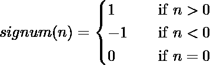

# 最长的之字形子序列

> 原文:[https://www.geeksforgeeks.org/longest-zig-zag-subsequence/](https://www.geeksforgeeks.org/longest-zig-zag-subsequence/)

最长的之字形子序列问题是找到给定序列的最长子序列的长度，使得它的所有元素都是交替的。
如果序列{x1，x2，..xn}是交替序列，则它的元素满足以下关系之一:

```
  x1 < x2 > x3 < x4 > x5 < …. xn or 
  x1 > x2 < x3 > x4 < x5 > …. xn 
```

**示例:**

```
Input: arr[] = {1, 5, 4}
Output: 3
The whole arrays is of the form  x1 < x2 > x3 

Input: arr[] = {1, 4, 5}
Output: 2
All subsequences of length 2 are either of the form 
x1 < x2; or x1 > x2

Input: arr[] = {10, 22, 9, 33, 49, 50, 31, 60}
Output: 6
The subsequences {10, 22, 9, 33, 31, 60} or
{10, 22, 9, 49, 31, 60} or {10, 22, 9, 50, 31, 60}
are longest Zig-Zag of length 6.
```

这个问题是[最长增子序列问题](https://www.geeksforgeeks.org/dynamic-programming-set-3-longest-increasing-subsequence/)的扩展，但是在这个问题中寻找最优子结构性质需要更多的思考。
我们将通过动态规划的方法来解决这个问题，让 A 是给定长度为 n 的整数数组。我们定义了一个 2D 数组 Z[n][2]，使得 Z[i][0]包含结束于索引 I 且最后一个元素大于它的前一个元素的最长的 Zig-Zag 子序列，Z[i][1]包含结束于索引 I 且最后一个元素小于它的前一个元素的最长的 Zig-Zag 子序列，那么它们之间有如下递推关系，

```
Z[i][0] = Length of the longest Zig-Zag subsequence 
          ending at index i and last element is greater
          than its previous element
Z[i][1] = Length of the longest Zig-Zag subsequence 
          ending at index i and last element is smaller
          than its previous element

Recursive Formulation:
   Z[i][0] = max (Z[i][0], Z[j][1] + 1); 
             for all j < i and A[j] < A[i] 
   Z[i][1] = max (Z[i][1], Z[j][0] + 1); 
             for all j < i and A[j] > A[i]
```

第一个递归关系是基于这样一个事实，如果我们在位置 I，并且这个元素必须比它的前一个元素大，那么对于这个序列(直到 I)要大，我们将尝试选择一个元素 j ( < i) such that A[j] < A[i] i.e. A[j] can become A[i]’s previous element and Z[j][1] + 1 is bigger than Z[i][0] then we will update Z[i][0]. 
记住，我们选择了 Z[j][1] + 1 而不是 Z[j][0] + 1 来满足替代属性，因为在 Z[j][0]中，最后一个元素比它的前一个元素大，并且 A[i]大于 A[j]，如果我们更新，这将打破替代属性。所以上述事实导出了第一个递推关系，对于第二个递推关系也可以做类似的论证。

## C++

```
// C++ program to find longest Zig-Zag subsequence in
// an array
#include <bits/stdc++.h>
using namespace std;

// function to return max of two numbers
int max(int a, int b) {  return (a > b) ? a : b; }

// Function to return longest Zig-Zag subsequence length
int zzis(int arr[], int n)
{

    /*Z[i][0] = Length of the longest Zig-Zag subsequence
          ending at index i and last element is greater
          than its previous element
     Z[i][1] = Length of the longest Zig-Zag subsequence
          ending at index i and last element is smaller
          than its previous element   */
    int Z[n][2];

    /* Initialize all values from 1  */
    for (int i = 0; i < n; i++)
        Z[i][0] = Z[i][1] = 1;

    int res = 1; // Initialize result

    /* Compute values in bottom up manner */
    for (int i = 1; i < n; i++)
    {
        // Consider all elements as previous of arr[i]
        for (int j = 0; j < i; j++)
        {
            // If arr[i] is greater, then check with Z[j][1]
            if (arr[j] < arr[i] && Z[i][0] < Z[j][1] + 1)
                Z[i][0] = Z[j][1] + 1;

            // If arr[i] is smaller, then check with Z[j][0]
            if( arr[j] > arr[i] && Z[i][1] < Z[j][0] + 1)
                Z[i][1] = Z[j][0] + 1;
        }

        /* Pick maximum of both values at index i  */
        if (res < max(Z[i][0], Z[i][1]))
            res = max(Z[i][0], Z[i][1]);
    }

    return res;
}

/* Driver program */
int main()
{
    int arr[] = { 10, 22, 9, 33, 49, 50, 31, 60 };
    int n = sizeof(arr)/sizeof(arr[0]);
    cout<<"Length of Longest Zig-Zag subsequence is "<<zzis(arr, n)<<endl;
    return 0;
}

// This code is contributed by noob2000.
```

## C

```
// C program to find longest Zig-Zag subsequence in
// an array
#include <stdio.h>
#include <stdlib.h>

// function to return max of two numbers
int max(int a, int b) {  return (a > b) ? a : b; }

// Function to return longest Zig-Zag subsequence length
int zzis(int arr[], int n)
{
    /*Z[i][0] = Length of the longest Zig-Zag subsequence
          ending at index i and last element is greater
          than its previous element
     Z[i][1] = Length of the longest Zig-Zag subsequence
          ending at index i and last element is smaller
          than its previous element   */
    int Z[n][2];

    /* Initialize all values from 1  */
    for (int i = 0; i < n; i++)
        Z[i][0] = Z[i][1] = 1;

    int res = 1; // Initialize result

    /* Compute values in bottom up manner */
    for (int i = 1; i < n; i++)
    {
        // Consider all elements as previous of arr[i]
        for (int j = 0; j < i; j++)
        {
            // If arr[i] is greater, then check with Z[j][1]
            if (arr[j] < arr[i] && Z[i][0] < Z[j][1] + 1)
                Z[i][0] = Z[j][1] + 1;

            // If arr[i] is smaller, then check with Z[j][0]
            if( arr[j] > arr[i] && Z[i][1] < Z[j][0] + 1)
                Z[i][1] = Z[j][0] + 1;
        }

        /* Pick maximum of both values at index i  */
        if (res < max(Z[i][0], Z[i][1]))
            res = max(Z[i][0], Z[i][1]);
    }

    return res;
}

/* Driver program */
int main()
{
    int arr[] = { 10, 22, 9, 33, 49, 50, 31, 60 };
    int n = sizeof(arr)/sizeof(arr[0]);
    printf("Length of Longest Zig-Zag subsequence is %d\n",
            zzis(arr, n) );
    return 0;
}
```

## Java 语言(一种计算机语言，尤用于创建网站)

```
// Java program to find longest
// Zig-Zag subsequence in an array
import java.io.*;

class GFG {

// Function to return longest
// Zig-Zag subsequence length
static int zzis(int arr[], int n)
{
    /*Z[i][0] = Length of the longest
        Zig-Zag subsequence ending at
        index i and last element is
        greater than its previous element
    Z[i][1] = Length of the longest
        Zig-Zag subsequence ending at
        index i and last element is
        smaller than its previous
        element */
    int Z[][] = new int[n][2];

    /* Initialize all values from 1 */
    for (int i = 0; i < n; i++)
        Z[i][0] = Z[i][1] = 1;

    int res = 1; // Initialize result

    /* Compute values in bottom up manner */
    for (int i = 1; i < n; i++)
    {
        // Consider all elements as
        // previous of arr[i]
        for (int j = 0; j < i; j++)
        {
            // If arr[i] is greater, then
            // check with Z[j][1]
            if (arr[j] < arr[i] &&
                Z[i][0] < Z[j][1] + 1)
                Z[i][0] = Z[j][1] + 1;

            // If arr[i] is smaller, then
            // check with Z[j][0]
            if( arr[j] > arr[i] &&
              Z[i][1] < Z[j][0] + 1)
                Z[i][1] = Z[j][0] + 1;
        }

        /* Pick maximum of both values at
        index i */
        if (res < Math.max(Z[i][0], Z[i][1]))
            res = Math.max(Z[i][0], Z[i][1]);
    }

    return res;
}

/* Driver program */
public static void main(String[] args)
{
    int arr[] = { 10, 22, 9, 33, 49,
                  50, 31, 60 };
    int n = arr.length;
    System.out.println("Length of Longest "+
                    "Zig-Zag subsequence is " +
                    zzis(arr, n));
}
}
// This code is contributed by Prerna Saini
```

## 蟒蛇 3

```
# Python3 program to find longest
# Zig-Zag subsequence in an array

# Function to return max of two numbers

# Function to return longest
# Zig-Zag subsequence length
def zzis(arr, n):

    '''Z[i][0] = Length of the longest Zig-Zag subsequence
        ending at index i and last element is greater
        than its previous element
    Z[i][1] = Length of the longest Zig-Zag subsequence
        ending at index i and last element is smaller
        than its previous element '''
    Z = [[1 for i in range(2)] for i in range(n)]

    res = 1 # Initialize result

    # Compute values in bottom up manner '''
    for i in range(1, n):

        # Consider all elements as previous of arr[i]
        for j in range(i):

            # If arr[i] is greater, then check with Z[j][1]
            if (arr[j] < arr[i] and Z[i][0] < Z[j][1] + 1):
                Z[i][0] = Z[j][1] + 1

            # If arr[i] is smaller, then check with Z[j][0]
            if( arr[j] > arr[i] and Z[i][1] < Z[j][0] + 1):
                Z[i][1] = Z[j][0] + 1

        # Pick maximum of both values at index i '''
        if (res < max(Z[i][0], Z[i][1])):
            res = max(Z[i][0], Z[i][1])

    return res

# Driver Code
arr = [10, 22, 9, 33, 49, 50, 31, 60]
n = len(arr)
print("Length of Longest Zig-Zag subsequence is",
                                    zzis(arr, n))

# This code is contributed by Mohit Kumar
```

## C#

```
// C# program to find longest
// Zig-Zag subsequence in an array
using System;

class GFG
{

// Function to return longest
// Zig-Zag subsequence length
static int zzis(int []arr, int n)
{
    /*Z[i][0] = Length of the longest
        Zig-Zag subsequence ending at
        index i and last element is
        greater than its previous element
    Z[i][1] = Length of the longest
        Zig-Zag subsequence ending at
        index i and last element is
        smaller than its previous
        element */
    int [,]Z = new int[n, 2];

    /* Initialize all values from 1 */
    for (int i = 0; i < n; i++)
        Z[i, 0] = Z[i, 1] = 1;

    // Initialize result
    int res = 1;

    /* Compute values in
    bottom up manner */
    for (int i = 1; i < n; i++)
    {
        // Consider all elements as
        // previous of arr[i]
        for (int j = 0; j < i; j++)
        {
            // If arr[i] is greater, then
            // check with Z[j][1]
            if (arr[j] < arr[i] &&
                Z[i, 0] < Z[j, 1] + 1)
                Z[i, 0] = Z[j, 1] + 1;

            // If arr[i] is smaller, then
            // check with Z[j][0]
            if( arr[j] > arr[i] &&
            Z[i, 1] < Z[j, 0] + 1)
                Z[i, 1] = Z[j, 0] + 1;
        }

        /* Pick maximum of both values at
        index i */
        if (res < Math.Max(Z[i, 0], Z[i, 1]))
            res = Math.Max(Z[i, 0], Z[i, 1]);
    }

    return res;
}

// Driver Code
static public void Main ()
{
    int []arr = {10, 22, 9, 33,
                 49, 50, 31, 60};
    int n = arr.Length;
    Console.WriteLine("Length of Longest "+
                      "Zig-Zag subsequence is " +
                                   zzis(arr, n));
    }
}

// This code is contributed by ajit
```

## 服务器端编程语言（Professional Hypertext Preprocessor 的缩写）

```
<?php
//PHP program to find longest Zig-Zag
//subsequence in  an array

// function to return max of two numbers
function  maxD($a, $b) {
    return ($a > $b) ? $a : $b;
    }

// Function to return longest Zig-Zag subsequence length
function  zzis($arr, $n)
{
    /*Z[i][0] = Length of the longest Zig-Zag subsequence
        ending at index i and last element is greater
        than its previous element
    Z[i][1] = Length of the longest Zig-Zag subsequence
        ending at index i and last element is smaller
        than its previous element */
     //$Z[$n][2];

    /* Initialize all values from 1 */
    for ($i = 0; $i < $n; $i++)
        $Z[$i][0] = $Z[$i][1] = 1;

     $res = 1; // Initialize result

    /* Compute values in bottom up manner */
    for ($i = 1; $i < $n; $i++)
    {
        // Consider all elements as previous of arr[i]
        for ($j = 0; $j < $i; $j++)
        {
            // If arr[i] is greater, then check with Z[j][1]
            if ($arr[$j] < $arr[$i] && $Z[$i][0] < $Z[$j][1] + 1)
                $Z[$i][0] = $Z[$j][1] + 1;

            // If arr[i] is smaller, then check with Z[j][0]
            if( $arr[$j] > $arr[$i] && $Z[$i][1] < $Z[$j][0] + 1)
                $Z[$i][1] = $Z[$j][0] + 1;
        }

        /* Pick maximum of both values at index i */
        if ($res < max($Z[$i][0], $Z[$i][1]))
            $res = max($Z[$i][0], $Z[$i][1]);
    }

    return $res;
}

/* Driver program */

     $arr = array( 10, 22, 9, 33, 49, 50, 31, 60 );
    $n = sizeof($arr);
    echo "Length of Longest Zig-Zag subsequence is ",
            zzis($arr, $n) ;
    echo "\n";

#This code is contributed by aj_36
?>
```

## java 描述语言

```
<script>

    // Javascript program to find longest
    // Zig-Zag subsequence in an array

    // Function to return longest
    // Zig-Zag subsequence length
    function zzis(arr, n)
    {
        /*Z[i][0] = Length of the longest
            Zig-Zag subsequence ending at
            index i and last element is
            greater than its previous element
        Z[i][1] = Length of the longest
            Zig-Zag subsequence ending at
            index i and last element is
            smaller than its previous
            element */
        let Z = new Array(n);

        for(let i = 0; i < n; i++)
        {
            Z[i] = new Array(2);
        }

        /* Initialize all values from 1 */
        for (let i = 0; i < n; i++)
            Z[i][0] = Z[i][1] = 1;

        let res = 1; // Initialize result

        /* Compute values in bottom up manner */
        for (let i = 1; i < n; i++)
        {
            // Consider all elements as
            // previous of arr[i]
            for (let j = 0; j < i; j++)
            {
                // If arr[i] is greater, then
                // check with Z[j][1]
                if (arr[j] < arr[i] &&
                    Z[i][0] < Z[j][1] + 1)
                    Z[i][0] = Z[j][1] + 1;

                // If arr[i] is smaller, then
                // check with Z[j][0]
                if( arr[j] > arr[i] &&
                  Z[i][1] < Z[j][0] + 1)
                    Z[i][1] = Z[j][0] + 1;
            }

            /* Pick maximum of both values at
            index i */
            if (res < Math.max(Z[i][0], Z[i][1]))
                res = Math.max(Z[i][0], Z[i][1]);
        }

        return res;
    }

    let arr = [ 10, 22, 9, 33, 49, 50, 31, 60 ];
    let n = arr.length;
    document.write("Length of Longest "+ "Zig-Zag subsequence is " + zzis(arr, n));

</script>
```

**输出:**

```
Length of Longest Zig-Zag subsequence is 6
```

**时间复杂度:**O(N)<sup>2</sup>)
T5】辅助空间: O(n)
**时间复杂度为 **O(n)** 的更好的方法解释如下:
让序列存储在未排序的整数数组 arr[N]中。
我们将通过比较 arr 的两个连续元素之差的数学符号(负数或正数)来进行。为了实现这一点，我们将(arr[I]–arr[I-1])的符号存储在一个变量中，随后将其与(arr[I+1]–arr[I])的符号进行比较。如果不同，我们将增加我们的结果。为了检查符号，我们将使用简单的[希格诺函数](https://en.wikipedia.org/wiki/Sign_function)，它将确定传递给它的数字的符号。也就是

考虑到我们遍历序列只有一次，这就变成了 **O(n)** 解。
上述方法的算法是:**

```
Input integer array seq[N].
Initialize integer lastSign to 0\. 
FOR i in range 1 to N - 1
    integer sign = signum(seq[i] - seq[i-1])
    IF sign != lastSign AND IF sign != 0
        increment length by 1\. lastSign = sign.
    END IF
END FOR
return length.
```

以下是上述方法的实施情况:

## C++

```
/*CPP program to find the maximum length of zig-zag
sub-sequence in given sequence*/
#include <bits/stdc++.h>
#include <iostream>
using namespace std;

// Function prototype.
int signum(int n);

/* Function to calculate maximum length of zig-zag
sub-sequence in given sequence.
*/
int maxZigZag(int seq[], int n)
{
    if (n == 0) {
        return 0;
    }

    int lastSign = 0, length = 1;

    // Length is initialized to 1 as
    // that is minimum value
    // for arbitrary sequence.
    for (int i = 1; i < n; ++i) {
        int Sign = signum(seq[i] - seq[i - 1]);

        // It qualifies
        if (Sign != lastSign && Sign != 0)
        {

            // Updating lastSign
            lastSign = Sign;
            length++;
        }
    }
    return length;
}

/* Signum function :
Returns 1 when passed a positive integer
Returns -1 when passed a negative integer
Returns 0 when passed 0\. */
int signum(int n)
{
    if (n != 0) {
        return n > 0 ? 1 : -1;
    }

    else {
        return 0;
    }
}
// Driver method
int main()
{
    int sequence1[4] = { 1, 3, 6, 2 };
    int sequence2[5] = { 5, 0, 3, 1, 0 };

    int n1 = sizeof(sequence1)
             / sizeof(*sequence1); // size of sequences
    int n2 = sizeof(sequence2) / sizeof(*sequence2);

    int maxLength1 = maxZigZag(sequence1, n1);
    int maxLength2
        = maxZigZag(sequence2, n2); // function call

    cout << "The maximum length of zig-zag sub-sequence in "
            "first sequence is: "
         << maxLength1;
    cout << endl;
    cout << "The maximum length of zig-zag sub-sequence in "
            "second sequence is: "
         << maxLength2;
}
```

## Java 语言(一种计算机语言，尤用于创建网站)

```
// Java code to find out maximum length of zig-zag
// sub-sequence in given sequence
class zigZagMaxLength {
    // Driver method
    public static void main(String[] args)
    {
        int[] sequence1 = { 1, 3, 6, 2 };
        int[] sequence2 = { 5, 0, 3, 1, 0 };

        int n1 = sequence1.length; // size of sequences
        int n2 = sequence2.length;

        int maxLength1 = maxZigZag(sequence1, n1);
        int maxLength2
            = maxZigZag(sequence2, n2); // function call

        System.out.println(
            "The maximum length of zig-zag sub-sequence in first sequence is: "
            + maxLength1);
        System.out.println(
            "The maximum length of zig-zag sub-sequence in second sequence is: "
            + maxLength2);
    }

    /* Function to calculate maximum length of zig-zag
    sub-sequence in given sequence.
    */

    static int maxZigZag(int[] seq, int n)
    {
        if (n == 0) {
            return 0;
        }

        int lastSign = 0, length = 1;
        // length is initialized to 1 as that is minimum
        // value for arbitrary sequence.

        for (int i = 1; i < n; ++i) {
            int Sign = signum(seq[i] - seq[i - 1]);

            if (Sign != 0
                && Sign != lastSign) // it qualifies
            {
                lastSign = Sign; // updating lastSign
                length++;
            }
        }

        return length;
    }

    /* Signum function :
    Returns 1 when passed a positive integer
    Returns -1 when passed a negative integer
    Returns 0 when passed 0\. */
    static int signum(int n)
    {
        if (n != 0) {
            return n > 0 ? 1 : -1;
        }

        else {
            return 0;
        }
    }
}
```

## 蟒蛇 3

```
# Python3 program to find the maximum
# length of zig-zag sub-sequence in
# given sequence

# Function to calculate maximum length
# of zig-zag sub-sequence in given sequence.

def maxZigZag(seq, n):

    if (n == 0):
        return 0

    lastSign = 0

    # Length is initialized to 1 as that is
    # minimum value for arbitrary sequence
    length = 1

    for i in range(1, n):
        Sign = signum(seq[i] - seq[i - 1])

        # It qualifies
        if (Sign != lastSign and Sign != 0):

            # Updating lastSign
            lastSign = Sign
            length += 1

    return length

# Signum function :
# Returns 1 when passed a positive integer
# Returns -1 when passed a negative integer
# Returns 0 when passed 0.

def signum(n):

    if (n != 0):
        return 1 if n > 0 else -1
    else:
        return 0

# Driver code
if __name__ == '__main__':

    sequence1 = [1, 3, 6, 2]
    sequence2 = [5, 0, 3, 1, 0]

    n1 = len(sequence1)
    n2 = len(sequence2)

    # Function call
    maxLength1 = maxZigZag(sequence1, n1)
    maxLength2 = maxZigZag(sequence2, n2)

    print("The maximum length of zig-zag sub-sequence "
          "in first sequence is:", maxLength1)
    print("The maximum length of zig-zag sub-sequence "
          "in second sequence is:", maxLength2)

# This code is contributed by himanshu77
```

## C#

```
// C# code to find out maximum length of
// zig-zag sub-sequence in given sequence
using System;

class zigZagMaxLength {
    // Driver method
    public static void Main(String[] args)
    {
        int[] sequence1 = { 1, 3, 6, 2 };
        int[] sequence2 = { 5, 0, 3, 1, 0 };

        int n1 = sequence1.Length; // size of sequences
        int n2 = sequence2.Length;

        int maxLength1 = maxZigZag(sequence1, n1);
        int maxLength2
            = maxZigZag(sequence2, n2); // function call

        Console.WriteLine(
            "The maximum length of zig-zag sub-sequence"
            + " in first sequence is: " + maxLength1);
        Console.WriteLine(
            "The maximum length of zig-zag "
            + "sub-sequence in second sequence is: "
            + maxLength2);
    }

    /* Function to calculate maximum length of zig-zag
    sub-sequence in given sequence.
    */
    static int maxZigZag(int[] seq, int n)
    {
        if (n == 0) {
            return 0;
        }

        // length is initialized to 1 as that is minimum
        // value for arbitrary sequence.
        int lastSign = 0, length = 1;

        for (int i = 1; i < n; ++i) {
            int Sign = signum(seq[i] - seq[i - 1]);

            if (Sign != 0
                && Sign != lastSign) // it qualifies
            {
                lastSign = Sign; // updating lastSign
                length++;
            }
        }

        return length;
    }

    /* Signum function :
    Returns 1 when passed a positive integer
    Returns -1 when passed a negative integer
    Returns 0 when passed 0\. */
    static int signum(int n)
    {
        if (n != 0) {
            return n > 0 ? 1 : -1;
        }

        else {
            return 0;
        }
    }
}

// This code is contributed by Rajput-Ji
```

## java 描述语言

```
<script>

    // Javascript code to find out maximum length of
    // zig-zag sub-sequence in given sequence

    /* Function to calculate maximum length of zig-zag
    sub-sequence in given sequence.
    */
    function maxZigZag(seq, n)
    {
        if (n == 0) {
            return 0;
        }

        // length is initialized to 1 as that is minimum
        // value for arbitrary sequence.
        let lastSign = 0, length = 1;

        for (let i = 1; i < n; ++i) {
            let Sign = signum(seq[i] - seq[i - 1]);

            if (Sign != 0 && Sign != lastSign) // it qualifies
            {
                lastSign = Sign; // updating lastSign
                length++;
            }
        }

        return length;
    }

    /* Signum function :
    Returns 1 when passed a positive integer
    Returns -1 when passed a negative integer
    Returns 0 when passed 0\. */
    function signum(n)
    {
        if (n != 0) {
            return n > 0 ? 1 : -1;
        }

        else {
            return 0;
        }
    }

    let sequence1 = [ 1, 3, 6, 2 ];
    let sequence2 = [ 5, 0, 3, 1, 0 ];

    let n1 = sequence1.length; // size of sequences
    let n2 = sequence2.length;

    let maxLength1 = maxZigZag(sequence1, n1);
    let maxLength2 = maxZigZag(sequence2, n2); // function call

    document.write("The maximum length of zig-zag sub-sequence"
      + " in first sequence is: " + maxLength1 + "</br>");
    document.write(
      "The maximum length of zig-zag "
      + "sub-sequence in second sequence is: "
      + maxLength2 + "</br>");

</script>
```

**输出:**

```
The maximum length of zig-zag sub-sequence in first sequence is: 3
The maximum length of zig-zag sub-sequence in second sequence is: 4
```

**时间复杂度:**O(n)
T3】辅助空间: O(1)
本文由乌卡什·特里维迪供稿。如果你发现任何不正确的地方，或者你想分享更多关于上面讨论的话题的信息，请写评论。