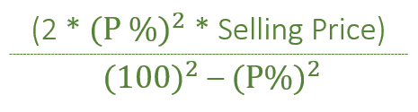

# 两个项目同价同盈亏百分比销售时的亏损

> 原文:[https://www . geeksforgeeks . org/当两个项目以相同的价格和相同的利润损失百分比出售时的损失/](https://www.geeksforgeeks.org/loss-when-two-items-are-sold-at-same-price-and-same-percentage-profit-loss/)

给定两个项目各自的销售价格，即**【SP】**。一个项目在**盈利时出售，另一个项目在**亏损时出售。任务是找出整体损失。
**举例:****** 

```
****Input:** SP = 2400, P = 30%  
**Output:** Loss = 474.725

**Input:** SP = 5000, P = 10%
**Output:** Loss = 101.01**
```

******进场:****** 

********

******以上公式是如何工作的？**
盈利项目:
以售价(100 + P)获得 P 利润。
以销售价格 SP，我们得到 SP * (P/(100 + P))利润
对于亏损项目:
以销售价格(100–P)，我们得到 P 亏损。
用卖价 SP，我们得到 SP *(P/(100–P))亏损
净亏损=总亏损–总利润
= SP *(P/(100–P))–SP *(P/(100+P))
=(SP * P * P * 2)/(100 * 100–P * P)
**注:**以上公式只适用于两个项目成本价不同时。如果两个项目的 CP 相同，则**“不盈利不亏损”。**
以下是上述方法的实施**** 

## ****C++****

```
**// C++ implementation of above approach.
#include <bits/stdc++.h>
using namespace std;

// Function that will
// find loss
void Loss(int SP, int P)
{

    float loss = 0;

    loss = (2 * P * P * SP) / float(100 * 100 - P * P);

    cout << "Loss = " << loss;
}

// Driver Code
int main()
{
    int SP = 2400, P = 30;

    // Calling Function
    Loss(SP, P);

    return 0;
}**
```

## ****Java 语言(一种计算机语言，尤用于创建网站)****

```
**// Java implementation of above approach.
class GFG
{

// Function that will
// find loss
static void Loss(int SP, int P)
{

    float loss = 0;

    loss = (float)(2 * P * P * SP) / (100 * 100 - P * P);

    System.out.println("Loss = " + loss);
}

// Driver Code
public static void main(String[] args)
{
    int SP = 2400, P = 30;

    // Calling Function
    Loss(SP, P);
}
}

// This code has been contributed by 29AjayKumar**
```

## ****蟒蛇 3****

```
**# Python3 implementation of above approach.

# Function that will find loss
def Loss(SP, P):

    loss = 0
    loss = ((2 * P * P * SP) /
            (100 * 100 - P * P))
    print("Loss =", round(loss, 3))

# Driver Code
if __name__ == "__main__":

    SP, P = 2400, 30

    # Calling Function
    Loss(SP, P)

# This code is contributed by Rituraj Jain**
```

## ****C#****

```
**// C# implementation of above approach.
class GFG
{

// Function that will
// find loss
static void Loss(int SP, int P)
{

    double loss = 0;

    loss = (double)(2 * P * P * SP) / (100 * 100 - P * P);

    System.Console.WriteLine("Loss = " +
                            System.Math.Round(loss,3));
}

// Driver Code
static void Main()
{
    int SP = 2400, P = 30;

    // Calling Function
    Loss(SP, P);
}
}

// This code has been contributed by mits**
```

## ****服务器端编程语言（Professional Hypertext Preprocessor 的缩写）****

```
**<?php
// PHP implementation of above approach.

// Function that will find loss
function Loss($SP, $P)
{

    $loss = 0;
    $loss = ((2 * $P * $P * $SP) /
          (100 * 100 - $P * $P));
    print("Loss = " . round($loss, 3));
}

// Driver Code
$SP = 2400;
$P = 30;

// Calling Function
Loss($SP, $P);

// This code is contributed by mits
?>**
```

## ****java 描述语言****

```
**<script>

// javascript implementation of above approach.
// Function that will
// find loss
    function Loss(SP , P) {

        var loss = 0;

        loss =  (2 * P * P * SP) / (100 * 100 - P * P);

        document.write("Loss = " + loss.toFixed(3));
    }

    // Driver Code

        var SP = 2400, P = 30;

        // Calling Function
        Loss(SP, P);

// This code contributed by gauravrajput1

</script>**
```

******Output:** 

```
Loss = 474.725
```****