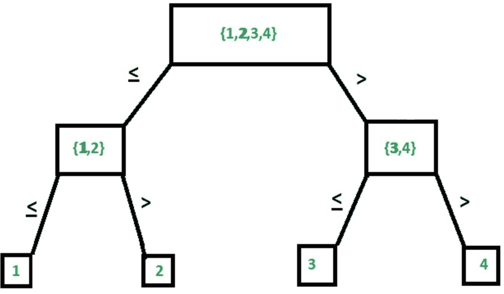
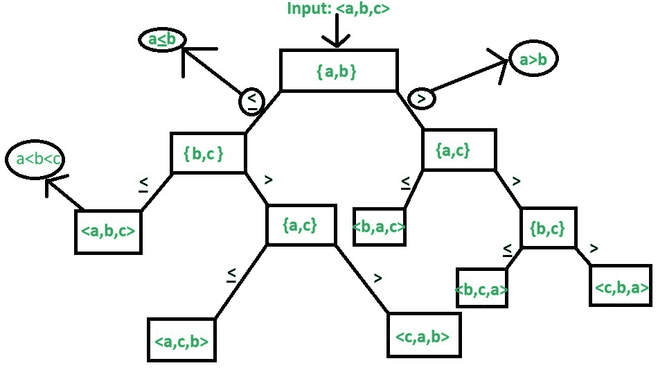

# 下限和上限理论

> 原文:[https://www.geeksforgeeks.org/lower-and-upper-bound-theory/](https://www.geeksforgeeks.org/lower-and-upper-bound-theory/)

下限和上限理论提供了一种寻找解决问题的最低复杂度算法的方法。在理解理论之前，首先，让我们简单了解一下实际上什么是下限和上限。

*   **下界–**
    设 L(n)为算法 A(比方说)的运行时间，那么 g(n)为 A 的**下界**如果存在两个常数 C 和 N，那么 L(n) > = C*g(n)为 n > N .算法的下界由称为[大ω](https://www.geeksforgeeks.org/analysis-of-algorithms-set-3asymptotic-notations/)的渐近符号表示(或者仅仅是ω)。

*   **上界–**
    设 U(n)为算法 A(比方说)的运行时间，那么 g(n)为 A 的**上界**如果存在两个常数 C 和 N，那么 U(n) < = C*g(n)为 n > N .算法的上界由渐近符号 [Big Oh(O)](https://www.geeksforgeeks.org/analysis-algorithms-big-o-analysis/) (或者只是 Oh)表示。

**1。下界理论:**
根据下界理论，对于一个算法的下界 L(n)，不可能有任何其他算法(对于一个常见问题)的时间复杂度小于随机输入的 L(n)。此外，在最坏的情况下，每个算法必须花费至少 L(n)个时间。**注意**这里的 L(n)是所有可能算法中复杂度最大的最小值。
下限对于任何算法都非常重要。一旦我们计算了它，那么我们就可以将其与算法的实际复杂性进行比较，如果它们的顺序相同，那么我们就可以宣布我们的算法是最优的。因此，在这一节中，我们将讨论寻找算法下限的技术。

**注意**我们的主要动机是得到一个最优算法，它的上界和下界相同(U(n)=L(n))。[合并排序](https://www.geeksforgeeks.org/merge-sort/)是优化算法的一个常见例子。

**平凡下界–**
求下界是最简单的方法。根据输入的数量和输出的数量可以很容易观察到的下限叫做平凡下限。

**例:**n×n 矩阵相乘，其中，

```
*Input*: For 2 matrix we will have 2n2 inputs
*Output*: 1 matrix of order n x n, i.e.,  n2 outputs 
```

在上面的例子中，很容易预测下限是 0(n<sup>2</sup>)。

**计算模型–**
该方法适用于所有基于比较的算法。例如，在排序中，我们必须比较列表中的元素，然后对它们进行相应的排序。搜索的情况类似，因此我们可以在这种情况下实现相同的功能。现在我们将看一些例子来理解它的用法。

**有序搜索–**
这是一种列表已经排序的搜索类型。
**示例-1:** [线性搜索](https://www.geeksforgeeks.org/linear-search/)
**解释–**
在线性搜索中，如果关键字与第一个元素不匹配，我们将它与第二个元素进行比较，以此类推，直到我们对照第 n 个元素进行检查。否则我们会以失败告终。

**示例-2:** [【二分搜索法】](https://www.geeksforgeeks.org/binary-search/)
**解释–**
在二分搜索法，我们对照键检查中间元素，如果大于则搜索前半部分，否则检查后半部分，重复同样的过程。
下图是由 4 个元素组成的阵列中二分搜索法的示意图



**计算下限:**最大比较次数为 n，假设树中有 k 个级别。

1.  节点数为 2 <sup>k</sup> -1
2.  在大小为 n 的列表中，任何基于比较的元素搜索中的节点数上限将为 n，因为在最坏的情况 2 <sup>k</sup> -1 中最多有 n 个比较
3.  每个级别将进行 1 次比较，因此比较次数 k≥|log <sub>2</sub> n|

因此，来自 n 个元素的列表的任何基于比较的搜索的下限不能小于 log(n)。因此，我们可以说二分搜索法是最优的，因为它的复杂度是θ(log n)。

**排序–**
下图是由 3 个元素的排序组合形成的树的示例。



**示例–**对于 n 个元素，使用计算模型寻找下界。

**解释–**
对于 n 个元素，我们总共有 n 个！组合(叶节点)。(参考图表，总组合为 3 个！或者 6)同样，很明显形成的树是二叉树。图表中的每个级别都表示一个比较。假设有 k 个级别= > 2 <sup>k</sup> 是一棵完整二叉树的叶节点总数，因此在这种情况下我们有 n 个！≤2 <sup>k</sup> 。

由于上述例子中的 k 是计算模型下限= k 的比较次数。

```
Now we can say that,
n!≤2<sup>T(n)</sup>
Thus, 
T(n)>|log n!| 
=> n!<=nn
Thus,
log n!<=log nn
Taking ceiling function on both sides, we get
|-log nn-|>=|-log n!-|
Thus complexity becomes Θ(lognn) or Θ(nlogn) 
```

**用低键理论求解代数问题:**

*   **直线程序–**
    没有任何循环或控制结构的程序称为直线程序。例如，

## C

```
//summing to nos
Sum(a, b)
{
    //no loops and no control structures
    c:= a+b;
    return c;
}
```

*   **代数问题–**
    与代数相关的问题，如解方程不等式等。归入代数问题。比如用简单的编程求解方程 ax <sup>2</sup> +bx+c。

## C

```
Algo_Sol(a, b, c, x)
{ 
    //1 assignment
    v:=a*x; 

    //1 assignment
    v:=v+b;

    //1 assignment
    v:=v*x;

    //1 assignment
    ans:=v+c;
    return ans;
}    
```

这里求解的复杂度是 4(不包括返回)。
上面的例子向我们展示了一种求解二次多项式方程的简单方法，即 4，因此对于 n <sup>次</sup>次多项式，我们的复杂度为 O(n <sup>2</sup> )。

让我们通过一个算法来演示。

**例:** x+a <sub>0</sub> 为 n 次多项式

## C

```
pow(x, n) 
  { 
    p := 1; 

    //loop from 1 to n 
    for i:=1 to n 
        p := p*x; 

    return p; 
  } 

polynomial(A, x, n) 
  { 
     int p, v:=0; 
     for i := 0 to n 

         //loop within a loop from 0 to n
         v := v + A[i]*pow(x, i); 
     return v; 
  } 
```

循环内的循环= >复杂性= 0(n<sup>2</sup>)；
现在要找到一个最优算法，我们需要在这里找到下界(根据下界理论)。根据下界理论，解决上述问题的最优算法是复杂度为 0(n)的算法。让我们用下界来证明这个定理。

**定理:**证明求解 n 次多项式的最优算法是 O(n)
**证明:**简化算法的最佳解决方案是将多项式分成几个直线问题，使这个问题不那么复杂。

```
=> anxn+an-1xn-1+an-2xn-2+...+a1x+a0 
can be written as, 
((..(anx+an-1)x+..+a2)x+a1)x+a0
Now, algorithm will be as,
v=0
v=v+an
v=v*x
v=v+an-1
v=v*x
...
v=v+a1
v=v*x
v=v+a0 
```

## C

```
polynomial(A, x, n) 
     {
      int p, v=0; 

      // loop executed n times
      for i = n to 0 
             v = (v + A[i])*x;

         return v;
      }
```

显然，这段代码的复杂性是 O(n)。这种求解这类方程的方法叫做霍纳法。这就是下界理论的工作原理，给出了最优算法的复杂度为 O(n)。
**2。上界理论:**
根据上界理论，对于一个算法的上界 U(n)，我们最多在 U(n)个时间内总能解决问题。已知算法解决具有更差情况输入的问题所花费的时间给出了上限。