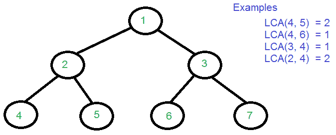

# 二叉树中最低的共同祖先|集合 1

> 原文:[https://www . geesforgeks . org/最低-共同祖先-二叉树-set-1/](https://www.geeksforgeeks.org/lowest-common-ancestor-binary-tree-set-1/)

给定一棵二叉树(不是二叉查找树树)和两个值，比如 n1 和 n2，编写一个程序来寻找最不相同的祖先。

***以下是*** [***维基百科***](http://en.wikipedia.org/wiki/Lowest_common_ancestor) ***对 LCA 的定义:***
让 T 成为一棵扎根的树。两个节点 n1 和 n2 之间的最低公共祖先被定义为 T 中同时具有 n1 和 n2 作为后代的最低节点(这里我们允许一个节点是其自身的后代)。
T 中 n1 和 n2 的 LCA 是距离根最远的 n1 和 n2 的共享祖先。最低共同祖先的计算可能是有用的，例如，作为确定树中节点对之间距离的过程的一部分:从 n1 到 n2 的距离可以计算为从根到 n1 的距离加上从根到 n2 的距离，减去从根到它们最低共同祖先的距离的两倍。(来源[维基](http://en.wikipedia.org/wiki/Lowest_common_ancestor) )



我们已经讨论了在二叉查找树寻找生命周期评价的有效解决方案。在二叉查找树，使用 BST 属性，我们可以在 O(h)时间内找到 LCA，其中 h 是树的高度。这样的实现在二叉树中是不可能的，因为关键字二叉树节点不遵循任何顺序。以下是在二叉树中寻找生命周期评价的不同方法。

**方法 1(通过存储根到 n1 和根到 n2 的路径):**
下面是一个简单的 O(n)算法来寻找 n1 和 n2 的 LCA。
**1)** 找到从根到 n1 的路径，并将其存储在向量或数组中。
**2)** 找到从根到 n2 的路径，并将其存储在另一个向量或数组中。
**3)** 遍历两条路径，直到数组中的值相同。返回不匹配前的公共元素。

下面是上述算法的实现。

## C++

```
// C++ Program for Lowest Common Ancestor in a Binary Tree
// A O(n) solution to find LCA of two given values n1 and n2
#include <iostream>
#include <vector>

using namespace std;

// A Binary Tree node
struct Node
{
    int key;
    struct Node *left, *right;
};

// Utility function creates a new binary tree node with given key
Node * newNode(int k)
{
    Node *temp = new Node;
    temp->key = k;
    temp->left = temp->right = NULL;
    return temp;
}

// Finds the path from root node to given root of the tree, Stores the
// path in a vector path[], returns true if path exists otherwise false
bool findPath(Node *root, vector<int> &path, int k)
{
    // base case
    if (root == NULL) return false;

    // Store this node in path vector. The node will be removed if
    // not in path from root to k
    path.push_back(root->key);

    // See if the k is same as root's key
    if (root->key == k)
        return true;

    // Check if k is found in left or right sub-tree
    if ( (root->left && findPath(root->left, path, k)) ||
         (root->right && findPath(root->right, path, k)) )
        return true;

    // If not present in subtree rooted with root, remove root from
    // path[] and return false
    path.pop_back();
    return false;
}

// Returns LCA if node n1, n2 are present in the given binary tree,
// otherwise return -1
int findLCA(Node *root, int n1, int n2)
{
    // to store paths to n1 and n2 from the root
    vector<int> path1, path2;

    // Find paths from root to n1 and root to n1\. If either n1 or n2
    // is not present, return -1
    if ( !findPath(root, path1, n1) || !findPath(root, path2, n2))
          return -1;

    /* Compare the paths to get the first different value */
    int i;
    for (i = 0; i < path1.size() && i < path2.size() ; i++)
        if (path1[i] != path2[i])
            break;
    return path1[i-1];
}

// Driver program to test above functions
int main()
{
    // Let us create the Binary Tree shown in above diagram.
    Node * root = newNode(1);
    root->left = newNode(2);
    root->right = newNode(3);
    root->left->left = newNode(4);
    root->left->right = newNode(5);
    root->right->left = newNode(6);
    root->right->right = newNode(7);
    cout << "LCA(4, 5) = " << findLCA(root, 4, 5);
    cout << "\nLCA(4, 6) = " << findLCA(root, 4, 6);
    cout << "\nLCA(3, 4) = " << findLCA(root, 3, 4);
    cout << "\nLCA(2, 4) = " << findLCA(root, 2, 4);
    return 0;
}
```

## Java 语言(一种计算机语言，尤用于创建网站)

```
// Java Program for Lowest Common Ancestor in a Binary Tree
// A O(n) solution to find LCA of two given values n1 and n2
import java.util.ArrayList;
import java.util.List;

// A Binary Tree node
class Node {
    int data;
    Node left, right;

    Node(int value) {
        data = value;
        left = right = null;
    }
}

public class BT_NoParentPtr_Solution1
{

    Node root;
    private List<Integer> path1 = new ArrayList<>();
    private List<Integer> path2 = new ArrayList<>();

    // Finds the path from root node to given root of the tree.
    int findLCA(int n1, int n2) {
        path1.clear();
        path2.clear();
        return findLCAInternal(root, n1, n2);
    }

    private int findLCAInternal(Node root, int n1, int n2) {

        if (!findPath(root, n1, path1) || !findPath(root, n2, path2)) {
            System.out.println((path1.size() > 0) ? "n1 is present" : "n1 is missing");
            System.out.println((path2.size() > 0) ? "n2 is present" : "n2 is missing");
            return -1;
        }

        int i;
        for (i = 0; i < path1.size() && i < path2.size(); i++) {

        // System.out.println(path1.get(i) + " " + path2.get(i));
            if (!path1.get(i).equals(path2.get(i)))
                break;
        }

        return path1.get(i-1);
    }

    // Finds the path from root node to given root of the tree, Stores the
    // path in a vector path[], returns true if path exists otherwise false
    private boolean findPath(Node root, int n, List<Integer> path)
    {
        // base case
        if (root == null) {
            return false;
        }

        // Store this node . The node will be removed if
        // not in path from root to n.
        path.add(root.data);

        if (root.data == n) {
            return true;
        }

        if (root.left != null && findPath(root.left, n, path)) {
            return true;
        }

        if (root.right != null && findPath(root.right, n, path)) {
            return true;
        }

        // If not present in subtree rooted with root, remove root from
        // path[] and return false
        path.remove(path.size()-1);

        return false;
    }

    // Driver code
    public static void main(String[] args)
    {
        BT_NoParentPtr_Solution1 tree = new BT_NoParentPtr_Solution1();
        tree.root = new Node(1);
        tree.root.left = new Node(2);
        tree.root.right = new Node(3);
        tree.root.left.left = new Node(4);
        tree.root.left.right = new Node(5);
        tree.root.right.left = new Node(6);
        tree.root.right.right = new Node(7);

        System.out.println("LCA(4, 5): " + tree.findLCA(4,5));
        System.out.println("LCA(4, 6): " + tree.findLCA(4,6));
        System.out.println("LCA(3, 4): " + tree.findLCA(3,4));
        System.out.println("LCA(2, 4): " + tree.findLCA(2,4));

    }
}
// This code is contributed by Sreenivasulu Rayanki.
```

## 计算机编程语言

```
# Python Program for Lowest Common Ancestor in a Binary Tree
# O(n) solution to find LCS of two given values n1 and n2

# A binary tree node
class Node:
    # Constructor to create a new binary node
    def __init__(self, key):
        self.key =  key
        self.left = None
        self.right = None

# Finds the path from root node to given root of the tree.
# Stores the path in a list path[], returns true if path
# exists otherwise false
def findPath( root, path, k):

    # Baes Case
    if root is None:
        return False

    # Store this node is path vector. The node will be
    # removed if not in path from root to k
    path.append(root.key)

    # See if the k is same as root's key
    if root.key == k :
        return True

    # Check if k is found in left or right sub-tree
    if ((root.left != None and findPath(root.left, path, k)) or
            (root.right!= None and findPath(root.right, path, k))):
        return True

    # If not present in subtree rooted with root, remove
    # root from path and return False

    path.pop()
    return False

# Returns LCA if node n1 , n2 are present in the given
# binary tre otherwise return -1
def findLCA(root, n1, n2):

    # To store paths to n1 and n2 fromthe root
    path1 = []
    path2 = []

    # Find paths from root to n1 and root to n2.
    # If either n1 or n2 is not present , return -1
    if (not findPath(root, path1, n1) or not findPath(root, path2, n2)):
        return -1

    # Compare the paths to get the first different value
    i = 0
    while(i < len(path1) and i < len(path2)):
        if path1[i] != path2[i]:
            break
        i += 1
    return path1[i-1]

# Driver program to test above function
# Let's create the Binary Tree shown in above diagram
root = Node(1)
root.left = Node(2)
root.right = Node(3)
root.left.left = Node(4)
root.left.right = Node(5)
root.right.left = Node(6)
root.right.right = Node(7)

print "LCA(4, 5) = %d" %(findLCA(root, 4, 5,))
print "LCA(4, 6) = %d" %(findLCA(root, 4, 6))
print "LCA(3, 4) = %d" %(findLCA(root,3,4))
print "LCA(2, 4) = %d" %(findLCA(root,2, 4))

# This code is contributed by Nikhil Kumar Singh(nickzuck_007)
```

## C#

```
// C# Program for Lowest Common
// Ancestor in a Binary Tree
// A O(n) solution to find LCA
// of two given values n1 and n2
using System.Collections;
using System;

// A Binary Tree node
class Node
{
  public int data;
  public Node left, right;

  public Node(int value)
  {
    data = value;
    left = right = null;
  }
}

public class BT_NoParentPtr_Solution1
{

  Node root;
  private ArrayList path1 =
          new ArrayList();
  private ArrayList path2 =
          new ArrayList();

  // Finds the path from root
  // node to given root of the
  // tree.
  int findLCA(int n1,
              int n2)
  {
    path1.Clear();
    path2.Clear();
    return findLCAInternal(root,
                           n1, n2);
  }

private int findLCAInternal(Node root,
                            int n1, int n2)
{
  if (!findPath(root, n1, path1) ||
      !findPath(root, n2, path2)) {
    Console.Write((path1.Count > 0) ?
                  "n1 is present" :
                  "n1 is missing");
    Console.Write((path2.Count > 0) ?
                  "n2 is present" :
                  "n2 is missing");
    return -1;
  }

  int i;
  for (i = 0; i < path1.Count &&
       i < path2.Count; i++)
  {
    // System.out.println(path1.get(i)
    // + " " + path2.get(i));
    if ((int)path1[i] !=
        (int)path2[i])
      break;
  }
  return (int)path1[i - 1];
}

// Finds the path from root node
// to given root of the tree,
// Stores the path in a vector
// path[], returns true if path
// exists otherwise false
private bool findPath(Node root,
                      int n,
                      ArrayList path)
{
  // base case
  if (root == null)
  {
    return false;
  }

  // Store this node . The node
  // will be removed if not in
  // path from root to n.
  path.Add(root.data);

  if (root.data == n)
  {
    return true;
  }

  if (root.left != null &&
      findPath(root.left,
               n, path))
  {
    return true;
  }

  if (root.right != null &&
      findPath(root.right,
               n, path))
  {
    return true;
  }

  // If not present in subtree
  //rooted with root, remove root
  // from path[] and return false
  path.RemoveAt(path.Count - 1);

  return false;
}

// Driver code
public static void Main(String[] args)
{
  BT_NoParentPtr_Solution1 tree =
     new BT_NoParentPtr_Solution1();

  tree.root = new Node(1);
  tree.root.left = new Node(2);
  tree.root.right = new Node(3);
  tree.root.left.left = new Node(4);
  tree.root.left.right = new Node(5);
  tree.root.right.left = new Node(6);
  tree.root.right.right = new Node(7);

  Console.Write("LCA(4, 5): " +
                 tree.findLCA(4, 5));
  Console.Write("\nLCA(4, 6): " +
                  tree.findLCA(4, 6));
  Console.Write("\nLCA(3, 4): " +
                  tree.findLCA(3, 4));
  Console.Write("\nLCA(2, 4): " +
                  tree.findLCA(2, 4));
}
}

// This code is contributed by Rutvik_56
```

## java 描述语言

```
<script>

    // JavaScript Program for Lowest Common
    // Ancestor in a Binary Tree
    // A O(n) solution to find LCA of
    // two given values n1 and n2

    class Node
    {
        constructor(value) {
           this.left = null;
           this.right = null;
           this.data = value;
        }
    }

    let root;
    let path1 = [];
    let path2 = [];

    // Finds the path from root node to given root of the tree.
    function findLCA(n1, n2) {
        path1 = [];
        path2 = [];
        return findLCAInternal(root, n1, n2);
    }

    function findLCAInternal(root, n1, n2) {

        if (!findPath(root, n1, path1) || !findPath(root, n2, path2))
        {
            document.write((path1.length > 0) ?
            "n1 is present" : "n1 is missing");
            document.write((path2.length > 0) ?
            "n2 is present" : "n2 is missing");
            return -1;
        }

        let i;
        for (i = 0; i < path1.length && i < path2.length; i++) {

        // System.out.println(path1.get(i) + " " + path2.get(i));
            if (path1[i] != path2[i])
                break;
        }

        return path1[i-1];
    }

    // Finds the path from root node to
    // given root of the tree, Stores the
    // path in a vector path[], returns true
    // if path exists otherwise false
    function findPath(root, n, path)
    {
        // base case
        if (root == null) {
            return false;
        }

        // Store this node . The node will be removed if
        // not in path from root to n.
        path.push(root.data);

        if (root.data == n) {
            return true;
        }

        if (root.left != null && findPath(root.left, n, path)) {
            return true;
        }

        if (root.right != null && findPath(root.right, n, path)) {
            return true;
        }

        // If not present in subtree rooted with root,
        // remove root from
        // path[] and return false
        path.pop();

        return false;
    }

    root = new Node(1);
    root.left = new Node(2);
    root.right = new Node(3);
    root.left.left = new Node(4);
    root.left.right = new Node(5);
    root.right.left = new Node(6);
    root.right.right = new Node(7);

    document.write("LCA(4, 5) = " + findLCA(4,5) + "</br>");
    document.write("LCA(4, 6) = " + findLCA(4,6) + "</br>");
    document.write("LCA(3, 4) = " + findLCA(3,4) + "</br>");
    document.write("LCA(2, 4) = " + findLCA(2,4));

</script>
```

**输出:**

```
LCA(4, 5) = 2
LCA(4, 6) = 1
LCA(3, 4) = 1
LCA(2, 4) = 2
```

***时间复杂度:*** 以上解的时间复杂度为 O(n)。遍历树两次，然后比较路径数组。
感谢*拉维·钱德拉·恩纳甘提*提出基于此方法的初始解。

**方法 2(使用单次遍历)**
方法 1 在 O(n)时间内找到 LCA，但需要三次树遍历加上额外的路径数组空间。如果我们假设关键字 n1 和 n2 存在于二叉树中，我们可以使用二叉树的单次遍历来找到 LCA，而不需要路径数组的额外存储。
思路是从根开始遍历树。如果任何给定的键(n1 和 n2)与根匹配，那么根就是 LCA(假设两个键都存在)。如果根与任何键都不匹配，我们会重复使用左右子树。一个键存在于其左子树中而另一个键存在于右子树中的节点是 LCA。如果两个键都在左子树，那么左子树也有 LCA，否则 LCA 在右子树。

## C++

```
/* C++ Program to find LCA of n1 and n2 using one traversal of Binary Tree */
#include <iostream>

using namespace std;

// A Binary Tree Node
struct Node
{
    struct Node *left, *right;
    int key;
};

// Utility function to create a new tree Node
Node* newNode(int key)
{
    Node *temp = new Node;
    temp->key = key;
    temp->left = temp->right = NULL;
    return temp;
}

// This function returns pointer to LCA of two given values n1 and n2.
// This function assumes that n1 and n2 are present in Binary Tree
struct Node *findLCA(struct Node* root, int n1, int n2)
{
    // Base case
    if (root == NULL) return NULL;

    // If either n1 or n2 matches with root's key, report
    // the presence by returning root (Note that if a key is
    // ancestor of other, then the ancestor key becomes LCA
    if (root->key == n1 || root->key == n2)
        return root;

    // Look for keys in left and right subtrees
    Node *left_lca  = findLCA(root->left, n1, n2);
    Node *right_lca = findLCA(root->right, n1, n2);

    // If both of the above calls return Non-NULL, then one key
    // is present in once subtree and other is present in other,
    // So this node is the LCA
    if (left_lca && right_lca)  return root;

    // Otherwise check if left subtree or right subtree is LCA
    return (left_lca != NULL)? left_lca: right_lca;
}

// Driver program to test above functions
int main()
{
    // Let us create binary tree given in the above example
    Node * root = newNode(1);
    root->left = newNode(2);
    root->right = newNode(3);
    root->left->left = newNode(4);
    root->left->right = newNode(5);
    root->right->left = newNode(6);
    root->right->right = newNode(7);
    cout << "LCA(4, 5) = " << findLCA(root, 4, 5)->key;
    cout << "\nLCA(4, 6) = " << findLCA(root, 4, 6)->key;
    cout << "\nLCA(3, 4) = " << findLCA(root, 3, 4)->key;
    cout << "\nLCA(2, 4) = " << findLCA(root, 2, 4)->key;
    return 0;
}
```

## Java 语言(一种计算机语言，尤用于创建网站)

```
//Java implementation to find lowest common ancestor of
// n1 and n2 using one traversal of binary tree

/* Class containing left and right child of current
 node and key value*/
class Node
{
    int data;
    Node left, right;

    public Node(int item)
    {
        data = item;
        left = right = null;
    }
}

public class BinaryTree
{
    //Root of the Binary Tree
    Node root;

    Node findLCA(int n1, int n2)
    {
        return findLCA(root, n1, n2);
    }

    // This function returns pointer to LCA of two given
    // values n1 and n2\. This function assumes that n1 and
    // n2 are present in Binary Tree
    Node findLCA(Node node, int n1, int n2)
    {
        // Base case
        if (node == null)
            return null;

        // If either n1 or n2 matches with root's key, report
        // the presence by returning root (Note that if a key is
        // ancestor of other, then the ancestor key becomes LCA
        if (node.data == n1 || node.data == n2)
            return node;

        // Look for keys in left and right subtrees
        Node left_lca = findLCA(node.left, n1, n2);
        Node right_lca = findLCA(node.right, n1, n2);

        // If both of the above calls return Non-NULL, then one key
        // is present in once subtree and other is present in other,
        // So this node is the LCA
        if (left_lca!=null && right_lca!=null)
            return node;

        // Otherwise check if left subtree or right subtree is LCA
        return (left_lca != null) ? left_lca : right_lca;
    }

    /* Driver program to test above functions */
    public static void main(String args[])
    {
        BinaryTree tree = new BinaryTree();
        tree.root = new Node(1);
        tree.root.left = new Node(2);
        tree.root.right = new Node(3);
        tree.root.left.left = new Node(4);
        tree.root.left.right = new Node(5);
        tree.root.right.left = new Node(6);
        tree.root.right.right = new Node(7);
        System.out.println("LCA(4, 5) = " +
                            tree.findLCA(4, 5).data);
        System.out.println("LCA(4, 6) = " +
                            tree.findLCA(4, 6).data);
        System.out.println("LCA(3, 4) = " +
                            tree.findLCA(3, 4).data);
        System.out.println("LCA(2, 4) = " +
                            tree.findLCA(2, 4).data);
    }
}
```

## 计算机编程语言

```
# Python program to find LCA of n1 and n2 using one
# traversal of Binary tree

# A binary tree node
class Node:

    # Constructor to create a new tree node
    def __init__(self, key):
        self.key = key
        self.left = None
        self.right = None

# This function returns pointer to LCA of two given
# values n1 and n2
# This function assumes that n1 and n2 are present in
# Binary Tree
def findLCA(root, n1, n2):

    # Base Case
    if root is None:
        return None

    # If either n1 or n2 matches with root's key, report
    #  the presence by returning root (Note that if a key is
    #  ancestor of other, then the ancestor key becomes LCA
    if root.key == n1 or root.key == n2:
        return root

    # Look for keys in left and right subtrees
    left_lca = findLCA(root.left, n1, n2)
    right_lca = findLCA(root.right, n1, n2)

    # If both of the above calls return Non-NULL, then one key
    # is present in once subtree and other is present in other,
    # So this node is the LCA
    if left_lca and right_lca:
        return root

    # Otherwise check if left subtree or right subtree is LCA
    return left_lca if left_lca is not None else right_lca

# Driver program to test above function

# Let us create a binary tree given in the above example
root = Node(1)
root.left = Node(2)
root.right = Node(3)
root.left.left = Node(4)
root.left.right = Node(5)
root.right.left = Node(6)
root.right.right = Node(7)
print "LCA(4,5) = ", findLCA(root, 4, 5).key
print "LCA(4,6) = ", findLCA(root, 4, 6).key
print "LCA(3,4) = ", findLCA(root, 3, 4).key
print "LCA(2,4) = ", findLCA(root, 2, 4).key

# This code is contributed by Nikhil Kumar Singh(nickzuck_007)
```

## C#

```
// C# implementation to find lowest common
// ancestor of n1 and n2 using one traversal
// of binary tree
using System;

// Class containing left and right
// child of current node and key value
public class Node
{
    public int data;
    public Node left, right;

    public Node(int item)
    {
        data = item;
        left = right = null;
    }
}

class BinaryTree{

// Root of the Binary Tree
Node root;

Node findLCA(int n1, int n2)
{
    return findLCA(root, n1, n2);
}

// This function returns pointer to LCA
// of two given values n1 and n2\. This
// function assumes that n1 and n2 are
// present in Binary Tree
Node findLCA(Node node, int n1, int n2)
{

    // Base case
    if (node == null)
        return null;

    // If either n1 or n2 matches with
    // root's key, report the presence
    // by returning root (Note that if
    // a key is ancestor of other,
    // then the ancestor key becomes LCA
    if (node.data == n1 || node.data == n2)
        return node;

    // Look for keys in left and right subtrees
    Node left_lca = findLCA(node.left, n1, n2);
    Node right_lca = findLCA(node.right, n1, n2);

    // If both of the above calls return Non-NULL,
    // then one key is present in once subtree
    // and other is present in other, So this
    // node is the LCA
    if (left_lca != null && right_lca != null)
        return node;

    // Otherwise check if left subtree or
    // right subtree is LCA
    return (left_lca != null) ? left_lca : right_lca;
}

// Driver code
public static void Main(string []args)
{
    BinaryTree tree = new BinaryTree();
    tree.root = new Node(1);
    tree.root.left = new Node(2);
    tree.root.right = new Node(3);
    tree.root.left.left = new Node(4);
    tree.root.left.right = new Node(5);
    tree.root.right.left = new Node(6);
    tree.root.right.right = new Node(7);

    Console.WriteLine("LCA(4, 5) = " +
                      tree.findLCA(4, 5).data);
    Console.WriteLine("LCA(4, 6) = " +
                      tree.findLCA(4, 6).data);
    Console.WriteLine("LCA(3, 4) = " +
                      tree.findLCA(3, 4).data);
    Console.WriteLine("LCA(2, 4) = " +
                      tree.findLCA(2, 4).data);
}
}

// This code is contributed by pratham76
```

## java 描述语言

```
<script>

    // JavaScript implementation to find
    // lowest common ancestor of
    // n1 and n2 using one traversal of binary tree

    class Node
    {
        constructor(item) {
           this.left = null;
           this.right = null;
           this.data = item;
        }
    }

    //Root of the Binary Tree
    let root;

    function findlCA(n1, n2)
    {
        return findLCA(root, n1, n2);
    }

    // This function returns pointer to LCA of two given
    // values n1 and n2\. This function assumes that n1 and
    // n2 are present in Binary Tree
    function findLCA(node, n1, n2)
    {
        // Base case
        if (node == null)
            return null;

        // If either n1 or n2 matches with root's key, report
        // the presence by returning root (Note that if a key is
        // ancestor of other, then the ancestor key becomes LCA
        if (node.data == n1 || node.data == n2)
            return node;

        // Look for keys in left and right subtrees
        let left_lca = findLCA(node.left, n1, n2);
        let right_lca = findLCA(node.right, n1, n2);

        // If both of the above calls return Non-NULL, then one key
        // is present in once subtree and other is present in other,
        // So this node is the LCA
        if (left_lca!=null && right_lca!=null)
            return node;

        // Otherwise check if left subtree or right subtree is LCA
        return (left_lca != null) ? left_lca : right_lca;
    }

    root = new Node(1);
    root.left = new Node(2);
    root.right = new Node(3);
    root.left.left = new Node(4);
    root.left.right = new Node(5);
    root.right.left = new Node(6);
    root.right.right = new Node(7);
    document.write("LCA(4, 5) = " +
                       findlCA(4, 5).data + "</br>");
    document.write("LCA(4, 6) = " +
                       findlCA(4, 6).data + "</br>");
    document.write("LCA(3, 4) = " +
                       findlCA(3, 4).data + "</br>");
    document.write("LCA(2, 4) = " +
                       findlCA(2, 4).data + "</br>");

</script>
```

**输出:**

```
LCA(4, 5) = 2
LCA(4, 6) = 1
LCA(3, 4) = 1
LCA(2, 4) = 2
```

感谢*阿图尔·辛格*提出这个解决方案。

***时间复杂度:*** 上述解决方案的时间复杂度为 O(n)，因为该方法以自下而上的方式进行简单的树遍历。

请注意，上述方法假设键存在于二叉树中。如果一个键存在，而另一个键不存在，那么它返回当前键作为生命周期评价(理想情况下应该返回空值)。

我们可以扩展这个方法来处理绕过两个布尔变量 v1 和 v2 的所有情况。当 n1 出现在树中时，v1 设置为真，如果 n2 出现在树中，v2 设置为真。

## C++

```
/* C++ program to find LCA of n1 and n2 using one traversal of Binary Tree.
   It handles all cases even when n1 or n2 is not there in Binary Tree */
#include <iostream>
using namespace std;

// A Binary Tree Node
struct Node
{
    struct Node *left, *right;
    int key;
};

// Utility function to create a new tree Node
Node* newNode(int key)
{
    Node *temp = new Node;
    temp->key = key;
    temp->left = temp->right = NULL;
    return temp;
}

// This function returns pointer to LCA of two given values n1 and n2.
// v1 is set as true by this function if n1 is found
// v2 is set as true by this function if n2 is found
struct Node *findLCAUtil(struct Node* root, int n1, int n2, bool &v1, bool &v2)
{
    // Base case
    if (root == NULL) return NULL;

    // If either n1 or n2 matches with root's key, report the presence
    // by setting v1 or v2 as true and return root (Note that if a key
    // is ancestor of other, then the ancestor key becomes LCA)
    if (root->key == n1)
    {
        v1 = true;
        return root;
    }
    if (root->key == n2)
    {
        v2 = true;
        return root;
    }

    // Look for keys in left and right subtrees
    Node *left_lca  = findLCAUtil(root->left, n1, n2, v1, v2);
    Node *right_lca = findLCAUtil(root->right, n1, n2, v1, v2);

    // If both of the above calls return Non-NULL, then one key
    // is present in once subtree and other is present in other,
    // So this node is the LCA
    if (left_lca && right_lca)  return root;

    // Otherwise check if left subtree or right subtree is LCA
    return (left_lca != NULL)? left_lca: right_lca;
}

// Returns true if key k is present in tree rooted with root
bool find(Node *root, int k)
{
    // Base Case
    if (root == NULL)
        return false;

    // If key is present at root, or in left subtree or right subtree,
    // return true;
    if (root->key == k || find(root->left, k) ||  find(root->right, k))
        return true;

    // Else return false
    return false;
}

// This function returns LCA of n1 and n2 only if both n1 and n2 are present
// in tree, otherwise returns NULL;
Node *findLCA(Node *root, int n1, int n2)
{
    // Initialize n1 and n2 as not visited
    bool v1 = false, v2 = false;

    // Find lca of n1 and n2 using the technique discussed above
    Node *lca = findLCAUtil(root, n1, n2, v1, v2);

    // Return LCA only if both n1 and n2 are present in tree
    if (v1 && v2 || v1 && find(lca, n2) || v2 && find(lca, n1))
        return lca;

    // Else return NULL
    return NULL;
}

// Driver program to test above functions
int main()
{
    // Let us create binary tree given in the above example
    Node * root = newNode(1);
    root->left = newNode(2);
    root->right = newNode(3);
    root->left->left = newNode(4);
    root->left->right = newNode(5);
    root->right->left = newNode(6);
    root->right->right = newNode(7);
    Node *lca =  findLCA(root, 4, 5);
    if (lca != NULL)
       cout << "LCA(4, 5) = " << lca->key;
    else
       cout << "Keys are not present ";

    lca =  findLCA(root, 4, 10);
    if (lca != NULL)
       cout << "\nLCA(4, 10) = " << lca->key;
    else
       cout << "\nKeys are not present ";

    return 0;
}
```

## Java 语言(一种计算机语言，尤用于创建网站)

```
// Java implementation to find lowest common ancestor of
// n1 and n2 using one traversal of binary tree
// It also handles cases even when n1 and n2 are not there in Tree

/* Class containing left and right child of current node and key */
class Node
{
    int data;
    Node left, right;

    public Node(int item)
    {
        data = item;
        left = right = null;
    }
}

public class BinaryTree
{
    // Root of the Binary Tree
    Node root;
    static boolean v1 = false, v2 = false;

    // This function returns pointer to LCA of two given
    // values n1 and n2.
    // v1 is set as true by this function if n1 is found
    // v2 is set as true by this function if n2 is found
    Node findLCAUtil(Node node, int n1, int n2)
    {
        // Base case
        if (node == null)
            return null;

        //Store result in temp, in case of key match so that we can search for other key also.
        Node temp=null;

        // If either n1 or n2 matches with root's key, report the presence
        // by setting v1 or v2 as true and return root (Note that if a key
        // is ancestor of other, then the ancestor key becomes LCA)
        if (node.data == n1)
        {
            v1 = true;
            temp = node;
        }
        if (node.data == n2)
        {
            v2 = true;
            temp = node;
        }

        // Look for keys in left and right subtrees
        Node left_lca = findLCAUtil(node.left, n1, n2);
        Node right_lca = findLCAUtil(node.right, n1, n2);

        if (temp != null)
            return temp;

        // If both of the above calls return Non-NULL, then one key
        // is present in once subtree and other is present in other,
        // So this node is the LCA
        if (left_lca != null && right_lca != null)
            return node;

        // Otherwise check if left subtree or right subtree is LCA
        return (left_lca != null) ? left_lca : right_lca;
    }

    // Finds lca of n1 and n2 under the subtree rooted with 'node'
    Node findLCA(int n1, int n2)
    {
        // Initialize n1 and n2 as not visited
        v1 = false;
        v2 = false;

        // Find lca of n1 and n2 using the technique discussed above
        Node lca = findLCAUtil(root, n1, n2);

        // Return LCA only if both n1 and n2 are present in tree
        if (v1 && v2)
            return lca;

        // Else return NULL
        return null;
    }

    /* Driver program to test above functions */
    public static void main(String args[])
    {
        BinaryTree tree = new BinaryTree();
        tree.root = new Node(1);
        tree.root.left = new Node(2);
        tree.root.right = new Node(3);
        tree.root.left.left = new Node(4);
        tree.root.left.right = new Node(5);
        tree.root.right.left = new Node(6);
        tree.root.right.right = new Node(7);

        Node lca = tree.findLCA(4, 5);
        if (lca != null)
            System.out.println("LCA(4, 5) = " + lca.data);
        else
            System.out.println("Keys are not present");

        lca = tree.findLCA(4, 10);
        if (lca != null)
            System.out.println("LCA(4, 10) = " + lca.data);
        else
            System.out.println("Keys are not present");
    }
}
```

## 计算机编程语言

```
""" Program to find LCA of n1 and n2 using one traversal of
 Binary tree
It handles all cases even when n1 or n2 is not there in tree
"""

# A binary tree node
class Node:

    # Constructor to create a new node
    def __init__(self, key):
        self.key = key
        self.left = None
        self.right = None

# This function return pointer to LCA of two given values
# n1 and n2
# v1 is set as true by this function if n1 is found
# v2 is set as true by this function if n2 is found
def findLCAUtil(root, n1, n2, v):

    # Base Case
    if root is None:
        return None

    # IF either n1 or n2 matches ith root's key, report
    # the presence by setting v1 or v2 as true and return
    # root (Note that if a key is ancestor of other, then
    # the ancestor key becomes LCA)
    if root.key == n1 :
        v[0] = True
        return root

    if root.key == n2:
        v[1] = True
        return root

    # Look for keys in left and right subtree
    left_lca = findLCAUtil(root.left, n1, n2, v)
    right_lca = findLCAUtil(root.right, n1, n2, v)

    # If both of the above calls return Non-NULL, then one key
    # is present in once subtree and other is present in other,
    # So this node is the LCA
    if left_lca and right_lca:
        return root

    # Otherwise check if left subtree or right subtree is LCA
    return left_lca if left_lca is not None else right_lca

def find(root, k):

    # Base Case
    if root is None:
        return False

    # If key is present at root, or if left subtree or right
    # subtree , return true
    if (root.key == k or find(root.left, k) or
        find(root.right, k)):
        return True

    # Else return false
    return False

# This function returns LCA of n1 and n2 onlue if both
# n1 and n2 are present in tree, otherwise returns None
def findLCA(root, n1, n2):

    # Initialize n1 and n2 as not visited
    v = [False, False]

    # Find lac of n1 and n2 using the technique discussed above
    lca = findLCAUtil(root, n1, n2, v)

    # Returns LCA only if both n1 and n2 are present in tree
    if (v[0] and v[1] or v[0] and find(lca, n2) or v[1] and
        find(lca, n1)):
        return lca

    # Else return None
    return None

# Driver program to test above function
root = Node(1)
root.left = Node(2)
root.right = Node(3)
root.left.left = Node(4)
root.left.right = Node(5)
root.right.left = Node(6)
root.right.right = Node(7)

lca = findLCA(root, 4, 5)

if lca is not None:
    print "LCA(4, 5) = ", lca.key
else :
    print "Keys are not present"

lca = findLCA(root, 4, 10)
if lca is not None:
    print "LCA(4,10) = ", lca.key
else:
    print "Keys are not present"

# This code is contributed by Nikhil Kumar Singh(nickzuck_007)
```

## C#

```
using System;

// c# implementation to find lowest common ancestor of
// n1 and n2 using one traversal of binary tree
// It also handles cases even when n1 and n2 are not there in Tree

/* Class containing left and right child of current node and key */
public class Node
{
    public int data;
    public Node left, right;

    public Node(int item)
    {
        data = item;
        left = right = null;
    }
}

public class BinaryTree
{
    // Root of the Binary Tree
    public Node root;
    public static bool v1 = false, v2 = false;

    // This function returns pointer to LCA of two given
    // values n1 and n2.
    // v1 is set as true by this function if n1 is found
    // v2 is set as true by this function if n2 is found
    public virtual Node findLCAUtil(Node node, int n1, int n2)
    {
        // Base case
        if (node == null)
        {
            return null;
        }

        //Store result in temp, in case of key match so that we can search for other key also.
        Node temp = null;

        // If either n1 or n2 matches with root's key, report the presence
        // by setting v1 or v2 as true and return root (Note that if a key
        // is ancestor of other, then the ancestor key becomes LCA)
        if (node.data == n1)
        {
            v1 = true;
            temp = node;
        }
        if (node.data == n2)
        {
            v2 = true;
            temp = node;
        }

        // Look for keys in left and right subtrees
        Node left_lca = findLCAUtil(node.left, n1, n2);
        Node right_lca = findLCAUtil(node.right, n1, n2);

        if (temp != null)
        {
            return temp;
        }

        // If both of the above calls return Non-NULL, then one key
        // is present in once subtree and other is present in other,
        // So this node is the LCA
        if (left_lca != null && right_lca != null)
        {
            return node;
        }

        // Otherwise check if left subtree or right subtree is LCA
        return (left_lca != null) ? left_lca : right_lca;
    }

    // Finds lca of n1 and n2 under the subtree rooted with 'node'
    public virtual Node findLCA(int n1, int n2)
    {
        // Initialize n1 and n2 as not visited
        v1 = false;
        v2 = false;

        // Find lca of n1 and n2 using the technique discussed above
        Node lca = findLCAUtil(root, n1, n2);

        // Return LCA only if both n1 and n2 are present in tree
        if (v1 && v2)
        {
            return lca;
        }

        // Else return NULL
        return null;
    }

    /* Driver program to test above functions */
    public static void Main(string[] args)
    {
        BinaryTree tree = new BinaryTree();
        tree.root = new Node(1);
        tree.root.left = new Node(2);
        tree.root.right = new Node(3);
        tree.root.left.left = new Node(4);
        tree.root.left.right = new Node(5);
        tree.root.right.left = new Node(6);
        tree.root.right.right = new Node(7);

        Node lca = tree.findLCA(4, 5);
        if (lca != null)
        {
            Console.WriteLine("LCA(4, 5) = " + lca.data);
        }
        else
        {
            Console.WriteLine("Keys are not present");
        }

        lca = tree.findLCA(4, 10);
        if (lca != null)
        {
            Console.WriteLine("LCA(4, 10) = " + lca.data);
        }
        else
        {
            Console.WriteLine("Keys are not present");
        }
    }
}

  // This code is contributed by Shrikant13
```

## java 描述语言

```
<script>

// JavaScript implementation to find lowest
// common ancestor of n1 and n2 using one
// traversal of binary tree. It also handles
// cases even when n1 and n2 are not there in Tree

// Class containing left and right child
// of current node and key
class Node
{
    constructor(item)
    {
        this.data = item;
        this.left = null;
        this.right = null;
    }
}

class BinaryTree{

// Root of the Binary Tree
constructor()
{
    this.root = null;
    this.v1 = false;
    this.v2 = false;
}

// This function returns pointer to LCA
// of two given values n1 and n2.
// v1 is set as true by this function
// if n1 is found
// v2 is set as true by this function
// if n2 is found
findLCAUtil(node, n1, n2)
{

    // Base case
    if (node == null)
    {
        return null;
    }

    // Store result in temp, in case of
    // key match so that we can search
    // for other key also.
    var temp = null;

    // If either n1 or n2 matches with root's key,
    // report the presence by setting v1 or v2 as
    // true and return root (Note that if a key
    // is ancestor of other, then the ancestor
    // key becomes LCA)
    if (node.data == n1)
    {
        this.v1 = true;
        temp = node;
    }
    if (node.data == n2)
    {
        this.v2 = true;
        temp = node;
    }

    // Look for keys in left and right subtrees
    var left_lca = this.findLCAUtil(node.left, n1, n2);
    var right_lca = this.findLCAUtil(node.right, n1, n2);

    if (temp != null)
    {
        return temp;
    }

    // If both of the above calls return Non-NULL,
    // then one key is present in once subtree and
    // other is present in other, So this node is the LCA
    if (left_lca != null && right_lca != null)
    {
        return node;
    }

    // Otherwise check if left subtree or
    // right subtree is LCA
    return left_lca != null ? left_lca : right_lca;
}

// Finds lca of n1 and n2 under the
// subtree rooted with 'node'
findLCA(n1, n2)
{

    // Initialize n1 and n2 as not visited
    this.v1 = false;
    this.v2 = false;

    // Find lca of n1 and n2 using the
    // technique discussed above
    var lca = this.findLCAUtil(this.root, n1, n2);

    // Return LCA only if both n1 and n2
    // are present in tree
    if (this.v1 && this.v2)
    {
        return lca;
    }

    // Else return NULL
    return null;
}
}

// Driver code
var tree = new BinaryTree();
tree.root = new Node(1);
tree.root.left = new Node(2);
tree.root.right = new Node(3);
tree.root.left.left = new Node(4);
tree.root.left.right = new Node(5);
tree.root.right.left = new Node(6);
tree.root.right.right = new Node(7);

var lca = tree.findLCA(4, 5);
if (lca != null)
{
    document.write("LCA(4, 5) = " +
                   lca.data + "<br>");
} else
{
    document.write("Keys are not present" + "<br>");
}

lca = tree.findLCA(4, 10);
if (lca != null)
{
    document.write("LCA(4, 10) = " +
                   lca.data + "<br>");
}
else
{
    document.write("Keys are not present" + "<br>");
}

// This code is contributed by rdtank

</script>
```

**输出:**

```
LCA(4, 5) = 2
Keys are not present
```

感谢 Dhruv 提出这个扩展的解决方案。
你可能也喜欢看下面的文章:
[LCA 使用父指针](https://www.geeksforgeeks.org/lowest-common-ancestor-in-a-binary-tree-set-2-using-parent-pointer/)

[二叉查找树的最低共同祖先。](https://www.geeksforgeeks.org/lowest-common-ancestor-in-a-binary-search-tree/)

[使用 RMQ](https://www.geeksforgeeks.org/find-lca-in-binary-tree-using-rmq/)
在二叉树中查找 LCA 如果您发现任何不正确的地方，或者您想分享关于上面讨论的主题的更多信息，请写评论